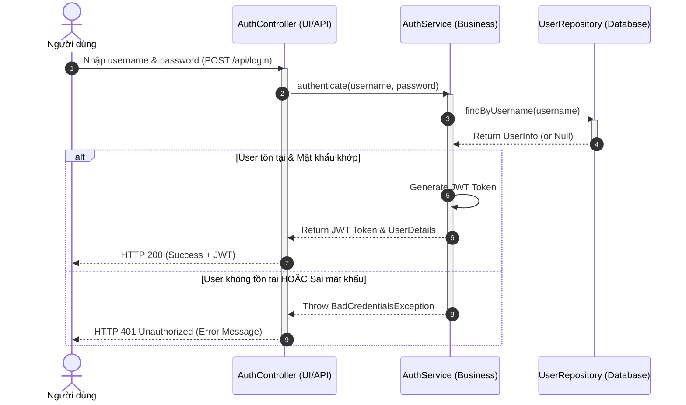
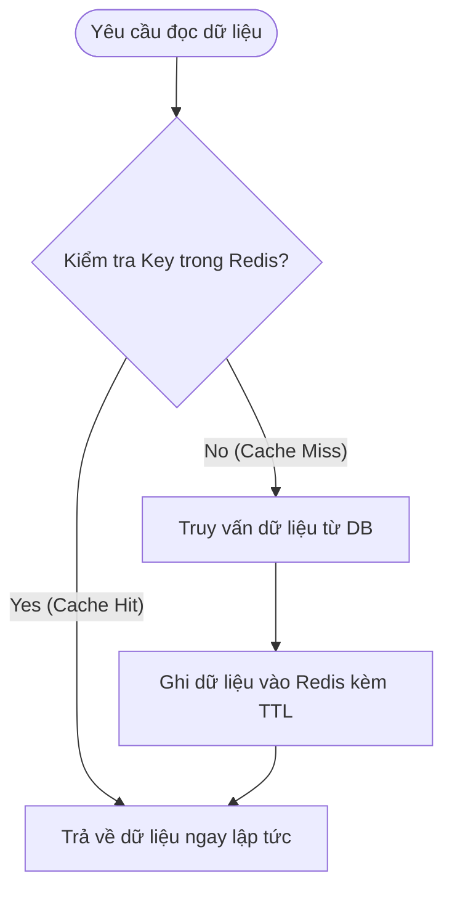

# TÀI LIỆU ÔN TẬP: SYSTEM DESIGN (GÓC NHÌN SENIOR - CHUẨN PHỎNG VẤN)

Tài liệu này hệ thống hóa các khái niệm thiết kế hệ thống, phân tích yêu cầu, UML Diagram và các bài toán tối ưu hóa hệ thống thực tế (caching, database index, microservices) với góc nhìn của một kỹ sư hệ thống lâu năm.

---

## 1. Phân Tích Yêu Cầu & Thiết Kế Kiến Trúc (SDLC)

### Câu 27: Mục tiêu quan trọng nhất của giai đoạn "Phân tích thiết kế" trong SDLC là gì? Phân biệt Yêu cầu chức năng và Phi chức năng.
*   **TL;DR:** Mục tiêu quan trọng nhất là **chuyển đổi các yêu cầu nghiệp vụ mơ hồ thành một bản thiết kế kỹ thuật khả thi, rõ ràng**, giảm thiểu rủi ro làm sai hướng và cung cấp một blueprint để toàn bộ đội ngũ phát triển (Dev, QC, DevOps) cùng làm việc hiệu quả.
*   **Phân biệt:**
    *   **Yêu cầu chức năng (Functional Requirements - FR):** Hệ thống phải làm được cái gì (Ví dụ: "Hệ thống phải cho phép người dùng chuyển tiền qua ví điện tử").
    *   **Yêu cầu phi chức năng (Non-Functional Requirements - NFR):** Hệ thống hoạt động tốt như thế nào về mặt hiệu năng, bảo mật, độ tin cậy (Ví dụ: "Hệ thống chuyển tiền phải xử lý dưới 2 giây và hỗ trợ 10.000 người dùng đồng thời").
*   **Góc nhìn Senior/Interview Tip:** Sinh viên thường bỏ qua NFR. Một Senior luôn biết rằng NFR mới là thứ quyết định kiến trúc hệ thống (Monolith vs Microservices, SQL vs NoSQL, dùng Cache ở đâu).

### Câu 28: Khi nhận được yêu cầu thiết kế hệ thống mới, bạn sẽ đặt 5 câu hỏi đầu tiên nào cho Product Owner?
1.  **Quy mô người dùng và lưu lượng truy cập là bao nhiêu?** (DAU - Daily Active Users, Peak QPS - Queries Per Second để tính toán throughput hệ thống).
2.  **Đặc thù đọc/ghi dữ liệu của hệ thống như thế nào?** (Read-heavy hay Write-heavy? Ví dụ: MXH là Read-heavy, hệ thống IoT là Write-heavy).
3.  **Yêu cầu về tính sẵn sàng và nhất quán dữ liệu ở mức độ nào?** (Cần Strong Consistency như Banking hay Eventual Consistency như Notification? Áp dụng định lý CAP).
4.  **Hệ thống cần tích hợp với các bên thứ ba (Third-party) nào không?** (Cổng thanh toán, dịch vụ vận chuyển, SMS OTP...).
5.  **Ngân sách vận hành (Cloud/Infra Cost) và thời gian ra mắt (Time-to-market) dự kiến là bao nhiêu?** (Để cân đối giữa giải pháp hoàn hảo và giải pháp tối giản khả thi MVP).

### Câu 29: Tại sao xác định đúng Domain Model lại quan trọng trước khi thiết kế CSDL? Ví dụ với hệ thống thư viện.
*   **TL;DR:** Domain Model (Mô hình miền nghiệp vụ) thể hiện bản chất của các thực thể và mối quan hệ nghiệp vụ trong thế giới thực, độc lập với công nghệ lưu trữ. Nếu thiết kế CSDL (Table, Column) trước khi hiểu rõ Domain Model, cấu trúc DB sẽ bị phụ thuộc vào giao diện hiển thị tạm thời, dẫn đến việc khó mở rộng và sửa đổi sau này.
*   **Ví dụ thư viện:**
    *   Nếu nhảy ngay vào vẽ DB: Tạo bảng `Book(id, title, author, is_borrowed)`.
    *   Khi nghiệp vụ thay đổi: Thư viện mua 5 cuốn sách giống hệt nhau (cùng tựa đề, tác giả). Ta không thể lưu `is_borrowed` vào bảng `Book` nữa vì cuốn này mượn nhưng cuốn kia vẫn còn.
    *   Domain Model chuẩn: Phải phân tách thành hai thực thể:
        *   `Book` (Sách - chứa thông tin chung: ISBN, Title, Author).
        *   `BookCopy` (Bản sao vật lý - chứa trạng thái thực tế: Barcode, Status: BORROWED/AVAILABLE, ShelfLocation). Bảng `BorrowTicket` sẽ liên kết tới `BookCopy`.

---

## 2. UML Diagrams & Thiết Kế Luồng Nghiệp Vụ

### Câu 30: Biểu đồ Use Case dùng để làm gì? Phân biệt Actor Primary và Actor Secondary. Cho ví dụ trong hệ thống thanh toán.
*   **TL;DR:** Use Case Diagram dùng để xác định phạm vi hệ thống, mô tả trực quan ai (Actor) làm gì với hệ thống (Use Case) mà không cần quan tâm đến cách cài đặt kỹ thuật bên trong.
*   **Phân biệt Actor:**
    *   **Primary Actor (Tác nhân chính):** Người/Hệ thống chủ động kích hoạt một luồng sự kiện để đạt được mục tiêu của họ (Ví dụ: Khách hàng click nút "Thanh toán").
    *   **Secondary Actor (Tác nhân phụ/hỗ trợ):** Người/Hệ thống được gọi để hỗ trợ hoàn thành Use Case đó (Ví dụ: Cổng thanh toán VNPay nhận request và phản hồi kết quả thanh toán cho hệ thống).

### Câu 31 & 32: Vẽ biểu đồ Use Case cho hệ thống ATM. Phân biệt <<include>> và <<extend>>.
*   **Sự khác biệt cốt lõi:**
    *   `<<include>>` (Bao gồm): Bắt buộc phải thực hiện. Use Case con là một phần không thể thiếu của Use Case cha.
    *   `<<extend>>` (Mở rộng): Chỉ thực hiện khi thỏa mãn một điều kiện cụ thể (không bắt buộc).
*   **Biểu đồ Use Case ATM (Mermaid):**

```mermaid
usecaseDiagram
    actor Customer as "Khách hàng"
    actor BankSystem as "Hệ thống Ngân hàng"

    rect "Hệ thống ATM" {
        usecase UC_Login as "Đăng nhập bằng thẻ & PIN"
        usecase UC_Withdraw as "Rút tiền"
        usecase UC_Transfer as "Chuyển khoản"
        usecase UC_Receipt as "In hóa đơn"
        usecase UC_CheckBalance as "Kiểm tra số dư"
        usecase UC_Warning as "Cảnh báo vượt hạn mức"
    }

    Customer --> UC_Login
    Customer --> UC_Withdraw
    Customer --> UC_Transfer

    UC_Withdraw ..> UC_Login : <<include>>
    UC_Transfer ..> UC_Login : <<include>>
    UC_CheckBalance ..> UC_Login : <<include>>

    UC_Withdraw <.. UC_Receipt : <<extend>>
    UC_Withdraw <.. UC_Warning : <<extend>> (nếu rút > số dư)

    UC_Login --> BankSystem
    UC_Withdraw --> BankSystem
    UC_Transfer --> BankSystem
```

### Câu 33: Chỉ ra 2 lỗi phổ biến nhất khi sinh viên vẽ Use Case Diagram.
1.  **Phân rã chức năng quá chi tiết (Functional Decomposition):** Vẽ các hành động mang tính kỹ thuật/giao diện thành Use Case (Ví dụ: vẽ Use Case "Nhập Username", "Nhập Password", "Click nút Submit". Đúng ra chỉ cần 1 Use Case duy nhất là "Đăng nhập").
2.  **Mũi tên chỉ ngược hướng logic:** Vẽ mũi tên từ Use Case chỉ vào Actor, hoặc dùng sai hướng của quan hệ `<<include>>`/`<<extend>>` (mũi tên đứt nét phải chỉ từ Use Case gốc sang Use Case được include, và từ Use Case extend ngược về Use Case gốc).

### Câu 34: Biểu đồ Sequence thể hiện điều gì mà Use Case không thể hiện được? Tại sao Backend Developer cần nó?
*   **TL;DR:** Use Case chỉ cho biết "Ai làm gì", còn Sequence Diagram thể hiện **trật tự thời gian tương tác giữa các đối tượng/thành phần** bên trong hệ thống để hoàn thành một chức năng đó.
*   **Tại sao Backend cần:** Giúp Backend Developer hình dung rõ các lời gọi hàm (API call, DB Query, Message Broker) giữa các Service/Layer theo trình tự thời gian, từ đó thiết kế Interface, DTO và xử lý Transaction hợp lý.

### Câu 35 & 36: Vẽ biểu đồ Sequence cho luồng "Người dùng đăng nhập" (Kiến trúc 3 lớp + Alt nhánh sai mật khẩu).
*   **Biểu đồ Sequence (Mermaid):**



### Câu 37: Phân biệt Message đồng bộ (Sync) và Message bất đồng bộ (Async) trong biểu đồ Sequence.
*   **Synchronous Message (Đồng bộ - mũi tên nét liền, đầu đặc `->>`):** Người gửi gửi thông điệp và **bắt buộc phải dừng lại chờ** phản hồi từ người nhận rồi mới tiếp tục làm việc tiếp.
*   **Asynchronous Message (Bất đồng bộ - mũi tên nét liền, đầu hở `->`):** Người gửi gửi thông điệp đi và **ngay lập tức tiếp tục công việc của mình** mà không cần chờ người nhận xử lý xong (Ví dụ: gửi mail xác nhận qua Message Queue).

### Câu 38: Biểu đồ Component khác gì so với biểu đồ Class?
*   **Class Diagram:** Ở mức độ chi tiết code thấp (Low-level). Thể hiện các Class, thuộc tính, phương thức và mối quan hệ kế thừa/phụ thuộc trong mã nguồn.
*   **Component Diagram:** Ở mức độ kiến trúc cao hơn (High-level). Thể hiện sự đóng gói vật lý của hệ thống thành các khối độc lập có thể tái sử dụng (như JAR file, Docker Container, DLL, SPA Client) và cách chúng giao tiếp với nhau qua các Interface/Port.

---

## 3. Kiến Trúc Hệ Thống (System Architecture)

### Câu 39: Sơ đồ kiến trúc tổng thể (High-level Architecture) cho hệ thống E-commerce.
*   **Sơ đồ kiến trúc (Mermaid):**

```mermaid
graph TD
    Client[React SPA / Mobile App] -->|HTTPS| WebACL[Cloudflare / WAF]
    WebACL -->|Reverse Proxy| APIGateway[API Gateway / Spring Cloud Gateway]

    subgraph "Microservices Layer"
        APIGateway -->|Routing| AuthService[Auth Service]
        APIGateway -->|Routing| ProductService[Product Service]
        APIGateway -->|Routing| OrderService[Order Service]
    end

    subgraph "Caching & Messaging"
        ProductService -->|Read-Aside| RedisCache[(Redis Cluster)]
        OrderService -->|Publish OrderCreated| RabbitMQ{RabbitMQ / Kafka}
        InventoryService[Inventory Service] <--|Subscribe| RabbitMQ
    end

    subgraph "Database Layer"
        AuthService --> DB_Auth[(PostgreSQL - Auth)]
        ProductService --> DB_Prod[(MongoDB - Catalog)]
        OrderService --> DB_Order[(MySQL - Order)]
    end
```

### Câu 41: Khi nào dùng REST đồng bộ, khi nào dùng Message Queue bất đồng bộ?
*   **Dùng REST đồng bộ (Synchronous REST):** Khi client thực sự cần kết quả phản hồi ngay lập tức để tiếp tục luồng xử lý (Ví dụ: Đăng nhập, truy vấn số dư tài khoản ngân hàng, kiểm tra thông tin chi tiết sản phẩm).
*   **Dùng Message Queue (Asynchronous MQ):**
    *   Khi tác vụ tốn nhiều thời gian xử lý (Ví dụ: Gửi email kích hoạt, xuất báo cáo PDF hàng triệu dòng, xử lý ảnh/video).
    *   Khi cần đảm bảo tính lỏng lẻo (Loose Coupling) giữa các service và chịu tải tốt (Load leveling) khi lưu lượng truy cập tăng đột biến.

### Câu 42: Lợi điểm lớn nhất của kiến trúc Monolith khi bắt đầu dự án sinh viên/Startup là gì?
*   **TL;DR:** Sự đơn giản trong việc **phát triển (Development)**, **kiểm thử (Testing)**, và đặc biệt là **triển khai (Deployment)**.
*   **Chi tiết:**
    *   Tất cả code nằm chung một repo, chia sẻ memory nên không tốn chi phí gọi mạng (network overhead) hay quản lý giao dịch phân tán (Distributed Transactions).
    *   Triển khai cực kỳ rẻ và nhanh (chỉ cần đẩy một file JAR duy nhất lên một server VPS).

### Câu 43: Khi nào KHÔNG NÊN chọn Microservices? Nêu 3 lý do cụ thể.
1.  **Quy mô đội ngũ phát triển quá nhỏ:** Nếu team chỉ có 3 - 5 người, việc quản lý hạ tầng Microservices (CI/CD, Monitoring, Service Discovery) sẽ ngốn sạch thời gian phát triển tính năng sản phẩm.
2.  **Mô hình nghiệp vụ chưa ổn định (Startup giai đoạn đầu):** Khi các ranh giới nghiệp vụ (domain boundaries) thay đổi liên tục, việc tách nhỏ cơ sở dữ liệu sẽ biến thành cơn ác mộng vì phải refactor DB liên tục trên nhiều service độc lập.
3.  **Hệ thống đòi hỏi độ trễ cực thấp (Ultra-low latency):** Các lời gọi mạng liên dịch vụ (REST, gRPC) luôn chậm hơn triệu lần so với lời gọi hàm trực tiếp trong bộ nhớ của Monolith.

### Câu 44: Rủi ro của "Database per Service" trong Microservices khi cần làm báo cáo thống kê?
*   **TL;DR:** Rủi ro lớn nhất là không thể thực hiện các câu lệnh `JOIN` trực tiếp trên SQL của nhiều database khác nhau để lấy thông tin tổng hợp.
*   **Cách giải quyết:**
    *   *Giải pháp ngắn hạn:* API Composition (Gọi API của từng service rồi join trong memory ở Gateway/BFF - hiệu năng kém khi lượng data lớn).
    *   *Giải pháp dài hạn (Senior):* Sử dụng mô hình **CQRS** (Command Query Responsibility Segregation) và kỹ thuật **CDC** (Change Data Capture) để đồng bộ dữ liệu từ các Database nghiệp vụ về một Data Warehouse chung (như BigQuery, Elasticsearch) để chuyên chạy báo cáo.

### Câu 45: REST đồng bộ vs. Message Queue bất đồng bộ — về độ tin cậy khi service đích bị down?
*   **REST đồng bộ:** Nếu Service B (nhận) bị sập, Service A (gọi) sẽ nhận về lỗi Timeout hoặc 500. Dữ liệu yêu cầu có nguy cơ bị mất vĩnh viễn nếu Service A không có cơ chế lưu trữ tạm thời hoặc cơ chế retry phức tạp.
*   **Message Queue:** Nếu Service B bị sập, Message vẫn được lưu an toàn trong Message Queue (như RabbitMQ, Kafka) nhờ tính chất **durability**. Khi Service B hồi phục, nó sẽ tự động tiêu thụ (consume) tiếp các message đang đợi. Tính sẵn sàng hệ thống tăng cực cao.

### Câu 46: Làm thế nào để phát hiện CPU/RAM Spike trong hệ thống đang chạy?
*   Sử dụng các công cụ **APM** (Application Performance Monitoring) như **Prometheus + Grafana**, **New Relic**, **Datadog**, hoặc **AWS CloudWatch**.
*   Thiết lập các **Alerting rules** (Ví dụ: CPU > 85% liên tục trong 5 phút -> Bắn cảnh báo qua Slack/Telegram).
*   Trong môi trường phát triển/VPS đơn giản, có thể SSH trực tiếp vào server sử dụng các lệnh dòng lệnh hệ thống như `top`, `htop` (Linux) hoặc `Task Manager`/`Performance Monitor` (Windows).

---

## 4. Tối Ưu Hóa & Cơ Chế Caching

### Câu 47: Giải thích N+1 Problem qua tình huống: GET /api/orders tải 5 giây khi có 50 đơn hàng.
*   **TL;DR:** N+1 Problem xảy ra khi ứng dụng thực hiện **1 câu truy vấn** để lấy danh sách đối tượng cha (N đối tượng), sau đó chạy thêm **N câu truy vấn riêng biệt** nữa để lấy thông tin của các đối tượng con liên kết của từng đối tượng cha đó. Tổng cộng là `N + 1` câu query xuống Database.
*   **Giải thích tình huống:**
    *   Bạn thực hiện lấy 50 đơn hàng: `SELECT * FROM orders;` (Lấy ra được 50 đơn hàng - 1 query).
    *   Ứng dụng lặp qua từng đơn hàng để lấy thông tin khách hàng (Customer) của đơn đó: `SELECT * FROM customers WHERE id = ?;` (Chạy 50 lần - N query).
    *   Vì mỗi query xuống Database mất trung bình 50-100ms (do độ trễ kết nối mạng), việc chạy 51 queries làm API mất tới 5 giây.

### Câu 48: Cách khắc phục N+1 trong JPA/Hibernate khi dùng quan hệ @OneToMany?
1.  **Sử dụng `JOIN FETCH` trong JPQL/HQL (Khuyên dùng):**
    ```java
    @Query("SELECT o FROM Order o JOIN FETCH o.orderDetails")
    List<Order> findAllWithDetails();
    ```
    Hibernate sẽ gộp lại thành đúng 1 câu query SQL duy nhất sử dụng mệnh đề `INNER JOIN` hoặc `LEFT JOIN`.
2.  **Sử dụng `@EntityGraph`:** Khai báo cấu trúc các mối quan hệ cần load đồng thời ngay trên Method của Repository.
3.  **Đặt `@BatchSize`:** Cấu hình cho Hibernate load các thực thể liên kết theo từng lô (batch) thay vì từng dòng một (giảm số lượng query từ `N + 1` xuống còn `N/BatchSize + 1`).

### Câu 49: Nêu 3 nguyên nhân khác (ngoài N+1) khiến DB query chậm.
1.  **Thiếu Index (Chỉ mục) trên các cột thường xuyên tìm kiếm (`WHERE`), sắp xếp (`ORDER BY`) hoặc liên kết (`JOIN`).** Database bắt buộc phải thực hiện quét toàn bộ bảng (Table Scan).
2.  **Không giới hạn số lượng bản ghi trả về:** Thực hiện `SELECT *` trên bảng hàng triệu dòng mà không phân trang (Pagination).
3.  **Khóa chết/Xung đột khóa (Database Lock/Deadlock):** Nhiều transaction cùng lúc cố gắng cập nhật trên cùng các dòng dữ liệu, dẫn đến hàng đợi bị block và gây ra timeout.

### Câu 50 & 51: Redis là gì? Tại sao không dùng biến Static? Mô tả chiến lược Cache-Aside.
*   **Redis là gì:** Là một hệ thống lưu trữ dữ liệu Key-Value trong bộ nhớ RAM (In-memory Database) mã nguồn mở, tốc độ đọc ghi cực nhanh (< 1ms).
*   **Tại sao không dùng biến static trong code (như ConcurrentHashMap)?**
    *   **Chia sẻ dữ liệu:** Biến static nằm ở bộ nhớ của JVM hiện tại. Khi scale hệ thống lên nhiều instance (nhiều server), các instance không thể truy cập chung biến static đó, dẫn đến không nhất quán dữ liệu. Redis đóng vai trò là một Centralized Cache dùng chung cho mọi instance.
    *   **Quản lý bộ nhớ:** Redis hỗ trợ cơ chế tự động xóa dữ liệu quá hạn (**TTL**) và thuật toán giải phóng bộ nhớ khi đầy (**LRU** - Least Recently Used). Biến static nếu lưu quá nhiều sẽ gây tràn bộ nhớ RAM (OutOfMemoryError).
*   **Chiến lược Cache-Aside (Lazy Loading) Hoạt động:**



*   **Cách Invalidation (Xử lý khi cập nhật dữ liệu):**
    *   Khi update/delete dữ liệu ở Database, lập tức **Xóa key tương ứng trong Cache** (Cache Eviction) thay vì cập nhật nó.
    *   Lý do xóa thay vì cập nhật: Để tránh tranh chấp dữ liệu khi có nhiều luồng cập nhật đồng thời (Race condition) và không làm lãng phí RAM lưu trữ những dữ liệu ít khi được đọc lại.

### Câu 52: Giải pháp cho Cache Penetration (Bộ nhớ đệm bị xuyên thủng) và Cache Avalanche (Tuyết lở)?
*   **Cache Penetration:** Xảy ra khi kẻ xấu liên tục request các Key **chắc chắn không tồn tại** trong cả Cache lẫn DB (Ví dụ: id = -1). Request chạy thẳng xuống DB làm DB quá tải.
    *   *Giải pháp:*
        1.  **Cache Null Values:** Nếu DB trả về null, vẫn lưu key đó vào Redis với value là một chuỗi rỗng kèm TTL cực ngắn (ví dụ: 1-2 phút).
        2.  **Bloom Filter:** Sử dụng cấu trúc dữ liệu xác suất để kiểm tra nhanh key có tồn tại trong hệ thống hay không trước khi gọi xuống DB.
*   **Cache Avalanche:** Xảy ra khi một lượng lớn các Key trong Cache **hết hạn (expire) cùng một thời điểm**, hoặc server Redis bị sập. Toàn bộ traffic ập xuống DB cùng lúc gây sập DB.
    *   *Giải pháp:*
        1.  **Jitter (Thêm thời gian ngẫu nhiên vào TTL):** Khi set TTL cho các key, cộng thêm một khoảng thời gian ngẫu nhiên từ 1 - 5 phút (ví dụ: `TTL = 30m + random(1m, 5m)`) để phân tán thời điểm hết hạn.
        2.  **Thiết lập Redis Cluster / Sentinel:** Đảm bảo tính sẵn sàng cao (High Availability), tự động failover nếu một node Redis bị sập.

### Câu 53: Khi nào KHÔNG NÊN dùng Cache?
1.  **Dữ liệu thay đổi quá thường xuyên (Real-time / High-frequency Write):** Ví dụ như biến động giá cổ phiếu liên tục. Chi phí xóa/ghi đè cache liên tục lớn hơn lợi ích đọc.
2.  **Dữ liệu đòi hỏi tính nhất quán tuyệt đối (Strong Consistency):** Như số dư tài khoản ngân hàng. Sai sót vài miligiây trong cache cũng gây ra hậu quả nghiêm trọng.
3.  **Dữ liệu ít khi được đọc lại:** Caching chỉ có ý nghĩa khi tần suất đọc (Read Rate) lớn hơn rất nhiều tần suất ghi (Write Rate).

### Câu 54: Database Index (B-Tree) hoạt động thế nào? Tại sao nhiều Index lại làm INSERT chậm?
*   **Database Index hoạt động thế nào:** Tương tự như mục lục của một cuốn sách. Thay vì quét từng trang từ đầu đến cuối để tìm từ khóa (Table Scan), Database sử dụng cấu trúc cây tự cân bằng (thường là **B+ Tree**) trên cột được tạo index để tìm kiếm bản ghi với độ phức tạp thời gian chỉ là **O(log N)**.
*   **Tại sao nhiều Index làm INSERT/UPDATE/DELETE chậm?**
    *   Bởi vì mỗi khi có một dòng dữ liệu mới được thêm vào bảng, Database không chỉ ghi dữ liệu vật lý vào bảng chính, mà còn phải **tự động chèn nút mới và cân bằng lại cây B-Tree của toàn bộ các cột có cấu hình Index**.
    *   Nhiều index đồng nghĩa với việc DB phải thực hiện rất nhiều thao tác ghi phụ và tái cấu trúc cây cho mỗi câu lệnh INSERT.
