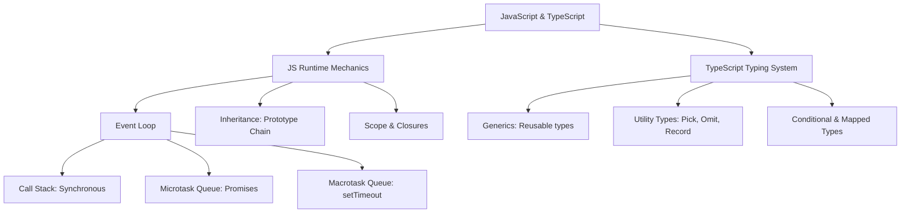

# JavaScript ES6+ & TypeScript Deep Dive

---

## 1. Khái niệm (Difficulty Breakdown)

### # Beginner
Ở mức độ cơ bản:
- **JavaScript (JS)**: Ngôn ngữ kịch bản nhẹ, đơn luồng (Single-threaded), chạy chủ yếu trên trình duyệt web (hoặc trên server qua Node.js). Có tính năng tự động thu gom rác và kiểu dữ liệu động (Dynamic typing).
- **TypeScript (TS)**: Là một tập cha (Superset) của JavaScript, bổ sung tính năng kiểm tra kiểu dữ liệu tĩnh (Static typing) tại thời điểm biên dịch (Compile-time). Mã TS sau đó sẽ được transpile (biên dịch chéo) sang mã JS thuần để chạy trên môi trường runtime.

### # Intermediate
Đi sâu vào các cơ chế cốt lõi của ngôn ngữ:
- **Scope & Closure**: **Scope** quyết định phạm vi truy cập của biến (Global, Function, Block). **Closure** là tính năng của JS cho phép một hàm ghi nhớ và truy cập vào scope bên ngoài của nó ngay cả khi hàm ngoài đã thực thi xong.
- **Prototype-based Inheritance**: Khác với Java dùng Class-based, JS sử dụng **Prototype** để kế thừa thuộc tính và phương thức. Mọi đối tượng trong JS đều có một liên kết ngầm đến một đối tượng khác gọi là prototype của nó, tạo nên **Prototype Chain**.
- **Event Loop (Vòng lặp sự kiện)**: Cơ chế giúp JS xử lý bất đồng bộ dù chạy đơn luồng. Các tác vụ bất đồng bộ được đẩy vào Web APIs (trình duyệt) hoặc C++ APIs (Node.js). Khi hoàn thành, callback của chúng được xếp vào:
  - **Microtask Queue**: Chứa Promise callbacks, `queueMicrotask`, `MutationObserver`. Được ưu tiên chạy hết trước.
  - **Macrotask/Callback Queue**: Chứa `setTimeout`, `setInterval`, I/O operations. Chạy sau khi Microtask Queue đã trống.

### # Advanced
Ở mức nâng cao với TypeScript:
- **Generics**: Cho phép định nghĩa hàm, class, interface hoạt động với nhiều kiểu dữ liệu khác nhau mà vẫn giữ được tính an toàn kiểu dữ liệu (Type-safe).
- **Utility Types**:
  - `Partial<T>`: Biến tất cả thuộc tính của T thành optional (có thể có hoặc không).
  - `Pick<T, K>`: Trích xuất một tập hợp các thuộc tính K từ T.
  - `Omit<T, K>`: Loại bỏ các thuộc tính K từ T.
  - `Record<K, T>`: Tạo một kiểu đối tượng với khóa thuộc K và giá trị thuộc T.
- **Conditional Types**: Cho phép chọn kiểu dữ liệu dựa trên biểu thức điều kiện (Ví dụ: `T extends U ? X : Y`).

### # Expert
Ở mức độ tối thượng (Architect):
- **Template Literal Types**: Kết hợp với kiểu chuỗi để sinh ra các kiểu dữ liệu động tinh vi (Ví dụ: Định nghĩa kiểu của CSS class hoặc route path dạng `` `/api/${string}` ``).
- **Covariance (Đồng biến) và Contravariance (Nghịch biến)**: Khái niệm toán học quy định tính tương thích kiểu dữ liệu khi truyền tham số hoặc kiểu trả về của các Hàm (Functions) kế thừa. Tham số hàm có tính chất contravariant (chấp nhận kiểu cha rộng hơn), trong khi kiểu trả về của hàm có tính chất covariant (chấp nhận kiểu con hẹp hơn).
- **Custom Type Guards & Assertions**: Viết các hàm kiểm tra kiểu tùy chỉnh sử dụng từ khóa `is` (ví dụ: `pet is Dog`) giúp TypeScript tự động suy luận kiểu (Type Narrowing) chính xác trong các khối mã phức tạp.

---

## 2. Mục đích

Trong các dự án doanh nghiệp:
- **Đảm bảo tính tin cậy của mã nguồn**: Sử dụng TypeScript giúp phát hiện sớm 80% lỗi logic ngay trong lúc gõ code (Compile-time) thay vì để nó crash trên production (Runtime).
- **Tăng hiệu quả làm việc nhóm**: Kiểu dữ liệu tĩnh đóng vai trò như tài liệu tự động (Auto-documentation). Khi gọi hàm của đồng nghiệp viết, IDE sẽ tự động gợi ý kiểu tham số và trả về, tránh việc phải mở file code nguồn ra đọc.
- **Xử lý các ứng dụng I/O lớn**: Hiểu rõ Event Loop giúp tối ưu hóa hiệu năng ứng dụng, ngăn chặn việc chặn luồng chính (Blocking Event Loop) của Node.js server.

---

## 3. Kiến trúc hoạt động

### Vòng lặp Sự kiện (Event Loop Execution Model)

```text
 Call Stack                  Web APIs / Background Tasks
┌───────────┐               ┌───────────────────────────┐
│           │               │ setTimeout, Fetch API,    │
│           │               │ Database Queries          │
└───────────┘               └───────────────────────────┘
      │                                    │
      │ 1. Run Sync Code                   │ 2. Task Completed
      ▼                                    ▼
+───────────────────────────────────────────────────────+
|                      EVENT LOOP                       |
+───────────────────────────────────────────────────────+
      ▲                                    │
      │ 4. If Call Stack is empty          │ 3. Enqueue Callback
      │                                    ▼
┌───────────────────┐             ┌───────────────────┐
│  Microtask Queue  │             │  Macrotask Queue  │
│ (Promises)        │             │ (setTimeout)      │
└───────────────────┘             └───────────────────┘
```

---

## 4. Ví dụ thực tế

### Tình huống:
Một ứng dụng Node.js làm API Gateway cho hệ thống ngân hàng bị sập liên tục và trễ (High Latency) khi có đợt quét báo cáo tháng. 

### Phân tích từ Architect:
Phát hiện trong mã nguồn có đoạn xử lý JSON String khổng lồ (dung lượng 150MB) bằng hàm `JSON.parse` đồng bộ trong một API handler. Vì JS là đơn luồng, cuộc gọi `JSON.parse` này chiếm hoàn toàn Call Stack trong 5 giây, chặn toàn bộ Event Loop. Trong 5 giây đó, API Gateway không thể tiếp nhận bất kỳ request thanh toán nào khác từ khách hàng, dẫn đến Timeout sập hệ thống.

### Giải pháp:
1. Di chuyển tác vụ phân tích JSON nặng đó sang một **Worker Thread** riêng của Node.js để chạy song song.
2. Hoặc chia nhỏ dữ liệu phân tích bằng các thư viện luồng dữ liệu (Stream parser như `oboe.js`) để xử lý bất đồng bộ từng phần dữ liệu, giải phóng Call Stack sau mỗi chu kỳ.

---

## 5. Code Demo

Dưới đây là một ví dụ minh họa việc kết hợp **Generics**, **Advanced Utility Types** và **Conditional Types** trong TypeScript để xây dựng một **Dynamic Database Repository** chuẩn Enterprise, hỗ trợ lọc và chuyển đổi kiểu dữ liệu an toàn.

```typescript
// Định nghĩa cấu trúc Model Entity cơ bản
interface BaseEntity {
  id: string;
  createdAt: Date;
  updatedAt: Date;
}

interface User extends BaseEntity {
  name: string;
  email: string;
  role: 'admin' | 'user';
}

// Kiểu loại bỏ các thuộc tính hệ thống (createdAt, updatedAt) để tạo kiểu Input gửi lên
type CreateInput<T extends BaseEntity> = Omit<T, keyof BaseEntity>;

// Kiểu tùy chọn tất cả thuộc tính ngoại trừ ID để làm dữ liệu Update
type UpdateInput<T extends BaseEntity> = { id: string } & Partial<Omit<T, keyof BaseEntity>>;

/**
 * Enterprise Abstract Repository using Generics, Utility Types, and Promises
 */
export class BaseRepository<T extends BaseEntity> {
  private database: Map<string, T> = new Map();

  async findById(id: string): Promise<T | null> {
    // Mô phỏng I/O bất đồng bộ qua Event Loop
    return new Promise((resolve) => {
      setTimeout(() => {
        const entity = this.database.get(id);
        resolve(entity ? { ...entity } : null);
      }, 50);
    });
  }

  async save(input: CreateInput<T>): Promise<T> {
    const id = Math.random().toString(36).substring(7);
    const now = new Date();
    
    // Ép kiểu động đảm bảo an toàn kiểu dữ liệu
    const newEntity = {
      ...(input as any),
      id,
      createdAt: now,
      updatedAt: now,
    } as T;

    this.database.set(id, newEntity);
    return newEntity;
  }

  async update(input: UpdateInput<T>): Promise<T> {
    const existing = this.database.get(input.id);
    if (!existing) {
      throw new Error(`Entity with ID ${input.id} not found`);
    }

    const updatedEntity = {
      ...(existing as any),
      ...(input as any),
      updatedAt: new Date()
    } as T;

    this.database.set(input.id, updatedEntity);
    return updatedEntity;
  }
}

// Ví dụ sử dụng an toàn kiểu
const userRepository = new BaseRepository<User>();
// Khởi tạo thành công, IDE sẽ bắt lỗi nếu thiếu trường 'name' hoặc 'email'
userRepository.save({
  name: 'Architect Huy',
  email: 'huy@enterprise.com',
  role: 'admin'
});
```

---

## 6. Best Practices

1. **Hiểu rõ kiểu `unknown` vs `any`**: Hạn chế tối đa sử dụng `any` vì nó làm mất hoàn toàn tính năng kiểm tra kiểu của TypeScript. Hãy dùng `unknown` thay thế cho các biến chưa rõ kiểu dữ liệu, bắt buộc phải thực hiện Type Narrowing trước khi sử dụng.
2. **Luôn sử dụng `const` thay cho `var`**: `var` hỗ trợ cơ chế Hoisting và có Function Scope dễ gây lỗi ẩn. `let` và `const` có Block Scope và tránh được lỗi trùng tên.
3. **Khai báo kiểu trả về tường minh cho hàm công khai (Public APIs)**: Luôn khai báo rõ kiểu trả về của các hàm xuất bản ra bên ngoài để tránh việc TS tự động suy luận kiểu sai lệch hoặc gây khó đọc cho người khác.
4. **Không chặn Event Loop (Block Event Loop)**: Tránh các phép toán đồng bộ phức tạp (đồng bộ hóa file `readFileSync`, vòng lặp hàng tỷ lần) trong luồng chính của Node.js.
5. **Cấu hình `tsconfig.json` khắt khe**: Luôn kích hoạt các flag `"strict": true`, `"noImplicitAny": true`, và `"strictNullChecks": true` để tận dụng tối đa sức mạnh bảo vệ của TypeScript.

---

## 7. Common Mistakes (Anti-patterns)

### 1. Không bắt lỗi (Catch Error) trong Promise
- **Anti-pattern**:
  ```javascript
  fetchData().then(result => process(result)); // Thiếu .catch()
  ```
- **Hệ quả**: Nếu mạng lỗi, Node.js sẽ ném ra lỗi `UnhandledPromiseRejectionWarning` có thể làm crash ứng dụng trong tương lai.
- **Khắc phục**: Luôn dùng `try-catch` bọc ngoài `async-await` hoặc thêm `.catch()` ở cuối chuỗi Promise.

### 2. Sử dụng Type Assertion vô tội vạ (`as`)
Sử dụng toán tử `as` để ép kiểu cưỡng bức chỉ nhằm mục đích tắt cảnh báo của compiler. Điều này có thể dẫn đến lỗi sập ứng dụng ở runtime vì thực tế dữ liệu nhận về có cấu trúc hoàn toàn khác.

---

## 8. Interview Questions

#### Q1: Closure là gì? Cho ví dụ thực tế ứng dụng của Closure?
* **Đáp án**: Closure là một hàm ghi nhớ và truy cập được vào scope của hàm cha ngay cả khi hàm cha đã chạy và kết thúc. Ví dụ thực tế là ứng dụng thiết kế dữ liệu riêng tư (Private Variables) hoặc tạo ra các hàm sinh dữ liệu (Factory Functions):
  ```javascript
  function createCounter() {
      let count = 0; // Private variable
      return {
          increment: () => ++count,
          getCount: () => count
      };
  }
  ```

#### Q2: Trình bày cơ chế hoạt động của Event Loop trong JavaScript?
* **Đáp án**: Event Loop kiểm tra liên tục xem Call Stack có trống không. Nếu trống, nó sẽ kiểm tra **Microtask Queue** và đẩy tất cả các tác vụ trong hàng đợi này (ví dụ: Promise callbacks) vào Call Stack để chạy cho đến khi trống. Sau đó, nó mới lấy tác vụ đầu tiên từ **Macrotask Queue** (ví dụ: setTimeout) để thực thi. Quá trình này lặp đi lặp lại vô tận.

#### Q3: Sự khác biệt giữa `Interface` và `Type` trong TypeScript là gì? Khi nào nên dùng cái nào?
* **Đáp án**:
  - Cả hai đều dùng để định nghĩa hình dạng (shape) của Object.
  - `Interface`: Có thể khai báo trùng tên nhiều lần để tự động gộp thuộc tính (Declaration Merging). Phù hợp định nghĩa các API contract công khai hoặc thư viện bên thứ ba.
  - `Type`: Có phạm vi rộng hơn, có thể định nghĩa Union Type (`A | B`), Tuple, các kiểu dữ liệu nguyên thủy biệt danh. Phù hợp cho việc thao tác logic kiểu nâng cao (Mapped Types, Conditional Types).

#### Q4: Phân biệt `==` và `===` trong JavaScript?
* **Đáp án**: 
  - `==` (Loose Equality) so sánh giá trị sau khi đã tự động ép kiểu về cùng định dạng (Type Coercion). Dễ gây lỗi bất ngờ.
  - `===` (Strict Equality) so sánh cả giá trị và kiểu dữ liệu mà không ép kiểu. Luôn khuyên dùng `===`.

#### Q5: Sự khác biệt giữa `unknown` và `any` trong TypeScript?
* **Đáp án**:
  - `any` tắt hoàn toàn trình kiểm tra kiểu của TypeScript, cho phép gọi mọi hàm, truy cập mọi thuộc tính trên biến đó (Không an toàn).
  - `unknown` là kiểu dữ liệu an toàn tương đương của `any`. TypeScript cho phép gán mọi thứ vào `unknown`, nhưng cấm không cho thực hiện bất kỳ thao tác nào trên biến đó cho tới khi ta thực hiện Type Guard (kiểm tra kiểu bằng `typeof`, `instanceof`) để thu hẹp kiểu của nó về một kiểu cụ thể hơn.

#### Q6: Mapped Types trong TypeScript dùng để làm gì? Cho ví dụ?
* **Đáp án**: Mapped Types cho phép tạo kiểu dữ liệu mới dựa trên các thuộc tính của một kiểu cũ bằng cách lặp qua các khóa của kiểu cũ.
  ```typescript
  type ReadOnlyUser<T> = {
      readonly [P in keyof T]: T[P];
  };
  ```

#### Q7: Điều gì xảy ra nếu bạn gọi `await` bên trong một vòng lặp `forEach`? Cách khắc phục?
* **Đáp án**: Vòng lặp `forEach` của mảng không hỗ trợ bất đồng bộ. Nó sẽ kích hoạt tất cả các Promise chạy song song và kết thúc vòng lặp ngay lập tức mà không đợi các Promise hoàn thành.
  - Khắc phục: Sử dụng vòng lặp `for...of` để chạy tuần tự (Sequential execution), hoặc sử dụng `Promise.all(array.map(async ...))` để chạy song song và đợi tất cả cùng xong.

#### Q8: Prototype Chain trong JavaScript hoạt động như thế nào?
* **Đáp án**: Khi ta truy cập vào một thuộc tính của một đối tượng, JS engine trước tiên tìm kiếm thuộc tính đó ngay trên đối tượng. Nếu không thấy, nó sẽ đi theo con trỏ `__proto__` tìm trên Prototype của đối tượng đó. Tiến trình này tiếp tục đi lên chuỗi liên kết cho đến khi tìm thấy thuộc tính hoặc gặp Prototype cao nhất là `Object.prototype` trỏ về `null`.

#### Q9: Phân biệt `Promise.all`, `Promise.allSettled`, `Promise.any` và `Promise.race`?
* **Đáp án**:
  - `Promise.all`: Đợi tất cả hoàn thành. Sẽ reject ngay lập tức nếu có một Promise thất bại.
  - `Promise.allSettled`: Đợi tất cả hoàn thành, trả về kết quả trạng thái (fulfilled/rejected) của từng Promise. Không bao giờ reject.
  - `Promise.any`: Trả về kết quả của Promise đầu tiên thành công. Reject nếu tất cả thất bại.
  - `Promise.race`: Trả về kết quả của Promise đầu tiên hoàn thành (bất kể thành công hay thất bại).

#### Q10: Giải thích khái niệm Covariance và Contravariance trong TypeScript?
* **Đáp án**: Đây là quy tắc xác định xem lớp con có thể thay thế lớp cha trong các cấu trúc phức tạp (như mảng hoặc hàm) hay không:
  - `Covariance` (Đồng biến): Cho phép gán một kiểu con hẹp hơn vào kiểu cha rộng hơn (ví dụ mảng `Dog[]` có thể gán vào `Animal[]`).
  - `Contravariance` (Nghịch biến): Ngược lại, xảy ra ở tham số hàm. Một hàm nhận tham số `Animal` có thể thay thế một hàm nhận tham số `Dog` (vì hàm xử lý Animal có thể xử lý an toàn mọi thuộc tính của Dog, ngược lại thì không).

---

## 9. Senior Notes

> [!IMPORTANT]
> **Kinh nghiệm thực tế từ Production:**
> 1. **Cảnh giác với memory leak do Closures kẹt tham chiếu**: Nếu một hàm closure tham chiếu tới một biến chứa dung lượng bộ nhớ lớn (như mảng lớn hoặc DOM elements), và closure đó được gắn vào một event listener toàn cục mà không gỡ bỏ, toàn bộ biến lớn đó sẽ không bao giờ được Garbage Collector giải phóng.
> 2. **Tránh lạm dụng `Promise.all` với số lượng request quá lớn**: Nếu bạn dùng `Promise.all` để thực hiện 10,000 request HTTP gọi API bên ngoài cùng một lúc, bạn sẽ làm cạn kiệt số lượng sockets của hệ điều hành (OS Socket exhaustion) và bị các máy chủ bên kia chặn IP (Rate limited). Hãy sử dụng thư viện giới hạn hàng đợi như `p-limit`.

---

## 10. Tài liệu tham khảo

1. [MDN Web Docs - JavaScript Guide](https://developer.mozilla.org/en-US/docs/Web/JavaScript)
2. [TypeScript Handbook (Official Documentation)](https://www.typescriptlang.org/docs/handbook/intro.html)
3. [Javascript Info - Deep dive tutorial](https://javascript.info/)
4. Sách: *You Don't Know JS* - Kyle Simpson.

---
# PHẦN BỔ TRỢ CHƯƠNG

### ✅ Checklist cần nhớ
- [ ] Hiểu rõ cơ chế hoạt động của Closure và Prototype Chain.
- [ ] Phân biệt được Microtask Queue và Macrotask Queue trong Event Loop.
- [ ] Luôn sử dụng `===` thay cho `==`.
- [ ] Biết cách áp dụng các Utility Types của TS (`Pick`, `Omit`, `Partial`).
- [ ] Hạn chế tối đa dùng `any`, chuyển sang dùng `unknown` khi không rõ kiểu dữ liệu.

### ✅ Mindmap (Mermaid)



### ✅ Cheat Sheet

* **Tóm tắt nhanh thứ tự chạy Event Loop**:
  1. Chạy tất cả code đồng bộ trong Call Stack.
  2. Chạy toàn bộ Task trong Microtask Queue (Promise `then`).
  3. Lấy 1 Task trong Macrotask Queue ra chạy (setTimeout).
  4. Lặp lại bước 2 (Kiểm tra và dọn sạch Microtask Queue phát sinh).
* **Khai báo kiểu Type Guard tùy chỉnh**:
  ```typescript
  function isUser(entity: any): entity is User {
      return entity && typeof entity.email === 'string';
  }
  ```

### ✅ Interview Tips

* Khi được yêu cầu **viết code giải thích Event Loop**, hãy viết ví dụ kinh điển này và giải thích thứ tự đầu ra (output):
  ```javascript
  console.log('1'); // Sync
  setTimeout(() => console.log('2'), 0); // Macrotask
  Promise.resolve().then(() => console.log('3')); // Microtask
  console.log('4'); // Sync
  // Output: 1 -> 4 -> 3 -> 2
  ```
* Khi phỏng vấn viên hỏi về **TypeScript Compiler (`tsc`)**, hãy nhấn mạnh: *"TypeScript chỉ bảo vệ chúng ta ở giai đoạn biên dịch. Khi biên dịch sang JavaScript, mọi định nghĩa interface, type đều bị xóa bỏ hoàn toàn (Type Erasure), vì vậy để bảo vệ dữ liệu ở runtime (khi nhận dữ liệu từ API bên ngoài), ta vẫn cần viết các đoạn code validation."*

### ✅ Mini Project: Enterprise-grade Event Emitter in TypeScript

**Mô tả**: Xây dựng một thư viện phát sự kiện (Event Emitter) thread-safe tự định nghĩa, hỗ trợ đăng ký sự kiện, hủy đăng ký, phát sự kiện bất đồng bộ qua Event Loop, đảm bảo an toàn kiểu dữ liệu bằng cách sử dụng TypeScript Generics.

**Triển khai**:

```typescript
type Listener<T> = (data: T) => void | Promise<void>;

export class SafeEventEmitter<Events extends Record<string, any>> {
  private listeners: { [K in keyof Events]?: Set<Listener<Events[K]>> } = {};

  // Đăng ký lắng nghe sự kiện
  on<K extends keyof Events>(event: K, listener: Listener<Events[K]>): void {
    if (!this.listeners[event]) {
      this.listeners[event] = new Set();
    }
    this.listeners[event]!.add(listener);
  }

  // Hủy đăng ký lắng nghe sự kiện
  off<K extends keyof Events>(event: K, listener: Listener<Events[K]>): void {
    const eventListeners = this.listeners[event];
    if (eventListeners) {
      eventListeners.delete(listener);
    }
  }

  // Phát sự kiện bất đồng bộ qua Event Loop
  async emit<K extends keyof Events>(event: K, data: Events[K]): Promise<void> {
    const eventListeners = this.listeners[event];
    if (!eventListeners) return;

    // Chạy tất cả callback một cách bất đồng bộ
    const promises = Array.from(eventListeners).map(async (listener) => {
      try {
        await listener(data);
      } catch (err) {
        console.error(`Error in event listener for ${String(event)}:`, err);
      }
    });

    await Promise.all(promises);
  }
}

// Kiểm thử kiểu dữ liệu tĩnh an toàn
interface AppEvents {
  'user:login': { userId: string; timestamp: number };
  'system:error': { code: number; message: string };
}

const emitter = new SafeEventEmitter<AppEvents>();

// Đăng ký lắng nghe
emitter.on('user:login', (data) => {
  console.log(`User ${data.userId} logged in at ${data.timestamp}`);
});

// Phát sự kiện (Nếu ghi sai định dạng data, TS compiler sẽ báo lỗi lập tức)
emitter.emit('user:login', { userId: 'usr_102', timestamp: Date.now() });
```

---

### ✅ Bài tập thực hành

#### Bài tập 1: Triển khai hàm `debounce`
Viết một hàm `debounce` bằng TypeScript giúp trì hoãn việc thực thi một callback cho tới khi không có sự kiện mới nào phát sinh trong một khoảng thời gian chờ (delay) quy định. Thường dùng tối ưu ô tìm kiếm.
* **Gợi ý Giải pháp**: Sử dụng `setTimeout` và trả về một closure. Ở mỗi lần gọi hàm, thực hiện `clearTimeout` của id cũ trước khi set id mới.

#### Bài tập 2: Tự định nghĩa Utility Type `MyOmit<T, K>`
Không sử dụng kiểu `Omit` có sẵn của TypeScript, hãy viết một Utility Type tương đương sử dụng `Pick` và `Exclude`.
* **Gợi ý Giải pháp**:
  ```typescript
  type MyOmit<T, K extends keyof any> = Pick<T, Exclude<keyof T, K>>;
  ```

---

### ✅ References
- [Ref1] Eloquent JavaScript - Marijn Haverbeke.
- [Ref2] TypeScript Deep Dive GitBook - Basarat Ali Syed.
