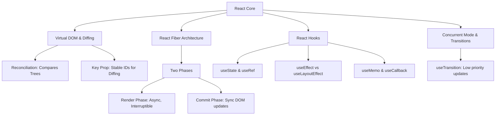

# React Core Mechanics & Fiber Architecture

---

## 1. Khái niệm (Difficulty Breakdown)

### # Beginner
Ở mức độ cơ bản, **React** là một thư viện JavaScript declarative (khai báo), component-based để xây dựng giao diện người dùng. 
- **Component**: Là các khối độc lập, có thể tái sử dụng để xây dựng giao diện. Component nhận đầu vào là **Props** (bất biến, truyền từ cha xuống) và quản lý trạng thái nội bộ thông qua **State** (có thể thay đổi để kích hoạt việc render lại giao diện).
- **JSX (JavaScript XML)**: Cú pháp mở rộng giúp bạn viết cấu trúc HTML trực tiếp ngay bên trong JavaScript. JSX sau đó được biên dịch thành các lệnh gọi hàm `React.createElement()`.

### # Intermediate
Đi sâu vào bên dưới bề mặt:
- **Virtual DOM (VDOM)**: React không cập nhật trực tiếp lên DOM thật (Real DOM) vì thao tác này rất đắt đỏ về hiệu năng. Thay vào đó, React duy trì một bản sao dung lượng nhẹ của DOM thật trong bộ nhớ gọi là Virtual DOM.
- **Render Lifecycle**: Khi state thay đổi, React tạo ra một cây VDOM mới, so sánh cây mới này với cây cũ (quá trình **Diffing**) để tìm ra sự khác biệt, và chỉ cập nhật những thay đổi đó lên DOM thật (quá trình **Reconciliation**).
- **React Hooks (useState, useEffect, useContext)**: Cơ chế cho phép Functional Component sử dụng state và các tính năng khác của React mà không cần viết Class Component.

### # Advanced
Ở mức độ nâng cao, ta đi vào kiến trúc **React Fiber** (được giới thiệu từ bản React 16):
- **React Fiber**: Là sự tái cấu trúc hoàn toàn thuật toán điều phối (Reconciler). Cây Virtual DOM truyền thống sử dụng đệ quy đồng bộ (Stack Reconciler), một khi đã chạy thì không thể ngắt quãng, gây đơ giao diện khi render cấu trúc lớn. Fiber chuyển đổi sang cấu trúc dữ liệu dạng **Linked List** hai chiều, cho phép chia nhỏ quá trình render thành các phần việc nhỏ (work units) có thể tạm dừng (pause), hủy bỏ (abort), hoặc thiết lập độ ưu tiên (priority).
- **Performance Hook Optimization**:
  - `useCallback`: Memoize (ghi nhớ) định nghĩa của một hàm để tránh tạo lại hàm mới ở mỗi chu kỳ render, ngăn việc re-render của component con nhận hàm đó làm prop.
  - `useMemo`: Ghi nhớ kết quả tính toán đắt đỏ để tránh tính toán lại khi các dependency không thay đổi.

### # Expert
Ở mức độ tối thượng (Architect):
- **React Server Components (RSC)**: Mô hình kiến trúc hiện đại (Next.js App Router). Component được thực thi trực tiếp trên Server và trả về định dạng JSON mô tả cây VDOM đã được phân tích cho Client. Client nhận dữ liệu này và ghép (merge) vào giao diện Client Component hiện tại mà không mất đi trạng thái (state) UI của Client, giảm kích thước bundle JavaScript tải xuống.
- **Concurrent Mode & Transitions (`useTransition`, `useDeferredValue`)**: Cho phép React cập nhật UI ở chế độ bất đồng bộ mà không chặn tương tác người dùng. Ví dụ: Khi người dùng gõ vào ô tìm kiếm, thao tác gõ (high priority) được cập nhật ngay, còn kết quả tìm kiếm hiển thị bên dưới (low priority) được tính toán song song ngầm và hiển thị mượt mà không gây giật lag.
- **Hydration**: Quá trình React Server-Side Rendering (SSR) sinh ra HTML tĩnh trên Server gửi về trình duyệt, sau đó React trên Client chạy để gắn các Event Listener vào cấu trúc HTML tĩnh đó để ứng dụng có khả năng tương tác.

---

## 2. Mục đích

Trong các dự án doanh nghiệp lớn:
- **Xây dựng Single Page Applications (SPA) quy mô lớn**: React giúp phân tách dự án thành các Component nhỏ độc lập cho các team phát triển song song, giảm thiểu xung đột mã nguồn.
- **Tối ưu hóa trải nghiệm người dùng (UX)**: Nhờ thuật toán VDOM và Fiber, giao diện phản hồi mượt mà ở tốc độ 60fps kể cả khi xử lý các tập dữ liệu lớn hiển thị thời gian thực (như bảng biểu tài chính, dashboard).
- **Tận dụng hệ sinh thái rộng lớn**: Khả năng tích hợp dễ dàng với các thư viện quản lý state (Redux Toolkit), router (React Router) và UI Frameworks (AntD, Tailwind) giúp tối ưu hóa thời gian phát triển dự án.

---

## 3. Kiến trúc hoạt động

### Cấu trúc Linked List của React Fiber Node và Cơ chế Render Phase vs Commit Phase

```text
    Platform Event (e.g., Click)
                │
                ▼
      ┌───────────────────┐
      │   Trigger State   │
      └───────────────────┘
                │
                ▼
┌───────────────────────────────────────────┐
│              RENDER PHASE                 │
│  (Asynchronous, Interruptible, No Side    │
│   Effects. Fiber builds Work-in-Progress  │
│   Tree using Linked List: child, sibling, │
│   return pointers)                        │
└───────────────────────────────────────────┘
                │
                ▼
┌───────────────────────────────────────────┐
│              COMMIT PHASE                 │
│  (Synchronous, Uninterruptible. React     │
│   applies mutations to Real DOM, runs     │
│   effects: useEffect, layoutEffects)      │
└───────────────────────────────────────────┘
```

---

## 4. Ví dụ thực tế

### Tình huống:
Một trang dashboard giám sát giao dịch chứng khoán của công ty tài chính hiển thị danh sách 5,000 cổ phiếu cập nhật giá mỗi giây. Khi giá cổ phiếu thay đổi, toàn bộ danh sách bị render lại khiến trình duyệt bị đứng (lag), người dùng không thể cuộn trang mượt mà hoặc gõ tìm kiếm mã cổ phiếu.

### Giải pháp của Architect:
1. Áp dụng kỹ thuật **Virtualization (Windowing)** sử dụng thư viện `react-window` để chỉ render lên DOM thật ~30 dòng cổ phiếu đang hiển thị trên màn hình của người dùng thay vì cả 5,000 dòng.
2. Bọc component dòng cổ phiếu (`StockRow`) trong `React.memo` để tránh re-render khi giá của các cổ phiếu khác thay đổi.
3. Sử dụng `useTransition` cho ô tìm kiếm mã cổ phiếu để việc lọc kết quả không chặn hành vi nhập văn bản của người dùng.

---

## 5. Code Demo

Dưới đây là một ví dụ mẫu chuẩn Enterprise cho một **Custom Hook** nâng cao xử lý việc gọi API có tích hợp Caching, tự động hủy request cũ khi component unmount (dùng `AbortController`) và xử lý trạng thái lỗi.

### Mã nguồn Custom Hook `useFetch`:
```typescript
import { useState, useEffect, useRef } from 'react';

interface FetchState<T> {
  data: T | null;
  loading: boolean;
  error: Error | null;
}

// Bộ nhớ đệm lưu trữ kết quả API trong bộ nhớ RAM client
const apiCache: Record<string, any> = {};

export function useFetch<T>(url: string, options?: RequestInit): FetchState<T> {
  const [state, setState] = useState<FetchState<T>>({
    data: null,
    loading: true,
    error: null
  });

  // Sử dụng useRef để lưu trữ options tránh lặp vô hạn useEffect
  const optionsRef = useRef(options);
  optionsRef.current = options;

  useEffect(() => {
    if (!url) return;

    // 1. Kiểm tra Cache trước khi gọi API
    if (apiCache[url]) {
      setState({ data: apiCache[url], loading: false, error: null });
      return;
    }

    setState(prev => ({ ...prev, loading: true }));
    
    // 2. Tạo AbortController để hủy request cũ nếu url thay đổi trước khi request cũ xong
    const abortController = new AbortController();
    const signal = abortController.signal;

    const fetchData = async () => {
      try {
        const response = await fetch(url, { ...optionsRef.current, signal });
        
        if (!response.ok) {
          throw new Error(`HTTP error! Status: ${response.status}`);
        }

        const json = await response.json() as T;

        // Lưu vào cache
        apiCache[url] = json;

        if (!signal.aborted) {
          setState({ data: json, loading: false, error: null });
        }
      } catch (error: any) {
        if (!signal.aborted) {
          setState({ data: null, loading: false, error: error as Error });
        }
      }
    };

    fetchData();

    // Cleanup function: Tự động chạy khi component unmount hoặc url thay đổi
    return () => {
      abortController.abort();
    };
  }, [url]);

  return state;
}
```

---

## 6. Best Practices

1. **Tránh re-render thừa bằng `React.memo`**: Bọc các component con tĩnh hoặc chỉ nhận props dạng nguyên thủy (primitive) bằng `React.memo` để tránh việc cha re-render kéo theo con re-render vô ích.
2. **Luôn cleanup trong `useEffect`**: Khi sử dụng event listener, `setInterval`, hoặc `WebSocket` trong `useEffect`, bắt buộc phải trả về một cleanup function để hủy chúng, tránh rò rỉ bộ nhớ (Memory Leak).
3. **Giữ cấu trúc State phẳng (Flat State)**: Hạn chế lồng ghép state quá nhiều tầng (Deeply nested state) vì sẽ rất khó cập nhật bất biến (immutably) và gây khó khăn cho việc kiểm soát rendering.
4. **Không đặt Hook bên trong vòng lặp hoặc câu lệnh điều kiện**: Hook phải luôn được gọi ở cấp cao nhất của component (Top-level) để đảm bảo React luôn gọi Hook đúng thứ tự ở mỗi lần render.
5. **Sử dụng Key duy nhất và ổn định cho danh sách**: Không sử dụng chỉ số mảng (`index`) làm thuộc tính `key` cho các danh sách động (có hành vi thêm, xóa, sắp xếp lại) vì sẽ khiến React hiểu nhầm cấu trúc VDOM và làm hỏng UI hoặc giảm hiệu năng render.

---

## 7. Common Mistakes (Anti-patterns)

### 1. Sử dụng State cho giá trị không dùng để hiển thị lên UI
- **Anti-pattern**:
  ```tsx
  const [clickCount, setClickCount] = useState(0); // Chỉ dùng để log tracker
  ```
- **Hệ quả**: Mỗi lần click, component bị re-render không cần thiết.
- **Khắc phục**: Thay thế bằng `useRef(0)` vì thay đổi giá trị của `.current` trong `useRef` sẽ không kích hoạt chu kỳ render.

### 2. Dependency Array của `useEffect` bị thiếu hoặc sai
Nếu dependency array rỗng (`[]`) nhưng bên trong `useEffect` sử dụng một biến state, giá trị của biến đó bên trong effect sẽ bị kẹt mãi ở giá trị khởi tạo (Stale Closures).

---

## 8. Interview Questions

#### Q1: React Fiber là gì? Nó giải quyết vấn đề gì của thuật toán cũ Stack Reconciler?
* **Đáp án**: React Fiber là kiến trúc core mới của thuật toán Reconciler từ React 16. Ở Stack Reconciler cũ, quá trình cập nhật VDOM sử dụng đệ quy đồng bộ, một khi đã bắt đầu thì không thể tạm dừng, dẫn đến trình duyệt bị đơ (dropped frames) nếu cây component quá lớn. Fiber chuyển sang cấu trúc Linked List giúp chia nhỏ tiến trình render thành các đơn vị công việc có thể tạm dừng, hủy bỏ hoặc gán độ ưu tiên, giúp giao diện phản hồi mượt mà hơn.

#### Q2: Phân biệt sự khác nhau giữa `useMemo` và `useCallback`?
* **Đáp án**: 
  - `useMemo` ghi nhớ **kết quả** của một hàm tính toán đắt đỏ (`const value = useMemo(() => computeValue(a), [a])`).
  - `useCallback` ghi nhớ **chính định nghĩa của hàm** (`const fn = useCallback(() => doSomething(a), [a])`). Thực chất, `useCallback(fn, deps)` tương đương với `useMemo(() => fn, deps)`.

#### Q3: Tại sao không được gọi Hook trong câu lệnh điều kiện (if) hoặc vòng lặp (for)?
* **Đáp án**: React lưu trữ trạng thái của các Hook bên trong component dưới dạng một danh sách liên kết đơn (Linked List). Khi render, React dựa hoàn toàn vào **thứ tự gọi** của các Hook để xác định trạng thái nào thuộc về Hook nào. Nếu đặt Hook trong câu lệnh `if` khiến nó không được gọi, thứ tự liên kết bị lệch, dẫn đến việc gán sai trạng thái cho tất cả các Hook phía sau và gây lỗi nghiêm trọng.

#### Q4: Thuật toán Diffing của React hoạt động thế nào? Độ phức tạp thuật toán là bao nhiêu?
* **Đáp án**: Thuật toán so sánh cây DOM tổng quát có độ phức tạp $O(n^3)$. React áp dụng các heuristic thông minh dựa trên 2 giả định để đưa độ phức tạp về $O(n)$:
  1. Hai phần tử khác loại (ví dụ từ `<div>` sang `<p>`) sẽ tạo ra cây khác nhau. React hủy cây cũ và dựng lại cây mới hoàn toàn.
  2. Lập trình viên cung cấp thuộc tính `key` ổn định để React nhận diện các phần tử con giống nhau qua các lần render.

#### Q5: Sự khác biệt giữa `useEffect` và `useLayoutEffect` là gì?
* **Đáp án**: 
  - `useEffect` chạy **bất đồng bộ (asynchronously)** sau khi trình duyệt đã vẽ xong giao diện lên màn hình (Paint). Không chặn luồng vẽ của trình duyệt (Ưu tiên cho hầu hết trường hợp).
  - `useLayoutEffect` chạy **đồng bộ (synchronously)** ngay sau khi React tính toán xong VDOM và ghi vào DOM thật nhưng **trước** khi trình duyệt vẽ giao diện lên màn hình. Thích hợp khi cần tính toán kích thước phần tử (DOM measurements) để tránh hiện tượng giao diện bị giật giật (flicker).

#### Q6: React Server Components (RSC) là gì? Khác gì với Server-Side Rendering (SSR) truyền thống?
* **Đáp án**: 
  - `SSR`: Chạy toàn bộ component trên Server tạo ra HTML tĩnh gửi về Client. Client vẫn phải tải toàn bộ mã nguồn JavaScript của các component đó để thực hiện Hydration (gắn event).
  - `RSC`: Component chạy hoàn toàn trên Server và không bao giờ gửi mã nguồn JS của nó về Client, chỉ gửi dữ liệu mô tả cấu trúc VDOM dạng JSON. Giúp giảm thiểu tối đa kích thước bundle JS tải về trình duyệt.

#### Q7: Tại sao thay đổi State trong React là bất đồng bộ (Asynchronous)?
* **Đáp án**: Để tối ưu hóa hiệu năng bằng cơ chế **Batching** (Gộp nhóm). Nếu React cập nhật DOM thật ngay lập tức sau mỗi dòng lệnh `setState`, trình duyệt sẽ phải tính toán lại layout liên tục. React gộp nhiều lệnh `setState` trong cùng một luồng sự kiện lại và chỉ thực hiện render lại component một lần duy nhất.

#### Q8: Thuộc tính `key` trong React dùng để làm gì? Điều gì xảy ra nếu dùng `Math.random()` làm key?
* **Đáp án**: `key` giúp React xác định phần tử nào trong danh sách bị thay đổi, thêm vào, hoặc xóa đi trong quá trình Diffing. Nếu sử dụng `Math.random()` làm key, ở mỗi chu kỳ render phần tử sẽ nhận một key hoàn toàn mới. React sẽ hiểu nhầm đó là một component mới hoàn toàn, tiến hành hủy (unmount) và khởi tạo lại (remount) component đó, gây mất trạng thái nội bộ, mất focus của ô nhập liệu và làm giảm cực kỳ nghiêm trọng hiệu năng.

#### Q9: Cơ chế Suspense trong React hoạt động thế nào?
* **Đáp án**: `Suspense` cho phép component trì hoãn việc render cho đến khi một số điều kiện bất đồng bộ (như tải dữ liệu từ API hoặc lazy load component) hoàn tất. Trong lúc chờ đợi, React sẽ hiển thị giao diện thay thế (fallback UI như Loading Spinner). Cơ chế này hoạt động bằng cách bắt một Promise được ném ra từ component con và tự động render lại khi Promise đó được resolve.

#### Q10: Làm thế nào để debug lỗi Memory Leak trong ứng dụng React?
* **Đáp án**: Sử dụng Chrome DevTools (tab Memory) để chụp Heap Snapshot tại các thời điểm: lúc vừa mở trang, lúc thực hiện thao tác (mở/đóng modal nhiều lần) và sau khi unmount component. Nếu lượng đối tượng tăng dần không giảm, ta lọc tìm các Class của component hoặc các hàm callback vẫn bị tham chiếu bởi các listener toàn cục chưa được gỡ bỏ (cleanup).

---

## 9. Senior Notes

> [!IMPORTANT]
> **Kinh nghiệm thực tế về tối ưu hiệu năng React:**
> 1. **Lạm dụng `useCallback` và `useMemo`**: Rất nhiều dev nghĩ rằng bọc mọi thứ trong `useCallback` sẽ giúp app chạy nhanh hơn. Thực tế, việc khai báo `useCallback` tốn chi phí khởi tạo hàm mới cộng thêm chi phí so sánh mảng dependency ở mỗi lần render. Chỉ nên dùng `useCallback` khi truyền hàm xuống component con đã được bọc trong `React.memo`, hoặc khi hàm đó là dependency của một hook khác (như `useEffect`).
> 2. **Context API không phải là công cụ quản lý bang hội (State Management) hiệu năng cao**: Khi một giá trị trong Context thay đổi, tất cả các component tiêu thụ Context đó (`useContext`) **đều bị re-render bắt buộc**, bất kể chúng chỉ dùng một phần nhỏ của object giá trị. Với các state cập nhật tần suất cao (như form input, websocket), hãy dùng Redux Toolkit, Zustand hoặc Rekit.

---

## 10. Tài liệu tham khảo

1. [React Official Documentation (New Docs)](https://react.dev/)
2. [React Fiber Architecture Github Wiki](https://github.com/acdlite/react-fiber-architecture)
3. [Rethinking Design Patterns with React Server Components](https://react.dev/reference/react/components)
4. Sách: *React Key Concepts* - Maximilian Schwarzmüller.

---
# PHẦN BỔ TRỢ CHƯƠNG

### ✅ Checklist cần nhớ
- [ ] Hiểu rõ sự khác biệt giữa Props và State.
- [ ] Giải thích được cách hoạt động của Virtual DOM và quá trình Reconciliation.
- [ ] Nắm vững quy tắc viết Hooks (Rules of Hooks).
- [ ] Biết cách tối ưu re-render bằng `React.memo`, `useMemo` và `useCallback`.
- [ ] Luôn trả về cleanup function trong `useEffect` cho các tác vụ listener.
- [ ] Phân biệt được `useEffect` và `useLayoutEffect`.

### ✅ Mindmap (Mermaid)



### ✅ Cheat Sheet

* **Quy tắc vàng của React Hooks**:
  - Chỉ gọi Hook ở cấp cao nhất (không gọi trong `if`, `for` hoặc hàm lồng nhau).
  - Chỉ gọi Hook từ Functional Component hoặc Custom Hooks.
* **Cú pháp gộp nhóm state cập nhật (React 18 Auto-batching)**:
  Tất cả cập nhật state trong promise, setTimeout hay event listener đều được tự động batch lại thành một lần render duy nhất.
* **Sử dụng `useTransition` trì hoãn cập nhật**:
  ```tsx
  const [isPending, startTransition] = useTransition();
  const handleSearch = (e) => {
    // Thao tác gõ: Ưu tiên cao
    setInput(e.target.value);
    // Thao tác tìm kiếm: Trì hoãn ngầm
    startTransition(() => {
      setSearchQuery(e.target.value);
    });
  };
  ```

### ✅ Interview Tips

* Khi được hỏi **"Tại sao React cần Virtual DOM?"**, hãy nhấn mạnh: *"Cập nhật trực tiếp lên DOM thật kích hoạt các tiến trình đắt đỏ của trình duyệt là Reflow (tính toán lại vị trí layout) và Repaint (vẽ lại pixel). Virtual DOM hoạt động như một lớp đệm bộ nhớ, tính toán gộp các thay đổi và chỉ áp dụng những thay đổi tối thiểu lên DOM thật, giúp tránh lãng phí tài nguyên trình duyệt."*
* Ghi nhớ bản chất của `useRef`: Nó trả về một đối tượng có thuộc tính `{ current: value }` tồn tại xuyên suốt vòng đời component. Việc thay đổi `.current` không kích hoạt re-render, cực kỳ hữu dụng để lưu trữ các biến trạng thái không tham gia hiển thị UI (như ID của timers, giá trị trước đó của props).

### ✅ Mini Project: Infinite Scroll List with Abort Controller

**Mô tả**: Thiết kế một Component hiển thị danh sách bài viết có cơ chế tải thêm dữ liệu vô hạn (Infinite Scroll) khi cuộn xuống cuối trang. Component sử dụng Custom Fetch Hook phía trên để gọi API và tự động hủy request nếu người dùng cuộn đi quá nhanh.

**Triển khai**:

```tsx
import React, { useState, useEffect, useRef } from 'react';

interface Post {
  id: number;
  title: string;
  body: string;
}

export const InfiniteScrollList: React.FC = () => {
  const [posts, setPosts] = useState<Post[]>([]);
  const [page, setPage] = useState(1);
  const [loading, setLoading] = useState(false);
  const observerTarget = useRef<HTMLDivElement>(null);

  useEffect(() => {
    const fetchPosts = async () => {
      setLoading(true);
      try {
        const response = await fetch(`https://jsonplaceholder.typicode.com/posts?_page=${page}&_limit=10`);
        const data = (await response.json()) as Post[];
        setPosts(prev => [...prev, ...data]);
      } catch (err) {
        console.error(err);
      } finally {
        setLoading(false);
      }
    };

    fetchPosts();
  }, [page]);

  useEffect(() => {
    // Sử dụng Intersection Observer API giám sát thanh cuộn
    const observer = new IntersectionObserver(
      entries => {
        if (entries[0].isIntersecting && !loading) {
          setPage(prevPage => prevPage + 1); // Tự động tăng trang khi cuộn tới phần tử mốc
        }
      },
      { threshold: 1.0 }
    );

    if (observerTarget.current) {
      observer.observe(observerTarget.current);
    }

    return () => {
      if (observerTarget.current) {
        observer.unobserve(observerTarget.current);
      }
    };
  }, [loading]);

  return (
    <div style={{ maxWidth: '600px', margin: '0 auto', fontFamily: 'sans-serif' }}>
      <h2>Bản tin thị trường</h2>
      <ul style={{ listStyle: 'none', padding: 0 }}>
        {posts.map(post => (
          <li key={post.id} style={{ padding: '15px', borderBottom: '1px solid #ddd' }}>
            <h4>{post.title}</h4>
            <p>{post.body}</p>
          </li>
        ))}
      </ul>
      {loading && <p style={{ textAlign: 'center' }}>Đang tải thêm...</p>}
      <div ref={observerTarget} style={{ height: '20px', background: 'transparent' }} />
    </div>
  );
};
```

---

### ✅ Bài tập thực hành

#### Bài tập 1: Xây dựng Custom Hook `usePrevious`
Hãy viết một custom hook tên là `usePrevious<T>(value: T): T | undefined` giúp trả về giá trị của biến đó ở lần render trước đó.
* **Gợi ý Giải pháp**: Sử dụng `useRef` để lưu trữ giá trị hiện tại. Trong một `useEffect`, cập nhật giá trị của `useRef` bằng `value`. Trả về `ref.current` từ hook (do `useEffect` chạy sau khi render, return sẽ trả về giá trị cũ trước khi được cập nhật).

#### Bài tập 2: Sửa lỗi Stale Closure trong `setInterval`
Component sau đây muốn tăng số đếm giây tự động nhưng biến `count` hiển thị luôn bị kẹt ở giá trị 1. Hãy giải thích tại sao và sửa lại code.

```tsx
function Timer() {
  const [count, setCount] = useState(0);
  useEffect(() => {
    const id = setInterval(() => {
      setCount(count + 1); // Bị lỗi closure giữ count = 0
    }, 1000);
    return () => clearInterval(id);
  }, []); // Array rỗng
  return <h1>{count}</h1>;
}
```

* **Gợi ý Giải pháp**: Thay đổi `setCount(count + 1)` thành dạng functional update `setCount(prev => prev + 1)` hoặc thêm `count` vào dependency array.

---

### ✅ References
- [Ref1] Dan Abramov's Overreacted blog: [A Complete Guide to useEffect](https://overreacted.io/a-complete-guide-to-useeffect/)
- [Ref2] React Dev Reference: [Synchronizing with Effects](https://react.dev/learn/synchronizing-with-effects)
