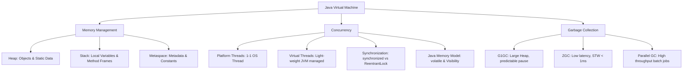

# Java Core & JVM Deep Dive (Concurrency, Memory Management, GC)

---

## 1. Khái niệm (Difficulty Breakdown)

### # Beginner
Ở mức độ cơ bản, **Java** là một ngôn ngữ lập trình hướng đối tượng (OOP), đa nền tảng nhờ vào cơ chế biên dịch ra **Bytecode** (`.class`) thay vì mã máy trực tiếp. Bytecode này sẽ chạy trên **JVM (Java Virtual Machine)** - máy ảo Java đóng vai trò như một lớp trừu tượng giữa code của bạn và hệ điều hành.

Cơ chế quản lý bộ nhớ của Java tự động nhờ vào **Garbage Collector (GC)**, giúp lập trình viên không cần giải phóng bộ nhớ thủ công bằng tay (như `free()` trong C hoặc `delete` trong C++).

### # Intermediate
Đi sâu hơn, bạn cần hiểu cấu trúc bộ nhớ của **JVM Run-Time Data Areas**:
- **Heap Memory**: Nơi lưu trữ tất cả các đối tượng (Objects) và biến thực thể (Instance variables). Được chia sẻ giữa các luồng (Thread-safe issues occur here).
- **Stack Memory**: Chứa các biến cục bộ (Local variables) và thông tin gọi hàm (Frame). Mỗi Thread có một Stack riêng biệt (Thread-safe).
- **Metaspace (thay thế PermGen từ Java 8)**: Lưu trữ metadata của class, static variables, constant pool. Nằm ở bộ nhớ ngoài (Native Memory) và tự động mở rộng.

**Cơ chế Garbage Collection (GC)** hoạt động dựa trên giả thuyết **Weak Generational Hypothesis**: hầu hết các đối tượng đều "chết trẻ". Do đó Heap được chia làm:
- **Young Generation (Eden, S0, S1)**: Nơi đối tượng mới được tạo ra. GC chạy ở đây gọi là **Minor GC**.
- **Old Generation (Tenured)**: Nơi chứa đối tượng sống sót qua nhiều chu kỳ GC. GC chạy ở đây gọi là **Major/Full GC**.

### # Advanced
Ở mức độ nâng cao, ta nghiên cứu **Java Memory Model (JMM)** và **Java Concurrency**:
- **JMM**: Quy định cách các Thread tương tác thông qua bộ nhớ chung. Nó giải quyết 3 vấn đề chính: **Visibility** (tính hiển thị), **Ordering** (sắp xếp lại lệnh của Compiler/CPU), và **Atomicity** (tính nguyên tử).
- **Volatile Keyword**: Đảm bảo biến được đọc/ghi trực tiếp từ Main Memory (bộ nhớ chính) thay vì CPU Cache, giải quyết vấn đề *Visibility*, nhưng không đảm bảo *Atomicity*.
- **Synchronized & ReentrantLock**: Cơ chế Lock để đồng bộ hóa. `ReentrantLock` cung cấp các tính năng nâng cao như *Fairness policy*, *Interruptible lock acquisition*, và *TryLock*.
- **Thread Pool (ExecutorService)**: Quản lý vòng đời và tái sử dụng các Thread để tránh overhead khi tạo mới Thread liên tục.

### # Expert
Ở mức độ tối thượng của một Architect:
- **Garbage Collection Algorithms**: Hiểu rõ sự khác biệt và cấu hình của **G1 (Garbage-First)**, **ZGC (Z Garbage Collector)**. ZGC có thời gian dừng (Pause Time/Stop-The-World) dưới 1ms bất kể kích thước Heap lên tới hàng Terabytes nhờ cơ chế *Colored Pointers* và *Load Barriers*.
- **Virtual Threads (Java 21 - Project Loom)**: Thay đổi hoàn toàn mô hình Concurrency. Thread truyền thống của Java là **Platform Thread** (ánh xạ 1-1 với OS Thread - rất đắt đỏ). **Virtual Thread** là các luồng siêu nhẹ (M-N mapping) được quản lý bởi JVM, cho phép chạy hàng triệu luồng song song mà không tốn tài nguyên hệ điều hành.
- **JVM Tuning & Troubleshooting**: Sử dụng các công cụ như `jstack`, `jmap`, `jstat`, và **Java Flight Recorder (JFR)** để phân tích Thread Dump, Heap Dump, phát hiện Memory Leak và CPU Spikes.

---

## 2. Mục đích

Trong các ứng dụng doanh nghiệp (Enterprise Applications), Java Core và JVM là nền móng vận hành của các hệ thống Microservices khổng lồ (như Spring Boot). 
- **Tối ưu hóa tài nguyên phần cứng**: Cấu hình JVM sai có thể khiến ứng dụng crash do `OutOfMemoryError` (OOM) hoặc bị trễ (Latency cao) do các đợt *Stop-The-World (STW)* kéo dài của GC.
- **Đảm bảo tính nhất quán dữ liệu**: Trong môi trường concurrency cao (ví dụ: trừ tiền trong tài khoản, đặt chỗ xem phim), lập trình viên phải hiểu rõ cơ chế khóa (locking) và JMM để tránh lỗi tranh chấp dữ liệu (Race Condition).
- **Mở rộng quy mô (High Throughput)**: Ứng dụng doanh nghiệp cần xử lý hàng chục nghìn request/giây. Việc chuyển đổi từ Thread-per-request truyền thống sang mô hình Reactive hoặc Virtual Threads giúp tăng khả năng chịu tải lên gấp nhiều lần.

---

## 3. Kiến trúc hoạt động

### JVM Memory Layout

```text
+---------------------------------------------------------------------------------+
|                               JVM MEMORY AREA                                   |
|                                                                                 |
|  +---------------------------+   +-------------------+   +-------------------+  |
|  |     Metaspace (Native)    |   |    Heap Memory    |   |   JVM Stack       |  |
|  |  (Class Metadata, Statics) |   |                   |   | (Local Variables, |  |
|  +---------------------------+   | +---------------+ |   |  Method Frames)   |  |
|                                  | |   Young Gen   | |   +-------------------+  |
|  +---------------------------+   | | (Eden, S0, S1)| |                          |
|  |   Program Counter (PC)    |   | +---------------+ |   +-------------------+  |
|  |        Register           |   | |    Old Gen    | |   |   Native Method   |  |
|  +---------------------------+   | |   (Tenured)   | |   |      Stack        |  |
|                                  | +---------------+ |   +-------------------+  |
|                                  +-------------------+                          |
+---------------------------------------------------------------------------------+
```

### Luồng Hoạt Động của Garbage Collection (Generational Flow)
1. Đối tượng mới được tạo ra trên phân vùng **Eden**.
2. Khi **Eden** đầy, **Minor GC** kích hoạt. Các đối tượng còn sống sót được chuyển sang Survivor space **S0** (hoặc **S1**) với Age = 1.
3. Trong các lần Minor GC tiếp theo, đối tượng di chuyển qua lại giữa **S0** và **S1**. Mỗi lần sống sót, Age tăng lên 1.
4. Khi Age đạt ngưỡng quy định (mặc định là 15 - `MaxTenuringThreshold`), đối tượng được chuyển (Promote) lên **Old Gen**.
5. Khi **Old Gen** đầy, **Major/Full GC** kích hoạt để dọn dẹp Old Gen (gây ra hiện tượng Stop-The-World dài hơn).

---

## 4. Ví dụ thực tế

### Tình huống:
Một hệ thống thanh toán điện tử (Payment Gateway) gặp hiện tượng thỉnh thoảng phản hồi rất chậm (Latency Spike lên tới 5-10 giây) vào giờ cao điểm, gây ra lỗi Timeout cho các API gọi sang ngân hàng. 

### Phân tích từ Architect:
Qua phân tích **Java Flight Recorder (JFR)**, chúng tôi phát hiện hệ thống sử dụng Heap 8GB với GC mặc định là G1GC. Vào giờ cao điểm, lượng đối tượng rác tạo ra quá nhanh làm đầy Old Gen, kích hoạt **Full GC**. Trong lúc Full GC chạy, toàn bộ luồng ứng dụng bị dừng lại (Stop-The-World) trong vòng 6 giây để dọn dẹp bộ nhớ.

### Giải pháp:
1. Chuyển đổi GC sang **ZGC** (`-XX:+UseZGC`) để ép thời gian Stop-The-World xuống dưới 1ms.
2. Tối ưu hóa code để giảm việc khởi tạo các đối tượng tạm thời không cần thiết (sử dụng Object Pool hoặc String Deduplication).
3. Cấu hình lại kích thước Heap tối ưu (`-Xms6g -Xmx6g` để tránh JVM resize Heap động gây overhead).

---

## 5. Code Demo

Dưới đây là một triển khai **Enterprise-grade Thread-safe Cache** sử dụng `ReentrantReadWriteLock` để tối ưu hóa việc đọc ghi song song, kết hợp cấu trúc dữ liệu thread-safe và xử lý ngoại lệ chuẩn chỉnh.

```java
package com.knowledgebase.core.concurrency;

import java.util.HashMap;
import java.util.Map;
import java.util.Optional;
import java.util.concurrent.locks.Lock;
import java.util.concurrent.locks.ReentrantReadWriteLock;
import java.util.logging.Level;
import java.util.logging.Logger;

/**
 * Enterprise Read-Write Cache for High-Concurrency Systems.
 * Illustrates Advanced Locking Mechanisms, Exception Handling, and Thread Safety.
 */
public class EnterpriseCache<K, V> {
    private static final Logger LOGGER = Logger.getLogger(EnterpriseCache.class.getName());
    
    private final Map<K, V> internalMap = new HashMap<>();
    private final ReentrantReadWriteLock rwLock = new ReentrantReadWriteLock(true); // Fair lock
    private final Lock readLock = rwLock.readLock();
    private final Lock writeLock = rwLock.writeLock();

    public Optional<V> get(K key) {
        if (key == null) {
            return Optional.empty();
        }
        readLock.lock();
        try {
            LOGGER.log(Level.FINE, "Reading key: {0} by thread {1}", new Object[]{key, Thread.currentThread().getName()});
            return Optional.ofNullable(internalMap.get(key));
        } finally {
            readLock.unlock(); // Always release lock in finally block to avoid deadlocks
        }
    }

    public void put(K key, V value) {
        if (key == null || value == null) {
            throw new IllegalArgumentException("Key or Value cannot be null");
        }
        writeLock.lock();
        try {
            LOGGER.log(Level.INFO, "Writing key: {0} by thread {1}", new Object[]{key, Thread.currentThread().getName()});
            internalMap.put(key, value);
        } catch (Exception e) {
            LOGGER.log(Level.SEVERE, "Error updating cache for key: " + key, e);
            throw e;
        } finally {
            writeLock.unlock();
        }
    }

    public void clear() {
        writeLock.lock();
        try {
            LOGGER.info("Clearing cache by thread " + Thread.currentThread().getName());
            internalMap.clear();
        } finally {
            writeLock.unlock();
        }
    }

    public int size() {
        readLock.lock();
        try {
            return internalMap.size();
        } finally {
            readLock.unlock();
        }
    }
}
```

---

## 6. Best Practices

1. **Luôn giải phóng Lock trong khối `finally`**: Tránh tình trạng Exception xảy ra làm giữ Lock vĩnh viễn gây Deadlock.
2. **Sử dụng đúng loại GC cho ứng dụng**:
   - Ứng dụng Backend Web (như Spring Boot REST API): Dùng **G1GC** hoặc **ZGC** để giảm thiểu Latency (thời gian phản hồi).
   - Ứng dụng Batch Processing (xử lý dữ liệu lớn offline): Dùng **Parallel GC** (`-XX:+UseParallelGC`) để tối đa hóa Throughput.
3. **Cấu hình Heap Size cố định**: Luôn đặt `-Xms` (kích thước Heap ban đầu) bằng với `-Xmx` (kích thước Heap tối đa) trong môi trường production để ngăn chặn JVM tốn CPU resize Heap.
4. **Hạn chế dùng `System.gc()`**: Việc gọi `System.gc()` chỉ mang tính chất "gợi ý" JVM và thường kích hoạt Full GC Stop-The-World không cần thiết. Hãy vô hiệu hóa bằng flag `-XX:+DisableExplicitGC`.
5. **Sử dụng Thread Pool thay vì tạo Thread thủ công**: Luôn sử dụng `ThreadPoolExecutor` qua `Executors` hoặc cấu hình trong Spring Boot để tái sử dụng Threads.

---

## 7. Common Mistakes (Anti-patterns)

### 1. Memory Leak do Static References
Các đối tượng được lưu trữ trong các biến `static` sẽ tồn tại vĩnh viễn trong suốt vòng đời của ứng dụng và không bao giờ được GC dọn dẹp.
- **Anti-pattern**:
  ```java
  public class BadCache {
      public static final List<Object> leakList = new ArrayList<>(); // Never GCed
  }
  ```
- **Khắc phục**: Dùng WeakReference hoặc giới hạn kích thước Cache bằng các thư viện như Caffeine Cache, Guava Cache.

### 2. Double-Checked Locking thiếu `volatile`
Khi triển khai Singleton pattern dạng Double-Checked Locking, nếu thiếu từ khóa `volatile`, luồng khác có thể nhận được một đối tượng chưa được khởi tạo hoàn chỉnh (do hiện tượng Instruction Reordering của CPU).
- **Anti-pattern**:
  ```java
  public class Singleton {
      private static Singleton instance; // THIẾU volatile!
  }
  ```
- **Khắc phục**: Thêm từ khóa `volatile` trước khai báo biến `instance`.

---

## 8. Interview Questions

#### Q1: Phân biệt Heap và Stack trong JVM?
* **Đáp án**: Stack dùng để lưu trữ các biến cục bộ và các method frame. Mỗi Thread có một Stack riêng và bộ nhớ tự giải phóng khi kết thúc hàm (Thread-safe). Heap lưu trữ tất cả các đối tượng (Objects) được khởi tạo bằng từ khóa `new`. Tất cả các Thread dùng chung Heap, do đó cần xử lý Concurrency và GC quản lý vùng này.

#### Q2: Từ khóa `volatile` trong Java giải quyết vấn đề gì? Nó có thay thế được `synchronized` không?
* **Đáp án**: `volatile` giải quyết vấn đề **Visibility** (đồng bộ hóa dữ liệu giữa các cache CPU và Main Memory). Khi một biến được đánh dấu `volatile`, mọi thao tác ghi vào biến đó sẽ được cập nhật ngay lập tức lên Main Memory, và thao tác đọc sẽ đọc trực tiếp từ Main Memory. Nó **không** thể thay thế `synchronized` vì không đảm bảo tính **Atomicity** (ví dụ phép toán `count++` gồm 3 bước: đọc, tăng, ghi không thể chạy atomically chỉ với volatile).

#### Q3: Garbage Collector hoạt động như thế nào? Điểm khác biệt giữa Minor GC và Full GC?
* **Đáp án**: GC dựa trên Reachability Analysis để tìm các đối tượng không còn được tham chiếu từ "GC Roots". Minor GC chạy trên phân vùng Young Generation để dọn dẹp các đối tượng ngắn hạn. Full GC chạy trên toàn bộ Heap (cả Young và Old) để dọn dẹp toàn bộ rác, thường gây ra Stop-The-World dài và tốn CPU hơn nhiều.

#### Q4: ZGC (Z Garbage Collector) hoạt động thế nào mà đạt được Pause Time < 1ms?
* **Đáp án**: ZGC thực hiện hầu hết các tác vụ dọn dẹp bộ nhớ một cách song song (concurrently) với luồng ứng dụng mà không cần dừng ứng dụng. Nó sử dụng kỹ thuật **Colored Pointers** (nhúng metadata trạng thái đối tượng trực tiếp vào địa chỉ con trỏ) và **Load Barriers** (chặn các thao tác đọc ghi của luồng ứng dụng để cập nhật con trỏ đối tượng ngay lập tức khi chúng đang di chuyển).

#### Q5: Sự khác biệt giữa `Runnable` và `Callable` là gì?
* **Đáp án**: Cả hai đều đại diện cho tác vụ chạy đa luồng. Tuy nhiên, `Runnable` có phương thức `run()` không trả về kết quả (void) và không thể ném ra checked exceptions. `Callable` có phương thức `call()` trả về kết quả kiểu `V` (thông qua `Future`) và có thể ném checked exceptions.

#### Q6: Điều gì xảy ra nếu một Thread ném ra ngoại lệ chưa được bắt (Unhandled Exception)?
* **Đáp án**: Nếu một Thread ném ra ngoại lệ chưa được catch, JVM sẽ kiểm tra xem Thread đó có đăng ký `UncaughtExceptionHandler` hay không. Nếu có, phương thức xử lý của handler sẽ chạy. Nếu không có handler nào, Thread đó sẽ chết (terminated), tuy nhiên các Thread khác trong JVM vẫn tiếp tục chạy bình thường (ứng dụng không bị sập hoàn toàn trừ khi đó là luồng Main).

#### Q7: Phân biệt `ReentrantLock` và từ khóa `synchronized`?
* **Đáp án**: `synchronized` là cơ chế lock tích hợp sẵn (Implicit Lock), tự giải phóng khóa khi kết thúc block. `ReentrantLock` là Explicit Lock của thư viện `java.util.concurrent`, yêu cầu lập trình viên gọi `lock()` và `unlock()` thủ công. `ReentrantLock` mạnh hơn vì có thể: thiết lập Fair Lock, dùng `tryLock()` với thời gian chờ (timeout) tránh deadlock, và có khả năng ngắt luồng đang đợi lock (`lockInterruptibly`).

#### Q8: Java 21 Virtual Threads giải quyết bài toán gì của hệ thống microservices?
* **Đáp án**: Truyền thống, mỗi request tới web server (như Tomcat) tốn 1 Platform Thread (OS Thread). OS Thread giới hạn ở vài nghìn luồng vì tốn Ram (1MB/thread) và tốn chi phí Context Switch của CPU. Virtual Threads là các luồng ảo cực nhẹ do JVM quản lý (chỉ tốn vài trăm bytes bộ nhớ). Khi Virtual Thread thực hiện blocking I/O (gọi DB, call API), JVM sẽ unmount nó khỏi OS Thread và gán Virtual Thread khác vào chạy. Điều này giúp nâng cao throughput của máy chủ lên hàng triệu request song song mà không cần viết code Reactive phức tạp.

#### Q9: Làm thế nào để phát hiện và xử lý lỗi Memory Leak trong Java?
* **Đáp án**: Sử dụng các công cụ giám sát (Prometheus & Grafana) để theo dõi đồ thị sử dụng Heap sau mỗi đợt GC. Nếu Heap dùng tăng dần không giảm, ta tiến hành Dump Heap (`jmap -dump:live,format=b,file=heap.hprof <pid>`). Sau đó dùng công cụ Eclipse Memory Analyzer (MAT) hoặc JProfiler để tìm các Class có số lượng instance lớn bất thường và truy vết con đường tham chiếu (Shortest Path to GC Roots) để xác định xem class nào đang giữ tham chiếu rác.

#### Q10: Phân biệt Thread-safe và các cấu hình Collection tương ứng: `Vector`, `Collections.synchronizedList`, và `CopyOnWriteArrayList`?
* **Đáp án**: 
  - `Vector`: Cổ xưa, tất cả các phương thức đều được đánh dấu `synchronized` (Hiệu năng rất kém).
  - `Collections.synchronizedList`: Bọc ngoài một List thường bằng cách đồng bộ hóa tất cả các truy cập qua một mutex lock chung.
  - `CopyOnWriteArrayList`: Sử dụng cơ chế sao chép toàn bộ mảng cũ sang mảng mới mỗi khi ghi dữ liệu. Thích hợp cho trường hợp ĐỌC CỰC NHIỀU, GHI CỰC ÍT vì thao tác đọc hoàn toàn không bị khóa (lock-free) nên cực nhanh, còn ghi thì rất tốn bộ nhớ.

---

## 9. Senior Notes

> [!IMPORTANT]
> **Kinh nghiệm thực chiến khi xử lý JVM Production:**
> 1. **OutOfMemoryError không chỉ xảy ra trên Heap**: Nếu bạn thấy lỗi `java.lang.OutOfMemoryError: Metaspace`, điều này thường do ứng dụng của bạn sinh class động quá nhiều (ví dụ sử dụng CGLIB, Reflection, Hibernate sinh class proxy liên tục) mà không giải phóng class loader cũ. Đừng chỉ tăng Heap, hãy cấu hình giới hạn `-XX:MaxMetaspaceSize` để tránh sập hệ thống do chiếm hết Ram vật lý của Server.
> 2. **Cảnh giác với OOM: Direct Buffer Memory**: Lỗi này xảy ra khi các thư viện I/O hiệu năng cao như Netty hoặc gRPC sử dụng bộ nhớ ngoài JVM (Direct Byte Buffers) để truyền nhận dữ liệu tốc độ cao. Dù Heap còn rất trống nhưng hệ thống vẫn crash. Cần cấu hình giới hạn này bằng flag `-XX:MaxDirectMemorySize`.
> 3. **Context Switching Overhead**: Đừng bao giờ tạo số lượng Thread trong Thread Pool lớn hơn nhiều so với số Core CPU của server cho các tác vụ tính toán (CPU-bound). Số Thread tối ưu cho CPU-bound là `Số Core CPU + 1`. Đối với I/O bound, có thể tăng lên nhưng tốt nhất nên cân nhắc dùng Virtual Threads nếu chạy Java 21+.

---

## 10. Tài liệu tham khảo

1. [Java Virtual Machine Specification (Java SE 21 Edition)](https://docs.oracle.com/javase/specs/jvms/se21/html/index.html)
2. [Baeldung Java Concurrency Guide](https://www.baeldung.com/java-concurrency)
3. [ZGC Official Wiki by OpenJDK](https://wiki.openjdk.org/display/zgc/Main)
4. Sách: *Effective Java (3rd Edition)* - Joshua Bloch.
5. Sách: *Java Concurrency in Practice* - Brian Goetz.

---
# PHẦN BỔ TRỢ CHƯƠNG

### ✅ Checklist cần nhớ
- [ ] Phân biệt được sự khác nhau giữa Heap và Stack.
- [ ] Hiểu rõ cơ chế thăng tiến đối tượng (Age Promotion) từ Young Gen lên Old Gen.
- [ ] Biết cách chuyển cấu hình GC sang G1GC hoặc ZGC thông qua VM Options.
- [ ] Không bao giờ tạo Thread trực tiếp bằng `new Thread()`, luôn dùng `ExecutorService` hoặc Spring Boot Async Thread Pool.
- [ ] Luôn đặt `volatile` cho biến dùng trong Double-Checked Locking.
- [ ] Nắm rõ cơ chế hoạt động của Virtual Threads trong Java 21.

### ✅ Mindmap (Mermaid)



### ✅ Cheat Sheet

* **Lệnh khởi chạy JVM tối ưu hóa sản xuất (Java 17+ / G1GC)**:
  ```bash
  java -Xms4g -Xmx4g -XX:+UseG1GC -XX:MaxGCPauseMillis=200 -XX:+DisableExplicitGC -jar payment-service.jar
  ```
* **Lệnh khởi chạy với ZGC (Java 21+)**:
  ```bash
  java -Xms8g -Xmx8g -XX:+UseZGC -XX:+DisableExplicitGC -jar core-banking-service.jar
  ```
* **Lệnh lấy Thread Dump khẩn cấp khi hệ thống bị treo (Deadlock)**:
  ```bash
  jstack -l <PID> > thread_dump.txt
  ```
* **Lệnh lấy Heap Dump phân tích Memory Leak**:
  ```bash
  jmap -dump:live,format=b,file=heap_dump.hprof <PID>
  ```

### ✅ Interview Tips

* **Khi bị hỏi về Deadlock**: Đừng chỉ định nghĩa lý thuyết. Hãy nêu ngay **4 điều kiện cần để xảy ra Deadlock** (Mutual Exclusion, Hold and Wait, No Preemption, Circular Wait) và cách phòng tránh như: *luôn acquire lock theo đúng một thứ tự nhất định*, hoặc sử dụng `tryLock(timeout)`.
* **Khi được hỏi làm thế nào để tối ưu ứng dụng Java chậm**: Hãy trả lời theo quy trình phân tích: 
  1. Giám sát hệ thống (APM tools như Datadog, NewRelic, Prometheus) để xác định nghẽn ở CPU, RAM hay Database.
  2. Bật GC Logging để xem tần suất và thời gian Stop-The-World.
  3. Sử dụng công cụ Profiler (JProfiler, VisualVM) để tìm phương thức ngốn nhiều CPU nhất (Hot spots).
  4. Thực hiện tối ưu hóa cấu trúc dữ liệu, thuật toán hoặc chuyển đổi cơ chế đồng bộ hóa.

### ✅ Mini Project: Custom Multi-tenant Virtual Thread Executor

**Yêu cầu**: Thiết kế một Executor giúp cô lập tài nguyên xử lý tác vụ đa luồng cho các Tenant (Khách hàng doanh nghiệp) khác nhau sử dụng Java 21 Virtual Threads, đảm bảo không một Tenant nào chiếm dụng hết tài nguyên của Tenant khác.

**Triển khai**:

```java
package com.knowledgebase.core.project;

import java.util.concurrent.ConcurrentHashMap;
import java.util.concurrent.ExecutorService;
import java.util.concurrent.Executors;
import java.util.concurrent.Semaphore;
import java.util.concurrent.RejectedExecutionException;

public class TenantVirtualThreadExecutor {
    private final ExecutorService parentExecutor = Executors.newVirtualThreadPerTaskExecutor();
    private final ConcurrentHashMap<String, Semaphore> tenantLimits = new ConcurrentHashMap<>();
    private final int maxConcurrencyPerTenant;

    public TenantVirtualThreadExecutor(int maxConcurrencyPerTenant) {
        this.maxConcurrencyPerTenant = maxConcurrencyPerTenant;
    }

    public void submit(String tenantId, Runnable task) {
        Semaphore semaphore = tenantLimits.computeIfAbsent(tenantId, k -> new Semaphore(maxConcurrencyPerTenant));
        
        if (!semaphore.tryAcquire()) {
            throw new RejectedExecutionException("Tenant " + tenantId + " exceeded maximum concurrency limit");
        }

        parentExecutor.submit(() -> {
            try {
                task.run();
            } finally {
                semaphore.release(); // Giải phóng slot cho tenant sau khi hoàn thành
            }
        });
    }

    public void shutdown() {
        parentExecutor.shutdown();
    }
}
```

---

### ✅ Bài tập thực hành

#### Bài tập 1: Sửa lỗi Thread-unsafe Counter
Đoạn code sau đây bị lỗi Race Condition khi chạy đa luồng. Hãy sửa lại code sử dụng hai cách:
1. Dùng `AtomicInteger`.
2. Dùng `ReentrantLock`.

```java
public class UnsafeCounter {
    private int count = 0;
    public void increment() {
        count++;
    }
    public int getCount() {
        return count;
    }
}
```

* **Gợi ý Giải pháp**:
  - Cách 1: Thay thế `int` bằng `AtomicInteger` và gọi `count.incrementAndGet()`.
  - Cách 2: Bọc phương thức `increment()` bằng `lock.lock()` và giải phóng trong `finally`.

#### Bài tập 2: Phân tích StackOverflowError
Hãy viết một đoạn chương trình cố tình gây ra lỗi `java.lang.StackOverflowError` và giải thích lý do tại sao lỗi xảy ra dựa trên cấu trúc bộ nhớ Stack.
* **Gợi ý Giải pháp**: Tạo một phương thức đệ quy không có điều kiện dừng. Mỗi lần gọi hàm, một Frame mới được đẩy vào Stack, khi vượt quá kích thước Stack tối đa (`-Xss`), lỗi sẽ xảy ra.

---

### ✅ References
- [Ref1] *Clean Code* - Robert C. Martin.
- [Ref2] Netflix Technology Blog: [Java Garbage Collection Secrets](https://netflixtechblog.com/)
- [Ref3] Java SE 21 Documentation on Virtual Threads: [Project Loom Core](https://openjdk.org/projects/loom/)
