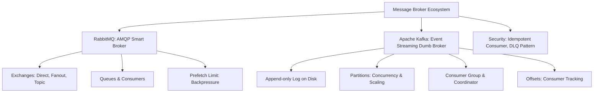

# Message Broker & Event Streaming (Kafka vs RabbitMQ)

---

## 1. Khái niệm (Difficulty Breakdown)

### # Beginner
Ở mức độ cơ bản:
- **Message Broker (Bộ trung chuyển tin nhắn)**: Hệ thống phần mềm trung gian cho phép các ứng dụng giao tiếp và trao đổi dữ liệu với nhau một cách bất đồng bộ (Asynchronously) mà không cần kết nối trực tiếp.
- **Mô hình Giao tiếp**:
  - **Point-to-Point (Queue - Điểm tới Điểm)**: Một Producer gửi tin nhắn vào hàng đợi (Queue), chỉ duy nhất một Consumer nhận và xử lý tin nhắn đó. Sau khi xử lý xong, tin nhắn bị xóa khỏi hàng đợi.
  - **Publish/Subscribe (Pub/Sub - Phát/Đăng ký)**: Một Producer (Publisher) phát tin nhắn vào một chủ đề (Topic/Exchange), nhiều Consumer (Subscribers) quan tâm đến chủ đề đó đều nhận được bản sao của tin nhắn để xử lý độc lập.

### # Intermediate
Đi sâu vào kiến trúc cụ thể của từng hệ thống:
- **RabbitMQ (AMQP Protocol)**: Là một Message Broker truyền thống dựa trên kiến trúc **Smart Broker / Dumb Consumer**. Nó chịu trách nhiệm định tuyến tinh vi:
  - **Producer** gửi tin nhắn tới **Exchange**.
  - **Exchange** định tuyến tin nhắn vào các **Queues** dựa trên các quy tắc liên kết (Bindings) và khóa định tuyến (Routing Key) của các loại Exchange: `Direct` (Khớp chính xác), `Fanout` (Phát sóng tới mọi queue liên kết), `Topic` (Khớp theo mẫu wildcard như `user.*`).
  - **Consumer** lắng nghe và nhận tin nhắn từ Queues. RabbitMQ theo dõi trạng thái tin nhắn và xóa ngay sau khi được ACK (Acknowledge).
- **Apache Kafka (Distributed Log)**: Là một nền tảng Event Streaming phân tán dựa trên kiến trúc **Dumb Broker / Smart Consumer**. Kafka tổ chức dữ liệu dưới dạng một **Append-only Log (Nhật ký chỉ ghi thêm)** lưu trữ bền vững trên đĩa:
  - Dữ liệu được chia vào các **Topics**, mỗi Topic chia làm nhiều **Partitions** để chạy song song.
  - Tin nhắn được ghi tuần tự vào Partition và gán một số chỉ mục tăng dần gọi là **Offset**. Tin nhắn không bị xóa đi sau khi đọc, nó được lưu trữ theo thời gian cấu hình (Retention Time).
  - **Consumer Groups**: Tập hợp các consumer cùng chia sẻ việc đọc dữ liệu từ các partitions của một Topic. Một partition chỉ được đọc bởi duy nhất 1 consumer trong group tại một thời điểm để đảm bảo tính thứ tự dữ liệu.

### # Advanced
Ở mức nâng cao:
- **Message Delivery Semantics (Độ tin cậy truyền tin)**:
  - **At-most-once (Tối đa một lần)**: Tin nhắn có thể bị mất nhưng không bao giờ bị lặp.
  - **At-least-once (Tối thiểu một lần)**: Tin nhắn không bao giờ mất nhưng có thể bị xử lý lặp lại do lỗi mạng khi gửi ACK.
  - **Exactly-once (Chính xác một lần)**: Tin nhắn được truyền nhận và xử lý đúng một lần duy nhất.
- **Consumer Group Rebalance trong Kafka**: Tiến trình phân bổ lại quyền đọc các Partitions cho các Consumers khi có một Consumer mới tham gia hoặc một Consumer cũ bị sập (ngừng gửi heartbeat). Trong quá trình rebalance, việc đọc dữ liệu có thể bị ngưng trệ tạm thời (Stop-the-world).
- **Dead Letter Queue (DLQ - Hàng đợi thư chết)**: Pattern xử lý lỗi. Khi một tin nhắn bị lỗi xử lý liên tục (ví dụ do lỗi dữ liệu đầu vào), thay vì block toàn bộ hàng đợi, ta chuyển tin nhắn đó sang một hàng đợi riêng (DLQ) để phân tích thủ công sau.

### # Expert
Ở mức độ tối thượng (Architect):
- **Kafka Exactly-Once Semantics (EOS)**: Đạt được nhờ sự kết hợp giữa **Idempotent Producer** (gán ID cho mỗi lô tin nhắn để broker tự loại bỏ trùng lặp) và **Transactions API** (cho phép ghi tin nhắn lên nhiều topic/partition kết hợp cập nhật consumer offsets trong một transaction nguyên tử duy nhất).
- **Backpressure Handling (Kiểm soát áp lực ngược)**: Thiết kế giải pháp ngăn chặn việc Consumer bị quá tải (tràn bộ nhớ RAM) khi tốc độ phát tin nhắn của Producer nhanh hơn gấp nhiều lần tốc độ xử lý của Consumer (sử dụng cơ chế Pull của Kafka hoặc giới hạn Prefetch Count của RabbitMQ).
- **Distributed Tracing across Brokers**: Sử dụng OpenTelemetry để truyền nhận metadata (Trace Context Headers) xuyên qua Kafka Record Headers hoặc RabbitMQ Message Properties, cho phép vẽ lại toàn bộ luồng request đi qua các hàng đợi bất đồng bộ.

---

## 2. Mục đích

Trong các kiến trúc phân tán (Microservices):
- **Loose Coupling (Liên kết lỏng lẻo)**: Service đặt hàng (`Order Service`) không cần biết Service gửi Email (`Email Service`) nằm ở đâu, chạy ngôn ngữ gì. Nó chỉ cần bắn event `ORDER_CREATED` vào broker và kết thúc công việc.
- **Asynchronous Processing (Xử lý bất đồng bộ)**: Chuyển các tác vụ tốn thời gian (gửi mail, xuất file PDF báo cáo, xử lý ảnh) ra khỏi luồng xử lý request HTTP chính của khách hàng để trả về phản hồi tức thời, nâng cao trải nghiệm người dùng.
- **Traffic Spikes Smoothing (Hấp thụ tải)**: Vào các đợt Flash Sale, lượng đặt hàng tăng đột biến gấp 1,000 lần. Message Broker đóng vai trò như một hồ chứa đệm, lưu trữ toàn bộ các yêu cầu đặt hàng. Các service xử lý phía sau sẽ rút (pull) tin nhắn ra xử lý từ từ theo đúng năng lực giới hạn của chúng, bảo vệ database không bị sập do quá tải truy cập trực tiếp.

---

## 3. Kiến trúc hoạt động

### So sánh Kiến trúc Định tuyến: RabbitMQ vs Apache Kafka

```text
=========================================================================
1. RabbitMQ Architecture (Smart Broker - Routing Centric)
=========================================================================
Producer ──> [ Exchange ] ──Routing Key: "user.created"──> [ Queue A ] ──> Consumer
                 │
                 └──────────Routing Key: "user.*"────────> [ Queue B ] ──> Consumer

=========================================================================
2. Apache Kafka Architecture (Dumb Broker - Partition & Log Centric)
=========================================================================
Topic: "user-events" (Partitioned Append-only Log on Disk)
┌───────────────────────────────────────────────────────────────────────┐
│ Partition 0:  [Msg 0: Offset 0] [Msg 1: Offset 1] [Msg 2: Offset 2]  │ ──> Consumer A
│                                                                       │     (Group 1)
│ Partition 1:  [Msg 0: Offset 0] [Msg 1: Offset 1]                     │ ──> Consumer B
└───────────────────────────────────────────────────────────────────────┘     (Group 1)
```

---

## 4. Ví dụ thực tế

### Tình huống:
Một ứng dụng đặt đồ ăn (Food Delivery) cần xử lý 2 bài toán:
1. Khi khách hàng đặt đơn, hệ thống cần gửi thông báo đẩy (Push Notification) tới tài xế, gửi tin nhắn SMS tới khách hàng, và báo về máy tính của nhà hàng. Các tác vụ này độc lập, cần xử lý song song, nếu lỗi gửi SMS thì không được làm hỏng luồng thông báo tới tài xế.
2. Hệ thống cần theo dõi tọa độ GPS thời gian thực của 10,000 tài xế đang di chuyển trên đường (cứ 3 giây cập nhật một lần) để chạy thuật toán tối ưu hóa đường đi và tính thời gian giao hàng.

### Giải pháp của Architect:
1. Đối với bài toán đặt đơn (Phức tạp về định tuyến, cần độ tin cậy giao nhận cao, nghiệp vụ rời rạc): Sử dụng **RabbitMQ Topic Exchange**. Phát event vào Exchange, RabbitMQ tự nhân bản tin nhắn vào 3 Queue riêng biệt cho 3 Service xử lý song song.
2. Đối với bài toán theo dõi GPS (Lưu lượng cực lớn, dữ liệu dạng chuỗi thời gian liên tục - Streaming, cần thứ tự chính xác theo tài xế): Sử dụng **Apache Kafka**. Mỗi tài xế được ánh xạ tọa độ vào Partition dựa trên `driver_id` làm Partition Key, đảm bảo tọa độ của cùng một tài xế luôn ghi vào 1 Partition duy nhất theo đúng thứ tự thời gian.

---

## 5. Code Demo

Dưới đây là một triển khai Spring Boot mẫu cho cấu hình **RabbitMQ Consumer** có cơ chế xử lý lỗi nâng cao bằng **Dead Letter Queue (DLQ)**. Nếu tin nhắn bị lỗi quá 3 lần, nó sẽ được chuyển tự động sang DLQ.

### Cấu hình RabbitMQ Queue, DLQ và Exchanges:
```java
package com.knowledgebase.broker.rabbitmq;

import org.springframework.amqp.core.*;
import org.springframework.context.annotation.Bean;
import org.springframework.context.annotation.Configuration;

@Configuration
public class RabbitMqDqConfig {

    public static final String MAIN_QUEUE = "orders.main.queue";
    public static final String DLQ_QUEUE = "orders.dlq.queue";
    public static final String MAIN_EXCHANGE = "orders.main.exchange";
    public static final String DLQ_EXCHANGE = "orders.dlq.exchange";
    public static final String ROUTING_KEY = "order.created";

    // 1. Khai báo Dead Letter Queue (DLQ)
    @Bean
    public Queue dlqQueue() {
        return QueueBuilder.durable(DLQ_QUEUE).build();
    }

    @Bean
    public DirectExchange dlqExchange() {
        return new DirectExchange(DLQ_EXCHANGE);
    }

    @Bean
    public Binding dlqBinding() {
        return BindingBuilder.bind(dlqQueue()).to(dlqExchange()).with(ROUTING_KEY);
    }

    // 2. Khai báo Main Queue kết nối với DLQ
    @Bean
    public Queue mainQueue() {
        return QueueBuilder.durable(MAIN_QUEUE)
                .withArgument("x-dead-letter-exchange", DLQ_EXCHANGE) // Cấu hình DLX
                .withArgument("x-dead-letter-routing-key", ROUTING_KEY)
                .build();
    }

    @Bean
    public DirectExchange mainExchange() {
        return new DirectExchange(MAIN_EXCHANGE);
    }

    @Bean
    public Binding mainBinding() {
        return BindingBuilder.bind(mainQueue()).to(mainExchange()).with(ROUTING_KEY);
    }
}
```

### Lớp Consumer xử lý tin nhắn có kiểm soát lỗi:
```java
package com.knowledgebase.broker.rabbitmq;

import org.springframework.amqp.AmqpRejectAndDontRequeueException;
import org.springframework.amqp.rabbit.annotation.RabbitListener;
import org.springframework.stereotype.Component;

@Component
public class OrderMessageConsumer {

    /**
     * Lắng nghe tin nhắn từ Main Queue.
     * Sử dụng cơ chế ném lỗi cụ thể của Spring AMQP để tự động chuyển tin nhắn sang DLQ.
     */
    @RabbitListener(queues = RabbitMqDqConfig.MAIN_QUEUE)
    public void processOrderMessage(String payload) {
        System.out.println("Processing order message: " + payload);

        try {
            // Giả lập logic parse dữ liệu
            if (payload.contains("invalid")) {
                throw new IllegalArgumentException("Invalid order data schema");
            }
            
            // Xử lý thành công (Spring AMQP tự động gửi ACK về RabbitMQ)
            System.out.println("Order processed successfully.");
            
        } catch (IllegalArgumentException e) {
            System.err.println("Fatal error processing message. Sending to DLQ: " + e.getMessage());
            // Ném exception đặc biệt này để báo Spring AMQP REJECT tin nhắn mà KHÔNG cho vào lại queue chính (requeue = false)
            // Lập tức RabbitMQ chuyển tin nhắn này sang Dead Letter Exchange cấu hình sẵn
            throw new AmqpRejectAndDontRequeueException(e);
        } catch (Exception e) {
            System.err.println("Transient error. Retrying message: " + e.getMessage());
            // Ném lỗi thường, Spring AMQP sẽ requeue lại tin nhắn để thử lại (có thể cấu hình tối đa số lần retry)
            throw e;
        }
    }
}
```

---

## 6. Best Practices

1. **Luôn cấu hình `durable=true` cho Queues và Exchanges**: Để tránh việc mất dữ liệu cấu hình hàng đợi khi máy chủ RabbitMQ bị khởi động lại.
2. **Kích hoạt Idempotency cho Consumers**: Luôn thiết kế logic xử lý tin nhắn có khả năng chống trùng lặp. Lưu trữ ID của tin nhắn đã xử lý vào Database (Redis/MySQL) và kiểm tra trước khi thực hiện các tác vụ thay đổi dữ liệu nhạy cảm.
3. **Giới hạn kích thước tin nhắn (Message Size)**: Hàng đợi bất đồng bộ không dùng để truyền các file dung lượng lớn (video, ảnh, zip). Chỉ truyền metadata hoặc ID của file, dữ liệu file thực tế hãy lưu trữ trên Object Storage (S3, Cloudinary) và đọc lại từ link.
4. **Cấu hình Prefetch Count trong RabbitMQ**: Mặc định RabbitMQ phân bổ tin nhắn theo dạng Round-robin đều cho các Consumer. Nếu Consumer A nhận phải 10 tin nhắn nặng chạy mất 10 phút, trong khi Consumer B đã xử lý xong và ngồi chơi, hệ thống sẽ bị trễ. Cấu hình `prefetch = 1` để ép RabbitMQ chỉ gửi tin nhắn mới cho consumer khi nó đã xử lý xong và ACK tin nhắn cũ.
5. **Chọn đúng số lượng Partitions cho Kafka**: Số lượng partitions quy định giới hạn tối đa về khả năng scale song song của Consumer Group (Ví dụ Topic có 3 partitions thì tối đa chỉ có 3 consumers trong group hoạt động song song, consumer thứ 4 sẽ ở trạng thái rảnh - Idle). Hãy thiết lập số partition dư ra (ví dụ 6 hoặc 12) ngay từ đầu để dễ dàng scale-out khi cần.

---

## 7. Common Mistakes (Anti-patterns)

### 1. Tạo hàng nghìn Queue động trong RabbitMQ
- **Anti-pattern**: Tạo mỗi queue riêng cho từng khách hàng hoặc từng phiên kết nối.
- **Hệ quả**: RabbitMQ quản lý hàng đợi và metadata hoàn toàn trong bộ nhớ RAM bằng ngôn ngữ Erlang. Việc tạo quá nhiều Queue động làm cạn kiệt RAM cực nhanh và treo sập toàn bộ cluster RabbitMQ.
- **Khắc phục**: Giữ số lượng Queue cố định và sử dụng cơ chế định tuyến qua Routing Keys của Exchange.

### 2. Thiết lập thời gian xử lý tin nhắn quá lâu trong Kafka Consumer
Nếu code xử lý một tin nhắn trong hàm `onMessage` của Kafka tốn quá nhiều thời gian (vượt quá cấu hình `max.poll.interval.ms`), Broker sẽ hiểu lầm consumer đó đã chết và kích hoạt tiến trình **Rebalance** liên tục, làm nghẽn toàn bộ Group. Cần chuyển tác vụ nặng sang một Thread Pool nội bộ chạy bất đồng bộ hoặc tăng cấu hình timeout.

---

## 8. Interview Questions

#### Q1: So sánh sự khác biệt cốt lõi giữa RabbitMQ và Apache Kafka?
* **Đáp án**:
  - `RabbitMQ`: Là mô hình **Smart Broker / Dumb Consumer**. Tập trung vào khả năng định tuyến tin nhắn tinh vi (Exchanges), theo dõi trạng thái tin nhắn chi tiết (xóa ngay khi ACK). Thích hợp cho các luồng nghiệp vụ phức tạp, transactions rời rạc, yêu cầu định tuyến mềm dẻo.
  - `Kafka`: Là mô hình **Dumb Broker / Smart Consumer**. Broker chỉ lưu trữ nhật ký ghi thêm (log) tuần tự trên đĩa cực kỳ nhanh, không quan tâm consumer đọc tới đâu (Consumer tự quản lý con trỏ offset của mình). Thích hợp cho Event Streaming lượng dữ liệu cực lớn, xử lý log, real-time analytics, yêu cầu replay lại dữ liệu cũ.

#### Q2: Cơ chế Ack (Acknowledge) trong Message Broker dùng để làm gì? Điều gì xảy ra nếu Consumer xử lý xong nhưng quên gửi Ack?
* **Đáp án**: Ack là tín hiệu Consumer gửi về Broker xác nhận đã xử lý thành công tin nhắn để Broker có thể xóa tin nhắn đó (trong RabbitMQ) hoặc dịch chuyển con trỏ offset (trong Kafka). Nếu quên gửi Ack, Broker sẽ giữ tin nhắn đó ở trạng thái unacknowledged. Khi kết nối của Consumer bị ngắt (hoặc sập), Broker sẽ tự động phân bổ lại tin nhắn đó cho một Consumer khác xử lý lại, dẫn đến xử lý lặp lại dữ liệu.

#### Q3: Consumer Group trong Kafka là gì? Làm thế nào để tăng tốc độ tiêu thụ tin nhắn của một Topic trong Kafka?
* **Đáp án**: Consumer Group là tập hợp các Consumer cùng hợp tác để tiêu thụ dữ liệu từ một Topic. Mỗi Partition trong Topic chỉ được gán cho duy nhất 1 Consumer trong Group.
  - Để tăng tốc độ tiêu thụ: Ta cần tăng số lượng Consumer trong Group để xử lý song song. Tuy nhiên, giới hạn tối đa số Consumer hoạt động là bằng số lượng Partitions của Topic đó. Vì thế, nếu số partitions ít, trước tiên ta phải tăng số lượng partitions của Topic, sau đó mới tăng số lượng Consumer.

#### Q4: Làm thế nào để đảm bảo tính thứ tự (Message Ordering) của tin nhắn khi truyền qua Message Broker?
* **Đáp án**:
  - Trong `RabbitMQ`: Đảm bảo chỉ có **1 Consumer** lắng nghe trên **1 Queue** duy nhất. Nếu có nhiều consumer cùng nghe 1 queue, tin nhắn có thể được xử lý song song dẫn đến mất thứ tự do độ lệch tốc độ xử lý.
  - Trong `Kafka`: Đảm bảo các tin nhắn cần giữ thứ tự (ví dụ: chuỗi thao tác của cùng một mã đơn hàng) được gửi cùng một **Partition Key** (ví dụ `orderId`). Kafka cam kết các tin nhắn cùng key sẽ vào cùng 1 Partition, và trong partition dữ liệu được lưu tuần tự, chỉ được đọc bởi 1 consumer duy nhất trong group nên tính thứ tự được bảo toàn tuyệt đối.

#### Q5: Giải thích hiện tượng Consumer Group Rebalance trong Kafka? Nó gây ảnh hưởng gì và làm thế nào để hạn chế?
* **Đáp án**: Rebalance là tiến trình Kafka Coordinator phân bổ lại quyền đọc các Partitions cho các Consumer trong Group (xảy ra khi thêm/bớt consumer, hoặc khi consumer bị sập). 
  - Ảnh hưởng: Trong lúc rebalance, các consumer phải dừng đọc dữ liệu (Stop-The-World), làm tăng độ trễ hệ thống.
  - Hạn chế: Cấu hình thời gian gửi heartbeat hợp lý (`session.timeout.ms`), cấu hình thời gian xử lý tối đa của một lần poll đủ lớn (`max.poll.interval.ms`) để tránh việc consumer bị coi là chết oan khi đang xử lý tác vụ nặng.

#### Q6: Tại sao Kafka có tốc độ ghi và đọc cực kỳ khủng khiếp (hàng triệu tin nhắn/giây)?
* **Đáp án**: Nhờ 3 yếu tố kiến trúc:
  1. **Sequential I/O (Ghi đĩa tuần tự)**: Kafka chỉ ghi thêm vào cuối file nhật ký trên đĩa. Việc ghi tuần tự nhanh ngang ngửa ghi vào RAM vật lý, tránh chi phí di chuyển đầu đọc của ổ cứng.
  2. **Page Cache**: Tận dụng bộ nhớ đệm của Hệ điều hành để lưu trữ dữ liệu đọc/ghi gần nhất.
  3. **Zero-Copy (sendfile System Call)**: Khi truyền dữ liệu từ đĩa sang card mạng, Kafka dùng tập lệnh hệ điều hành để copy trực tiếp dữ liệu từ OS Page Cache sang Network Socket mà không cần copy trung gian qua bộ nhớ RAM của ứng dụng Java (JVM), giảm tối đa Context Switch của CPU.

#### Q7: Dead Letter Queue (DLQ) hoạt động thế nào và khi nào nên sử dụng?
* **Đáp án**: DLQ là một hàng đợi chứa các tin nhắn bị lỗi xử lý (poison messages). Khi Consumer nhận tin nhắn và xử lý gặp Runtime Exception (như lỗi parse dữ liệu, lỗi logic), thay vì cố gắng thử lại vô hạn làm nghẽn hàng đợi (block queue), Consumer sẽ gửi lệnh từ chối (REJECT/NACK) và Broker chuyển hướng tin nhắn đó sang DLQ cấu hình sẵn. Nên dùng khi gặp lỗi dữ liệu sai cấu trúc không thể tự phục hồi.

#### Q8: Phân biệt cơ chế Pull và Push trong giao tiếp giữa Broker và Consumer?
* **Đáp án**:
  - `Push (RabbitMQ)`: Broker chủ động đẩy tin nhắn tới Consumer ngay khi có dữ liệu. Ưu điểm là độ trễ cực thấp. Nhược điểm là dễ làm sập Consumer nếu lượng tin nhắn tràn về quá nhanh mà Consumer chưa kịp xử lý (cần kết hợp prefetch limit).
  - `Pull (Kafka)`: Consumer chủ động gửi yêu cầu lấy tin nhắn từ Broker khi nó sẵn sàng. Ưu điểm là Consumer hoàn toàn làm chủ tốc độ của mình (tránh quá tải). Nhược điểm là có thể tốn tài nguyên thăm dò (polling) nếu topic không có dữ liệu mới.

#### Q9: Làm sao để triển khai Idempotent Consumer (Consumer chống trùng lặp)?
* **Đáp án**: Ta sử dụng một cơ chế kiểm tra trạng thái duy nhất:
  1. Mỗi tin nhắn gửi đi phải chứa một ID duy nhất (`Message ID` hoặc `Transaction ID`).
  2. Khi Consumer nhận tin nhắn, trước tiên nó thực hiện ghi ID đó vào một Database phân tán (như Redis với lệnh `SETNX` hoặc bảng MySQL có chỉ mục Unique).
  3. Nếu ghi thành công (ID chưa từng tồn tại), tiến hành xử lý nghiệp vụ chính.
  4. Nếu ghi thất bại (ID đã tồn tại), Consumer bỏ qua tin nhắn và gửi ACK về broker để xác nhận đã xử lý xong.

#### Q10: Zookeeper và KRaft có vai trò gì trong kiến trúc Apache Kafka?
* **Đáp án**: Zookeeper/KRaft chịu trách nhiệm quản lý metadata của cluster Kafka: lưu trữ cấu hình Topics, theo dõi trạng thái các Brokers trực tuyến, thực hiện bầu chọn Broker làm Leader cho các partitions (Controller election).
  - `Zookeeper`: Hệ thống quản lý ngoài (External). Yêu cầu triển khai một cluster Zookeeper riêng biệt cạnh Kafka.
  - `KRaft (Kafka Raft)`: Cơ chế đồng thuận tích hợp sẵn bên trong Kafka từ bản 3.0+. Loại bỏ hoàn toàn sự phụ thuộc vào Zookeeper, giúp quản lý cluster đơn giản và nhanh hơn nhiều.

---

## 9. Senior Notes

> [!IMPORTANT]
> **Bài học xương máu khi thiết kế Hệ thống Message Broker:**
> 1. **Cảnh giác với Disk Space Exhaustion (Cạn kiệt ổ đĩa)**:
>    Mặc định RabbitMQ sẽ tự động ngưng tiếp nhận tin nhắn từ Producer nếu dung lượng đĩa trống dưới mức giới hạn (`disk_free_limit`). Đối với Kafka, nếu bạn không cấu hình chính sách dọn dẹp nhật ký (`log.cleanup.policy=delete` hoặc `compact`) và thời gian lưu trữ (`log.retention.hours`), ổ đĩa server sẽ bị đầy 100% cực nhanh, làm sập hoàn toàn cả Cluster. Luôn thiết lập giới hạn lưu trữ đĩa an toàn.
> 2. **Tránh cấu hình tự động Requeue lỗi liên tục**:
>    Trong RabbitMQ, nếu bạn bắt exception và trả về `nack(requeue=true)` nhưng lỗi đó là lỗi vĩnh viễn (như lỗi code nullpointer, dữ liệu sai định dạng), tin nhắn sẽ được đẩy ngược lại đầu hàng đợi và gửi lại ngay lập tức cho consumer. Việc này lặp đi lặp lại vô hạn tạo ra một vòng lặp vô tận (Infinite Loop) chiếm 100% CPU của cả Consumer và Broker. Luôn dùng DLQ cho các exception không thể tự phục hồi.

---

## 10. Tài liệu tham khảo

1. [RabbitMQ Tutorials - Official Guide](https://www.rabbitmq.com/getstarted.html)
2. [Apache Kafka Documentation - Design Section](https://kafka.apache.org/documentation/#design)
3. Sách: *Kafka: The Definitive Guide (2nd Edition)* - Gwen Shapira.

---
# PHẦN BỔ TRỢ CHƯƠNG

### ✅ Checklist cần nhớ
- [ ] Phân biệt rõ sự khác nhau giữa RabbitMQ và Apache Kafka về mặt kiến trúc.
- [ ] Hiểu rõ cơ chế định tuyến của RabbitMQ (Direct, Fanout, Topic Exchanges).
- [ ] Hiểu rõ cấu trúc Partition và cơ chế lưu trữ Offset của Kafka.
- [ ] Biết cách thiết lập Dead Letter Queue (DLQ) để xử lý poison messages.
- [ ] Đảm bảo tất cả các Consumer đều có tính chất chống trùng lặp (Idempotency).
- [ ] Thiết lập cấu hình Prefetch Count hợp lý cho RabbitMQ Consumers.

### ✅ Mindmap (Mermaid)



### ✅ Cheat Sheet

* **Lệnh chạy nhanh RabbitMQ với giao diện quản trị (Docker)**:
  ```bash
  docker run -d --name my-rabbitmq -p 5672:5672 -p 15672:15672 rabbitmq:3-management
  ```
* **Lệnh Kafka CLI tạo một Topic mới**:
  ```bash
  kafka-topics.sh --create --bootstrap-server localhost:9092 --replication-factor 3 --partitions 6 --topic user-activities
  ```
* **Lệnh theo dõi lượng tin nhắn bị trễ (Consumer Lag) trong Kafka**:
  ```bash
  kafka-consumer-groups.sh --bootstrap-server localhost:9092 --describe --group my-app-group
  ```

### ✅ Interview Tips

* Khi được hỏi **"Khi nào chọn Kafka và khi nào chọn RabbitMQ?"**, hãy tóm tắt bằng câu trả lời ngắn gọn: *"Chọn RabbitMQ khi hệ thống có các luồng nghiệp vụ phức tạp cần định tuyến mềm dẻo, transactions riêng lẻ cần xử lý ngay với độ trễ thấp. Chọn Kafka khi cần xử lý luồng dữ liệu cực lớn (Big Data, Log Aggregation, Clickstream), cần lưu trữ dữ liệu lâu dài để replay lại, hoặc cần phân tích luồng sự kiện thời gian thực (Event Streaming)."*
* Hãy chủ động giải thích kỹ thuật **Zero-Copy** để chứng tỏ kiến thức sâu sắc của bạn về mặt tối ưu hóa nhân hệ điều hành (OS kernel) khi được hỏi về hiệu năng vượt trội của Kafka.

### ✅ Mini Project: Kafka Event-driven Order Processing System Simulation

**Mô tả**: Viết mã nguồn Spring Boot giả lập một Producer gửi Event tạo đơn hàng (`OrderCreatedEvent`) tới Apache Kafka Topic, và một Consumer thuộc một Consumer Group lắng nghe Event đó, thực hiện ghi nhận ID tin nhắn vào Redis để đảm bảo tính chống trùng lặp (Idempotent Consumer).

**Triển khai**:

```java
package com.knowledgebase.broker.kafka;

import org.apache.kafka.clients.admin.NewTopic;
import org.springframework.beans.factory.annotation.Autowired;
import org.springframework.context.annotation.Bean;
import org.springframework.context.annotation.Configuration;
import org.springframework.kafka.annotation.KafkaListener;
import org.springframework.kafka.config.TopicBuilder;
import org.springframework.kafka.core.KafkaTemplate;
import org.springframework.stereotype.Component;
import org.springframework.stereotype.Service;

import java.util.concurrent.ConcurrentHashMap;

// 1. Cấu hình Topic Kafka
@Configuration
class KafkaTopicConfig {
    public static final String ORDER_TOPIC = "enterprise.orders.created";

    @Bean
    public NewTopic ordersTopic() {
        return TopicBuilder.name(ORDER_TOPIC)
                .partitions(3)
                .replicas(1) // Chạy local giả lập 1 replica
                .build();
    }
}

// 2. Lớp Producer gửi Event
@Service
class OrderEventProducer {
    @Autowired
    private KafkaTemplate<String, String> kafkaTemplate;

    public void sendOrderEvent(String orderId, String payload) {
        // Dùng orderId làm Message Key để đảm bảo cùng đơn hàng luôn vào 1 Partition
        kafkaTemplate.send(KafkaTopicConfig.ORDER_TOPIC, orderId, payload);
        System.out.println("Sent Order Event to Kafka for ID: " + orderId);
    }
}

// 3. Lớp Consumer lắng nghe Event, đảm bảo chống trùng lặp (Idempotency)
@Component
class OrderEventConsumer {

    // Giả lập một bộ nhớ Redis lưu trữ danh sách các Message Keys đã xử lý thành công
    private final ConcurrentHashMap<String, Boolean> processedMessagesRedisMock = new ConcurrentHashMap<>();

    @KafkaListener(
            topics = KafkaTopicConfig.ORDER_TOPIC,
            groupId = "order-processing-group",
            concurrency = "3" // Khởi chạy 3 luồng lắng nghe tương ứng với 3 partitions
    )
    public void consumeOrderEvent(String messageKey, String payload) {
        System.out.println("Received message with Key: " + messageKey + " - Payload: " + payload);

        // Kiểm tra Idempotent Key (Sử dụng SETNX trong Redis thực tế)
        if (processedMessagesRedisMock.putIfAbsent(messageKey, true) != null) {
            // Nếu Key đã tồn tại, bỏ qua không xử lý lại
            System.out.println("Duplicate message detected for Key: " + messageKey + ". Skipping processing.");
            return;
        }

        // Thực thi nghiệp vụ chính
        try {
            System.out.println("Processing order business logic for ID: " + messageKey);
            // Giả lập ghi DB, trừ kho...
            Thread.sleep(100); 
        } catch (Exception e) {
            // Nếu lỗi nghiệp vụ, xóa key khỏi redis mock để có thể thử lại ở lần sau
            processedMessagesRedisMock.remove(messageKey);
            System.err.println("Error processing transaction, rollback idempotent key");
        }
    }
}
```

---

### ✅ Bài tập thực hành

#### Bài tập 1: Cấu hình Retry & Backoff cho Kafka Consumer
Hãy viết mã cấu hình Spring Boot (`DefaultErrorHandler`) thiết lập chính sách tự động thử lại (Retry) 3 lần cho Kafka Consumer khi gặp lỗi kết nối tạm thời, với thời gian giãn cách tăng dần (Backoff) là 2 giây, 4 giây, và sau cùng chuyển sang DLQ.
* **Gợi ý Giải pháp**: Cấu hình `DefaultErrorHandler` kết hợp `DeadLetterPublishingRecoverer` và `FixedBackOff` hoặc `ExponentialBackOff` trong class cấu hình Listener Container Factory.

#### Bài tập 2: So sánh độ phức tạp thời gian của RabbitMQ và Kafka
Hãy giải thích tại sao RabbitMQ gặp vấn đề hiệu năng khi số lượng tin nhắn tích tụ trong Queue lớn (hàng triệu tin nhắn chưa đọc), trong khi Kafka hoàn toàn không bị ảnh hưởng hiệu năng bởi số lượng tin nhắn lưu trữ trên đĩa.
* **Gợi ý Giải pháp**: RabbitMQ quản lý trạng thái tin nhắn trong bộ nhớ RAM và index dạng cây. Khi queue bị đầy, RabbitMQ phải thực hiện swap tin nhắn cũ từ RAM xuống đĩa (page out) làm giảm hiệu năng ghi đĩa ngẫu nhiên. Kafka chỉ ghi đĩa tuần tự (Sequential log) và không quan tâm đến trạng thái của consumer, các thao tác đọc ghi diễn ra độc lập nên không bị suy giảm hiệu năng khi kích thước dữ liệu tăng.

---

### ✅ References
- [Ref1] Kafka The Definitive Guide (O'Reilly).
- [Ref2] RabbitMQ Production Checklist: [RabbitMQ Operating](https://www.rabbitmq.com/production-checklist.html)
