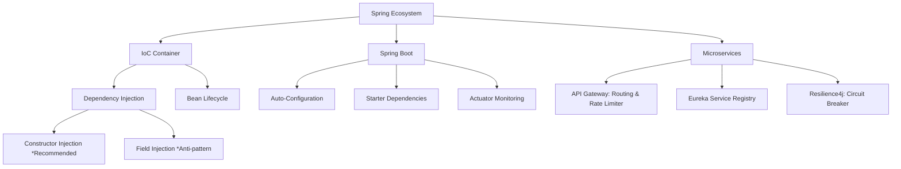

# Spring Boot & Microservices Core Architecture

---

## 1. Khái niệm (Difficulty Breakdown)

### # Beginner
Ở mức độ cơ bản, **Spring Framework** là một framework mã nguồn mở giúp đơn giản hóa việc phát triển ứng dụng Java Enterprise. Cốt lõi của Spring là hai nguyên lý chính:
- **Inversion of Control (IoC - Đảo ngược điều khiển)**: Thay vì lập trình viên tự khởi tạo đối tượng bằng từ khóa `new`, quyền kiểm soát vòng đời và khởi tạo đối tượng được giao lại cho Spring Container.
- **Dependency Injection (DI - Tiêm phụ thuộc)**: Cách Spring Container cung cấp các đối tượng phụ thuộc (Beans) vào một đối tượng khác khi khởi tạo (thông qua Constructor, Setter hoặc Field).

**Spring Boot** là một dự án mở rộng từ Spring Framework, giúp cấu hình ứng dụng nhanh chóng bằng cách loại bỏ hầu hết các tệp cấu hình XML phức tạp thông qua hai cơ chế: **Starter Dependencies** (gộp sẵn các thư viện liên quan) và **Auto-configuration** (tự động cấu hình dựa trên các thư viện có sẵn trong classpath).

### # Intermediate
Ở mức độ trung cấp, lập trình viên cần hiểu rõ:
- **Spring Bean Lifecycle**: Vòng đời của một Bean đi từ Khởi tạo (Instantiation) -> Điền thuộc tính (Populate Properties) -> Các hàm gọi lại (Aware interfaces, BeanPostProcessor) -> Initialization (PostConstruct, InitializingBean) -> Sẵn sàng sử dụng -> Destruction (PreDestroy, DisposableBean).
- **Bean Scopes**: `singleton` (mặc định - 1 instance cho toàn container), `prototype` (mới mỗi lần gọi), `request`, `session`, `application` và `websocket`.
- **Spring MVC Request Lifecycle**: Luồng xử lý request đi qua **DispatcherServlet** (Front Controller) -> **HandlerMapping** (tìm Controller phù hợp) -> **HandlerAdapter** -> **Controller** -> Trả về **ModelAndView** hoặc ghi trực tiếp vào HTTP Response qua **HttpMessageConverter** (cho REST API `@ResponseBody`).

### # Advanced
Ở mức độ nâng cao:
- **Spring Boot Auto-configuration Mechanics**: Spring Boot quét file `META-INF/spring/org.springframework.boot.autoconfigure.AutoConfiguration.imports` (ở Spring Boot 3+) hoặc `spring.factories` để tải các class cấu hình tự động. Các class này sử dụng các annotation điều kiện như `@ConditionalOnClass`, `@ConditionalOnMissingBean`, `@ConditionalOnProperty` để quyết định xem có khởi tạo Bean hay không.
- **Spring Cloud Microservice Components**: 
  - **Eureka Server / Service Registry**: Đăng ký và phát hiện dịch vụ tự động.
  - **Feign Client**: HTTP client khai báo (Declarative HTTP Client) giúp gọi API giữa các microservices một cách trực quan giống như gọi hàm local.
  - **Spring Cloud Gateway**: Đóng vai trò là Single Entry Point, chịu trách nhiệm định tuyến, lọc request, xác thực, và Rate Limiting.

### # Expert
Ở mức độ tối thượng (Architect):
- **Custom Starter Development**: Tạo các thư viện auto-configuration riêng cho doanh nghiệp (ví dụ: logger chung, security filter chung) đóng gói thành thư viện jar dùng lại ở tất cả microservices.
- **Resilience Design Pattern**: Tích hợp **Resilience4j** để thiết kế hệ thống có khả năng tự phục hồi bằng các cơ chế: **Circuit Breaker** (ngắt mạch khi dịch vụ đích gặp lỗi liên tục), **Rate Limiter** (giới hạn số request/s), **Bulkhead** (cô lập tài nguyên luồng xử lý), và **Retry** (thử lại khi gặp lỗi tạm thời).
- **Graceful Shutdown & Liveness/Readiness Probes**: Cấu hình Spring Boot kết hợp với Kubernetes để đảm bảo hệ thống không làm mất request của người dùng khi tiến hành Scale-in/Scale-out hoặc Deployment.

---

## 2. Mục đích

Trong các doanh nghiệp hiện nay:
- **Giảm chi phí phát triển (Time-to-Market)**: Nhờ có Spring Boot Starter, lập trình viên có thể dựng một ứng dụng REST API kết nối database chỉ trong vài phút thay vì vài ngày như thời kỳ cấu hình XML thủ công.
- **Quản lý độ phức tạp hệ thống**: Cơ chế IoC/DI giúp các thành phần trong code lỏng lẻo (loosely coupled), cực kỳ dễ viết Unit Test (bằng cách mock các phụ thuộc) và bảo trì nâng cấp.
- **Hỗ trợ chuyển dịch sang Microservices**: Spring Boot cung cấp kiến trúc hoàn hảo để xây dựng các service nhỏ gọn, đóng gói độc lập trong Docker container và dễ dàng điều phối qua Kubernetes.

---

## 3. Kiến trúc hoạt động

### Spring MVC Request Flow Diagram

```text
 Client
   │
   │ 1. HTTP Request (e.g., GET /api/v1/users)
   ▼
+──────────────────────────────────────────────────────────────+
|                      DispatcherServlet                       |
+──────────────────────────────────────────────────────────────+
   │                                     ▲
   │ 2. Ask for Handler                  │ 3. Return Handler
   ▼                                     │
+───────────────────+             +───────────────────+
|  HandlerMapping   |             |  HandlerAdapter   |
+───────────────────+             +───────────────────+
                                         │
                                         │ 4. Execute Controller
                                         ▼
                                  +───────────────────+
                                  |    Controller     |
                                  | (Process Business)|
                                  +───────────────────+
                                         │
                                         │ 5. Return Data / View
                                         ▼
                                  +───────────────────+
                                  |  HttpMessageConv  |
                                  | (JSON Converter)  |
                                  +───────────────────+
                                         │
                                         │ 6. HTTP Response (JSON)
                                         ▼
                                       Client
```

---

## 4. Ví dụ thực tế

### Tình huống:
Một hệ thống đặt đồ ăn (Food Delivery App) gồm microservice `Order Service` và `Restaurant Service`. Khi người dùng đặt đơn hàng, `Order Service` cần gọi `Restaurant Service` để xác nhận xem món ăn còn phục vụ không. Nếu `Restaurant Service` bị quá tải hoặc sập, toàn bộ tiến trình của `Order Service` cũng bị nghẽn (do các luồng gọi HTTP bị block chờ timeout), dẫn đến sập dây chuyền (Cascading Failure) toàn hệ thống.

### Giải pháp của Architect:
1. Sử dụng **OpenFeign** kết hợp với **Resilience4j Circuit Breaker** trên `Order Service`.
2. Khi `Restaurant Service` phản hồi chậm hoặc lỗi quá 50% trong 10 giây, Circuit Breaker chuyển sang trạng thái **OPEN** (ngắt mạch).
3. Các request tiếp theo từ `Order Service` sẽ không gọi sang `Restaurant Service` nữa mà trả về ngay lập tức một thông báo lỗi dự phòng (Fallback response) trong vòng vài mili-giây, bảo vệ hệ thống không bị cạn kiệt luồng xử lý (Thread exhaustion).

---

## 5. Code Demo

Dưới đây là một ví dụ mẫu chuẩn Enterprise cho việc xây dựng một **Custom Spring Boot Starter** đơn giản: Một logger ghi nhận thời gian thực thi của các Controller API tự động bằng Aspect-Oriented Programming (AOP).

### Cấu trúc lớp Aspect:
```java
package com.knowledgebase.core.logging;

import org.aspectj.lang.ProceedingJoinPoint;
import org.aspectj.lang.annotation.Around;
import org.aspectj.lang.annotation.Aspect;
import org.slf4j.Logger;
import org.slf4j.LoggerFactory;
import org.springframework.stereotype.Component;

@Aspect
@Component
public class PerformanceLoggingAspect {
    private static final Logger log = LoggerFactory.getLogger(PerformanceLoggingAspect.class);

    @Around("@within(org.springframework.web.bind.annotation.RestController)")
    public Object logExecutionTime(ProceedingJoinPoint joinPoint) throws Throwable {
        long start = System.currentTimeMillis();
        String className = joinPoint.getSignature().getDeclaringTypeName();
        String methodName = joinPoint.getSignature().getName();

        try {
            Object result = joinPoint.proceed(); // Thực thi API thực tế
            long executionTime = System.currentTimeMillis() - start;
            log.info("API Executed: {}.{} took {} ms", className, methodName, executionTime);
            return result;
        } catch (Throwable throwable) {
            long executionTime = System.currentTimeMillis() - start;
            log.error("API Failed: {}.{} after {} ms with message: {}", 
                className, methodName, executionTime, throwable.getMessage());
            throw throwable;
        }
    }
}
```

### Lớp Auto-Configuration:
```java
package com.knowledgebase.core.logging;

import org.springframework.boot.autoconfigure.AutoConfiguration;
import org.springframework.boot.autoconfigure.condition.ConditionalOnProperty;
import org.springframework.context.annotation.Bean;
import org.springframework.context.annotation.EnableAspectJAutoProxy;

@AutoConfiguration
@EnableAspectJAutoProxy
@ConditionalOnProperty(name = "enterprise.logging.performance.enabled", havingValue = "true", matchIfMissing = true)
public class PerformanceLoggingAutoConfiguration {

    @Bean
    public PerformanceLoggingAspect performanceLoggingAspect() {
        return new PerformanceLoggingAspect();
    }
}
```

---

## 6. Best Practices

1. **Ưu tiên dùng Constructor Injection**: Thay vì dùng `@Autowired` trực tiếp lên thuộc tính (Field Injection), hãy sử dụng Constructor Injection. Nó giúp các biến phụ thuộc có thể đánh dấu `final` (bất biến), ngăn lỗi nullpointer khi chạy test thủ công và hỗ trợ viết unit test dễ dàng.
2. **Không chặn luồng chính trong @Configuration**: Tránh viết các đoạn code kết nối cơ sở dữ liệu hoặc xử lý I/O nặng trong các phương thức khởi tạo Bean của class cấu hình.
3. **Cấu hình Spring Boot Actuator bảo mật**: Actuator cung cấp thông tin cực kỳ nhạy cảm về hệ thống (`/actuator/env`, `/actuator/heapdump`). Phải bảo mật các endpoints này bằng Spring Security và chỉ mở những endpoint thực sự cần thiết (`/actuator/health`, `/actuator/prometheus`).
4. **Sử dụng Record cho DTOs (Java 16+)**: Dùng Java Record thay vì class thông thường để định nghĩa các đối tượng truyền dữ liệu (DTO) nhằm giảm thiểu boilerplate code (Getter, equals, hashCode).
5. **Cấu hình Graceful Shutdown**: Kích hoạt `server.shutdown=graceful` trong file properties giúp Spring Boot hoàn thành nốt các request dở dang trước khi tắt ứng dụng.

---

## 7. Common Mistakes (Anti-patterns)

### 1. Quét quá nhiều Bean không cần thiết
- **Anti-pattern**: Đặt `@SpringBootApplication` ở package gốc không chuẩn dẫn đến việc Spring quét qua toàn bộ classpath và khởi tạo hàng trăm Bean không dùng tới, làm tăng thời gian khởi động ứng dụng (Startup Time) và tốn RAM.
- **Khắc phục**: Đặt class chính ở package cha cao nhất của project cấu trúc rõ ràng (ví dụ: `com.enterprise.myproject`).

### 2. Sử dụng Prototype Bean bên trong Singleton Bean không đúng cách
Do Singleton Bean chỉ được khởi tạo một lần duy nhất, Prototype Bean được tiêm vào nó cũng sẽ chỉ được khởi tạo một lần duy nhất, làm mất đi ý nghĩa của Prototype scope.
- **Anti-pattern**:
  ```java
  @Component // Singleton mặc định
  public class SingletonService {
      @Autowired private PrototypeService prototypeService; // Sẽ bị giữ vĩnh viễn
  }
  ```
- **Khắc phục**: Sử dụng `@Lookup` annotation hoặc `ObjectProvider<PrototypeService>` để lấy instance mới mỗi khi gọi.

---

## 8. Interview Questions

#### Q1: Sự khác biệt giữa `@Component`, `@Service`, `@Repository` và `@Controller` là gì?
* **Đáp án**: Về mặt kỹ thuật, cả 4 annotation này đều được đánh dấu `@Component`, giúp Spring quét và nhận diện để khởi tạo Bean. Tuy nhiên, chúng có vai trò ngữ nghĩa khác nhau:
  - `@Controller`: Định nghĩa lớp điều phối Web, tiếp nhận request.
  - `@Service`: Đánh dấu lớp chứa logic nghiệp vụ (Business Logic).
  - `@Repository`: Đánh dấu lớp truy xuất dữ liệu, tự động dịch các ngoại lệ Database cụ thể sang `DataAccessException` của Spring.

#### Q2: Spring Boot Auto-configuration hoạt động như thế nào?
* **Đáp án**: Khi ứng dụng khởi động, Spring Boot tìm kiếm tệp `imports` tự động. Nó quét các class cấu hình và áp dụng các annotation dạng `@Conditional` (như `@ConditionalOnClass`, `@ConditionalOnMissingClass`). Nếu các điều kiện này thỏa mãn (ví dụ: thư viện driver H2 tồn tại trong classpath và chưa có Bean DataSource nào tự định nghĩa), Spring Boot sẽ tự động đăng ký và khởi tạo Bean tương ứng cho ứng dụng.

#### Q3: Dependency Injection trong Spring có những loại nào? Loại nào được khuyên dùng nhất và tại sao?
* **Đáp án**: Có 3 loại: Field Injection, Setter Injection, và Constructor Injection. Constructor Injection được khuyến khích sử dụng nhất vì: đảm bảo tính bất biến của dependency (sử dụng từ khóa `final`), đảm bảo Bean không bao giờ được tạo ra ở trạng thái nửa vời (chưa tiêm đủ dependencies), và dễ dàng viết Unit Test mà không cần dùng framework mock phức tạp.

#### Q4: Làm thế nào để giải quyết lỗi Circular Dependency (phụ thuộc vòng tròn) trong Spring?
* **Đáp án**: Phụ thuộc vòng tròn xảy ra khi Class A yêu cầu Class B, và Class B lại yêu cầu Class A. 
  - Cách tốt nhất: Tách phần logic chung tạo nên vòng lặp ra một Class C độc lập khác để phá vỡ vòng lặp.
  - Cách tạm thời: Sử dụng annotation `@Lazy` ở điểm tiêm phụ thuộc để Spring trì hoãn việc khởi tạo Bean cho tới khi thực sự cần dùng.

#### Q5: Sự khác biệt giữa `@Bean` và `@Component` là gì?
* **Đáp án**: 
  - `@Component` được chú thích trực tiếp trên cấp lớp (Class-level), Spring quét classpath tự động để khởi tạo.
  - `@Bean` được viết trên cấp phương thức (Method-level) nằm trong các class `@Configuration`. `@Bean` thường được sử dụng khi bạn muốn tích hợp và khởi tạo class của các thư viện bên thứ ba mà bạn không thể sửa mã nguồn của họ để đánh dấu `@Component`.

#### Q6: Spring Boot Actuator dùng để làm gì?
* **Đáp án**: Spring Boot Actuator cung cấp các endpoint dựng sẵn giúp giám sát (monitoring) và quản lý ứng dụng khi chạy trên production. Nó cung cấp các thông tin về sức khỏe hệ thống (`/health`), cấu hình môi trường (`/env`), các thông số đo lường (`/metrics`), luồng chạy (`/threaddump`), v.v.

#### Q7: Cơ chế xử lý ngoại lệ toàn cục (Global Exception Handling) trong Spring Boot hoạt động ra sao?
* **Đáp án**: Spring sử dụng annotation `@ControllerAdvice` hoặc `@RestControllerAdvice` kết hợp với `@ExceptionHandler(ExceptionClass.class)` ở các method. Khi một Exception bị ném ra từ bất kỳ Controller nào và không được bắt lại, DispatcherServlet sẽ chuyển hướng xử lý đến các method tương ứng trong class `@RestControllerAdvice` để format thông tin lỗi và trả về mã lỗi HTTP đồng nhất cho client.

#### Q8: Transactional Annotation (`@Transactional`) hoạt động như thế nào trong Spring?
* **Đáp án**: `@Transactional` sử dụng kỹ thuật Spring AOP (Aspect-Oriented Programming). Khi một method có chú thích này được gọi, Spring tạo ra một Proxy bao quanh Class đó. Proxy này sẽ mở một kết nối (Connection) Database, tắt chế độ Auto-commit, chạy logic nghiệp vụ của method, và tự động gọi `commit()` nếu thành công hoặc `rollback()` nếu có `RuntimeException` xảy ra.

#### Q9: Phân biệt `ApplicationContext` và `BeanFactory` trong Spring?
* **Đáp án**: Cả hai đều là Spring Container. `BeanFactory` cung cấp các tính năng quản lý Bean cơ bản, sử dụng cơ chế Lazy-loading (chỉ khởi tạo Bean khi được gọi). `ApplicationContext` kế thừa `BeanFactory` và bổ sung các tính năng nâng cao: Eager-loading (khởi tạo tất cả singleton Bean ngay khi startup), tích hợp AOP, xử lý đa ngôn ngữ (i18n), phát sự kiện (Event Publication). Thực tế luôn khuyên dùng `ApplicationContext`.

#### Q10: Sự khác biệt giữa Circuit Breaker trạng thái CLOSED, OPEN và HALF_OPEN trong Resilience4j?
* **Đáp án**:
  - `CLOSED`: Trạng thái bình thường, tất cả các request đều đi thẳng tới dịch vụ đích.
  - `OPEN`: Trạng thái ngắt mạch, tất cả request bị chặn lại lập tức và trả về fallback mà không gọi dịch vụ đích để tránh nghẽn.
  - `HALF_OPEN`: Sau một khoảng thời gian cấu hình ở trạng thái OPEN, hệ thống cho phép một lượng nhỏ request đi qua thử nghiệm. Nếu thành công hết, mạch đóng lại (`CLOSED`). Nếu vẫn lỗi, mạch mở tiếp (`OPEN`).

---

## 9. Senior Notes

> [!WARNING]
> **Góc khuất thực chiến với Spring AOP và `@Transactional`:**
> Một lỗi cực kỳ phổ biến của cả các lập trình viên trung cấp là việc gọi nội bộ (Internal Method Call). 
> Nếu bạn có một Class `OrderService` và phương thức `createOrder()` không có transaction gọi đến phương thức `saveToDb()` có chú thích `@Transactional` nằm trong CÙNG MỘT CLASS, thì Transaction **sẽ không bao giờ được kích hoạt**.
> 
> **Lý do**: Spring AOP chỉ can thiệp khi cuộc gọi đi qua lớp Proxy bên ngoài. Cuộc gọi nội bộ (sử dụng từ khóa `this.saveToDb()`) bỏ qua Proxy, khiến cơ chế Transaction bị vô hiệu hóa. 
> Để khắc phục, phương thức `@Transactional` phải được gọi từ một Bean khác bên ngoài, hoặc bạn tự tiêm chính Bean đó vào qua `@Lazy` autowired.

---

## 10. Tài liệu tham khảo

1. [Spring Boot Reference Documentation](https://docs.spring.io/spring-boot/docs/current/reference/htmlsingle/)
2. [Spring Framework IoC Container Guide](https://docs.spring.io/spring-framework/reference/core/beans.html)
3. [Resilience4j Official Documentation](https://resilience4j.readme.io/docs)
4. Sách: *Spring Boot in Action* - Craig Walls.

---
# PHẦN BỔ TRỢ CHƯƠNG

### ✅ Checklist cần nhớ
- [ ] Hiểu rõ vòng đời của một Spring Bean.
- [ ] Biết cách thiết lập Constructor Injection thay vì Field Injection.
- [ ] Giải quyết được lỗi Circular Dependency.
- [ ] Nắm rõ cơ chế hoạt động của `@Transactional` và lỗi gọi nội bộ (Internal Call).
- [ ] Biết cách cấu hình bảo mật cho Spring Boot Actuator endpoints.
- [ ] Hiểu cơ chế hoạt động của Circuit Breaker.

### ✅ Mindmap (Mermaid)



### ✅ Cheat Sheet

* **Bật cấu hình Graceful Shutdown (application.properties)**:
  ```properties
  server.shutdown=graceful
  spring.lifecycle.timeout-per-shutdown-phase=30s
  ```
* **Bật Endpoint Actuator cần thiết cho Prometheus monitoring**:
  ```properties
  management.endpoints.web.exposure.include=health,prometheus
  management.endpoint.health.show-details=always
  ```
* **Cấu hình Custom Auto-configuration Spring Boot 3**:
  Tạo file `src/main/resources/META-INF/spring/org.springframework.boot.autoconfigure.AutoConfiguration.imports` và ghi tên Class cấu hình vào:
  ```text
  com.enterprise.logging.PerformanceLoggingAutoConfiguration
  ```

### ✅ Interview Tips

* Khi giải thích về **Dependency Injection**, hãy dùng ẩn dụ thực tế: *"Thay vì một chiếc ô tô tự sản xuất động cơ (tự new đối tượng phụ thuộc), động cơ được sản xuất độc lập ở ngoài và lắp ráp vào ô tô khi lắp ráp (Injected). Điều này giúp dễ bảo trì, thay thế động cơ hoặc chạy thử nghiệm động cơ giả lập (Mocking)."*
* Nếu được hỏi về cách tối ưu hóa **Startup Time của Spring Boot**, hãy liệt kê các kỹ thuật:
  1. Sử dụng Spring Boot 3.x với **GraalVM Native Image** để biên dịch trực tiếp sang file thực thi nhị phân (Binary) bản xứ giúp khởi động trong vài mili-giây và giảm tiêu thụ RAM.
  2. Bật chế độ khởi tạo Bean lười (`spring.main.lazy-initialization=true`) trong môi trường dev.
  3. Loại bỏ các `@ComponentScan` thừa.

### ✅ Mini Project: API Rate Limiter Gateway Filter với Resilience4j

**Mô tả**: Viết một class Filter tùy chỉnh hoạt động như một thành phần chặn và kiểm soát tần suất request (Rate Limiting) dựa trên địa chỉ IP của Client bằng cách sử dụng thư viện Resilience4j.

**Mã nguồn**:

```java
package com.knowledgebase.core.project;

import io.github.resilience4j.ratelimiter.RateLimiter;
import io.github.resilience4j.ratelimiter.RateLimiterConfig;
import io.github.resilience4j.ratelimiter.RateLimiterRegistry;
import org.springframework.http.HttpStatus;
import org.springframework.stereotype.Component;
import jakarta.servlet.*;
import jakarta.servlet.http.HttpServletRequest;
import jakarta.servlet.http.HttpServletResponse;
import java.io.IOException;
import java.time.Duration;
import java.util.concurrent.ConcurrentHashMap;

@Component
public class IpRateLimiterFilter implements Filter {

    private final ConcurrentHashMap<String, RateLimiter> limiters = new ConcurrentHashMap<>();
    
    // Cấu hình giới hạn: Tối đa 5 request trong mỗi 10 giây
    private final RateLimiterConfig config = RateLimiterConfig.custom()
            .limitForPeriod(5)
            .limitRefreshPeriod(Duration.ofSeconds(10))
            .timeoutDuration(Duration.ZERO) // Không đợi, block ngay lập tức nếu vượt ngưỡng
            .build();
            
    private final RateLimiterRegistry registry = RateLimiterRegistry.of(config);

    @Override
    public void doFilter(ServletRequest request, ServletResponse response, FilterChain chain) 
            throws IOException, ServletException {
        
        HttpServletRequest httpRequest = (HttpServletRequest) request;
        HttpServletResponse httpResponse = (HttpServletResponse) response;
        
        String clientIp = httpRequest.getRemoteAddr();
        RateLimiter rateLimiter = limiters.computeIfAbsent(clientIp, ip -> registry.rateLimiter(ip, config));

        if (rateLimiter.acquirePermission()) {
            chain.doFilter(request, response); // Cho phép tiếp tục
        } else {
            httpResponse.setStatus(HttpStatus.TOO_MANY_REQUESTS.value());
            httpResponse.setContentType("application/json");
            httpResponse.getWriter().write("{\"error\": \"Too many requests. Please try again later.\"}");
        }
    }
}
```

---

### ✅ Bài tập thực hành

#### Bài tập 1: Sửa lỗi Internal Method @Transactional
Đoạn code sau đây thực hiện ghi đè dữ liệu người dùng nhưng khi ném ra lỗi `RuntimeException` thì database không được rollback dữ liệu cũ. Hãy giải thích tại sao và sửa lại code.

```java
@Service
public class UserService {
    @Autowired
    private UserRepository userRepository;

    public void registerUser(User user) {
        saveUser(user);
    }

    @Transactional
    public void saveUser(User user) {
        userRepository.save(user);
        if (user.getName().equals("error")) {
            throw new RuntimeException("Simulated db error");
        }
    }
}
```

* **Gợi ý Giải pháp**: Di chuyển `@Transactional` lên phương thức `registerUser()` hoặc tách `saveUser()` sang một service phụ trợ khác để cuộc gọi đi qua Proxy.

---

### ✅ References
- [Ref1] *Spring in Action, Sixth Edition* - Craig Walls.
- [Ref2] Spring Cloud gateway official guide: [Spring Cloud Routing](https://spring.io/projects/spring-cloud-gateway)
