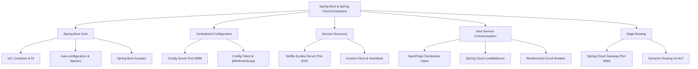

# Spring Boot & Microservices Core Architecture

---

> **Mục tiêu đầu ra:** Xây dựng hệ sinh thái microservices hoàn chỉnh bằng Spring Boot 3+ và Spring Cloud: từ quản trị cấu hình tập trung (**Spring Cloud Config Server & Client** với `@RefreshScope`), đăng ký và khám phá dịch vụ tự động (**Netflix Eureka Service Discovery**), giao tiếp liên dịch vụ kiên cường (**OpenFeign + Spring Cloud LoadBalancer + Resilience4j Circuit Breaker**), định tuyến cổng vào (**Spring Cloud Gateway**) cho đến cơ chế giám sát sức khỏe (**Spring Boot Actuator**).

---

## 1. Khái niệm (Difficulty Breakdown)

### Beginner
Ở mức độ cơ bản, **Spring Framework** là nền tảng số một để phát triển ứng dụng Java Enterprise. Cốt lõi của Spring bao gồm:
- **Inversion of Control (IoC - Đảo ngược điều khiển)**: Thay vì lập trình viên tự khởi tạo và quản lý vòng đời đối tượng bằng từ khóa `new`, quyền kiểm soát được trao lại cho Spring Container (ApplicationContext).
- **Dependency Injection (DI - Tiêm phụ thuộc)**: Cách Spring Container tự động tiêm các đối tượng phụ thuộc (Beans) vào một đối tượng khác thông qua Constructor, Setter hoặc Field.
- **Spring Boot**: Dự án giúp đơn giản hóa việc phát triển ứng dụng Spring bằng cách:
  - **Starter Dependencies**: Đóng gói sẵn các bộ thư viện tương thích (`spring-boot-starter-web`, `spring-boot-starter-data-jpa`).
  - **Auto-configuration**: Tự động cấu hình Bean dựa trên các file `.jar` có sẵn trong classpath mà không cần cấu hình XML thủ công.
  - **Embedded Web Server**: Tích hợp sẵn Tomcat, Jetty hoặc Netty để chạy trực tiếp file `.jar` độc lập.

---

### Intermediate
Ở mức độ trung cấp, kỹ sư cần hiểu sâu về cơ chế nội tại của Spring Boot và bước đầu xây dựng các thành phần phân tán:
- **Spring Bean Lifecycle**: Khởi tạo (Instantiation) ➔ Điền thuộc tính (Populate Properties) ➔ Aware Interfaces ➔ `@PostConstruct` (Initialization) ➔ Sẵn sàng sử dụng ➔ `@PreDestroy` (Destruction).
- **Bean Scopes**: `singleton` (mặc định - 1 instance duy nhất trên Container), `prototype` (sinh mới mỗi lần gọi), `request`, `session`, và `refresh` (`@RefreshScope`).
- **Spring MVC Request Lifecycle**: Request ➔ **DispatcherServlet** (Front Controller) ➔ **HandlerMapping** ➔ **HandlerAdapter** ➔ **Controller** ➔ **HttpMessageConverter** (chuyển đổi POJO sang JSON).
- **Spring Cloud Config Server & Config Client**:
  - *Config Server*: Máy chủ quản lý tập trung toàn bộ cấu hình (`application.yml`, `order-service.yml`) lưu trên Git repository hoặc thư mục nội bộ.
  - *Config Client*: Các microservices tải cấu hình từ Config Server khi khởi động qua `spring.config.import`.
  - *@RefreshScope*: Annotation cho phép nạp lại các biến `@Value` ngay trong lúc ứng dụng đang chạy khi kích hoạt endpoint `POST /actuator/refresh` mà không cần khởi động lại ứng dụng.
- **Netflix Eureka Discovery (Service Registry & Client)**:
  - *Eureka Server*: Đóng vai trò danh bạ trung tâm lưu trữ bản đồ tên dịch vụ và danh sách IP:Port tương ứng.
  - *Eureka Client*: Microservice tự động gửi thông tin đăng ký và đều đặn gửi tín hiệu duy trì sự sống (**Heartbeat**) mỗi 30 giây.
  - *Self-Preservation Mode*: Chế độ tự vệ của Eureka không xóa các instance khỏi danh bạ khi xảy ra sự cố chập chờn mạng diện rộng.

---

### Advanced
Ở mức độ nâng cao, kỹ sư thiết kế giao tiếp liên dịch vụ và cổng định tuyến API:
- **Declarative REST Client (OpenFeign)**:
  - Cho phép viết interface gọi API giữa các microservices giống hệt như gọi hàm Java thông thường.
  - Tự động tích hợp **Spring Cloud LoadBalancer** để giải mã tên dịch vụ trên Eureka (ví dụ `http://PAYMENT-SERVICE/charge`) thành địa chỉ IP thực tế và phân bổ tải theo thuật toán Round-Robin.
- **Spring Cloud Gateway**:
  - Được xây dựng trên nền tảng bất đồng bộ không chặn (Non-blocking Reactive) với Project Reactor và Netty.
  - Sử dụng tiền tố `lb://SERVICE-NAME` để tự động tra cứu danh bạ Eureka và định tuyến động traffic từ người dùng vào các microservice downstream.
- **Spring Boot Actuator**:
  - Cung cấp các endpoint giám sát sẵn có: `/actuator/health` (sức khỏe hệ thống), `/actuator/info`, `/actuator/metrics`, `/actuator/prometheus` và `/actuator/refresh`.

---

### Expert (Architect)
Ở mức độ chuyên gia:
- **Resilience Design Pattern với Resilience4j**:
  - Tích hợp **Circuit Breaker** vào OpenFeign: Tự động ngắt mạch (`OPEN`) khi tỷ lệ gọi lỗi sang service đích vượt quá ngưỡng (ví dụ 50%), lập tức kích hoạt hàm **Fallback** để bảo vệ hệ thống không bị cạn kiệt luồng xử lý (Thread Pool Starvation).
  - Kết hợp **Rate Limiter**, **Retry** và **Bulkhead**.
- **Custom Starter Development**:
  - Đóng gói các thư viện cấu hình tự động dùng chung (như Common Security Filter, Distributed Tracing Interceptor) sử dụng file `META-INF/spring/org.springframework.boot.autoconfigure.AutoConfiguration.imports` và các điều kiện `@ConditionalOnClass`, `@ConditionalOnProperty`.
- **Graceful Shutdown & Kubernetes Probes**:
  - Cấu hình `server.shutdown=graceful` kết hợp Kubernetes `readinessProbe` và `livenessProbe` đảm bảo không làm rơi bất kỳ request nào của khách hàng khi scale-in hoặc rolling release.

---

## 2. Mục đích

Trong phát triển phần mềm hiện đại:
- **Quản trị Cấu hình Tập trung (Centralized Configuration)**: Thay vì phải truy cập vào từng máy chủ để sửa đổi file cấu hình, kỹ sư chỉ cần chỉnh sửa trên Git Repo của Config Server và kích hoạt refresh động, tiết kiệm 90% thời gian vận hành.
- **Tự động Hóa Phân giải Địa chỉ (Dynamic Service Discovery)**: Không cần phải hardcode địa chỉ IP/Port trong mã nguồn. Khi dịch vụ scale từ 2 lên 20 instance, Eureka và LoadBalancer tự động nhận biết và cân bằng tải.
- **Chống Sập Dây Chuyền (Preventing Cascading Failures)**: Circuit Breaker và Gateway bảo vệ các service cốt lõi trước những biến động, quá tải hoặc sự cố của các dịch vụ phụ trợ.

---

## 3. Kiến trúc Hoạt động

### Sơ đồ 1: Luồng Xử lý Spring MVC bên trong mỗi Microservice

```text
 Client (Browser / Postman)
    │
    │ 1. HTTP Request (e.g., GET /api/v1/orders/1001)
    ▼
+──────────────────────────────────────────────────────────────+
|                      DispatcherServlet                       |
+──────────────────────────────────────────────────────────────+
    │                                     ▲
    │ 2. Ask for Handler                  │ 3. Return Handler
    ▼                                     │
+───────────────────+             +───────────────────+
|  HandlerMapping   |             |  HandlerAdapter   |
+───────────────────+             +───────────────────+
                                          │
                                          │ 4. Execute Controller
                                          ▼
                                   +───────────────────+
                                   |    Controller     |
                                   | (Process Business)|
                                   +───────────────────+
                                          │
                                          │ 5. Return Data DTO
                                          ▼
                                   +───────────────────+
                                   |  HttpMessageConv  |
                                   | (Jackson JSON)    |
                                   +───────────────────+
                                          │
                                          │ 6. HTTP Response 200 OK (JSON)
                                          ▼
                                        Client
```

---

### Sơ đồ 2: Luồng Hoạt động Hệ sinh thái Spring Cloud Microservices

```text
                               ┌────────────────────────────────────────┐
                               │       GIT REPOSITORY / LOCAL DIR       │
                               │   order-service.yml, restaurant.yml    │
                               └───────────────────┬────────────────────┘
                                                   │ 1. Fetch configs
                                                   ▼
                               ┌────────────────────────────────────────┐
                               │      SPRING CLOUD CONFIG SERVER        │
                               │             (Port 8888)                │
                               └─────────┬───────────────────┬──────────┘
                                         │                   │
                        Pull configs at  │                   │ Pull configs at
                        startup          │                   │ startup
                                         ▼                   ▼
                     ┌───────────────────────┐   ┌───────────────────────┐
                     │     ORDER SERVICE     │   │   RESTAURANT SERVICE  │
                     │  (Config Client 8081) │   │  (Config Client 8082) │
                     │  - @RefreshScope      │   │  - @RefreshScope      │
                     └───────────┬───────────┘   └───────────┬───────────┘
                                 │                           │
                                 │ 2. Register & Heartbeat   │ 2. Register & Heartbeat
                                 ▼                           ▼
                     ┌───────────────────────────────────────────────────┐
                     │        NETFLIX EUREKA SERVICE REGISTRY            │
                     │                 (Port 8761)                       │
                     │   - ORDER-SERVICE      -> [192.168.1.10:8081]     │
                     │   - RESTAURANT-SERVICE -> [192.168.1.10:8082]     │
                     └───────────────────────────┬───────────────────────┘
                                                 ▲
                                                 │ 3. Fetch Service Registry
                                                 │    (LoadBalancer cache)
                                                 ▼
┌──────────────────┐           ┌─────────────────────────────────────────┐
│     CLIENT       │  Request  │           SPRING CLOUD GATEWAY          │
│ (Web / Mobile)   ├──────────>│               (Port 8080)               │
└──────────────────┘           │  Route: Path=/api/v1/orders/**          │
                               │  URI:   lb://ORDER-SERVICE              │
                               └────────────────────┬────────────────────┘
                                                    │
                                                    │ 4. Route dynamically to IP:Port
                                                    ▼
                                       [ ORDER SERVICE (8081) ]
                                                    │
                                                    │ 5. Call Restaurant via OpenFeign
                                                    │    @FeignClient(name="RESTAURANT-SERVICE")
                                                    │    (Eureka resolves IP:Port + CB)
                                                    ▼
                                     [ RESTAURANT SERVICE (8082) ]
```

---

## 4. Ví dụ Thực tế: Hệ thống Đặt Đồ ăn Trực tuyến (Food Delivery)

### Tình huống nghiệp vụ:
Một ứng dụng đặt món ăn trực tuyến gồm:
- **API Gateway (8080)**: Cổng vào duy nhất tiếp nhận request từ App người dùng.
- **Config Server (8888)**: Quản lý cấu hình mức phí ship, tỷ lệ giảm giá và timeout tập trung.
- **Eureka Server (8761)**: Danh bạ quản lý các microservice.
- **Order Service (8081)**: Tiếp nhận đơn đặt món.
- **Restaurant Service (8082)**: Quản lý tình trạng phục vụ của nhà hàng và thực đơn món ăn.

### Sự cố xảy ra:
1. Khi có khuyến mãi lớn, nhà hàng đối tác bị quá tải đơn, hệ thống `Restaurant Service` phản hồi cực kỳ chậm (timeout > 10 giây).
2. Hàng ngàn khách hàng cùng lúc gửi đơn đặt món vào `Order Service`. Các luồng của `Order Service` đều bị block để chờ `Restaurant Service`, dẫn đến cạn kiệt luồng (Thread Exhaustion) làm sập toàn bộ `Order Service`.
3. Doanh nghiệp muốn thay đổi tỷ lệ phí giao hàng nhưng mỗi lần sửa file properties phải restart lại máy chủ, làm gián đoạn việc đặt hàng của người dùng.

### Giải pháp của Kỹ sư Backend:
1. **Dynamic Config**: Đưa cấu hình `shipping.fee` lên Config Server. Gắn `@RefreshScope` trên Controller của `Order Service`. Khi phí thay đổi, chỉ cần gọi `POST /actuator/refresh`, giá trị mới lập tức có hiệu lực mà không cần restart máy chủ.
2. **Eureka Service Discovery**: Các service đăng ký tự động với Eureka, Gateway sử dụng `lb://ORDER-SERVICE` để tự động cân bằng tải giữa nhiều instance.
3. **OpenFeign + Resilience4j Circuit Breaker**:
   - `Order Service` gọi `Restaurant Service` qua `@FeignClient(name = "RESTAURANT-SERVICE", fallbackFactory = ...)`.
   - Nếu tỷ lệ lỗi hoặc timeout vượt quá 50%, Circuit Breaker lập tức chuyển sang trạng thái `OPEN` (ngắt mạch).
   - Các request đặt món tiếp theo sẽ không gọi sang `Restaurant Service` nữa mà trả về ngay phản hồi dự phòng: *"Nhà hàng đang bận, đơn hàng của bạn đã được ghi nhận vào hàng đợi xử lý"* trong vòng 0.5ms.

---

## 5. Code Demo Thực Chiến: Trọn bộ Hệ sinh thái Spring Cloud

Dưới đây là mã nguồn chuẩn hóa Java 17 + Spring Boot 3+ và Spring Cloud 2023+ sử dụng công cụ quản lý dự án **Gradle (`build.gradle`)** cho 5 thành phần cốt lõi:

---

### Khai báo Quản lý Phiên bản (BOM) trong file `build.gradle`

Mọi dự án Spring Cloud dùng Gradle đều cần khai báo plugin `io.spring.dependency-management` và import BOM `spring-cloud-dependencies` để đồng bộ phiên bản:

```groovy
plugins {
    id 'java'
    id 'org.springframework.boot' version '3.2.3'
    id 'io.spring.dependency-management' version '1.1.4'
}

group = 'com.knowledgebase'
version = '0.0.1-SNAPSHOT'

java {
    sourceCompatibility = '17'
}

repositories {
    mavenCentral()
}

ext {
    set('springCloudVersion', "2023.0.0")
}

dependencyManagement {
    imports {
        mavenBom "org.springframework.cloud:spring-cloud-dependencies:${springCloudVersion}"
    }
}
```

---

### 1. Spring Cloud Config Server (Port 8888)

#### Cấu hình `build.gradle` (Config Server):
```groovy
dependencies {
    // Máy chủ phân phối cấu hình tập trung
    implementation 'org.springframework.cloud:spring-cloud-config-server'
    testImplementation 'org.springframework.boot:spring-boot-starter-test'
}
```

#### Application Class: `ConfigServerApplication.java`
```java
package com.knowledgebase.backend.configserver;

import org.springframework.boot.SpringApplication;
import org.springframework.boot.autoconfigure.SpringBootApplication;
import org.springframework.cloud.config.server.EnableConfigServer;

@SpringBootApplication
@EnableConfigServer // Bật tính năng máy chủ quản lý cấu hình tập trung
public class ConfigServerApplication {
    public static void main(String[] args) {
        SpringApplication.run(ConfigServerApplication.class, args);
    }
}
```

#### File cấu hình `application.yml` của Config Server:
```yaml
server:
  port: 8888

spring:
  application:
    name: config-server
  profiles:
    active: git # Sử dụng Git hoặc 'native' cho thư mục nội bộ
  cloud:
    config:
      server:
        git:
          uri: https://github.com/my-org/food-delivery-config-repo.git
          default-label: main
          clone-on-start: true
```

#### File cấu hình tập trung lưu trên Git: `order-service.yml`
```yaml
# Cấu hình nghiệp vụ cho Order Service
food:
  order:
    shipping-fee: 15000.0 # 15.000 VNĐ
    discount-percent: 0.10 # Giảm giá 10%

# Cấu hình Eureka Client
eureka:
  client:
    service-url:
      defaultZone: http://localhost:8761/eureka/
  instance:
    prefer-ip-address: true

# Cho phép refresh động qua Actuator
management:
  endpoints:
    web:
      exposure:
        include: health,info,refresh
```

---

### 2. Spring Cloud Config Client với Dynamic Refresh (`@RefreshScope`)

#### Cấu hình `build.gradle` (Order Service - Config Client):
```groovy
dependencies {
    // Thư viện kết nối Config Server
    implementation 'org.springframework.cloud:spring-cloud-starter-config'
    // Actuator cho Dynamic Refresh (/actuator/refresh)
    implementation 'org.springframework.boot:spring-boot-starter-actuator'
    // Spring Web REST API
    implementation 'org.springframework.boot:spring-boot-starter-web'
    testImplementation 'org.springframework.boot:spring-boot-starter-test'
}
```

#### File cấu hình `application.yml` của Client (Spring Boot 3+):
```yaml
server:
  port: 8081

spring:
  application:
    name: order-service
  config:
    # Nạp cấu hình từ Config Server cổng 8888 lúc ứng dụng khởi động
    import: "optional:configserver:http://localhost:8888"
```

#### Controller sử dụng `@RefreshScope`: `OrderFeeController.java`
```java
package com.knowledgebase.backend.orderservice.controller;

import org.springframework.beans.factory.annotation.Value;
import org.springframework.cloud.context.config.annotation.RefreshScope;
import org.springframework.web.bind.annotation.GetMapping;
import org.springframework.web.bind.annotation.RequestMapping;
import org.springframework.web.bind.annotation.RestController;
import java.util.Map;

@RestController
@RequestMapping("/api/v1/orders")
@RefreshScope // CỐT LÕI: Nạp lại giá trị thuộc tính khi có request /actuator/refresh
public class OrderFeeController {

    @Value("${food.order.shipping-fee:20000.0}")
    private double shippingFee;

    @Value("${food.order.discount-percent:0.0}")
    private double discountPercent;

    @GetMapping("/fees")
    public Map<String, Object> getCurrentFees() {
        return Map.of(
            "shippingFee", shippingFee,
            "discountPercent", discountPercent,
            "status", "CONFIG_LOADED_SUCCESSFULLY"
        );
    }
}
```

> [!TIP]
> **Thực nghiệm Dynamic Refresh:**
> 1. Gọi `GET http://localhost:8081/api/v1/orders/fees` ➔ Trả về `shippingFee: 15000.0`.
> 2. Cập nhật `shipping-fee: 25000.0` trong file `order-service.yml` trên Git/Config Server.
> 3. Chạy lệnh: `curl -X POST http://localhost:8081/actuator/refresh`.
> 4. Gọi lại `GET http://localhost:8081/api/v1/orders/fees` ➔ Kết quả đổi thành `25000.0` tức thì!

---

### 3. Netflix Eureka Server (Port 8761)

#### Cấu hình `build.gradle` (Eureka Server):
```groovy
dependencies {
    // Máy chủ Service Registry Eureka
    implementation 'org.springframework.cloud:spring-cloud-starter-netflix-eureka-server'
    testImplementation 'org.springframework.boot:spring-boot-starter-test'
}
```

#### Application Class: `EurekaServerApplication.java`
```java
package com.knowledgebase.backend.eurekaserver;

import org.springframework.boot.SpringApplication;
import org.springframework.boot.autoconfigure.SpringBootApplication;
import org.springframework.cloud.netflix.eureka.server.EnableEurekaServer;

@SpringBootApplication
@EnableEurekaServer // Kích hoạt Service Registry trung tâm
public class EurekaServerApplication {
    public static void main(String[] args) {
        SpringApplication.run(EurekaServerApplication.class, args);
    }
}
```

#### File cấu hình `application.yml` của Eureka Server:
```yaml
server:
  port: 8761

spring:
  application:
    name: eureka-server

eureka:
  instance:
    hostname: localhost
  client:
    register-with-eureka: false # Server không cần tự đăng ký chính mình
    fetch-registry: false
    service-url:
      defaultZone: http://${eureka.instance.hostname}:${server.port}/eureka/
  server:
    enable-self-preservation: false # Tắt trong môi trường dev để dọn instance chết ngay
    eviction-interval-timer-in-ms: 5000
```

---

### 4. Netflix Eureka Client (Order Service & Restaurant Service)

#### Cấu hình `build.gradle` (Eureka Client):
```groovy
dependencies {
    // Client đăng ký và khám phá dịch vụ Eureka
    implementation 'org.springframework.cloud:spring-cloud-starter-netflix-eureka-client'
    implementation 'org.springframework.boot:spring-boot-starter-web'
    testImplementation 'org.springframework.boot:spring-boot-starter-test'
}
```

#### Application Class: `OrderServiceApplication.java`
```java
package com.knowledgebase.backend.orderservice;

import org.springframework.boot.SpringApplication;
import org.springframework.boot.autoconfigure.SpringBootApplication;
import org.springframework.cloud.client.discovery.EnableDiscoveryClient;
import org.springframework.cloud.openfeign.EnableFeignClients;

@SpringBootApplication
@EnableDiscoveryClient // Cho phép service tự động đăng ký vào Eureka
@EnableFeignClients    // Bật tính năng OpenFeign Client
public class OrderServiceApplication {
    public static void main(String[] args) {
        SpringApplication.run(OrderServiceApplication.class, args);
    }
}
```

#### Cấu hình kết nối Eureka trong `application.yml`:
```yaml
eureka:
  client:
    service-url:
      defaultZone: http://localhost:8761/eureka/
    register-with-eureka: true
    fetch-registry: true
  instance:
    prefer-ip-address: true
    lease-renewal-interval-in-seconds: 10 # Gửi Heartbeat mỗi 10s
    lease-expiration-duration-in-seconds: 30 # Hết hạn sau 30s không có tin nhắn
```

---

### 5. OpenFeign Client với Eureka Discovery & Resilience4j Circuit Breaker

#### Cấu hình `build.gradle` (OpenFeign + LoadBalancer + Resilience4j):
```groovy
dependencies {
    // Declarative REST Client
    implementation 'org.springframework.cloud:spring-cloud-starter-openfeign'
    // Client-side Load Balancer
    implementation 'org.springframework.cloud:spring-cloud-starter-loadbalancer'
    // Circuit Breaker Resilience4j
    implementation 'org.springframework.cloud:spring-cloud-starter-circuitbreaker-resilience4j'
    testImplementation 'org.springframework.boot:spring-boot-starter-test'
}
```

#### Interface Feign Client: `RestaurantClient.java`
```java
package com.knowledgebase.backend.orderservice.client;

import org.springframework.cloud.openfeign.FeignClient;
import org.springframework.stereotype.Component;
import org.springframework.web.bind.annotation.GetMapping;
import org.springframework.web.bind.annotation.PathVariable;
import org.slf4j.Logger;
import org.slf4j.LoggerFactory;

/**
 * Feign Client sử dụng tên dịch vụ 'RESTAURANT-SERVICE' đăng ký trên Eureka!
 * Tích hợp FallbackFactory để xử lý lỗi ngắt mạch khi nhà hàng offline.
 */
@FeignClient(name = "RESTAURANT-SERVICE", fallbackFactory = RestaurantClientFallbackFactory.class)
public interface RestaurantClient {

    @GetMapping("/api/v1/restaurants/{id}/status")
    RestaurantStatusResponse checkRestaurantStatus(@PathVariable("id") String restaurantId);
}

record RestaurantStatusResponse(String restaurantId, boolean isOpen, String message) {}

/**
 * Fallback Factory: Trả về phản hồi dự phòng an toàn khi gọi dịch vụ thất bại
 */
@Component
class RestaurantClientFallbackFactory implements org.springframework.cloud.openfeign.FallbackFactory<RestaurantClient> {
    private static final Logger log = LoggerFactory.getLogger(RestaurantClientFallbackFactory.class);

    @Override
    public RestaurantClient create(Throwable cause) {
        return restaurantId -> {
            log.warn("Gọi RESTAURANT-SERVICE thất bại cho ID: {}. Lý do: {}", restaurantId, cause.getMessage());
            // Fallback: Trả về trạng thái bận nhưng không làm sập tiến trình tạo đơn
            return new RestaurantStatusResponse(restaurantId, false, "Nhà hàng đang bận hoặc gián đoạn kết nối. Vui lòng thử lại!");
        };
    }
}
```

#### Cấu hình Circuit Breaker trong `application.yml`:
```yaml
feign:
  circuitbreaker:
    enabled: true

resilience4j:
  circuitbreaker:
    instances:
      RESTAURANT-SERVICE:
        sliding-window-size: 10
        failure-rate-threshold: 50 # >= 50% lỗi -> Chuyển sang trạng thái OPEN
        wait-duration-in-open-state: 10000ms # Chờ 10s trước khi thử lại
```

---

### 6. Spring Cloud Gateway Định tuyến qua Eureka (Port 8080)

#### Cấu hình `build.gradle` (API Gateway):
```groovy
dependencies {
    // Reactive API Gateway
    implementation 'org.springframework.cloud:spring-cloud-starter-gateway'
    // Eureka Client để Gateway tra cứu địa chỉ các service
    implementation 'org.springframework.cloud:spring-cloud-starter-netflix-eureka-client'
    testImplementation 'org.springframework.boot:spring-boot-starter-test'
}
```

#### File cấu hình `application.yml` của Gateway:
```yaml
server:
  port: 8080

spring:
  application:
    name: api-gateway
  cloud:
    gateway:
      discovery:
        locator:
          enabled: true
          lower-case-service-id: true
      routes:
        - id: order-service-route
          uri: lb://ORDER-SERVICE # Định tuyến cân bằng tải qua Eureka
          predicates:
            - Path=/api/v1/orders/**

        - id: restaurant-service-route
          uri: lb://RESTAURANT-SERVICE
          predicates:
            - Path=/api/v1/restaurants/**

eureka:
  client:
    service-url:
      defaultZone: http://localhost:8761/eureka/
```

---

## 6. Best Practices

1. **Luôn sử dụng Constructor Injection**: Tránh dùng Field Injection (`@Autowired` trên biến). Constructor injection giúp biến đánh dấu được `final`, ngăn chặn lỗi `NullPointerException` và dễ viết Unit Test với Mockito.
2. **Luôn bật `prefer-ip-address: true` cho Eureka Client**: Khi chạy trong Docker hoặc Kubernetes, hostname của container thường là chuỗi hash ngẫu nhiên không thể phân giải DNS giữa các host khác nhau. Cấu hình dùng IP thật sẽ giải quyết triệt để lỗi kết nối.
3. **Bảo mật endpoint `/actuator/refresh`**: Endpoint nạp lại cấu hình có thể bị kẻ xấu khai thác nếu mở public. Hãy bọc endpoint này bằng Spring Security với quyền quản trị viên (`ROLE_ACTUATOR_ADMIN`).
4. **Cấu hình Timeouts cho OpenFeign**: Không bao giờ để Feign sử dụng timeout mặc định không giới hạn. Luôn cấu hình `connect-timeout: 2000` và `read-timeout: 5000` để tránh treo luồng khi dịch vụ downstream bị lag.
5. **Sử dụng Profile riêng cho Config Server**: Chia cấu hình rõ ràng thành `order-service-dev.yml`, `order-service-staging.yml` và `order-service-prod.yml` để tránh nhầm lẫn giữa môi trường phát triển và sản phẩm thực tế.

---

## 7. Common Mistakes (Anti-patterns)

### 1. Quên `@RefreshScope` khi dùng Config Client
- **Sai lầm**: Khai báo `@Value("${my.prop}")` nhưng không đánh dấu `@RefreshScope` trên class Controller/Service.
- **Hệ quả**: Sau khi gọi `/actuator/refresh` thành công, giá trị biến trong class vẫn giữ nguyên giá trị cũ vì Spring Singleton Bean không tự động khởi tạo lại thuộc tính.

### 2. Hardcode URL máy chủ thay vì dùng Eureka Service Name
- **Sai lầm**: Khai báo Feign Client dạng `@FeignClient(name = "restaurant", url = "http://192.168.1.10:8082")`.
- **Hệ quả**: Mất hoàn toàn tính năng cân bằng tải động (Load Balancing) và Service Discovery của Eureka. Khi instance thay đổi IP hoặc scale-out, hệ thống lập tức bị lỗi kết nối.

### 3. Tắt Eureka Self-Preservation Mode trên Production
- **Sai lầm**: Cấu hình `eureka.server.enable-self-preservation=false` trên môi trường Production.
- **Hệ quả**: Khi xảy ra sự cố nghẽn mạng nội bộ tạm thời, Eureka hiểu nhầm tất cả các service đã chết và xóa sạch danh bạ, khiến Gateway không thể điều hướng request nào nữa.

### 4. Gọi nội bộ phương thức `@Transactional` (Internal Method Call)
- **Sai lầm**: Phương thức A không có Transaction gọi trực tiếp phương thức B có `@Transactional` nằm trong CÙNG MỘT CLASS bằng `this.methodB()`.
- **Hệ quả**: Cuộc gọi nội bộ bỏ qua lớp Spring AOP Proxy, làm cơ chế Transaction và Rollback bị vô hiệu hóa hoàn toàn.

---

## 8. Interview Questions & Expert Answers

#### Q1: Trình bày sự khác nhau giữa `@Component`, `@Service`, `@Repository` và `@Controller`?
* **Đáp án**: Tất cả đều là Bean trong Spring Container được thừa hưởng từ meta-annotation `@Component`. Tuy nhiên, chúng có vai trò ngữ nghĩa (Semantics) và xử lý chuyên biệt:
  - `@Controller`: Tiếp nhận HTTP request trong luồng Spring MVC.
  - `@Service`: Đánh dấu lớp chứa logic nghiệp vụ thuần túy (Business Logic).
  - `@Repository`: Đánh dấu lớp truy xuất dữ liệu (DAO), tự động bắt và dịch các ngoại lệ cấp cơ sở dữ liệu sang `DataAccessException` của Spring.

#### Q2: Spring Cloud Config Server kết nối và quản lý cấu hình như thế nào?
* **Đáp án**: Config Server cung cấp một REST API chuẩn hóa cho các client truy xuất cấu hình (`/{application}/{profile}/{label}`). Khi ứng dụng client khởi động, nó gửi tên service (`spring.application.name`) và profile đang kích hoạt tới Config Server. Config Server tìm file `.yml` tương ứng trên Git/Local repo, nạp vào bộ nhớ và trả về dạng JSON để client gán vào Environment trước khi khởi tạo ApplicationContext.

#### Q3: Cơ chế hoạt động của `@RefreshScope` trong Spring Cloud là gì?
* **Đáp án**: `@RefreshScope` là một Custom Scope của Spring. Khi một Bean được đánh dấu annotation này, Spring bọc nó trong một CGLIB Dynamic Proxy. Khi nhận sự kiện `POST /actuator/refresh`, cache instance bên trong Proxy bị xóa. Ở lần gọi phương thức tiếp theo, Proxy nhận thấy instance trống nên sẽ khởi tạo một instance mới với các giá trị cấu hình mới được tiêm vào (Lazy Re-instantiation).

#### Q4: Eureka Server quản lý vòng đời (Lifecycle) của một Instance như thế nào?
* **Đáp án**:
  - *Đăng ký (Register)*: Khi client khởi chạy, gửi HTTP POST kèm IP, Port và metadata tới Eureka.
  - *Duy trì (Renew / Heartbeat)*: Mỗi 30 giây (mặc định), client gửi HTTP PUT báo còn sống.
  - *Hết hạn (Cancel / Eviction)*: Nếu sau 90 giây Eureka không nhận được heartbeat, instance sẽ bị coi là đã chết và bị xóa khỏi danh bạ.

#### Q5: OpenFeign kết hợp với Spring Cloud LoadBalancer hoạt động ra sao?
* **Đáp án**: Khi OpenFeign nhận một lời gọi API có tên dịch vụ (ví dụ `RESTAURANT-SERVICE`), nó chuyển giao tên này cho `Spring Cloud LoadBalancer`. LoadBalancer truy vấn cache danh bạ Eureka để lấy danh sách các instance IP:Port đang hoạt động của service đó. Sau đó, nó áp dụng thuật toán cân bằng tải (mặc định là Round-Robin) để chọn ra một IP cụ thể và thực hiện request HTTP.

#### Q6: So sánh sự khác nhau giữa Spring MVC (Tomcat) và Spring Cloud Gateway (Netty)?
* **Đáp án**:
  - *Spring MVC*: Mô hình luồng đồng bộ chặn (Thread-per-request model). Mỗi request chiếm trọn một thread của Tomcat cho đến khi hoàn tất. Không phù hợp làm Gateway vì khi có hàng chục ngàn kết nối đồng thời sẽ gây cạn kiệt thread.
  - *Spring Cloud Gateway*: Dựa trên Project Reactor và Netty với mô hình hướng sự kiện không chặn (Event-driven Non-blocking). Một số lượng nhỏ thread (bằng số core CPU) có thể phục vụ đồng thời hàng trăm ngàn request, tối ưu hóa tối đa throughput và bộ nhớ RAM.

#### Q7: Sự khác biệt giữa 3 trạng thái CLOSED, OPEN và HALF_OPEN trong Circuit Breaker?
* **Đáp án**:
  - `CLOSED`: Trạng thái bình thường, request đi thẳng tới service đích.
  - `OPEN`: Khi tỷ lệ lỗi vượt ngưỡng, mạch ngắt hoàn toàn. Mọi request bị chặn lại ngay lập tức và chuyển sang hàm Fallback trong 0ms.
  - `HALF_OPEN`: Sau thời gian chờ, mạch mở hé cho một số lượng nhỏ request đi qua thử nghiệm. Nếu thành công, mạch đóng lại (`CLOSED`); nếu vẫn lỗi, mạch mở tiếp (`OPEN`).

#### Q8: Dependency Injection có những loại nào? Loại nào được khuyên dùng nhất?
* **Đáp án**: Có 3 loại: Constructor Injection, Setter Injection, và Field Injection. Constructor Injection được khuyến khích sử dụng nhất vì: đảm bảo tính bất biến (sử dụng từ khóa `final`), đảm bảo Bean luôn được tạo ra với đầy đủ các phụ thuộc cần thiết, và dễ dàng viết Unit Test mà không cần can thiệp Reflection.

#### Q9: Tại sao trong kiến trúc Microservices ta nên dùng Spring Cloud Gateway thay vì để Client gọi trực tiếp các Service?
* **Đáp án**:
  1. *Bảo mật*: Giấu địa chỉ IP và port nội bộ của các microservice sau tường lửa.
  2. *Tập trung hóa*: Xử lý xác thực JWT, giải mã SSL và Rate Limiting tại một nơi duy nhất.
  3. *Tối ưu hóa*: Giảm số lượng request từ Client thông qua API Aggregation.
  4. *Tránh lỗi CORS*: Client chỉ giao tiếp với một domain duy nhất của Gateway.

#### Q10: Khi nào nên sử dụng Spring Cloud Bus kết hợp với Config Server?
* **Đáp án**: Khi hệ thống có hàng chục hoặc hàng trăm microservices, việc gửi lệnh `curl -X POST /actuator/refresh` tới từng máy chủ thủ công là bất khả thi. **Spring Cloud Bus** kết nối các microservice thông qua một Message Broker (RabbitMQ hoặc Kafka). Kỹ sư chỉ cần gửi một lệnh duy nhất tới `POST /actuator/busrefresh` của Config Server, Config Server sẽ bắn event qua Message Broker để thông báo cho tất cả các microservices tự động nạp lại cấu hình đồng loạt.

---

## 9. Senior Notes (Kinh nghiệm thực chiến quý giá)

> [!IMPORTANT]
> **Bài học xương máu từ các dự án Spring Cloud quy mô lớn:**
> 1. **Độ trễ Danh bạ Eureka (Eureka Discovery Latency)**: Khi một service mới khởi động, nó có thể mất tới **60 - 90 giây** để bắt đầu nhận được traffic từ Gateway. Lý do: Eureka Server có bộ đệm cache 30s, Eureka Client có bộ đệm cache 30s, và LoadBalancer cũng cache danh sách. Để tăng tốc trong môi trường kiểm thử (CI/CD), hãy giảm: `eureka.server.response-cache-update-interval-ms=3000` và `eureka.client.registry-fetch-interval-seconds=5`.
> 2. **Chuyển đổi HTTP Client cho OpenFeign**: Mặc định, OpenFeign sử dụng `HttpURLConnection` của Java (không có Connection Pooling, mở kết nối TCP mới cho mỗi request). Trên môi trường Production, bắt buộc phải thêm thư viện `feign-hc5` (Apache HttpClient 5) hoặc `feign-okhttp` để tái sử dụng kết nối (Keep-Alive), giúp giảm độ trễ mạng tới 60%.

---

## 10. Tài liệu tham khảo

1. [Spring Boot Reference Documentation](https://docs.spring.io/spring-boot/docs/current/reference/htmlsingle/)
2. [Spring Cloud Official Documentation](https://docs.spring.io/spring-cloud/docs/current/reference/html/)
3. [Spring Cloud Netflix Documentation](https://docs.spring.io/spring-cloud-netflix/docs/current/reference/html/)
4. [Resilience4j Documentation](https://resilience4j.readme.io/docs)
5. Sách: *Spring in Action, Sixth Edition* - Craig Walls.

---

# PHẦN BỔ TRỢ CHƯƠNG

### ✅ Checklist Kiểm soát Kiến thức
- [ ] Phân biệt rõ IoC, DI và cách Spring Boot Auto-configuration vận hành.
- [ ] Thiết lập được Config Server và kết nối Config Client qua `spring.config.import`.
- [ ] Nắm vững cách dùng `@RefreshScope` và kích hoạt nạp lại cấu hình qua `POST /actuator/refresh`.
- [ ] Khởi chạy được Eureka Server, đăng ký Eureka Client và hiểu chế độ Self-Preservation Mode.
- [ ] Viết được Declarative REST Client với OpenFeign, tự động phân giải tên dịch vụ từ Eureka.
- [ ] Cấu hình được Resilience4j Circuit Breaker cho OpenFeign Client với Fallback Factory.
- [ ] Cấu hình được Spring Cloud Gateway định tuyến động với tiền tố `lb://`.

---

### ✅ Mindmap (Mermaid)



---

### ✅ Cheat Sheet: Bảng Tra cứu Cốt lõi

| Annotation / Cấu hình | Mô-đun | Công dụng cốt lõi |
| :--- | :--- | :--- |
| `@SpringBootApplication` | Spring Boot | Kích hoạt `@Configuration`, `@EnableAutoConfiguration` và `@ComponentScan`. |
| `@EnableConfigServer` | Spring Cloud Config | Biến ứng dụng thành máy chủ phân phối cấu hình tập trung từ Git/Local. |
| `@RefreshScope` | Spring Cloud Context | Bọc Bean trong Proxy, cho phép nạp lại cấu hình tức thì khi gọi `/actuator/refresh`. |
| `@EnableEurekaServer` | Netflix Eureka | Khởi động máy chủ đăng ký danh bạ trung tâm quản lý danh sách IP:Port. |
| `@EnableDiscoveryClient` | Spring Cloud Commons | Cho phép microservice tự động đăng ký vào Eureka và gửi Heartbeat. |
| `@EnableFeignClients` | OpenFeign | Quét và kích hoạt các interface gọi API trong dự án. |
| `@FeignClient(name="...")` | OpenFeign | Tạo HTTP Client khai báo gọi sang dịch vụ đích qua tên trên Eureka. |
| `lb://SERVICE-NAME` | Gateway Route | Cú pháp Gateway tự động hỏi Eureka lấy IP:Port để cân bằng tải. |
| `prefer-ip-address: true` | Eureka Client | Bắt buộc client đăng ký bằng IP thật thay vì hostname. |
| `POST /actuator/refresh` | Spring Boot Actuator | Endpoint kích hoạt sự kiện làm mới thuộc tính cho các Bean `@RefreshScope`. |

---

### ✅ Interview Tips

* Khi được hỏi: *"Tại sao Microservices lại cần Service Discovery (như Eureka) thay vì dùng DNS truyền thống?"*
  * **Trả lời sắc sảo**: *"DNS truyền thống có độ trễ TTL (Time-To-Live) cache ở phía client. Trong môi trường Container hoặc Kubernetes, các pod có thể sinh ra và chết đi liên tục trong vài giây. Nếu dùng DNS, traffic có thể bị gửi vào một container đã chết do cache chưa hết hạn. Eureka hỗ trợ cơ chế Heartbeat liên tục và Event-driven thông báo thay đổi ngay lập tức cho client-side load balancer."*
* Khi được hỏi: *"Làm thế nào để truyền JWT Token từ API Gateway xuống các microservice downstream khi dùng OpenFeign?"*
  * **Trả lời**: *"Ta sử dụng `RequestInterceptor` của OpenFeign để lấy header `Authorization: Bearer <token>` từ request hiện tại (qua `RequestContextHolder`) và tự động chèn vào header của request Feign trước khi gửi đi."*

---

### ✅ Mini Project: Hệ thống Microservices Food-Delivery với Eureka & Feign

**Mô tả**: Tạo một dự án mô phỏng gồm:
1. `Eureka Server` (8761).
2. `Restaurant Service` (8082): Cung cấp API `GET /api/v1/restaurants/{id}/status`.
3. `Order Service` (8081): Gọi `RestaurantClient` qua Feign để xác thực nhà hàng trước khi tạo đơn.

**Mã nguồn Feign Interceptor mẫu truyền Context:**

```java
package com.knowledgebase.backend.project;

import feign.RequestInterceptor;
import feign.RequestTemplate;
import org.springframework.stereotype.Component;

@Component
public class FeignClientInterceptor implements RequestInterceptor {

    @Override
    public void apply(RequestTemplate template) {
        // Tự động đính kèm Header xác thực nội bộ vào mọi request Feign
        template.header("X-Internal-Service", "ORDER-SERVICE");
        template.header("X-Request-Source", "SPRING-CLOUD-FEIGN");
    }
}
```

---

### ✅ Bài tập Thực hành

#### Bài tập 1: Cấu hình Feign Timeout và Retry với Resilience4j
* **Đề bài**: Hãy viết cấu hình trong file `application.yml` cho `Order Service` sao cho khi gọi `Restaurant Service`: thời gian chờ kết nối tối đa là 1.5 giây, thời gian chờ đọc dữ liệu tối đa là 3 giây; nếu gặp lỗi timeout, tự động thử lại (Retry) tối đa 2 lần trước khi kích hoạt Fallback.
* **Gợi ý Giải pháp**:
  ```yaml
  spring:
    cloud:
      openfeign:
        client:
          config:
            RESTAURANT-SERVICE:
              connect-timeout: 1500
              read-timeout: 3000

  resilience4j:
    retry:
      instances:
        RESTAURANT-SERVICE:
          max-attempts: 3
          wait-duration: 1000ms
  ```

#### Bài tập 2: Tự động Refresh Cấu hình với Scheduled Polling
* **Đề bài**: Giả sử hệ thống không có Spring Cloud Bus, hãy viết một `@Scheduled` task chạy mỗi 5 phút trong `Order Service` tự động gửi request HTTP POST tới `http://localhost:8081/actuator/refresh` để tự động đồng bộ cấu hình mới nhất từ Config Server.
* **Gợi ý Giải pháp**: Dùng `RestClient` hoặc `RestTemplate` trong một class `@Component` có method chú thích `@Scheduled(fixedRate = 300000)` gọi tới endpoint `/actuator/refresh`.

---

### ✅ References
- [Ref1] *Spring in Action, Sixth Edition* - Craig Walls.
- [Ref2] Spring Cloud Official Documentation: [Spring Cloud Reference](https://docs.spring.io/spring-cloud/docs/current/reference/html/)
- [Ref3] [Microservices Architecture Master Guide](../4-System-Design/Microservices-Master-Guide.md)
