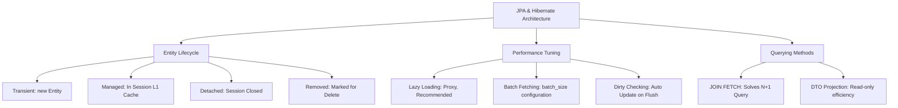

# JPA & Hibernate Persistence Architecture

---

> **Mục tiêu đầu ra:** thiết kế entity và repository đúng, tránh N+1/LazyInitializationException và tối ưu truy vấn JPA.

## 1. Khái niệm (Difficulty Breakdown)

### Beginner
Ở mức độ cơ bản:
- **ORM (Object-Relational Mapping)**: Kỹ thuật lập trình giúp bản đồ hóa (mapping) các đối tượng trong ngôn ngữ lập trình hướng đối tượng (như các Java Class) vào các bảng dữ liệu tương ứng trong cơ sở dữ liệu quan hệ (RDBMS).
- **JPA (Jakarta Persistence API)**: Tập hợp các đặc tả (Specification) và giao diện tiêu chuẩn (Interface) do Oracle/Jakarta định nghĩa cho ORM trong Java. JPA chỉ là lý thuyết và không chứa mã thực thi.
- **Hibernate**: Là một thư viện framework cụ thể triển khai (Implementation) các đặc tả của JPA. Nó cung cấp các mã chạy thực tế để tương tác với cơ sở dữ liệu.

### Intermediate
Đi sâu vào cơ chế quản lý trạng thái của Hibernate:
- **Persistence Context (Ngữ cảnh bền vững)**: Đóng vai trò như một bộ nhớ đệm cấp 1 (First-level Cache), quản lý tất cả các đối tượng Entity đang hoạt động trong phiên làm việc hiện tại (**EntityManager** hoặc **Session**).
- **Entity Lifecycle States**: Một thực thể có thể nằm trong 4 trạng thái:
  1. **Transient**: Đối tượng mới được tạo bằng từ khóa `new`, chưa có ID, chưa liên kết với Persistence Context và chưa có dòng tương ứng dưới DB.
  2. **Managed**: Đối tượng đang nằm trong sự quản lý của Persistence Context. Mọi thay đổi thuộc tính trên đối tượng này sẽ được tự động đồng bộ xuống DB khi kết thúc phiên.
  3. **Detached**: Đối tượng từng ở trạng thái Managed nhưng Persistence Context đã bị đóng lại hoặc thực hiện `clear()`. Thay đổi thuộc tính sẽ không tự cập nhật xuống DB nữa.
  4. **Removed**: Đối tượng được đánh dấu để xóa khỏi DB thông qua lệnh `remove()`.
- **Fetch Types**:
  - `LAZY`: Trì hoãn việc tải dữ liệu liên quan từ DB cho đến khi thực sự gọi getter (Sử dụng Hibernate Proxy).
  - `EAGER`: Tự động tải tất cả dữ liệu liên quan ngay lập tức bằng câu lệnh JOIN.

### Advanced
Ở mức độ nâng cao:
- **N+1 Select Problem**: Lỗi kinh điển trong ORM xảy ra khi ta truy vấn một danh sách $N$ đối tượng cha, và đối với mỗi đối tượng cha, Hibernate lại thực hiện thêm 1 câu lệnh truy vấn phụ để lấy dữ liệu con liên quan. Tổng số câu lệnh là $N+1$ câu lệnh SELECT, làm giảm sập hiệu năng DB.
- **Dirty Checking (Kiểm tra thay đổi ngầm)**: Cơ chế mà Hibernate tự động so sánh trạng thái hiện tại của Entity trong Persistence Context với bản chụp trạng thái ban đầu của nó (Snapshot). Nếu phát hiện có sự thay đổi (dirty), Hibernate sẽ tự động sinh câu lệnh `UPDATE` tương ứng khi transaction commit mà không cần gọi hàm `.save()` hoặc `.update()` thủ công.
- **First-level (L1) vs Second-level (L2) Cache**:
  - **L1 Cache**: Mặc định, gắn liền với Session hiện tại. Chỉ hoạt động trong phạm vi 1 transaction duy nhất.
  - **L2 Cache**: Hoạt động xuyên suốt giữa các Session khác nhau, được cấu hình qua các thư viện ngoài như Ehcache hoặc Redis.

### Expert
Ở mức độ tối thượng (Architect):
- **Batch Fetching & Batch Inserts**: Cấu hình `spring.jpa.properties.hibernate.jdbc.batch_size` kết hợp với `@BatchSize` giúp gộp hàng trăm câu lệnh chèn dữ liệu (`INSERT`) hoặc lấy dữ liệu con (`SELECT`) thành một lô (batch) duy nhất để truyền nhận qua mạng tới DB, giảm thiểu tối đa các đợt Network Roundtrips.
- **DynamicUpdate Annotation**: Mặc định, Hibernate luôn cập nhật tất cả các cột của bảng trong câu lệnh `UPDATE` kể cả các cột không thay đổi giá trị. Đánh dấu `@DynamicUpdate` trên Entity giúp Hibernate chỉ sinh ra SQL cho các cột thực sự thay đổi dữ liệu, giảm thiểu chi phí ghi log của Database và tối ưu hóa hiệu năng ghi.
- **HikariCP Connection Pool Optimization**: Thiết lập tối ưu hóa số lượng kết nối tối đa (`maximum-pool-size`) dựa trên công thức thực nghiệm của PostgreSQL: `Pool Size = ((Core CPU * 2) + Số ổ đĩa cứng)`.

---

## 2. Mục đích

Trong các ứng dụng Java Enterprise:
- **Tránh Boilerplate Code**: Loại bỏ hoàn toàn hàng chục nghìn dòng code JDBC thuần bao gồm việc thiết lập connection, chuẩn bị câu lệnh `PreparedStatement`, duyệt qua `ResultSet` và đóng kết nối thủ công.
- **Đảm bảo tính nhất quán dữ liệu qua Persistence Context**: Cơ chế L1 Cache đảm bảo trong cùng một transaction, nếu bạn truy vấn một bản ghi nhiều lần, Hibernate chỉ gọi DB 1 lần duy nhất và trả về cùng một instance đối tượng duy nhất, tránh lỗi bất nhất dữ liệu trong bộ nhớ RAM.
- **Độc lập cơ sở dữ liệu**: Hibernate tự động sinh câu lệnh SQL tương thích với từng loại cơ sở dữ liệu cụ thể (MySQL, PostgreSQL, Oracle) thông qua cấu hình **Dialect**.

---

## 3. Kiến trúc hoạt động

### Vòng đời Thực thể (Entity Lifecycle States)

```text
    new Entity()
         │
         ▼
  +───────────────+        session.evict()         +───────────────+
  |   Transient   | ─────────────────────────────> |   Detached    |
  +───────────────+                                +───────────────+
         │                                                 │
         │ session.save() / persist()                      │ session.merge()
         ▼                                                 ▼
  +───────────────+ <──────────────────────────────────────┘
  |    Managed    | 
  +───────────────+
         │
         │ session.delete() / remove()
         ▼
  +───────────────+
  |    Removed    |
  +───────────────+
```

---

## 4. Ví dụ thực tế

### Tình huống:
Một ứng dụng quản lý lớp học trực tuyến hiển thị danh sách 50 khóa học trên trang chủ kèm theo thông tin tên giảng viên của từng khóa học đó.
Mặc định trong Entity `Course`, mối quan hệ với `Teacher` được cấu hình là:
```java
@ManyToOne(fetch = FetchType.LAZY)
private Teacher teacher;
```
Khi duyệt qua danh sách 50 khóa học để hiển thị tên giảng viên, trang web mất **8 giây** để tải xong. Ghi log Hibernate cho thấy hệ thống thực hiện **51 câu lệnh SQL** gọi về Database.

### Phân tích từ Architect:
Đây là lỗi **N+1 Select Problem**. Câu lệnh SQL đầu tiên lấy ra danh sách 50 khóa học (1 câu lệnh). Sau đó, đối với mỗi khóa học trong vòng lặp, do giảng viên được cấu hình `LAZY` load, Hibernate lại bắn ra 1 câu lệnh SELECT phụ để lấy chi tiết giảng viên đó (50 câu lệnh).

### Giải pháp tối ưu:
Sử dụng kỹ thuật **Entity Graph** hoặc **JOIN FETCH** trong câu truy vấn để ép Hibernate thực hiện câu lệnh `JOIN` lấy toàn bộ thông tin khóa học và giảng viên tương ứng trong **1 câu lệnh duy nhất**:
```java
@Query("SELECT c FROM Course c JOIN FETCH c.teacher")
List<Course> findAllWithTeacher();
```
Thời gian tải trang giảm từ 8 giây xuống còn **0.05 giây** với duy nhất **1 câu truy vấn SQL**.

---

## 5. Code Demo

Dưới đây là một cấu trúc triển khai JPA & Hibernate chuẩn Enterprise cho mối quan hệ **One-to-Many** giữa `Order` (Đơn hàng) và `OrderItem` (Chi tiết đơn hàng), minh họa cách thiết lập mapping hai chiều (Bidirectional Mapping), xử lý Cascade, và cơ chế Batch Fetching.

### 1. Thực thể Order (Thực thể cha):
```java
package com.knowledgebase.database.entity;

import jakarta.persistence.*;
import org.hibernate.annotations.BatchSize;
import org.hibernate.annotations.DynamicUpdate;
import java.util.ArrayList;
import java.util.List;

@Entity
@Table(name = "orders")
@DynamicUpdate // Tối ưu SQL Update
public class Order {

    @Id
    @GeneratedValue(strategy = GenerationType.IDENTITY)
    private Long id;

    private String orderNumber;

    // Thiết lập cascade xóa con khi xóa cha, và orphansRemoval để dọn các item bị ngắt liên kết
    @OneToMany(mappedBy = "order", cascade = CascadeType.ALL, orphanRemoval = true, fetch = FetchType.LAZY)
    @BatchSize(size = 20) // Tối ưu hóa Batch Fetching chống lỗi N+1 khi duyệt danh sách
    private List<OrderItem> items = new ArrayList<>();

    // Constructors, Getters, Setters
    public Order() {}

    // Helper methods duy trì tính đồng bộ của mối quan hệ 2 chiều
    public void addItem(OrderItem item) {
        items.add(item);
        item.setOrder(this);
    }

    public void removeItem(OrderItem item) {
        items.remove(item);
        item.setOrder(null);
    }

    public Long getId() { return id; }
    public String getOrderNumber() { return orderNumber; }
    public void setOrderNumber(String orderNumber) { this.orderNumber = orderNumber; }
    public List<OrderItem> getItems() { return items; }
}
```

### 2. Thực thể OrderItem (Thực thể con):
```java
package com.knowledgebase.database.entity;

import jakarta.persistence.*;

@Entity
@Table(name = "order_items")
public class OrderItem {

    @Id
    @GeneratedValue(strategy = GenerationType.IDENTITY)
    private Long id;

    private String productName;

    private Double price;

    @ManyToOne(fetch = FetchType.LAZY) // Bắt buộc dùng LAZY
    @JoinColumn(name = "order_id")
    private Order order;

    // Constructors, Getters, Setters
    public OrderItem() {}

    public OrderItem(String productName, Double price) {
        this.productName = productName;
        this.price = price;
    }

    public Long getId() { return id; }
    public String getProductName() { return productName; }
    public Double getPrice() { return price; }
    public Order getOrder() { return order; }
    public void setOrder(Order order) { this.order = order; }
}
```

---

## 6. Best Practices

1. **Luôn sử dụng `FetchType.LAZY` làm mặc định**: Không bao giờ sử dụng `EAGER` cho `@OneToMany` hoặc `@ManyToMany` vì nó tự động tải dữ liệu con liên tục lên RAM gây lãng phí bộ nhớ và chậm hệ thống. Đối với các quan hệ `@ManyToOne`, JPA mặc định là `EAGER`, hãy đổi cấu hình thủ công sang `LAZY`.
2. **Thiết lập Helper Methods cho quan hệ 2 chiều (Bidirectional Mapping)**: Luôn viết các hàm hỗ trợ như `addItem()` và `removeItem()` trong lớp cha để tự động cập nhật cả hai phía của mối quan hệ trong bộ nhớ RAM, tránh lỗi bất nhất dữ liệu khi chạy test.
3. **Cấu hình HikariCP Pool Size tối ưu**: Không đặt size quá lớn làm quá tải luồng xử lý của DB. Hãy bật cơ chế dò rỉ kết nối (`leak-detection-threshold`) để cảnh báo khi có transaction giữ connection quá lâu.
4. **Sử dụng DTO Projection cho các câu truy vấn chỉ đọc**: Nếu bạn chỉ cần đọc dữ liệu hiển thị lên UI mà không cần sửa đổi, hãy dùng JPQL Constructor hoặc Spring Data Interface Projection để đọc trực tiếp dữ liệu dạng DTO thay vì thực thể Managed Entity để loại bỏ chi phí kiểm tra thay đổi (Dirty Checking) của Hibernate.
5. **Cấu hình `batch_size` toàn cục**: Thiết lập `spring.jpa.properties.hibernate.default_batch_fetch_size=20` trong file cấu hình để tự động sửa lỗi N+1 ở hầu hết các mối quan hệ lười (Lazy Relationships) khi duyệt danh sách.

---

## 7. Common Mistakes (Anti-patterns)

### 1. Viết mã gọi `.save()` trong vòng lặp liên tục
- **Anti-pattern**:
  ```java
  for (User user : users) {
      userRepository.save(user); // Gọi save liên tục
  }
  ```
- **Hệ quả**: Hibernate phải mở transaction và sinh câu lệnh SQL cập nhật từng thực thể đơn lẻ, tốn chi phí giao tiếp mạng liên tục.
- **Khắc phục**: Gom danh sách lại và gọi `userRepository.saveAll(users)` kết hợp bật cấu hình JDBC Batching.

### 2. Gọi hàm Getter của Lazy Relationship ngoài phạm vi Session (Transaction)
Gọi getter của một đối tượng con được đánh dấu `LAZY` sau khi Session JPA đã đóng (ở tầng Controller hoặc DTO Mapper không có `@Transactional`) sẽ ném ra lỗi kinh điển: `org.hibernate.LazyInitializationException`.

---

## 8. Interview Questions

#### Q1: JPA và Hibernate khác nhau như thế nào?
* **Đáp án**: JPA là một bộ tài liệu đặc tả tiêu chuẩn (Specification), định nghĩa các API, luật lệ và annotation để map đối tượng sang database. Hibernate là framework triển khai thực tế (Implementation) của JPA. Hibernate hiện thực hóa tất cả các hàm của JPA và bổ sung các tính năng nâng cao độc quyền (như caching nâng cao, batch fetching tự động).

#### Q2: Trình bày sự khác biệt giữa 4 trạng thái vòng đời Entity trong Hibernate?
* **Đáp án**:
  - `Transient`: Thực thể vừa tạo mới bằng `new`, chưa có ID DB, chưa nằm trong Persistence Context.
  - `Managed`: Thực thể đã liên kết với Persistence Context (EntityManager), có ID DB. Thay đổi thuộc tính sẽ tự động cập nhật xuống DB (Dirty Checking).
  - `Detached`: Thực thể từng là Managed nhưng Session đã đóng hoặc gọi `clear()`. Thay đổi thuộc tính không tự động cập nhật xuống DB.
  - `Removed`: Thực thể được đánh dấu để xóa trong Persistence Context, sẽ bị xóa khỏi DB vật lý khi commit transaction.

#### Q3: Lỗi N+1 Query trong JPA là gì? Nêu 3 cách giải quyết lỗi này?
* **Đáp án**: Lỗi N+1 xảy ra khi ta truy vấn danh sách $N$ thực thể cha, và để lấy thực thể con liên quan, Hibernate phải bắn thêm $N$ câu lệnh truy vấn phụ. Cách giải quyết:
  1. Sử dụng **JOIN FETCH** trong câu truy vấn JPQL.
  2. Sử dụng **Entity Graph** (`@EntityGraph`) để chỉ định cấu trúc các thuộc tính cần tải đồng thời.
  3. Cấu hình **Batch Fetching** (`@BatchSize` hoặc `default_batch_fetch_size`) để gộp các câu lệnh SELECT phụ theo lô.

#### Q4: Dirty Checking trong Hibernate hoạt động thế nào?
* **Đáp án**: Khi một thực thể được đưa vào trạng thái **Managed**, Hibernate lưu trữ một bản chụp trạng thái (Snapshot) ban đầu của thực thể đó. Khi transaction chuẩn bị commit (quá trình Flush), Hibernate tự động duyệt qua tất cả các Managed Entities và so sánh các giá trị thuộc tính hiện tại với Snapshot ban đầu. Nếu có sự khác biệt, nó tự động sinh ra câu lệnh SQL `UPDATE` tối ưu để đồng bộ xuống DB mà ta không cần gọi hàm `save()` thủ công.

#### Q5: Sự khác biệt giữa `EntityManager.persist()` và `EntityManager.merge()`?
* **Đáp án**:
  - `persist()`: Đưa một đối tượng ở trạng thái **Transient** trở thành **Managed**. Nó không thực hiện câu lệnh chèn ngay lập tức mà đợi đến lúc Flush. Sẽ báo lỗi nếu đối tượng đã có ID DB.
  - `merge()`: Dùng để đồng bộ một đối tượng ở trạng thái **Detached** trở lại Persistence Context. Hibernate sẽ tìm thực thể tương ứng trong DB bằng ID, tải nó lên trạng thái Managed, sao chép các thay đổi từ đối tượng Detached vào đối tượng Managed này và trả về instance Managed đó.

#### Q6: Tại sao phương thức `equals()` và `hashCode()` lại vô cùng quan trọng khi thiết kế Entity JPA?
* **Đáp án**: Trong JPA, các thực thể đại diện cho các dòng dữ liệu vật lý dưới DB. Khi thực thể di chuyển qua các trạng thái khác nhau (như chuyển sang Detached), Hibernate cần so sánh chúng để quản lý trong các Set (ví dụ trong mối quan hệ One-to-Many). Nếu không định nghĩa đúng `equals()` và `hashCode()` (khuyên dùng ID làm cơ sở so sánh hoặc kết hợp các thuộc tính định danh nghiệp vụ ổn định), Set sẽ coi hai instance của cùng một thực thể là khác nhau, gây lỗi bất nhất hoặc rò rỉ bộ nhớ.

#### Q7: Tại sao ta luôn nên đổi cấu hình mặc định của các mối quan hệ `@ManyToOne` từ EAGER sang LAZY?
* **Đáp án**: Theo đặc tả JPA, `@ManyToOne` và `@OneToOne` mặc định có chế độ tải là `FetchType.EAGER`. Điều này nghĩa là mỗi khi bạn truy vấn thực thể cha, Hibernate sẽ tự động sinh câu lệnh JOIN hoặc SELECT phụ để lấy thực thể con liên quan, bất kể bạn có dùng đến nó hay không. Khi hệ thống lớn, việc này làm lãng phí rất nhiều bộ nhớ RAM và băng thông cơ sở dữ liệu.

#### Q8: Hibernate First-level Cache (Bộ nhớ đệm cấp 1) hoạt động ra sao? Có thể tắt nó đi được không?
* **Đáp án**: First-level Cache là bộ nhớ đệm mặc định gắn liền với vòng đời của một Session (Transaction) hiện tại. Mọi thực thể Managed đều được lưu trữ ở đây. Nếu trong cùng một Session ta gọi truy vấn một thực thể nhiều lần bằng ID, Hibernate sẽ trả về ngay đối tượng trong cache mà không gọi lại DB. **Không thể tắt** First-level Cache vì nó là thành phần cốt lõi để đảm bảo tính nhất quán trong Persistence Context.

#### Q9: Làm thế nào để cấu hình Batch Insert (Chèn dữ liệu theo lô) hiệu quả trong Spring Boot?
* **Đáp án**:
  1. Cấu hình trong file `application.properties`:
     ```properties
     spring.jpa.properties.hibernate.jdbc.batch_size=50
     spring.jpa.properties.hibernate.order_inserts=true
     ```
  2. Bắt buộc khóa chính của Entity **không được sử dụng** chiến lược tự tăng `GenerationType.IDENTITY` (vì Identity yêu cầu database sinh ID ngay lập tức tại thời điểm ghi dòng, làm vô hiệu hóa cơ chế batching). Thay vào đó hãy dùng chiến lược `GenerationType.SEQUENCE` hoặc UUID.

#### Q10: Lỗi `LazyInitializationException` xảy ra khi nào và xử lý ra sao?
* **Đáp án**: Xảy ra khi ta cố gắng truy cập vào một thuộc tính liên kết `LAZY` (ví dụ: `order.getItems()`) sau khi Session quản lý thực thể đó đã bị đóng lại (thường là ngoài phạm vi của `@Transactional`, ví dụ như ở tầng Controller hoặc lúc chuyển đổi sang DTO).
  - Cách xử lý:
    1. Đảm bảo thao tác đọc diễn ra trong block `@Transactional`.
    2. Sử dụng `JOIN FETCH` để tải trước dữ liệu con ở tầng Repository trước khi kết thúc Transaction.

---

## 9. Senior Notes

> [!WARNING]
> **Hiểm họa tiềm ẩn của `@EqualsAndHashCode(callSuper = false)` từ Lombok trên JPA Entity:**
> Khi sử dụng Lombok để tự sinh `equals` và `hashCode` trên Entity, Lombok mặc định sẽ sử dụng tất cả các trường bao gồm cả danh sách các thực thể liên quan (`@OneToMany`). 
> Điều này gây ra hai hiểm họa:
> 1. **Lặp vô hạn (StackOverflowError)**: Nếu bạn có mối quan hệ 2 chiều, gọi `equals` ở cha sẽ gọi `equals` ở con, và con lại gọi cha, làm sập chương trình.
> 2. **Hiệu năng cực kém**: Việc so sánh toàn bộ các trường của danh sách con sẽ kích hoạt Lazy Load tải toàn bộ cơ sở dữ liệu con lên RAM vô ích.
> 
> **Lời khuyên**: Hãy tự viết phương thức `equals` và `hashCode` chỉ dựa trên khóa chính (`id`) hoặc thuộc tính định danh nghiệp vụ bất biến (`businessKey`).

---

## 10. Tài liệu tham khảo

1. [Hibernate User Guide (Official Documentation)](https://hibernate.org/orm/documentation/)
2. [Spring Data JPA Reference Guide](https://docs.spring.io/spring-data/jpa/docs/current/reference/html/)
3. Vlad Mihalcea's Blog: [High-Performance Java Persistence tips](https://vladmihalcea.com/)

---
# PHẦN BỔ TRỢ CHƯƠNG

### ✅ Checklist cần nhớ
- [ ] Phân biệt rõ JPA và Hibernate.
- [ ] Nắm rõ 4 trạng thái vòng đời của một Entity.
- [ ] Không bao giờ sử dụng `FetchType.EAGER` cho các mối quan hệ.
- [ ] Giải quyết được lỗi N+1 Query bằng `JOIN FETCH`.
- [ ] Biết cách thiết lập helper methods cho các mapping hai chiều.
- [ ] Không dùng Lombok `@Data` hoặc `@EqualsAndHashCode` mặc định trên Entity.

### ✅ Mindmap (Mermaid)



### ✅ Cheat Sheet

* **VM Options & Cấu hình kiểm tra SQL sinh ra**:
  ```properties
  spring.jpa.show-sql=true
  spring.jpa.properties.hibernate.format_sql=true
  logging.level.org.hibernate.type.descriptor.sql.BasicBinder=TRACE
  ```
* **Cấu hình tối ưu JDBC Batching**:
  ```properties
  spring.jpa.properties.hibernate.jdbc.batch_size=50
  spring.jpa.properties.hibernate.order_inserts=true
  spring.jpa.properties.hibernate.order_updates=true
  ```

### ✅ Interview Tips

* Khi được yêu cầu giải thích **"Làm thế nào để tối ưu hóa hiệu năng Hibernate?"**, hãy phân loại câu trả lời làm 3 phần rõ ràng:
  1. *Mapping*: Dùng `LAZY` cho tất cả các quan hệ, tránh lạm dụng cascade vô tội vạ.
  2. *Querying*: Sử dụng `JOIN FETCH` để loại bỏ N+1, dùng DTO Projection cho các truy vấn chỉ đọc (Read-only) để bỏ qua Dirty Checking.
  3. *Batching*: Cấu hình `batch_size` toàn cục cho insert/update và fetch size cho select.

### ✅ Mini Project: Enterprise-grade Batch Data Importer

**Yêu cầu**: Xây dựng một service thực hiện chèn dữ liệu (Batch Insert) hàng chục nghìn log giao dịch vào Database sử dụng Spring Data JPA kết hợp cấu hình Sequence Generator và EntityManager để tối ưu hóa bộ nhớ RAM (thực hiện giải phóng Persistence Context định kỳ tránh tràn bộ nhớ).

**Triển khai**:

```java
package com.knowledgebase.database.project;

import jakarta.persistence.EntityManager;
import jakarta.persistence.PersistenceContext;
import org.springframework.stereotype.Service;
import org.springframework.transaction.annotation.Transactional;
import java.util.List;

@Service
public class TransactionBatchImporter {

    @PersistenceContext
    private EntityManager entityManager;

    private static final int BATCH_SIZE = 50;

    @Transactional
    public void importLargeDataset(List<TransactionLog> logs) {
        for (int i = 0; i < logs.size(); i++) {
            entityManager.persist(logs.get(i)); // Đưa thực thể vào trạng thái Managed

            // Mỗi khi đạt số lượng batch size, đồng bộ xuống DB và giải phóng L1 Cache
            if (i > 0 && i % BATCH_SIZE == 0) {
                entityManager.flush(); // Bắn SQL INSERT xuống DB
                entityManager.clear(); // Giải phóng toàn bộ bộ nhớ L1 Cache tránh lỗi OutOfMemory
                System.out.println("Flushed and cleared batch at index: " + i);
            }
        }
        
        // Thực hiện flush nốt số lượng dư còn lại ở cuối danh sách
        entityManager.flush();
        entityManager.clear();
    }
}

// Lớp Entity sử dụng Sequence Generator thay vì Identity để hỗ trợ Batching
@jakarta.persistence.Entity
@jakarta.persistence.Table(name = "transaction_logs")
class TransactionLog {
    @jakarta.persistence.Id
    @jakarta.persistence.GeneratedValue(strategy = jakarta.persistence.GenerationType.SEQUENCE, generator = "log_seq")
    @jakarta.persistence.SequenceGenerator(name = "log_seq", sequenceName = "log_sequence", allocationSize = 50)
    private Long id;

    private String transactionCode;
    private Double amount;

    public TransactionLog() {}
    public TransactionLog(String transactionCode, Double amount) {
        this.transactionCode = transactionCode;
        this.amount = amount;
    }
}
```

---

### ✅ Bài tập thực hành

#### Bài tập 1: Sửa lỗi LazyInitializationException
Đoạn code sau đây thực hiện lấy thông tin hóa đơn và các mặt hàng của hóa đơn đó ở tầng Controller nhưng bị ném ra lỗi `LazyInitializationException`. Hãy giải thích tại sao và sửa lại ở tầng Repository.

```java
@RestController
public class InvoiceController {
    @Autowired private InvoiceRepository invoiceRepository;

    @GetMapping("/invoices/{id}")
    public List<InvoiceItem> getInvoiceItems(@PathVariable Long id) {
        Invoice invoice = invoiceRepository.findById(id).orElseThrow();
        return invoice.getItems(); // Ném ra Exception ở đây vì Session đã đóng
    }
}
```

* **Gợi ý Giải pháp**: Viết một phương thức trong Repository sử dụng `@Query("SELECT i FROM Invoice i JOIN FETCH i.items WHERE i.id = :id")` để lấy trọn vẹn dữ liệu trong transaction.

---

### ✅ References
- [Ref1] High-Performance Java Persistence - Vlad Mihalcea.
- [Ref2] Spring Data JPA spec: [Spring Repository Query Methods](https://docs.spring.io/spring-data/jpa/reference/jpa/query-methods.html)
