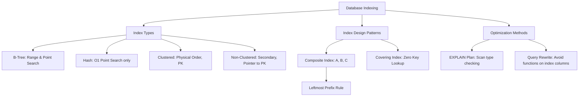

# Indexing & Query Optimization Techniques

---

> **Mục tiêu đầu ra:** đọc được EXPLAIN, chọn index phù hợp và kiểm chứng cải thiện truy vấn bằng số liệu.

## 1. Khái niệm (Difficulty Breakdown)

### Beginner
Ở mức độ cơ bản:
- **Database Index (Chỉ mục)**: Là một cấu trúc dữ liệu đặc biệt được lưu trữ riêng biệt, đóng vai trò như mục lục của một cuốn sách. Nó giúp hệ quản trị cơ sở dữ liệu (DBMS) tìm thấy các dòng dữ liệu cụ thể một cách nhanh chóng mà không cần phải thực hiện quét toàn bộ bảng (Table Scan).
- **Table Scan (Quét toàn bảng - Seq Scan)**: Hành vi database phải đọc từng dòng từ đầu đến cuối bảng để tìm kiếm kết quả. Việc này cực kỳ chậm đối với các bảng có hàng triệu dòng.

### Intermediate
Đi sâu vào cấu trúc dữ liệu chỉ mục:
- **B-Tree Index (Balanced Tree - Cây cân bằng)**: Cấu trúc chỉ mục mặc định và phổ biến nhất. Dữ liệu được tổ chức theo cây tự cân bằng, đảm bảo các thao tác tìm kiếm, thêm, xóa, cập nhật có độ phức tạp thời gian là $O(\log n)$. Thích hợp cho cả tìm kiếm chính xác (`=`) và tìm kiếm dải (`>`, `<`, `BETWEEN`).
- **Hash Index**: Dựa trên cấu trúc bảng băm (Hash Table). Độ phức tạp tìm kiếm cực nhanh $O(1)$ nhưng chỉ hỗ trợ so sánh bằng (`=`), không hỗ trợ tìm kiếm dải hoặc sắp xếp dữ liệu.
- **Clustered Index (Chỉ mục cụm)**: Quy định thứ tự vật lý thực tế của dữ liệu được lưu trữ trên đĩa. Mỗi bảng chỉ có duy nhất **1** Clustered Index (thường là Primary Key).
- **Non-Clustered Index (Chỉ mục thứ cấp)**: Chứa các trường được đánh chỉ mục và một con trỏ trỏ về dòng dữ liệu thực tế (chỉ vào Clustered Index key). Một bảng có thể có nhiều chỉ mục thứ cấp.

### Advanced
Ở mức độ tối ưu hóa nâng cao:
- **Composite Index (Chỉ mục tổ hợp)**: Chỉ mục được tạo từ 2 cột trở lên (ví dụ: `INDEX(status, created_at)`). Cần tuân thủ tuyệt đối quy tắc **Leftmost Prefix Rule (Quy tắc tiền tố bên trái nhất)**: Chỉ mục chỉ được sử dụng nếu truy vấn tìm kiếm lọc theo cột đầu tiên của chỉ mục tổ hợp.
- **Covering Index (Chỉ mục bao phủ)**: Tình huống tối ưu nhất khi tất cả các cột cần lấy dữ liệu trong câu lệnh `SELECT` đều nằm gọn trong cấu trúc của chính chỉ mục đó. Database chỉ cần đọc file chỉ mục và trả về kết quả ngay lập tức mà không cần tốn chi phí truy cập ngược về bộ nhớ đĩa chính để lấy dòng dữ liệu (loại bỏ bước **Key Lookup** hoặc **Bookmark Lookup**).
- **EXPLAIN Plan (Kế hoạch thực thi)**: Câu lệnh tiền tố giúp phân tích cách Optimizer của DB thực hiện câu lệnh SQL (sử dụng Index nào, thứ tự kết hợp các bảng, số lượng dòng dự kiến quét).

### Expert
Ở mức độ tối thượng (Architect):
- **Database Partitioning (Phân vùng)**: Chia một bảng khổng lồ thành các phần nhỏ hơn về mặt vật lý (ví dụ: chia theo tháng `partition by range(created_at)`) nhưng vẫn giữ nguyên một bảng logic duy nhất đối với ứng dụng. Giúp thu hẹp phạm vi quét dữ liệu (Partition Pruning).
- **Sharding (Phân mảnh theo chiều ngang)**: Giải pháp mở rộng hệ thống bằng cách phân chia dữ liệu của một bảng lớn ra nhiều Database Instance độc lập nằm trên các server vật lý khác nhau dựa trên một **Shard Key**.
- **Read-Write Splitting (Tách biệt Đọc-Ghi)**: Cấu hình một database Master chuyên ghi dữ liệu, đồng bộ bất đồng bộ sang nhiều database Slaves chuyên đọc dữ liệu để giảm tải hệ thống.

---

## 2. Mục đích

Trong vận hành doanh nghiệp:
- **Đảm bảo tính sẵn sàng cao của dịch vụ (SLA)**: Một câu lệnh SQL không tối ưu chạy mất 10 giây có thể chiếm dụng toàn bộ tài nguyên CPU của database server, dẫn đến nghẽn cổ chai (bottleneck) và làm sập toàn bộ các dịch vụ kết nối tới DB.
- **Tiết kiệm chi phí hạ tầng (Cloud infrastructure costs)**: Thay vì nâng cấp cấu hình RAM/CPU của Database Server lên gói đắt tiền (Vertical Scaling), việc đánh chỉ mục đúng và viết lại câu lệnh SQL tối ưu có thể tăng tốc độ truy vấn lên gấp 100 lần mà không tốn một đồng chi phí phần cứng nào.

---

## 3. Kiến trúc hoạt động

### Sự khác biệt giữa Clustered Index (B-Tree) và Non-Clustered Index Lookup

```text
                  [Query: SELECT name FROM users WHERE id = 15]
                                        │
                                        ▼
                  +───────────────────────────────────────────+
                  |           Clustered Index (id)            |
                  |                (B-Tree)                   |
                  +───────────────────────────────────────────+
                                        │
                                        ▼ (Direct match to leaf node)
                  +───────────────────────────────────────────+
                  |        Leaf Node (Contains Row Data)       |
                  |     [id=15 | name="Huy" | age=35 ...]     |
                  +───────────────────────────────────────────+

              [Query: SELECT name FROM users WHERE email = "a@b.com"]
                                        │
                                        ▼
                  +───────────────────────────────────────────+
                  |       Non-Clustered Index (email)         |
                  +───────────────────────────────────────────+
                                        │
                                        ▼ (Finds pointer/Primary Key value)
                  +───────────────────────────────────────────+
                  |         Leaf Node (Contains: id=15)       |
                  +───────────────────────────────────────────+
                                        │
                                        ▼ (Key Lookup / Bookmark Lookup)
                  +───────────────────────────────────────────+
                  |           Clustered Index (id)            |
                  +───────────────────────────────────────────+
                                        │
                                        ▼
                  +───────────────────────────────────────────+
                  |             Row Data ("Huy")              |
                  +───────────────────────────────────────────+
```

---

## 4. Ví dụ thực tế

### Tình huống:
Một hệ thống quản lý lịch sử đơn hàng E-commerce chứa bảng `orders` có 50 triệu dòng dữ liệu. 
Trang quản trị (Admin Dashboard) có chức năng tải danh sách các đơn hàng đã thanh toán thành công trong ngày hôm nay để đóng gói, câu lệnh SQL chạy như sau:
```sql
SELECT id, customer_id, total_amount, created_at 
FROM orders 
WHERE status = 'SUCCESS' AND created_at >= '2026-08-07 00:00:00';
```
Hệ thống chạy mất **45 giây** cho mỗi lần tải trang, khiến các nhân viên kho không thể làm việc và CPU database liên tục chạm ngưỡng 100%.

### Phân tích từ Architect bằng `EXPLAIN`:
Khi chạy `EXPLAIN SELECT ...`, kết quả trả về:
- `type`: `ALL` (Table Scan - quét toàn bộ 50 triệu dòng).
- `rows`: `49,500,000` (Quét gần như hết bảng).
Lý do: Đã có chỉ mục đơn lẻ trên cột `status` và cột `created_at`, nhưng Optimizer của MySQL đánh giá độ chọn lọc của chỉ mục đơn lẻ kém và quyết định quét toàn bảng.

### Giải pháp tối ưu:
1. Tạo một **Composite Index (Chỉ mục tổ hợp)** bao gồm cả hai trường theo đúng thứ tự lọc:
   ```sql
   CREATE INDEX idx_status_created ON orders (status, created_at);
   ```
2. Chạy lại `EXPLAIN`:
   - `type`: `range` (Quét dải chỉ mục).
   - `key`: `idx_status_created` (Sử dụng chỉ mục vừa tạo).
   - `rows`: `12,500` (Chỉ cần quét 12,500 dòng thay vì 50 triệu).
3. Thời gian truy vấn giảm từ 45 giây xuống còn **0.02 giây**.

---

## 5. Code Demo

Dưới đây là một cấu trúc dự án mẫu mô tả việc áp dụng chỉ mục và cách viết các câu lệnh truy vấn tối ưu trong tệp XML của MyBatis hoặc viết Native Query trong Spring Data JPA.

### Mã nguồn Spring Data JPA Repository với Native Query tối ưu:
```java
package com.knowledgebase.database.repository;

import com.knowledgebase.database.entity.Order;
import org.springframework.data.jpa.repository.JpaRepository;
import org.springframework.data.jpa.repository.Query;
import org.springframework.data.repository.query.Param;
import org.springframework.stereotype.Repository;
import java.time.LocalDateTime;
import java.util.List;

@Repository
public interface OrderOptimizationRepository extends JpaRepository<Order, Long> {

    /**
     * TỐI ƯU HÓA CAO: Truy vấn sử dụng Covering Index.
     * Chỉ SELECT đúng các trường có sẵn trong Composite Index (id, status, createdAt)
     * mà không dùng SELECT * để loại bỏ chi phí Key Lookup về đĩa.
     */
    @Query(value = "SELECT o.id, o.status, o.createdAt FROM Order o " +
                   "WHERE o.status = :status AND o.createdAt >= :startDate")
    List<Object[]> findMinimalOrdersByStatusAndDate(
            @Param("status") String status, 
            @Param("startDate") LocalDateTime startDate
    );
}
```

---

## 6. Best Practices

1. **Tuân thủ quy tắc Leftmost Prefix**: Khi thiết kế chỉ mục tổ hợp `INDEX(A, B, C)`, hãy đặt các cột có tần suất xuất hiện nhiều nhất trong mệnh đề `WHERE` lên bên trái nhất (A). Truy vấn lọc theo `WHERE B = 1` hoặc `WHERE C = 2` sẽ không sử dụng được chỉ mục này.
2. **Loại bỏ Index dư thừa**: Tránh tạo quá nhiều Index trên một bảng. Mỗi khi có thao tác `INSERT`, `UPDATE`, `DELETE`, Database phải tốn tài nguyên cập nhật lại tất cả các cây chỉ mục liên quan, làm giảm tốc độ ghi.
3. **Tránh bọc hàm (Functions) ngoài cột chỉ mục**:
   - **Anti-pattern**: `WHERE YEAR(created_at) = 2026` (Làm vô hiệu hóa Index trên cột `created_at`).
   - **Khắc phục**: `WHERE created_at >= '2026-01-01' AND created_at <= '2026-12-31'`.
4. **Không dùng Wildcard `%` ở đầu trong `LIKE`**:
   - **Anti-pattern**: `WHERE email LIKE '%gmail.com'` (Gây Table Scan vì database không biết bắt đầu tìm từ đâu trên cây chỉ mục B-Tree).
   - **Khắc phục**: `WHERE email LIKE 'huy.arch%'` (Sử dụng được Index).
5. **Chọn kiểu dữ liệu nhỏ gọn làm Khóa chính**: Sử dụng kiểu dữ liệu số nguyên tự tăng (`BIGINT`) hoặc UUID v7 (hỗ trợ sắp xếp theo thời gian) làm Primary Key thay vì các chuỗi ngẫu nhiên (UUID v4) để tránh hiện tượng phân mảnh đĩa (Page Splits) trên cây Clustered Index của InnoDB.

---

## 7. Common Mistakes (Anti-patterns)

### 1. Quên không kiểm tra tính chọn lọc (Selectivity) của Index
- **Anti-pattern**: Đánh chỉ mục đơn lẻ trên cột `gender` (chỉ có 2 giá trị Male/Female).
- **Hệ quả**: Độ chọn lọc của cột này cực kỳ thấp (~50% dữ liệu giống nhau). Optimizer của DB sẽ từ chối sử dụng Index này và chuyển sang quét toàn bảng vì chi phí đọc file Index + Key Lookup còn đắt hơn quét trực tiếp.

### 2. Viết câu lệnh `SELECT *` trong ứng dụng sản xuất
Viết `SELECT *` lấy ra hàng chục trường dữ liệu thừa (bao gồm cả các trường TEXT, BLOB dung lượng lớn) làm vô hiệu hóa cơ chế Covering Index và tăng băng thông truyền tải mạng không cần thiết.

---

## 8. Interview Questions

#### Q1: Sự khác biệt bản chất giữa Clustered Index và Non-Clustered Index?
* **Đáp án**:
  - `Clustered Index`: Xác định thứ tự sắp xếp vật lý thực tế của dữ liệu trên ổ đĩa đệm. Node lá của cây chứa toàn bộ dữ liệu của dòng. Chỉ có 1 Clustered Index duy nhất trên 1 bảng.
  - `Non-Clustered Index`: Không thay đổi thứ tự vật lý của bảng. Node lá chỉ chứa khóa chỉ mục và con trỏ (thường là Primary Key value) trỏ về bản ghi trong Clustered Index. Có thể tạo nhiều Non-Clustered Index trên bảng.

#### Q2: Trình bày quy tắc Leftmost Prefix (Quy tắc tiền tố trái) trong Composite Index?
* **Đáp án**: Quy tắc này quy định rằng một Composite Index trên các cột `(A, B, C)` chỉ có thể được sử dụng bởi Optimizer nếu truy vấn lọc theo các tiền tố bên trái nhất. Cụ thể:
  - Lọc theo `(A)`, `(A, B)`, `(A, B, C)` -> Có sử dụng Index.
  - Lọc theo `(B)` hoặc `(C)` hoặc `(B, C)` -> Không sử dụng Index (Table Scan).

#### Q3: Covering Index là gì? Tại sao nó giúp tăng tốc truy vấn tối đa?
* **Đáp án**: Covering Index là chỉ mục chứa tất cả các cột dữ liệu được yêu cầu trong câu lệnh `SELECT`, `WHERE`, `ORDER BY` và `GROUP BY`. Khi truy vấn, database engine lấy được toàn bộ dữ liệu cần thiết ngay trên file chỉ mục mà không cần thực hiện bước **Key Lookup** truy cập về đĩa để đọc dòng dữ liệu thực tế, giảm thiểu tối đa các thao tác I/O đĩa.

#### Q4: Làm thế nào để phân tích một câu lệnh SQL chạy chậm?
* **Đáp án**: 
  1. Kích hoạt **Slow Query Log** của Database để thu thập các câu lệnh chạy vượt ngưỡng thời gian cho phép (ví dụ: > 1 giây).
  2. Sử dụng câu lệnh tiền tố `EXPLAIN` hoặc `EXPLAIN ANALYZE` (trong MySQL/PostgreSQL) trước câu lệnh SQL đó.
  3. Phân tích kế hoạch thực thi: Kiểm tra cột `type` (tìm kiếm các giá trị nguy hiểm như `ALL` - Table Scan, `index` - Index Scan), cột `key` (xem chỉ mục nào được dùng) và cột `rows` (số dòng phải quét).

#### Q5: Sự khác biệt giữa Database Partitioning và Sharding?
* **Đáp án**:
  - `Partitioning` (Phân vùng): Chia dữ liệu của một bảng lớn thành các phân vùng vật lý độc lập nhưng vẫn nằm trên **cùng một máy chủ** Database duy nhất. Ứng dụng vẫn nhìn thấy một bảng duy nhất.
  - `Sharding` (Phân mảnh ngang): Chia dữ liệu của một bảng ra nhiều **máy chủ database khác nhau vật lý**. Ứng dụng phải tự định tuyến truy vấn tới đúng máy chủ chứa dữ liệu thông qua Shard Key.

#### Q6: Tại sao đánh chỉ mục giúp tăng tốc độ ĐỌC nhưng lại làm giảm tốc độ GHI (`INSERT`, `UPDATE`, `DELETE`)?
* **Đáp án**: Vì khi dữ liệu trên bảng thay đổi (ví dụ chèn dòng mới), database engine không chỉ ghi dữ liệu vào bảng chính mà phải tìm vị trí thích hợp trên cây B-Tree của **tất cả** các chỉ mục đã đánh trên bảng đó để chèn node mới và thực hiện tự cân bằng cây. Càng nhiều chỉ mục, chi phí cập nhật này càng lớn.

#### Q7: Khi nào Database Optimizer từ chối sử dụng một Index dù ta đã đánh Index trên trường đó?
* **Đáp án**: Optimizer sẽ từ chối dùng Index trong các trường hợp:
  1. Độ chọn lọc (Selectivity) của trường quá thấp (ví dụ: trường phái tính, trạng thái nhị phân).
  2. Bảng quá nhỏ (dưới vài trăm dòng), việc quét toàn bảng nhanh hơn đọc file chỉ mục.
  3. Có các hàm hoặc phép toán bao bọc ngoài cột chỉ mục trong mệnh đề `WHERE` (ví dụ: `WHERE UPPER(name) = 'HUY'`).
  4. Sử dụng toán tử so sánh phủ định (`!=`, `NOT IN`).

#### Q8: UUID v4 (Ngẫu nhiên) ảnh hưởng thế nào đến hiệu năng của chỉ mục Clustered Index trong MySQL InnoDB?
* **Đáp án**: InnoDB lưu dữ liệu vật lý theo thứ tự của Clustered Index (thường là Primary Key). UUID v4 là chuỗi ngẫu nhiên không có tính thứ tự. Khi chèn liên tục các dòng có UUID v4 ngẫu nhiên, database phải chèn node mới vào các vị trí ngẫu nhiên ở giữa cây B-Tree. Việc này gây ra hiện tượng **Page Splits** (phân tách trang đĩa vật lý liên tục), làm phân mảnh đĩa nghiêm trọng và giảm tốc độ ghi dữ liệu đáng kể. Giải pháp là dùng UUID v7 (Time-based sequential UUID) hoặc BigInt tự tăng.

#### Q9: Phân biệt cơ chế quét `Index Scan` và `Index Seek` trong Explain Plan?
* **Đáp án**:
  - `Index Scan` (hoặc Full Index Scan): Database quét qua **toàn bộ** các node trên cây chỉ mục. Nhanh hơn Table Scan một chút vì file chỉ mục nhỏ hơn file bảng, nhưng vẫn là dấu hiệu cần tối ưu.
  - `Index Seek` (hoặc Range Scan): Database sử dụng cấu trúc cây B-Tree để đi thẳng từ root node xuống leaf node chứa giá trị cần tìm (hoặc quét một dải hẹp), cực kỳ nhanh và tối ưu.

#### Q10: Index Covering có giải quyết được bài toán phân trang sâu (`OFFSET 1000000 LIMIT 10`) không?
* **Đáp án**: Bản chất `LIMIT 10 OFFSET 1000000` bắt database vẫn phải quét qua 1,000,010 dòng đầu tiên rồi bỏ đi 1,000,000 dòng. Ta giải quyết bằng kỹ thuật **Deferred Join**: Dùng Index Covering để truy vấn lấy ra nhanh 10 cái IDs trước, sau đó mới `JOIN` ngược lại bảng chính để lấy đầy đủ chi tiết của 10 dòng đó, tránh việc Key Lookup cho cả 1,000,000 dòng bị bỏ đi.

---

## 9. Senior Notes

> [!IMPORTANT]
> **Kinh nghiệm thực chiến của Database Architect:**
> 1. **Cảnh giác với Implicit Type Conversion (Tự động ép kiểu ngầm)**:
>    Nếu cột `phone` được định nghĩa kiểu `VARCHAR` nhưng trong câu lệnh truy vấn bạn viết: `WHERE phone = 0987654321` (Số nguyên không có nháy đơn). MySQL sẽ tự động ép kiểu toàn bộ giá trị cột `phone` từ chuỗi sang số nguyên để so sánh. Việc ép kiểu ngầm này làm vô hiệu hóa hoàn toàn Index trên cột `phone`, gây Table Scan chết người. Luôn viết đúng kiểu dữ liệu: `WHERE phone = '0987654321'`.
> 2. **Sử dụng Index Hints khi cần thiết**: Đôi khi Optimizer của DB đưa ra kế hoạch thực thi sai lầm. Bạn có thể sử dụng `FORCE INDEX (index_name)` để ép buộc database sử dụng đúng chỉ mục bạn muốn.

---

## 10. Tài liệu tham khảo

1. [MySQL High Performance Guide: Indexing](https://dev.mysql.com/doc/index.html)
2. [Use The Index, Luke! - Guide to Database Indexing for Developers](https://use-the-index-luke.com/)
3. Sách: *High Performance MySQL (4th Edition)* - Silvia Botros.

---
# PHẦN BỔ TRỢ CHƯƠNG

### ✅ Checklist cần nhớ
- [ ] Phân biệt được sự khác nhau giữa B-Tree Index và Hash Index.
- [ ] Nắm rõ cơ chế hoạt động của Clustered và Non-Clustered Index.
- [ ] Tuân thủ quy tắc Leftmost Prefix cho mọi chỉ mục tổ hợp.
- [ ] Luôn sử dụng `EXPLAIN` để kiểm tra kế hoạch thực thi của các câu lệnh SQL chính.
- [ ] Tránh viết `SELECT *` trong code dự án sản xuất.
- [ ] Đảm bảo kiểu dữ liệu trong mệnh đề `WHERE` khớp hoàn toàn với định nghĩa cột để tránh ép kiểu ngầm.

### ✅ Mindmap (Mermaid)



### ✅ Cheat Sheet

* **Lệnh phân tích câu lệnh SQL trong MySQL**:
  ```sql
  EXPLAIN FORMAT=JSON SELECT * FROM users WHERE status = 'ACTIVE';
  ```
* **Kế hoạch thực thi tốt nhất đến kém nhất (Cột `type` của EXPLAIN)**:
  `system` -> `const` (khóa chính/duy nhất) -> `eq_ref` -> `ref` -> `range` (quét dải index) -> `index` (quét toàn bộ index) -> `ALL` (Table Scan - CẦN TRÁNH).
* **Viết lại câu lệnh SQL tránh bọc hàm**:
  - Không tốt: `SELECT * FROM log WHERE SUBSTR(code, 1, 3) = 'ERR';`
  - Tốt: `SELECT * FROM log WHERE code LIKE 'ERR%';`

### ✅ Interview Tips

* Khi được hỏi **"Làm thế nào để tối ưu một câu truy vấn phân trang sâu ở trang thứ 10,000?"**, hãy trả lời bằng giải pháp **Deferred Join**: *"Thay vì gọi trực tiếp `LIMIT 10 OFFSET 100000`, ta viết câu lệnh con chỉ `SELECT id` kết hợp `LIMIT 10 OFFSET 100000` (được tối ưu nhờ Covering Index), sau đó JOIN kết quả ID này ngược lại bảng chính để lấy chi tiết. Hoặc tốt hơn, chuyển sang cơ chế Keyset Pagination (Cursor-based pagination) dùng `WHERE id > last_seen_id LIMIT 10` để đạt tốc độ không đổi $O(1)$ ở mọi trang."*

### ✅ Mini Project: Query Optimizer Simulation with Java

**Yêu cầu**: Mô phỏng thuật toán tìm kiếm trên cây B-Tree Index đơn giản bằng Java để minh họa tốc độ vượt trội của việc tìm kiếm theo chỉ mục so với việc quét tuyến tính toàn bộ danh sách (Table Scan).

**Triển khai**:

```java
package com.knowledgebase.database.project;

import java.util.Arrays;

public class IndexSeekSimulator {

    // Giả lập bảng dữ liệu vật lý (Đã sắp xếp theo Primary Key)
    static class Row {
        int id;
        String name;
        Row(int id, String name) { this.id = id; this.name = name; }
    }

    private final Row[] tableData;
    private final int[] indexTree; // Chỉ mục B-Tree (Trong ví dụ đơn giản này dùng mảng Id đã sorted)

    public IndexSeekSimulator(int size) {
        tableData = new Row[size];
        indexTree = new int[size];
        for (int i = 0; i < size; i++) {
            tableData[i] = new Row(i * 2, "User_" + i);
            indexTree[i] = i * 2; // Index lưu trữ cặp (Key, RowPointer)
        }
    }

    // Giả lập Table Scan (Quét tuần tự) - Độ phức tạp O(N)
    public Row seqScan(int targetId) {
        int steps = 0;
        for (Row row : tableData) {
            steps++;
            if (row.id == targetId) {
                System.out.println("Seq Scan Steps: " + steps);
                return row;
            }
        }
        System.out.println("Seq Scan Steps (Not Found): " + steps);
        return null;
    }

    // Giả lập Index Seek (Tìm kiếm nhị phân trên cây Index) - Độ phức tạp O(log N)
    public Row indexSeek(int targetId) {
        int steps = 0;
        int low = 0;
        int high = indexTree.length - 1;

        while (low <= high) {
            steps++;
            int mid = (low + high) >>> 1;
            int midVal = indexTree[mid];

            if (midVal < targetId) {
                low = mid + 1;
            } else if (midVal > targetId) {
                high = mid - 1;
            } else {
                System.out.println("Index Seek Steps: " + steps);
                return tableData[mid]; // Trỏ trực tiếp về dữ liệu dòng
            }
        }
        System.out.println("Index Seek Steps (Not Found): " + steps);
        return null;
    }

    public static void main(String[] args) {
        IndexSeekSimulator simulator = new IndexSeekSimulator(100_000);
        int target = 88_888;

        System.out.println("--- Searching Target: " + target + " ---");
        simulator.seqScan(target);
        simulator.indexSeek(target);
    }
}
```

---

### ✅ Bài tập thực hành

#### Bài tập 1: Phân tích Leftmost Prefix Rule
Cho Composite Index `idx_a_b_c (a, b, c)` trên bảng `sample`. Những câu lệnh truy vấn nào dưới đây sẽ sử dụng được chỉ mục này? Giải thích tại sao.
1. `SELECT * FROM sample WHERE a = 1 AND b = 2;`
2. `SELECT * FROM sample WHERE b = 2 AND c = 3;`
3. `SELECT * FROM sample WHERE c = 3 AND a = 1;`
4. `SELECT * FROM sample WHERE b = 2;`

* **Gợi ý Giải pháp**:
  - Truy vấn 1: Sử dụng tốt (khớp tiền tố `a, b`).
  - Truy vấn 2: Không sử dụng (thiếu cột đầu tiên `a`).
  - Truy vấn 3: Có sử dụng (Optimizer tự động sắp xếp lại thứ tự điều kiện thành `a = 1 AND c = 3`, sử dụng phần chỉ mục của `a`).
  - Truy vấn 4: Không sử dụng (thiếu `a`).

#### Bài tập 2: Tối ưu hóa truy vấn có hàm
Hãy viết lại câu lệnh SQL sau để nó có thể sử dụng chỉ mục đã đánh trên cột `updated_at`:
```sql
SELECT id, message FROM notifications WHERE DATE_ADD(updated_at, INTERVAL 7 DAY) >= NOW();
```
* **Gợi ý Giải pháp**: Chuyển phép toán cộng ngày sang vế phải: `WHERE updated_at >= DATE_SUB(NOW(), INTERVAL 7 DAY)`.

---

### ✅ References
- [Ref1] High Performance MySQL, 4th Edition (O'Reilly).
- [Ref2] PostgreSQL Index Types official docs: [PostgreSQL Indexing](https://www.postgresql.org/docs/current/indexes-types.html)
