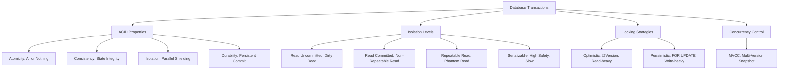

# Transactions, Isolation Levels & Locking Strategies

---

## 1. Khái niệm (Difficulty Breakdown)

### # Beginner
Ở mức độ cơ bản, một **Transaction (Giao dịch)** là một chuỗi các thao tác trên database được xử lý như một đơn vị công việc duy nhất. Có nghĩa là, hoặc tất cả các thao tác thành công (**Commit**), hoặc không có thao tác nào được áp dụng (**Rollback**).

Transaction được định nghĩa bởi thuộc tính **ACID**:
- **A (Atomicity - Tính nguyên tử)**: Thành công tất cả hoặc thất bại tất cả.
- **C (Consistency - Tính nhất quán)**: Database chuyển từ trạng thái hợp lệ này sang trạng thái hợp lệ khác.
- **I (Isolation - Tính cô lập)**: Các transaction chạy song song không can thiệp lẫn nhau.
- **D (Durability - Tính bền vững)**: Dữ liệu đã commit sẽ được lưu trữ vĩnh viễn, kể cả khi mất điện hay sập hệ thống.

### # Intermediate
Để giải quyết bài toán Isolation khi nhiều luồng cùng truy cập dữ liệu, chuẩn SQL-92 định nghĩa 4 cấp độ cô lập (**Isolation Levels**):
1. **Read Uncommitted**: Cho phép đọc dữ liệu chưa được commit của transaction khác. Gây ra hiện tượng **Dirty Read** (đọc phải dữ liệu rác sau đó bị rollback).
2. **Read Committed**: Chỉ đọc dữ liệu đã commit. Tránh được *Dirty Read*, nhưng vẫn bị **Non-repeatable Read** (đọc lại cùng một bản ghi tại các thời điểm khác nhau trong cùng transaction cho ra kết quả khác nhau do transaction khác sửa đổi).
3. **Repeatable Read**: Đảm bảo đọc cùng một bản ghi nhiều lần trong transaction sẽ luôn ra kết quả giống nhau. Tránh được *Non-repeatable Read*, nhưng có thể bị **Phantom Read** (đọc lại một dải dữ liệu thấy xuất hiện thêm hàng mới do transaction khác chèn thêm). Mức cô lập mặc định của MySQL (InnoDB).
4. **Serializable**: Cấp độ cao nhất, ép các transaction chạy tuần tự. Tránh toàn bộ lỗi nhưng hiệu năng cực kỳ kém.

### # Advanced
Ở mức độ nâng cao, ta nghiên cứu các chiến lược khóa (**Locking Strategies**):
- **Optimistic Locking (Khóa lạc quan)**: Không khóa dữ liệu khi đọc. Thay vào đó, sử dụng một cột số phiên bản (`version` hoặc `timestamp`). Khi ghi dữ liệu, hệ thống so sánh phiên bản cũ. Nếu phiên bản đã bị thay đổi bởi luồng khác, hệ thống sẽ từ chối và ném ra Exception (ví dụ: `OptimisticLockException`). Thích hợp cho hệ thống Đọc nhiều - Ghi ít.
- **Pessimistic Locking (Khóa bi quan)**: Khóa bản ghi ngay lập tức khi đọc để ngăn luồng khác sửa đổi cho đến khi transaction kết thúc. Sử dụng lệnh `SELECT ... FOR UPDATE` (Khóa độc quyền - Exclusive Lock) hoặc `SELECT ... SHARE` (Khóa chia sẻ - Shared Lock). Thích hợp cho hệ thống Ghi nhiều, tranh chấp cao.
- **Shared Lock (S-Lock)**: Nhiều transaction có thể cùng giữ S-lock để đọc, nhưng không ai được sửa dữ liệu.
- **Exclusive Lock (X-Lock)**: Chỉ một transaction được giữ X-lock để ghi, chặn hoàn toàn mọi hành vi đọc/ghi khác của luồng khác.

### # Expert
Ở mức độ tối thượng (Architect):
- **MVCC (Multi-Version Concurrency Control)**: Cơ chế mà MySQL (InnoDB) và PostgreSQL sử dụng để thực thi cô lập mà không cần lock ngốn tài nguyên. Thay vì ghi đè trực tiếp, mỗi lần update sẽ tạo ra một phiên bản (version) mới của bản ghi. Khi đọc, database dựa trên **Read View** để hiển thị đúng phiên bản dữ liệu tương thích với thời điểm transaction bắt đầu. Nhờ MVCC, hành vi *Đọc không bao giờ chặn Ghi, và Ghi không bao giờ chặn Đọc*.
- **InnoDB Gap Locks & Next-Key Locks**: Trong MySQL, để ngăn chặn hiện tượng *Phantom Read* ở mức cô lập *Repeatable Read*, InnoDB sử dụng **Next-Key Locks** (kết hợp Record Lock trên bản ghi và Gap Lock trên các khoảng trống xung quanh bản ghi đó), ngăn chặn việc chèn bản ghi mới vào dải dữ liệu đang quét.
- **Deadlock Detection**: Hiểu cách hệ quản trị cơ sở dữ liệu phát hiện chu trình khóa (Lock Wait Cycle) và tự động giết (abort) một transaction ít tốn tài nguyên nhất để giải phóng hệ thống.

---

## 2. Mục đích

Trong phát triển phần mềm doanh nghiệp:
- **Đảm bảo tính chính xác của dữ liệu nghiệp vụ nhạy cảm**: Đặc biệt trong các ứng dụng tài chính (Banking, E-commerce), các thao tác trừ tiền tài khoản, trừ số lượng tồn kho (Inventory) bắt buộc phải chạy trong transaction cô lập tốt, tránh lỗi ghi đè dữ liệu (Lost Update).
- **Cân bằng giữa Performance và Data Integrity**: Chọn Isolation Level quá cao (Serializable) sẽ làm nghẽn hệ thống (Connection Pool bị cạn kiệt do chờ khóa). Chọn quá thấp (Read Uncommitted) sẽ dẫn đến lỗi logic nghiệp vụ. Một Architect giỏi phải thiết kế mức cô lập tối ưu cho từng chức năng.

---

## 3. Kiến trúc hoạt động

### Luồng Hoạt Động của MVCC (Multi-Version Concurrency Control)

```text
Time   Transaction 1 (Read Committed)          Transaction 2 (Update)
 │
 │     1. START TRANSACTION
 │     2. SELECT age FROM users WHERE id = 1
 │        (Age = 20, Read View Created)
 │                                             3. START TRANSACTION
 │                                             4. UPDATE users SET age = 25 WHERE id = 1
 │                                                (InnoDB creates new version of row,
 │                                                 old version kept in Undo Log)
 │                                             5. COMMIT
 │     6. SELECT age FROM users WHERE id = 1
 │        (Age = 25 - Read View updated
 │         to see committed changes)
 │     7. COMMIT
 ▼
```

---

## 4. Ví dụ thực tế

### Tình huống:
Một ứng dụng bán vé máy bay trực tuyến gặp hiện tượng: Vào giờ vàng khuyến mãi, 2 khách hàng cùng đặt chiếc vé cuối cùng của chuyến bay cùng một lúc. Do hệ thống chỉ đọc số lượng vé còn trống (`available_seats = 1`) rồi tiến hành trừ số lượng và ghi lại, cả hai khách hàng đều thanh toán thành công, dẫn đến tình trạng **Overbooking** (1 ghế bán cho 2 người).

### Giải pháp của Architect:
1. Sử dụng **Pessimistic Lock** bằng cách thay đổi câu lệnh check số ghế trống thành:
   ```sql
   SELECT available_seats FROM flights WHERE id = 101 FOR UPDATE;
   ```
2. Khi khách hàng A gọi câu lệnh này, database sẽ khóa bản ghi chuyến bay 101 (Exclusive Lock). Khách hàng B gọi câu lệnh tương tự sẽ phải xếp hàng đợi cho đến khi Transaction của A hoàn tất (đã mua vé thành công và `available_seats` giảm về 0).
3. Khách hàng B sau khi hết chờ khóa sẽ đọc được `available_seats = 0` và nhận thông báo hết vé hợp lệ.

---

## 5. Code Demo

Dưới đây là một ví dụ minh họa cách triển khai **Optimistic Locking** và **Pessimistic Locking** sử dụng **Spring Data JPA** để xử lý tranh chấp cập nhật số dư tài khoản ngân hàng (Wallet Balance).

### Lớp Entity với Spring Data JPA Optimistic Lock:
```java
package com.knowledgebase.database.entity;

import jakarta.persistence.*;

@Entity
@Table(name = "wallets")
public class Wallet {

    @Id
    @GeneratedValue(strategy = GenerationType.IDENTITY)
    private Long id;

    private String ownerName;

    private Double balance;

    @Version // Kích hoạt cơ chế Optimistic Locking tự động của Hibernate
    private Long version;

    // Constructors, Getters, Setters
    public Wallet() {}

    public Long getId() { return id; }
    public String getOwnerName() { return ownerName; }
    public Double getBalance() { return balance; }
    public Long getVersion() { return version; }

    public void setBalance(Double balance) { this.balance = balance; }
}
```

### Lớp Repository cấu hình Pessimistic Lock:
```java
package com.knowledgebase.database.repository;

import com.knowledgebase.database.entity.Wallet;
import jakarta.persistence.LockModeType;
import org.springframework.data.jpa.repository.JpaRepository;
import org.springframework.data.jpa.repository.Lock;
import org.springframework.data.jpa.repository.Query;
import org.springframework.data.repository.query.Param;
import org.springframework.stereotype.Repository;

import java.util.Optional;

@Repository
public interface WalletRepository extends JpaRepository<Wallet, Long> {

    // Định nghĩa Pessimistic Write Lock (SELECT ... FOR UPDATE)
    @Lock(LockModeType.PESSIMISTIC_WRITE)
    @Query("SELECT w FROM Wallet w WHERE w.id = :id")
    Optional<Wallet> findByIdForUpdate(@Param("id") Long id);
}
```

### Lớp Service xử lý nghiệp vụ Rút tiền:
```java
package com.knowledgebase.database.service;

import com.knowledgebase.database.entity.Wallet;
import com.knowledgebase.database.repository.WalletRepository;
import org.springframework.beans.factory.annotation.Autowired;
import org.springframework.orm.ObjectOptimisticLockingFailureException;
import org.springframework.stereotype.Service;
import org.springframework.transaction.annotation.Transactional;

@Service
public class WalletService {

    @Autowired
    private WalletRepository walletRepository;

    /**
     * Rút tiền sử dụng Khóa Bi Quan (Pessimistic Lock).
     * Thích hợp cho môi trường tranh chấp rất cao.
     */
    @Transactional
    public void withdrawWithPessimisticLock(Long walletId, Double amount) {
        Wallet wallet = walletRepository.findByIdForUpdate(walletId)
                .orElseThrow(() -> new IllegalArgumentException("Wallet not found"));

        if (wallet.getBalance() < amount) {
            throw new IllegalArgumentException("Insufficient funds");
        }

        wallet.setBalance(wallet.getBalance() - amount);
        walletRepository.save(wallet); // Khóa giải phóng khi transaction commit kết thúc hàm
    }

    /**
     * Rút tiền sử dụng Khóa Lạc Quan (Optimistic Lock).
     * Thích hợp cho môi trường tranh chấp thấp/trung bình, tối ưu throughput.
     */
    @Transactional
    public void withdrawWithOptimisticLock(Long walletId, Double amount) {
        Wallet wallet = walletRepository.findById(walletId)
                .orElseThrow(() -> new IllegalArgumentException("Wallet not found"));

        if (wallet.getBalance() < amount) {
            throw new IllegalArgumentException("Insufficient funds");
        }

        wallet.setBalance(wallet.getBalance() - amount);
        
        try {
            walletRepository.save(wallet); 
        } catch (ObjectOptimisticLockingFailureException e) {
            // Khi có luồng khác ghi đè trước đó, version kiểm tra bị lệch và ném Exception
            throw new RuntimeException("Transaction failed due to concurrent modification. Please retry.");
        }
    }
}
```

---

## 6. Best Practices

1. **Giữ Transaction ngắn nhất có thể**: Không thực hiện các tác vụ tốn thời gian như gọi API bên ngoài (Third-party REST API call), đọc ghi file hoặc mã hóa dữ liệu nặng bên trong block `@Transactional`. Điều này giữ kết nối cơ sở dữ liệu lâu, dẫn đến cạn kiệt Connection Pool.
2. **Chọn đúng chiến lược Lock**:
   - Sử dụng **Optimistic Lock** làm mặc định cho hầu hết các chức năng nghiệp vụ thông thường (đặc biệt khi tỉ lệ đọc/ghi là 90/10).
   - Sử dụng **Pessimistic Lock** cho các nghiệp vụ cực kỳ nhạy cảm liên quan tới tiền bạc hoặc tài nguyên giới hạn cần tính chính xác tuyệt đối ngay tại thời điểm thao tác.
3. **Luôn đánh chỉ mục (Index) trên các cột làm điều kiện của câu lệnh FOR UPDATE**: Nếu bạn dùng `SELECT ... FOR UPDATE` mà không đánh chỉ mục cột trong điều kiện `WHERE`, MySQL sẽ nâng cấp khóa từ Row-level Lock (Khóa dòng) lên thành Table-level Lock (Khóa toàn bảng), gây treo toàn bộ ứng dụng.
4. **Tránh Deadlock bằng cách sắp xếp thứ tự thao tác**: Nếu các Transaction luôn truy cập và khóa các bản ghi theo một thứ tự duy nhất (Ví dụ luôn khóa Wallet của người gửi trước, người nhận sau), bạn sẽ ngăn chặn được hoàn toàn tình huống Deadlock vòng tròn.
5. **Ưu tiên mức cô lập mặc định**: Sử dụng mức cô lập mặc định của Database (MySQL là Repeatable Read, PostgreSQL là Read Committed) và kết hợp với khóa mức ứng dụng (Optimistic/Pessimistic) thay vì thay đổi Isolation Level toàn cục sang Serializable.

---

## 7. Common Mistakes (Anti-patterns)

### 1. Gọi API bên thứ ba trong Transaction
- **Anti-pattern**:
  ```java
  @Transactional
  public void purchaseOrder(Order order) {
      orderRepository.save(order);
      paymentGateway.chargeCard(order.getCardDetails()); // Gọi API ngoài qua Internet
  }
  ```
- **Hệ quả**: Nếu cổng thanh toán bị chậm (mất 30 giây phản hồi), kết nối DB bị giữ chặt 30 giây. Khi có hàng trăm request đồng thời, Connection Pool bị nghẽn hoàn toàn và sập toàn bộ hệ thống.
- **Khắc phục**: Gọi API ngoài trước, nếu thành công mới mở Transaction ghi nhận dữ liệu vào DB.

### 2. Lock không giải phóng do Exception trôi nổi
Khi sử dụng khóa thủ công bằng Redis (`Distributed Lock`), nếu không bọc trong khối try-finally để unlock, khóa sẽ bị kẹt vĩnh viễn cho đến khi hết TTL (Time-To-Live).

---

## 8. Interview Questions

#### Q1: Thuộc tính ACID của Transaction là gì? Thuộc tính nào khó đảm bảo nhất trong hệ thống phân tán?
* **Đáp án**: ACID bao gồm Atomicity, Consistency, Isolation, và Durability. Trong hệ thống phân tán, thuộc tính **Consistency** (Tính nhất quán) và **Isolation** (Tính cô lập) là khó đảm bảo nhất do độ trễ truyền tin và nguy cơ phân mảnh mạng (Network Partition - theo định lý CAP).

#### Q2: Phân biệt Dirty Read, Non-repeatable Read và Phantom Read?
* **Đáp án**:
  - `Dirty Read`: Đọc dữ liệu chưa commit của transaction khác.
  - `Non-repeatable Read`: Đọc lại một dòng dữ liệu thấy giá trị cột thay đổi (do transaction khác UPDATE và commit).
  - `Phantom Read`: Đọc lại một truy vấn dải (Range query) thấy số lượng dòng thay đổi (do transaction khác INSERT hoặc DELETE và commit).

#### Q3: Cơ chế MVCC là gì? Tại sao nó giúp tăng tốc độ đọc ghi đáng kể?
* **Đáp án**: MVCC (Multi-Version Concurrency Control) là cơ chế tạo ra nhiều phiên bản của một dòng dữ liệu. Khi thực hiện thay đổi, database không ghi đè mà tạo phiên bản mới và lưu phiên bản cũ vào rollback segment (Undo log). Khi truy vấn đọc, database tạo một Read View để xác định bản ghi nào hợp lệ. Nhờ đó, thao tác đọc hoàn toàn không cần chờ khóa của thao tác ghi và ngược lại (Read does not block Write, Write does not block Read).

#### Q4: Next-Key Lock của MySQL InnoDB hoạt động thế nào để ngăn chặn Phantom Read?
* **Đáp án**: InnoDB sử dụng Next-Key Lock ở mức Repeatable Read. Nó là sự kết hợp giữa **Record Lock** (khóa chính bản ghi được quét) và **Gap Lock** (khóa các khoảng trống trước và sau bản ghi đó). Bằng cách khóa các khoảng trống (gap), InnoDB chặn không cho transaction khác chèn bản ghi mới (INSERT) vào dải dữ liệu đó, giải quyết triệt để lỗi Phantom Read.

#### Q5: Sự khác biệt bản chất giữa Optimistic Locking và Pessimistic Locking?
* **Đáp án**:
  - `Optimistic Locking`: Giả định ít khi xảy ra tranh chấp dữ liệu. Không khóa khi đọc, kiểm tra xung đột khi update bằng phiên bản cột `@Version`. Nếu trùng khớp thì update và tăng version, nếu lệch thì báo lỗi. Tối ưu cho hiệu năng đọc.
  - `Pessimistic Locking`: Giả định tranh chấp xảy ra thường xuyên. Sử dụng khóa độc quyền của database (`FOR UPDATE`) để chặn các tiến trình khác ngay từ bước đọc dữ liệu. Đảm bảo an toàn tuyệt đối nhưng làm giảm throughput hệ thống.

#### Q6: Lock Escalation là gì? Gặp trong trường hợp nào?
* **Đáp án**: Lock Escalation (Nâng cấp khóa) là cơ chế database tự động chuyển nhiều khóa cấp thấp (như khóa dòng Row Lock) thành một khóa cấp cao hơn (như khóa trang Page Lock hoặc khóa bảng Table Lock) để tiết kiệm bộ nhớ RAM quản lý khóa. Việc này thường xảy ra khi một Transaction cập nhật quá nhiều dòng dữ liệu (hàng trăm ngàn dòng) cùng lúc.

#### Q7: Làm sao để phát hiện và phòng tránh Deadlock trong Database?
* **Đáp án**: 
  - Phát hiện: Các DBMS hiện đại có luồng chạy ngầm để phát hiện đồ thị chu trình khóa (Wait-For Graph). Nếu có chu trình kín, database sẽ tự rollback một transaction (thường là transaction ít thay đổi dữ liệu nhất) và báo lỗi về ứng dụng.
  - Phòng tránh: 
    1. Thiết kế ứng dụng luôn truy cập các bảng và bản ghi theo một thứ tự cố định.
    2. Đánh chỉ mục đầy đủ để tránh Table Scan nâng cấp khóa.
    3. Rút ngắn thời gian transaction.

#### Q8: Tại sao PostgreSQL không bị lỗi Phantom Read ở mức Isolation Level là Repeatable Read?
* **Đáp án**: PostgreSQL thiết kế kiến trúc MVCC cực kỳ nghiêm ngặt. Khi một transaction bắt đầu ở mức Repeatable Read trong PostgreSQL, nó sẽ chụp một Snapshot của toàn bộ database tại thời điểm đó. Mọi truy vấn trong transaction đó chỉ nhìn thấy Snapshot này, vì thế các hành vi chèn mới dữ liệu của transaction khác hoàn toàn vô hình, loại bỏ Phantom Read.

#### Q9: Ý nghĩa của lệnh `SELECT ... FOR UPDATE` và `SELECT ... FOR SHARE`?
* **Đáp án**:
  - `FOR UPDATE` đặt một **Exclusive Lock (X-Lock)** lên các dòng được truy vấn, ngăn các transaction khác đọc với FOR UPDATE/SHARE hoặc ghi đè (UPDATE/DELETE).
  - `FOR SHARE` đặt một **Shared Lock (S-Lock)**, cho phép các transaction khác cùng đọc dữ liệu, nhưng chặn mọi hành vi ghi đè dữ liệu của họ cho tới khi khóa được giải phóng.

#### Q10: Trong Spring Data JPA, điều gì xảy ra nếu một thực thể bị lỗi OptimisticLockException? Làm sao để tự động retry?
* **Đáp án**: Khi phát hiện số version ở DB khác với thực thể đang giữ trong bộ nhớ, Hibernate ném ra `ObjectOptimisticLockingFailureException`. Để xử lý, ta có thể viết một AOP Aspect bắt exception này và tự động thực hiện lại (Retry) phương thức đó với số lần giới hạn (ví dụ: 3 lần), hoặc báo lỗi thân thiện yêu cầu người dùng F5 tải lại dữ liệu.

---

## 9. Senior Notes

> [!IMPORTANT]
> **Kinh nghiệm thực chiến thiết kế Database cho High-Concurrency:**
> 1. **Cảnh giác với Gap Locks sinh Deadlock âm thầm**: Trong MySQL InnoDB, Gap Lock có thể được cấp chéo giữa các transaction. Nếu Transaction A giữ Gap Lock trên khoảng (10, 20) và Transaction B cũng giữ Gap Lock trên khoảng (10, 20) (điều này được phép vì Gap Lock không xung đột với Gap Lock khác), sau đó cả hai cùng cố gắng thực hiện chèn dữ liệu (`INSERT`) vào khoảng này, họ sẽ chờ lẫn nhau và tạo ra Deadlock ngay lập tức.
> 2. **Kiểm tra chỉ mục của trường FK**: Luôn đánh chỉ mục trên các khóa ngoại (Foreign Keys). Nếu không có chỉ mục, khi bạn cập nhật bảng cha, database có thể phải thực hiện quét toàn bảng con để kiểm tra ràng buộc khóa ngoại, gây khóa ngầm diện rộng.

---

## 10. Tài liệu tham khảo

1. [MySQL InnoDB Locking and Transaction Model](https://dev.mysql.com/doc/refman/8.0/en/innodb-locking-transaction-model.html)
2. [PostgreSQL Concurrency Control (MVCC)](https://www.postgresql.org/docs/current/mvcc.html)
3. [Spring Data JPA Reference: Locking](https://docs.spring.io/spring-data/jpa/docs/current/reference/html/#specifications.query-by-example.locking)

---
# PHẦN BỔ TRỢ CHƯƠNG

### ✅ Checklist cần nhớ
- [ ] Hiểu rõ định nghĩa và ý nghĩa của 4 thuộc tính ACID.
- [ ] Phân biệt được 4 cấp độ Isolation Levels và 3 hiện tượng xung đột dữ liệu.
- [ ] Biết cách áp dụng `@Version` để bật khóa lạc quan (Optimistic Locking) trong JPA.
- [ ] Biết cách dùng `@Lock(LockModeType.PESSIMISTIC_WRITE)` cho khóa bi quan.
- [ ] Nhớ đánh chỉ mục cho trường điều kiện `WHERE` trong các câu lệnh `FOR UPDATE`.
- [ ] Không bao giờ đặt các cuộc gọi API qua mạng bên trong block `@Transactional`.

### ✅ Mindmap (Mermaid)



### ✅ Cheat Sheet

* **Lệnh kiểm tra các transaction đang bị block trong MySQL**:
  ```sql
  SELECT * FROM information_schema.innodb_trx;
  SELECT * FROM sys.innodb_lock_waits;
  ```
* **Câu lệnh thiết lập Isolation Level cho session hiện tại**:
  ```sql
  SET SESSION TRANSACTION ISOLATION LEVEL REPEATABLE READ;
  ```
* **Cấu hình thời gian timeout chờ khóa trong Spring Boot (application.properties)**:
  ```properties
  spring.jpa.properties.javax.persistence.lock.timeout=5000 # 5 giây
  ```

### ✅ Interview Tips

* Khi được hỏi làm sao để **phân biệt và lựa chọn** giữa Khóa Lạc Quan và Khóa Bi Quan, hãy trả lời: *"Khóa Lạc Quan (Optimistic) tối ưu hiệu năng vì không giữ kết nối lâu, thích hợp cho hệ thống có tỉ lệ xung đột thấp. Khóa Bi Quan (Pessimistic) chặn luồng ghi ngay khi đọc, thích hợp cho các bài toán nhạy cảm cao như ví tiền, vé máy bay có tỉ lệ tranh chấp cực lớn trên cùng một tài nguyên tại cùng thời điểm."*
* Khi phỏng vấn viên hỏi về **Lỗi gọi nội bộ trong Spring `@Transactional`**, hãy giải thích cơ chế Proxy của Spring AOP không can thiệp được cuộc gọi nội bộ (như đã ghi trong Senior Notes của chương Spring).

### ✅ Mini Project: Banking Money Transfer with Anti-Deadlock Design

**Yêu cầu**: Xây dựng nghiệp vụ chuyển tiền giữa 2 tài khoản ngân hàng (Wallet) sử dụng Pessimistic Lock trong Spring Boot, áp dụng giải pháp sắp xếp thứ tự ID để ngăn chặn Deadlock khi hai người dùng cùng chuyển tiền chéo cho nhau cùng một lúc.

**Triển khai**:

```java
package com.knowledgebase.database.project;

import com.knowledgebase.database.entity.Wallet;
import com.knowledgebase.database.repository.WalletRepository;
import org.springframework.beans.factory.annotation.Autowired;
import org.springframework.stereotype.Service;
import org.springframework.transaction.annotation.Transactional;

@Service
public class TransferService {

    @Autowired
    private WalletRepository walletRepository;

    @Transactional
    public void transferMoney(Long fromId, Long toId, Double amount) {
        if (fromId.equals(toId)) {
            throw new IllegalArgumentException("Cannot transfer to the same account");
        }

        // THIẾT KẾ PHÒNG TRÁNH DEADLOCK: Sắp xếp thứ tự ID để khóa
        Long firstLockId = fromId < toId ? fromId : toId;
        Long secondLockId = fromId < toId ? toId : fromId;

        // Tiến hành khóa theo thứ tự ID nhỏ trước, lớn sau
        Wallet firstWallet = walletRepository.findByIdForUpdate(firstLockId)
                .orElseThrow(() -> new IllegalArgumentException("Account not found: " + firstLockId));
        Wallet secondWallet = walletRepository.findByIdForUpdate(secondLockId)
                .orElseThrow(() -> new IllegalArgumentException("Account not found: " + secondLockId));

        // Phân bổ lại ví nguồn và ví đích dựa trên ID
        Wallet fromWallet = firstWallet.getId().equals(fromId) ? firstWallet : secondWallet;
        Wallet toWallet = firstWallet.getId().equals(toId) ? firstWallet : secondWallet;

        if (fromWallet.getBalance() < amount) {
            throw new IllegalArgumentException("Insufficient balance");
        }

        fromWallet.setBalance(fromWallet.getBalance() - amount);
        toWallet.setBalance(toWallet.getBalance() + amount);

        walletRepository.save(fromWallet);
        walletRepository.save(toWallet);
    }
}
```

---

### ✅ Bài tập thực hành

#### Bài tập 1: Mô phỏng Lost Update
Hãy giải thích hiện tượng **Lost Update** (Cập nhật bị mất) bằng ví dụ và cho biết làm thế nào để giải quyết lỗi này bằng Optimistic Locking.
* **Gợi ý Giải pháp**: Lost Update xảy ra khi hai Transaction cùng đọc một dòng dữ liệu, sau đó cả hai cùng sửa và lưu lại. Transaction lưu sau cùng sẽ ghi đè và làm mất dữ liệu của transaction lưu trước. Giải quyết bằng cách thêm cột version, JPA sẽ tự động kiểm tra version trước khi lưu.

#### Bài tập 2: Phân tích Lock Timeout
Hãy viết mã cấu hình thời gian chờ lock (Lock Timeout) cho một truy vấn cụ thể trong Spring Data JPA bằng cách sử dụng Query Hint `jakarta.persistence.lock.timeout`.
* **Gợi ý Giải pháp**:
  ```java
  @QueryHints({@QueryHint(name = "jakarta.persistence.lock.timeout", value = "3000")})
  ```

---

### ✅ References
- [Ref1] *Designing Data-Intensive Applications* - Martin Kleppmann (Chapter 7: Transactions).
- [Ref2] High-Performance Java Persistence - Vlad Mihalcea.
