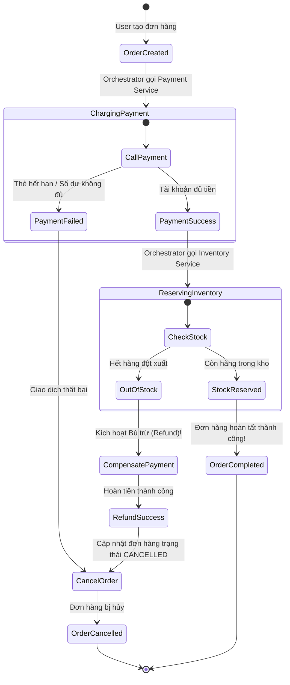
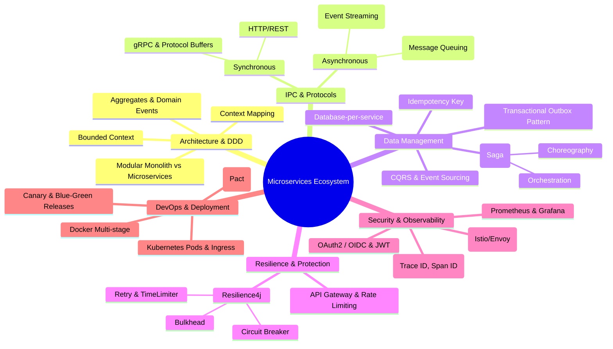

# Microservices Architecture Master Guide (Tổng Hợp Toàn Diện Kiến Trúc Microservices)

---

> **Mục tiêu đầu ra:** Làm chủ toàn diện kiến trúc Microservices từ tư duy thiết kế hệ thống phân tán (Domain-Driven Design, Bounded Context, Saga, Outbox, CQRS), phương thức giao tiếp (gRPC, REST, Kafka, RabbitMQ), cơ chế bảo vệ kiên cường (Circuit Breaker, Rate Limiter, Bulkhead), quản lý dữ liệu phân tán (Database-per-service, Eventual Consistency), hạ tầng vận hành (Docker, Kubernetes, Service Mesh Envoy/Istio, Distributed Tracing) cho đến mô hình tổ chức đội ngũ (Định luật Conway, Contract Testing) và tích hợp AI Agents hiện đại.

---

## 🗺️ Bản đồ Kết nối Tri thức (Ecosystem Knowledge Map)

Kiến trúc Microservices không tồn tại độc lập mà là giao điểm của toàn bộ các tầng công nghệ trong kho tri thức này:

```text
┌─────────────────────────────────────────────────────────────────────────────────────────────────┐
│                                   CLIENT TIẾP NHẬN YÊU CẦU                                      │
│  [1-Frontend/React-Core.md] ──> Micro-frontends & BFF (Backend-for-Frontend) Pattern            │
└────────────────────────────────────────────────┬────────────────────────────────────────────────┘
                                                 │ HTTPS / WSS
                                                 ▼
┌─────────────────────────────────────────────────────────────────────────────────────────────────┐
│                             API GATEWAY & SERVICE MESH INFRASTRUCTURE                            │
│  - Authentication / Authorization (JWT / OAuth2 / OIDC)                                         │
│  - Rate Limiting, SSL Termination, Dynamic Routing                                              │
│  - Service Mesh (Istio / Envoy): mTLS Zero-Trust, Traffic Splitting, Distributed Tracing        │
└────────────────────────────────────────────────┬────────────────────────────────────────────────┘
                                                 │ Internal Network (gRPC / HTTP REST / mTLS)
                                                 ▼
┌─────────────────────────────────────────────────────────────────────────────────────────────────┐
│                               CORE MICROSERVICES LAYER (SPRING BOOT)                            │
│  [2-Backend/Spring-Boot-Microservices.md]                                                       │
│  - Inversion of Control & Dependency Injection (IoC/DI)                                         │
│  - Declarative Clients: OpenFeign                                                               │
│  - Resiliency Patterns: Resilience4j (Circuit Breaker, Retry, Bulkhead, TimeLimiter)            │
│  - Service Discovery: Eureka / Consul / K8s CoreDNS                                             │
└───────────────────────┬─────────────────────────────────────────────────┬───────────────────────┘
                        │                                                 │
          Synchronous   │                                                 │ Asynchronous
          (REST / gRPC) │                                                 │ (Event-Driven)
                        ▼                                                 ▼
┌───────────────────────────────────────────────┐ ┌───────────────────────────────────────────────┐
│     DATABASE & DISTRIBUTED CONSISTENCY        │ │           ASYNCHRONOUS MESSAGING             │
│  [3-Database/Transactions-Isolation.md]       │ │  [2-Backend/Message-Broker-Kafka-RabbitMQ.md] │
│  - Database-per-service (No Shared DB)        │ │  - Event-Driven Architecture (EDA)            │
│  - Distributed Transactions: Saga Pattern     │ │  - Message Streaming: Apache Kafka            │
│  - Dual-Write Solution: Transactional Outbox  │ │  - Task Queuing: RabbitMQ (AMQP)              │
│  - Query Segregation: CQRS & Event Sourcing   │ │  - Idempotent Consumer & DLQ Patterns         │
└───────────────────────────────────────────────┘ └───────────────────────────────────────────────┘
                        ▲                                                 ▲
                        │                                                 │
┌───────────────────────┴─────────────────────────────────────────────────┴───────────────────────┐
│                              DEVOPS, CLOUD & CONTAINER ORCHESTRATION                            │
│  [6-DevOps/Docker-Containerization.md] & [6-DevOps/CI-CD-AWS-Deployment.md]                     │
│  - Packaging: Docker Multi-stage Builds, Distroless Images                                      │
│  - Orchestration: Kubernetes (Pods, Deployments, Services, Ingress, HPA, ConfigMaps, Secrets)   │
│  - Deployment Strategies: Zero-Downtime Rolling Update, Canary, Blue-Green                      │
│  - Observability: Prometheus, Grafana, OpenTelemetry, Jaeger, ELK/Loki Stack                    │
└─────────────────────────────────────────────────────────────────────────────────────────────────┘
                        │
                        ▼
┌─────────────────────────────────────────────────────────────────────────────────────────────────┐
│                       ORGANIZATION & MODERN AI INTEGRATION EXTENSION                            │
│  - Team Culture: [5-Agile-Scrum/Agile-Scrum-Framework.md] (Conway's Law, Two-Pizza Squads)      │
│  - AI Extension: [7-AI-Integration/AI-Integration-Foundation.md] (AI Agents as Microservices)   │
└─────────────────────────────────────────────────────────────────────────────────────────────────┘
```

---

## 1. Khái niệm (Difficulty Breakdown)

### Beginner
Ở cấp độ nhập môn, kỹ sư cần phân biệt bản chất cốt lõi giữa hai phong cách kiến trúc:
- **Monolith (Nguyên khối)**: Toàn bộ mã nguồn nghiệp vụ (User, Order, Payment, Inventory) được đóng gói thành một đơn vị duy nhất (ví dụ file `.jar` hoặc `.war`) và chạy chung trên một tiến trình hệ điều hành (OS Process), chia sẻ chung một Database duy nhất.
- **Microservices (Dịch vụ nhỏ độc lập)**: Ứng dụng được chia nhỏ thành nhiều dịch vụ độc lập. Mỗi dịch vụ:
  - Đảm nhận một nghiệp vụ kinh doanh riêng biệt (**Single Responsibility Principle**).
  - Chạy trong tiến trình riêng (thường là một Docker Container).
  - Sở hữu cơ sở dữ liệu riêng (**Database-per-Service**).
  - Giao tiếp với các dịch vụ khác qua mạng (Network calls) bằng giao thức nhẹ như HTTP REST, gRPC hoặc Message Brokers (Kafka, RabbitMQ).
- **Synchronous vs Asynchronous IPC**:
  - *Đồng bộ (Synchronous)*: Service A gửi request sang Service B và phải chờ Service B phản hồi rồi mới xử lý tiếp (ví dụ HTTP REST, gRPC). Điểm yếu: tạo ra coupling về thời gian, dễ gây sập dây chuyền (Cascading Failure).
  - *Bất đồng bộ (Asynchronous)*: Service A bắn một Event/Message vào hàng đợi (Broker) rồi lập tức trả lời client. Service B tự lấy tin nhắn về xử lý khi rảnh. Điểm mạnh: Decoupled, chịu tải đột biến tốt.

---

### Intermediate
Ở cấp độ trung cấp, kỹ sư cần nắm vững các mẫu hình (patterns) cốt lõi cấu thành nên một hệ sinh thái Microservices tiêu chuẩn:
- **API Gateway Pattern**: Đóng vai trò là Single Entry Point (cổng vào duy nhất) tiếp nhận mọi traffic từ Client (Web, Mobile). Gateway đảm nhận:
  - *Reverse Proxy & Routing*: Điều hướng request đến đúng microservice downstream.
  - *Cross-cutting Concerns*: Xác thực (Authentication/JWT verification), Phân quyền, Giới hạn tần suất gọi (Rate Limiting), Giám sát (Metrics), SSL Termination.
- **Service Discovery & Registration**:
  - Trong môi trường container/cloud (như Kubernetes hoặc AWS ECS), các instance microservice được sinh ra và xóa đi liên tục, địa chỉ IP thay đổi động.
  - *Service Registry* (như Netflix Eureka, HashiCorp Consul hoặc K8s CoreDNS) lưu trữ bản đồ tên dịch vụ và danh sách IP:Port tương ứng.
  - *Client-side Load Balancing* (Spring Cloud LoadBalancer): Client tự hỏi Registry danh sách IP và tự chọn thuật toán cân bằng tải (Round-Robin, Weighted).
- **Declarative HTTP Client (OpenFeign)**: Cho phép viết interface gọi API giữa các service giống như gọi method Java bình thường, tự động tích hợp Load Balancing và Serialization.
- **Resiliency & Fault Tolerance (Khả năng chịu lỗi)**:
  - **Circuit Breaker (Bộ ngắt mạch)**: Giám sát tỷ lệ lỗi khi gọi downstream. Nếu tỷ lệ lỗi vượt ngưỡng, Circuit chuyển sang trạng thái `OPEN` và ngắt ngay các cuộc gọi tiếp theo, trả về dữ liệu dự phòng (Fallback) để tránh cạn kiệt luồng (Thread Starvation).
  - **Rate Limiter & Bulkhead**: Giới hạn số lượng request trong một đơn vị thời gian và cô lập số lượng luồng xử lý riêng biệt cho từng dịch vụ để lỗi ở dịch vụ này không làm tê liệt dịch vụ khác.
- **Externalized Configuration**: Quản lý tập trung file cấu hình (`application.yml`) tại một nguồn duy nhất (Spring Cloud Config Server, HashiCorp Vault hoặc K8s ConfigMap/Secret), cho phép cập nhật cấu hình mà không cần build lại mã nguồn.

---

### Advanced
Ở cấp độ nâng cao, kỹ sư đối mặt với bài toán hóc búa nhất của hệ thống phân tán: **Quản lý dữ liệu phân tán (Distributed Data Management) & Tính nhất quán (Consistency)**.
- **Giới hạn của 2-Phase Commit (2PC)**: Giao thức 2PC cổ điển đòi hỏi Coordinator khóa tài nguyên trên tất cả database tham gia cho đến khi commit hoàn tất. Trong môi trường mạng phân tán lớn, 2PC làm giảm nghiêm trọng thông lượng (throughput), dễ gây deadlocks và vi phạm định lý CAP.
- **Saga Pattern**: Thay thế 2PC bằng cách chia giao dịch phân tán thành một chuỗi các **Local Transactions**. Mỗi local transaction cập nhật DB của một service và phát ra Event/Message kích hoạt bước tiếp theo. Nếu một bước thất bại, Saga kích hoạt chuỗi **Compensating Transactions (Giao dịch bù trừ)** để hoàn tác trạng thái trước đó.
  - *Choreography (Biên đạo)*: Các service tự lắng nghe Event của nhau và tự phản ứng (không có điều phối trung tâm). Phù hợp với luồng 2-3 bước.
  - *Orchestration (Dàn dựng)*: Có một Orchestrator service đóng vai trò State Machine chỉ huy lần lượt các service. Phù hợp với luồng phức tạp, nhiều bước.
- **Transactional Outbox Pattern**: Giải quyết bài toán **Dual-Write** (không thể vừa commit DB vừa publish message sang Kafka trong cùng một transaction nguyên tử). Kỹ thuật này lưu message vào một bảng tạm `outbox` ngay trong transaction DB của nghiệp vụ chính. Sau đó, một tiến trình CDC (Change Data Capture như Debezium) hoặc Polling Worker sẽ đọc bảng outbox và đẩy lên Kafka với cam kết **At-Least-Once Delivery**.
- **CQRS (Command Query Responsibility Segregation)**: Tách biệt mô hình Ghi (Command - ghi vào Relational DB chuẩn hóa để đảm bảo toàn vẹn) và mô hình Đọc (Query - đồng bộ dữ liệu sang Elasticsearch hoặc Redis để phục vụ tìm kiếm tốc độ cao).
- **Idempotent Consumers**: Đảm bảo việc nhận và xử lý lại một message nhiều lần (do mạng chập chờn gây re-delivery) không làm sai lệch trạng thái hệ thống (ví dụ: không trừ tiền khách hàng 2 lần).

---

### Expert (System Architect)
Ở cấp độ chuyên gia, kiến trúc sư làm chủ các chiến lược kiến trúc quy mô lớn:
- **Strategic Domain-Driven Design (DDD)**:
  - Phân tích ranh giới nghiệp vụ (**Bounded Contexts**) và vẽ **Context Mapping** để xác định biên giới chính xác của từng Microservice, ngăn ngừa triệt để thảm họa "Distributed Monolith".
  - Thiết kế các Aggregate Roots và Domain Events.
- **Service Mesh (Istio / Envoy Proxy)**:
  - Tách toàn bộ logic giao tiếp mạng, bảo mật (mTLS), giám sát và traffic engineering ra khỏi code ứng dụng và đẩy xuống tầng hạ tầng (**Sidecar Proxy pattern**).
  - Áp dụng Zero-Trust Security: Mã hóa toàn bộ traffic giữa các pod bên trong cụm Kubernetes bằng mutual TLS (mTLS) tự động xoay vòng chứng chỉ.
- **Distributed Tracing & W3C Trace Context**:
  - Chuẩn hóa việc truyền `Trace ID`, `Span ID` và `Baggage` qua HTTP Headers/Kafka Headers bằng OpenTelemetry, tích hợp với Jaeger/Tempo để quan sát vết request xuyên suốt hàng chục dịch vụ.
- **Backend-for-Frontend (BFF)**: Thiết kế các API Gateway riêng biệt cho từng kênh người dùng (BFF for Web, BFF for Mobile iOS/Android, BFF for Public Partners) để tối ưu payload và trải nghiệm người dùng.
- **Multi-Region Active-Active & Disaster Recovery**: Thiết kế đồng bộ hóa dữ liệu liên vùng (Cross-region replication) với chiến lược giải quyết xung đột (Conflict-free Replicated Data Types - CRDTs hoặc Last-Write-Wins).

---

## 2. Mục đích & Động lực Chuyển đổi

### 1. Tại sao doanh nghiệp chọn Microservices?
- **Định luật Conway (Conway's Law)**: *"Cấu trúc của hệ thống phần mềm phản ánh cấu trúc giao tiếp của tổ chức tạo ra nó."* Khi doanh nghiệp có hàng trăm kỹ sư, việc tất cả cùng commit vào một repo Monolith gây ra xung đột merge code triền miên, quy trình release bị tắc nghẽn. Microservices cho phép tổ chức thành các **Autonomous Two-Pizza Teams (Squads)**, mỗi team làm chủ một dịch vụ từ khâu thiết kế, viết code, kiểm thử đến triển khai lên production.
- **Độc lập triển khai (Independent Deployment)**: Team Payment có thể release phiên bản mới 10 lần/ngày mà không cần hỏi ý kiến hay phụ thuộc vào lịch release của team Catalog hay team Notification.
- **Tối ưu hóa tài nguyên phần cứng (Independent Scalability)**:
  - Service Xử lý AI/Hình ảnh cần máy chủ gắn GPU.
  - Service Tìm kiếm cần máy chủ nhiều RAM để chạy in-memory cache.
  - Service Đặt hàng chỉ cần CPU cơ bản.
  - Trong Monolith, bạn buộc phải mua máy chủ cấu hình đắt nhất chứa đủ tất cả các yêu cầu trên. Trong Microservices, bạn scale đúng service cần thiết.
- **Fault Isolation (Cô lập lỗi)**: Lỗi rò rỉ bộ nhớ (Out-Of-Memory) tại module Đề xuất sản phẩm (Recommendation) chỉ làm sập container của service đó. Khách hàng vẫn có thể tìm kiếm sản phẩm và thanh toán đơn hàng bình thường.

### 2. Khi nào KHÔNG NÊN dùng Microservices? (Microservices Readiness Assessment)
> [!WARNING]
> **Cảnh báo thực tế từ Kiến trúc sư:** Microservices không phải là liều thuốc vạn năng (Silver Bullet). Microservices đánh đổi **sự đơn giản trong code** lấy **sự phức tạp khổng lồ của hạ tầng và mạng phân tán**.

Bạn **CHỈ NÊN** chuyển sang Microservices khi thỏa mãn ít nhất 3 trong 4 điều kiện sau:
1. Đội ngũ kỹ sư lớn hơn 20 - 30 người và bắt đầu có sự tắc nghẽn trong việc triển khai code chung.
2. Nghiệp vụ kinh doanh đã ổn định và hiểu rõ ranh giới các Domain (Domain Boundaries đã rõ). Nếu chia service khi chưa hiểu rõ nghiệp vụ, bạn sẽ tạo ra các service gắn kết chặt chẽ (Tightly Coupled) - tức là **Distributed Monolith**.
3. Doanh nghiệp đã sở hữu nền tảng DevOps vững chắc: Đã có CI/CD tự động, Container Orchestration (Kubernetes), Centralized Logging và APM Tracing.
4. Có các module nghiệp vụ có sự chênh lệch tải trọng cực kỳ lớn (ví dụ: lượt đọc tin gấp 10.000 lần lượt viết).

---

## 3. Kiến trúc Hoạt động & Hệ thống Patterns

### Sơ đồ 1: Tổng thể Kiến trúc Microservices Chuẩn Doanh nghiệp

```text
                                [ INTERNET CLIENTS ]
                                          │
                   ┌──────────────────────┴──────────────────────┐
                   │ Mobile Apps (iOS/Android)   Web SPA (React) │
                   └──────────────────────┬──────────────────────┘
                                          │ HTTPS (Port 443)
                                          ▼
                   ┌─────────────────────────────────────────────┐
                   │    Cloudflare / AWS CloudFront (CDN & WAF)  │
                   └──────────────────────┬──────────────────────┘
                                          │
                                          ▼
┌─────────────────────────────────────────────────────────────────────────────────────────────┐
│                                     API GATEWAY CLUSTER                                     │
│  - SSL Termination, DDoS Protection, Rate Limiting (Redis Token Bucket)                     │
│  - Centralized Authentication & JWT Verification (gọi Identity/Keycloak)                    │
│  - Dynamic Routing & Load Balancing                                                         │
│  - Response Aggregation / BFF Layer                                                         │
└──────────────┬──────────────────────────┬──────────────────────────┬────────────────────────┘
               │                          │                          │
               │ HTTP/gRPC                │ HTTP/gRPC                │ HTTP/gRPC
               ▼                          ▼                          ▼
┌───────────────────────────┐┌───────────────────────────┐┌───────────────────────────┐
│     CUSTOMER SERVICE      ││       ORDER SERVICE       ││      PAYMENT SERVICE      │
│ ┌───────────────────────┐ ││ ┌───────────────────────┐ ││ ┌───────────────────────┐ │
│ │ Envoy Sidecar (mTLS)  │ ││ │ Envoy Sidecar (mTLS)  │ ││ │ Envoy Sidecar (mTLS)  │ │
│ ├───────────────────────┤ ││ ├───────────────────────┤ ││ ├───────────────────────┤ │
│ │ Spring Boot App       │ ││ │ Spring Boot App       │ ││ │ Spring Boot App       │ │
│ │ - OpenFeign Client    │ ││ │ - Saga Orchestrator   │ ││ │ - Resilience4j CB     │ │
│ │ - Micrometer Tracing  │ ││ │ - Outbox Publisher    │ ││ │ - Idempotency Filter  │ │
│ └───────────┬───────────┘ ││ └───────────┬───────────┘ ││ └───────────┬───────────┘ │
└─────────────┼─────────────┘└─────────────┼─────────────┘└─────────────┼─────────────┘
              │                            │                            │
              ▼                            ▼                            ▼
      [(Customer DB)]              [(Order DB & Outbox)]         [(Payment DB)]
      PostgreSQL                   PostgreSQL                    PostgreSQL
                                           │
                                           │ Debezium CDC Engine (Đọc WAL Logs)
                                           ▼
┌─────────────────────────────────────────────────────────────────────────────────────────────┐
│                           EVENT-DRIVEN BACKBONE (APACHE KAFKA)                              │
│  Topics: order.created │ order.paid │ inventory.reserved │ notification.send                │
└──────────────────────┬───────────────────────────────────────────────┬──────────────────────┘
                       │                                               │
                       ▼                                               ▼
┌─────────────────────────────────────────────┐ ┌─────────────────────────────────────────────┐
│              INVENTORY SERVICE              │ │            NOTIFICATION SERVICE             │
│  - Lắng nghe topic `order.created`          │ │  - Lắng nghe topic `order.paid`             │
│  - Trừ tồn kho & Phát `inventory.reserved`  │ │  - Gửi Email / SMS / Web Push qua FCM/SES   │
│  - Database: MySQL / Redis Cache            │ │  - Database: MongoDB                        │
└─────────────────────────────────────────────┘ └─────────────────────────────────────────────┘
```

---

### Sơ đồ 1.1: Hệ sinh thái Spring Cloud Core (Config Server + Eureka Discovery + Gateway + Feign)

Dưới đây là sơ đồ chi tiết luồng vận hành thực tế của bộ công cụ **Spring Cloud** chuẩn mà bạn đang học:

```text
                               ┌────────────────────────────────────────┐
                               │       GIT REPOSITORY / LOCAL DIR       │
                               │   order-service.yml, payment.yml       │
                               └───────────────────┬────────────────────┘
                                                   │ 1. Fetch configurations
                                                   ▼
                               ┌────────────────────────────────────────┐
                               │      SPRING CLOUD CONFIG SERVER        │
                               │             (Port 8888)                │
                               └─────────┬───────────────────┬──────────┘
                                         │                   │
                     2. Pull configs at  │                   │ 2. Pull configs at
                        startup          │                   │    startup
                                         ▼                   ▼
                     ┌───────────────────────┐   ┌───────────────────────┐
                     │     ORDER SERVICE     │   │    PAYMENT SERVICE    │
                     │  (Config Client 8081) │   │  (Config Client 8082) │
                     │  - @RefreshScope      │   │  - @RefreshScope      │
                     └───────────┬───────────┘   └───────────┬───────────┘
                                 │                           │
                                 │ 3. Register IP:Port       │ 3. Register IP:Port
                                 │    & Send Heartbeat       │    & Send Heartbeat
                                 ▼                           ▼
                     ┌───────────────────────────────────────────────────┐
                     │        NETFLIX EUREKA SERVICE REGISTRY            │
                     │                 (Port 8761)                       │
                     │   - ORDER-SERVICE  -> [192.168.1.10:8081]         │
                     │   - PAYMENT-SERVICE -> [192.168.1.10:8082]        │
                     └───────────────────────────┬───────────────────────┘
                                                 ▲
                                                 │ 4. Periodic Registry Fetch
                                                 │    (LoadBalancer cache)
                                                 ▼
┌──────────────────┐           ┌─────────────────────────────────────────┐
│     CLIENT       │  Request  │           SPRING CLOUD GATEWAY          │
│ (Web / Postman)  ├──────────>│               (Port 8080)               │
└──────────────────┘           │  Route: Path=/api/v1/orders/**          │
                               │  URI:   lb://ORDER-SERVICE              │
                               └────────────────────┬────────────────────┘
                                                    │
                                                    │ 5. Route dynamically to IP:Port
                                                    ▼
                                       [ ORDER SERVICE (8081) ]
                                                    │
                                                    │ 6. Call Payment via OpenFeign
                                                    │    @FeignClient(name="PAYMENT-SERVICE")
                                                    │    (Eureka resolves IP:Port + CB)
                                                    ▼
                                      [ PAYMENT SERVICE (8082) ]
```

---

### Sơ đồ 2: Cơ chế Bảo mật Xác thực Tập trung & Chuyển tiếp Ngữ cảnh (Context Propagation)

```text
Client                API Gateway              Identity Provider         Microservices (Downstream)
  │                        │                       (Keycloak)                        │
  │ 1. POST /login         │                           │                             │
  ├───────────────────────>│ 2. Forward credentials    │                             │
  │                        ├──────────────────────────>│                             │
  │                        │ 3. Return JWT Token       │                             │
  │                        │<──────────────────────────┤                             │
  │ 4. Set JWT in Cookie   │                           │                             │
  │<───────────────────────┤                           │                             │
  │                        │                           │                             │
  │ 5. GET /api/v1/orders  │                           │                             │
  │    (Bearer JWT)        │                           │                             │
  ├───────────────────────>│ 6. Verify Signature &     │                             │
  │                        │    Extract Claims (Roles) │                             │
  │                        │                           │                             │
  │                        │ 7. Strip raw JWT, Inject Trusted Headers:                       │
  │                        │    - X-User-Id: 9981                                    │
  │                        │    - X-User-Roles: ROLE_USER                            │
  │                        │    - X-Trace-Id: 4bf92f3577b34da6a3ce929d0e0e4736       │
  │                        ├────────────────────────────────────────────────────────>│
  │                        │                                                         │ 8. Service nhận
  │                        │                                                         │    request không cần
  │                        │                                                         │    gọi verify JWT lại,
  │                        │                                                         │    chỉ đọc Headers!
```

---

### Sơ đồ 3: Transactional Outbox Pattern kết hợp Debezium CDC và Apache Kafka

```text
[ ORDER SERVICE ]
  │
  │ 1. Start Local DB Transaction
  ├─────────────────────────────────────────────────────────────┐
  │ 2. INSERT INTO orders (id, total, status) VALUES (...)      │
  │ 3. INSERT INTO outbox_events (event_id, topic, payload)    │
  │ 4. COMMIT TRANSACTION                                       │
  └─────────────────────────────────────────────────────────────┘
                                  │
                                  ▼
                   [( Order Database: PostgreSQL )]
                                  │
                                  │ 5. Ghi thay đổi vào Transaction Log (WAL)
                                  ▼
                        PostgreSQL WAL (Write-Ahead Log)
                                  │
                                  │ 6. Streaming CDC changes via Debezium Connector
                                  ▼
                        [ Debezium CDC Engine ]
                                  │
                                  │ 7. Publish Event to exact Topic (At-Least-Once)
                                  ▼
                      [ Apache Kafka Cluster ]
                                  │
                                  ├───────────────────────────────┐
                                  ▼                               ▼
                      [ Payment Service ]                [ Inventory Service ]
                      (Idempotent Consumer)              (Idempotent Consumer)
```

---

### Sơ đồ 4: Saga Orchestrator State Machine xử lý Rollback Bù trừ



---

## 4. Ví dụ thực tế: Thiết kế Hệ thống E-Commerce & Flash Sale

### Tình huống kinh doanh:
Một sàn thương mại điện tử tổ chức sự kiện Flash Sale lúc 00:00. Có 50.000 người dùng bấm nút "Mua Ngay" một sản phẩm duy nhất chỉ còn 100 chiếc trong kho.
Hệ thống bao gồm:
1. `API Gateway`: Cổng đón nhận traffic.
2. `Order Service`: Quản lý giỏ hàng và đơn hàng.
3. `Inventory Service`: Quản lý số lượng tồn kho.
4. `Payment Service`: Tích hợp cổng thanh toán ngân hàng.
5. `Notification Service`: Gửi tin nhắn xác nhận.

### Các bài toán kỹ thuật xảy ra:
1. **Overselling (Bán vượt tồn kho)**: Do 50.000 request ùa vào cùng một tích tắc, nếu nhiều instance của Inventory Service cùng đọc tồn kho = 100 và cùng trừ, số lượng hàng bán ra thực tế có thể lên đến 500 chiếc.
2. **Cascading Failure**: Cổng thanh toán ngân hàng bị quá tải, phản hồi trễ 15 giây. 500 luồng xử lý của Order Service bị treo cứng để chờ Payment Service, khiến toàn bộ RAM/CPU cạn kiệt, làm sập luôn cả Order Service.
3. **Bất nhất dữ liệu (Inconsistency)**: Trừ tiền của khách hàng thành công nhưng bước lưu đơn hàng bị lỗi mạng, khách mất tiền mà không có hàng.

### Giải pháp của Software Architect:
1. **Chống sập Gateway & Bảo vệ hệ thống bằng Rate Limiting**:
   - Sử dụng thuật toán **Redis Token Bucket** trên API Gateway: Mỗi User ID chỉ được gửi tối đa 1 request đặt hàng/giây. Traffic vượt mức lập tức nhận mã lỗi `HTTP 429 Too Many Requests`.
2. **Xử lý tồn kho Flash Sale bằng In-memory Cache & Distributed Lock**:
   - Số lượng 100 sản phẩm được nạp sẵn vào Redis: `DECRBY product:101:stock 1`.
   - Lệnh `DECRBY` của Redis là **Atomic** (đơn luồng). Khi số lượng < 0, Redis trả về ngay kết quả hết hàng trong vòng 1ms, chặn đứng 49.900 request không cho chạm vào Database.
3. **Bảo vệ kết nối liên dịch vụ bằng Circuit Breaker**:
   - Đặt **Resilience4j Circuit Breaker** tại Order Service khi gọi sang Payment Service.
   - Cấu hình: Nếu 50% request trong vòng 5 giây bị timeout quá 2 giây, Circuit chuyển sang `OPEN`, ngắt ngay các lệnh gọi tiếp theo và trả về phản hồi: *"Cổng thanh toán đang bận, vui lòng thử lại sau 30 giây"*.
4. **Đảm bảo toàn vẹn bằng Saga Orchestration & Transactional Outbox**:
   - Không gọi thanh toán và trừ kho đồng bộ. Thay vào đó, Order Service tạo đơn hàng trạng thái `PENDING`, ghi kèm Outbox Event.
   - Debezium đẩy Event sang Kafka. Payment Service và Inventory Service tiêu thụ sự kiện. Nếu hết hàng, Event `inventory.failed` được bắn ra, kích hoạt Saga hoàn tiền lại cho khách hàng tự động.

---

## 5. Code Demo Thực Chiến: Trọn bộ Hệ sinh thái Spring Cloud (Config Server, Config Client, Eureka Server, Eureka Client, Gateway, OpenFeign & Circuit Breaker)

Dưới đây là mã nguồn chuẩn hóa theo phong cách **Spring Boot 3+** và **Spring Cloud 2023+ (hoặc 2022+)** phản ánh chính xác 100% kiến trúc mà bạn đang học trên trường/dự án thực tế.

---

### Khai báo Quản lý Phiên bản (BOM) trong file `build.gradle`

Mọi dự án Spring Cloud dùng Gradle đều cần khai báo plugin `io.spring.dependency-management` và import BOM `spring-cloud-dependencies` để đồng bộ phiên bản:

```groovy
plugins {
    id 'java'
    id 'org.springframework.boot' version '3.2.3'
    id 'io.spring.dependency-management' version '1.1.4'
}

group = 'com.knowledgebase'
version = '0.0.1-SNAPSHOT'

java {
    sourceCompatibility = '17'
}

repositories {
    mavenCentral()
}

ext {
    set('springCloudVersion', "2023.0.0")
}

dependencyManagement {
    imports {
        mavenBom "org.springframework.cloud:spring-cloud-dependencies:${springCloudVersion}"
    }
}
```

---

### 1. Mô-đun 1: Spring Cloud Config Server (Port 8888)

Config Server đóng vai trò là "Kho cấu hình trung tâm" (Single Source of Truth). Thay vì lưu cấu hình rải rác trên từng microservice, toàn bộ file `.yml` được quản lý tập trung trên một Git Repository hoặc thư mục nội bộ (Native profile).

#### Cấu hình `build.gradle` (Config Server):
```groovy
dependencies {
    // Thư viện máy chủ phân phối cấu hình
    implementation 'org.springframework.cloud:spring-cloud-config-server'
    testImplementation 'org.springframework.boot:spring-boot-starter-test'
}
```

#### Class khởi chạy: `ConfigServerApplication.java`
```java
package com.knowledgebase.configserver;

import org.springframework.boot.SpringApplication;
import org.springframework.boot.autoconfigure.SpringBootApplication;
import org.springframework.cloud.config.server.EnableConfigServer;

@SpringBootApplication
@EnableConfigServer // Kích hoạt tính năng máy chủ phân phối cấu hình
public class ConfigServerApplication {
    public static void main(String[] args) {
        SpringApplication.run(ConfigServerApplication.class, args);
    }
}
```

#### File cấu hình `application.yml` của Config Server:
```yaml
server:
  port: 8888

spring:
  application:
    name: config-server
  profiles:
    active: git # Hoặc 'native' nếu đọc từ thư mục local trên ổ đĩa
  cloud:
    config:
      server:
        git:
          uri: https://github.com/my-org/microservices-config-repo.git
          default-label: main
          clone-on-start: true
          # Nếu dùng thư mục local: 
          # native:
          #   search-locations: classpath:/shared-configs/
```

#### File cấu hình tập trung mẫu trên Git repo: `order-service.yml`
*(Config Server sẽ cung cấp nội dung này khi `order-service` kết nối tới)*:
```yaml
# Cấu hình dùng chung được nạp động về cho order-service
order:
  discount:
    rate: 0.15 # Giảm giá 15%
    message: "Khuyến mãi mùa hè đặc biệt!"
  max-items-per-order: 50

# Cấu hình Eureka Client cho Order Service
eureka:
  client:
    service-url:
      defaultZone: http://localhost:8761/eureka/
  instance:
    prefer-ip-address: true

# Mở endpoint Actuator để cho phép refresh cấu hình động
management:
  endpoints:
    web:
      exposure:
        include: health,info,refresh
```

---

### 2. Mô-đun 2: Spring Cloud Config Client với Dynamic Refresh (`@RefreshScope`)

Config Client kết nối tới Config Server lúc ứng dụng khởi động (Bootstrap phase), tải toàn bộ cấu hình về RAM. Khi cần thay đổi cấu hình, ta chỉ cần sửa trên Git/Config Server rồi gửi lệnh `POST /actuator/refresh`, Bean sẽ tự cập nhật giá trị mới **mà không cần restart máy chủ**!

#### Cấu hình `build.gradle` (Order Service - Config Client):
```groovy
dependencies {
    // Thư viện kết nối Config Server
    implementation 'org.springframework.cloud:spring-cloud-starter-config'
    // Actuator kích hoạt endpoint /actuator/refresh
    implementation 'org.springframework.boot:spring-boot-starter-actuator'
    // Web REST API
    implementation 'org.springframework.boot:spring-boot-starter-web'
    testImplementation 'org.springframework.boot:spring-boot-starter-test'
}
```

#### File cấu hình `application.yml` của Client (Spring Boot 3+):
```yaml
spring:
  application:
    name: order-service
  config:
    # Kết nối tới Config Server cổng 8888. 'optional:' giúp app không sập nếu config server trễ
    import: "optional:configserver:http://localhost:8888"

server:
  port: 8081
```

#### Class Controller ứng dụng `@RefreshScope`: `OrderDiscountController.java`
```java
package com.knowledgebase.orderservice.controller;

import org.springframework.beans.factory.annotation.Value;
import org.springframework.cloud.context.config.annotation.RefreshScope;
import org.springframework.web.bind.annotation.GetMapping;
import org.springframework.web.bind.annotation.RequestMapping;
import org.springframework.web.bind.annotation.RestController;
import java.util.Map;

@RestController
@RequestMapping("/api/v1/orders")
@RefreshScope // CỐT LÕI: Đánh dấu Bean này sẽ được Spring làm mới khi có sự kiện /actuator/refresh
public class OrderDiscountController {

    // Giá trị này được lấy từ file 'order-service.yml' trên Config Server
    @Value("${order.discount.rate:0.0}")
    private double discountRate;

    @Value("${order.discount.message:Không có ưu đãi}")
    private String discountMessage;

    @GetMapping("/discount")
    public Map<String, Object> getDiscountPolicy() {
        return Map.of(
            "currentDiscountRate", discountRate,
            "message", discountMessage,
            "appliedStatus", discountRate > 0 ? "ACTIVE" : "INACTIVE"
        );
    }
}
```

> [!TIP]
> **Cách thực hành Dynamic Refresh trên môi trường thực tế:**
> 1. Gọi thử: `GET http://localhost:8081/api/v1/orders/discount` ➔ Trả về `0.15`.
> 2. Sửa giá trị trên file `order-service.yml` thành `0.25` (25%).
> 3. Gửi lệnh HTTP POST: `curl -X POST http://localhost:8081/actuator/refresh`
> 4. Gọi lại: `GET http://localhost:8081/api/v1/orders/discount` ➔ Kết quả lập tức đổi sang `0.25` mà Service **vẫn chạy liên tục, không downtime**!

---

### 3. Mô-đun 3: Spring Cloud Netflix Eureka Server (Port 8761)

Eureka Server là tổng đài danh bạ (Service Registry). Khi bất kỳ microservice nào khởi động, nó tự động gửi IP, Port và trạng thái sức khỏe (Heartbeat) về đây.

#### Cấu hình `build.gradle` (Eureka Server):
```groovy
dependencies {
    // Máy chủ Service Registry Eureka
    implementation 'org.springframework.cloud:spring-cloud-starter-netflix-eureka-server'
    testImplementation 'org.springframework.boot:spring-boot-starter-test'
}
```

#### Class khởi chạy: `EurekaServerApplication.java`
```java
package com.knowledgebase.eurekaserver;

import org.springframework.boot.SpringApplication;
import org.springframework.boot.autoconfigure.SpringBootApplication;
import org.springframework.cloud.netflix.eureka.server.EnableEurekaServer;

@SpringBootApplication
@EnableEurekaServer // Kích hoạt trung tâm đăng ký & khám phá dịch vụ Eureka
public class EurekaServerApplication {
    public static void main(String[] args) {
        SpringApplication.run(EurekaServerApplication.class, args);
    }
}
```

#### File cấu hình `application.yml` của Eureka Server:
```yaml
server:
  port: 8761

spring:
  application:
    name: eureka-server

eureka:
  instance:
    hostname: localhost
  client:
    # Vì đây là Server trung tâm, nó không cần tự đăng ký chính nó vào danh bạ
    register-with-eureka: false
    # Không cần tải danh bạ về
    fetch-registry: false
    service-url:
      defaultZone: http://${eureka.instance.hostname}:${server.port}/eureka/
  server:
    # Self-preservation: Trong môi trường dev/học tập, nên tắt để Eureka lập tức xóa các instance đã tắt
    enable-self-preservation: false
    eviction-interval-timer-in-ms: 5000 # Quét dọn các instance chết mỗi 5 giây
```

---

### 4. Mô-đun 4: Spring Cloud Eureka Client (Service Registration & Discovery)

Áp dụng cho các dịch vụ nghiệp vụ như `Order Service` (Port 8081) và `Payment Service` (Port 8082).

#### Cấu hình `build.gradle` (Eureka Client):
```groovy
dependencies {
    // Client đăng ký và khám phá dịch vụ Eureka
    implementation 'org.springframework.cloud:spring-cloud-starter-netflix-eureka-client'
    implementation 'org.springframework.boot:spring-boot-starter-web'
    testImplementation 'org.springframework.boot:spring-boot-starter-test'
}
```

#### Class khởi chạy: `OrderServiceApplication.java`
```java
package com.knowledgebase.orderservice;

import org.springframework.boot.SpringApplication;
import org.springframework.boot.autoconfigure.SpringBootApplication;
import org.springframework.cloud.client.discovery.EnableDiscoveryClient;
import org.springframework.cloud.openfeign.EnableFeignClients;

@SpringBootApplication
@EnableDiscoveryClient // Cho phép service tự động đăng ký với Eureka Server
@EnableFeignClients    // Bật tính năng gọi API khai báo bằng Feign Client
public class OrderServiceApplication {
    public static void main(String[] args) {
        SpringApplication.run(OrderServiceApplication.class, args);
    }
}
```

#### File cấu hình `application.yml` của Eureka Client:
```yaml
server:
  port: 8081

spring:
  application:
    name: ORDER-SERVICE # Tên dịch vụ hiển thị trên bảng điều khiển Eureka (viết hoa chuẩn convention)

eureka:
  client:
    service-url:
      defaultZone: http://localhost:8761/eureka/
    fetch-registry: true
    register-with-eureka: true
  instance:
    prefer-ip-address: true # Ưu tiên dùng IP thay vì hostname để tránh lỗi phân giải DNS trong Docker
    lease-renewal-interval-in-seconds: 10 # Gửi Heartbeat báo còn sống mỗi 10 giây
    lease-expiration-duration-in-seconds: 30 # Nếu sau 30 giây không nhận heartbeat -> Eureka coi như đã chết
```

---

### 5. Mô-đun 5: Inter-Service Communication qua OpenFeign với Eureka + Resilience4j

Thay vì gọi URL cứng như `http://localhost:8082/api/v1/payments/charge`, OpenFeign kết hợp với **Spring Cloud LoadBalancer** sẽ tự động hỏi Eureka danh sách các IP đang chạy của `PAYMENT-SERVICE` và tự cân bằng tải.

#### Cấu hình `build.gradle` (OpenFeign + LoadBalancer + Resilience4j):
```groovy
dependencies {
    // Declarative REST Client
    implementation 'org.springframework.cloud:spring-cloud-starter-openfeign'
    // Client-side Load Balancer
    implementation 'org.springframework.cloud:spring-cloud-starter-loadbalancer'
    // Circuit Breaker Resilience4j
    implementation 'org.springframework.cloud:spring-cloud-starter-circuitbreaker-resilience4j'
    testImplementation 'org.springframework.boot:spring-boot-starter-test'
}
```

#### Interface Feign Client: `PaymentClient.java`
```java
package com.knowledgebase.orderservice.client;

import org.springframework.cloud.openfeign.FeignClient;
import org.springframework.stereotype.Component;
import org.springframework.web.bind.annotation.PostMapping;
import org.springframework.web.bind.annotation.RequestParam;
import org.slf4j.Logger;
import org.slf4j.LoggerFactory;

/**
 * Feign Client sử dụng tên dịch vụ 'PAYMENT-SERVICE' đã đăng ký trên Eureka!
 * Tích hợp FallbackFactory để xử lý ngắt mạch khi Payment Service gặp sự cố.
 */
@FeignClient(name = "PAYMENT-SERVICE", fallbackFactory = PaymentClientFallbackFactory.class)
public interface PaymentClient {

    @PostMapping("/api/v1/payments/charge")
    PaymentResponse chargePayment(@RequestParam("orderId") String orderId, 
                                  @RequestParam("amount") Double amount);
}

record PaymentResponse(String paymentId, String status, String message) {}

/**
 * Fallback Factory: Trả về kết quả an toàn khi Payment Service bị sập, timeout hoặc ngắt mạch
 */
@Component
class PaymentClientFallbackFactory implements org.springframework.cloud.openfeign.FallbackFactory<PaymentClient> {
    private static final Logger log = LoggerFactory.getLogger(PaymentClientFallbackFactory.class);

    @Override
    public PaymentClient create(Throwable cause) {
        return (orderId, amount) -> {
            log.error("Payment Service qua Eureka gặp lỗi cho Order: {}. Nguyên nhân: {}", orderId, cause.getMessage());
            // Trả về fallback an toàn giúp Order Service không bị sập theo
            return new PaymentResponse(null, "FALLBACK_QUEUED", "Cổng thanh toán tạm thời gián đoạn. Đơn hàng chuyển sang xử lý sau.");
        };
    }
}
```

#### Cấu hình Resilience4j trong `application.yml` của Order Service:
```yaml
feign:
  circuitbreaker:
    enabled: true # Kích hoạt hỗ trợ Circuit Breaker cho OpenFeign

resilience4j:
  circuitbreaker:
    instances:
      PAYMENT-SERVICE:
        sliding-window-size: 10 # Đo lường 10 request gần nhất
        failure-rate-threshold: 50 # Nếu >= 50% bị lỗi -> Chuyển sang trạng thái OPEN (Ngắt mạch)
        wait-duration-in-open-state: 10000ms # Chờ 10 giây trước khi sang HALF_OPEN để thử lại
```

---

### 6. Mô-đun 6: Spring Cloud Gateway Định tuyến Động qua Eureka (Port 8080)

Gateway kết nối vào Eureka Server và sử dụng giao thức `lb://` (Load Balanced) để định tuyến request tới các microservice mà không cần biết IP/Port cụ thể của từng máy chủ.

#### Cấu hình `build.gradle` (API Gateway):
```groovy
dependencies {
    // Reactive API Gateway (chạy trên Netty)
    implementation 'org.springframework.cloud:spring-cloud-starter-gateway'
    // Eureka Client để Gateway tra cứu địa chỉ các service
    implementation 'org.springframework.cloud:spring-cloud-starter-netflix-eureka-client'
    testImplementation 'org.springframework.boot:spring-boot-starter-test'
}
```

#### File cấu hình `application.yml` của Spring Cloud Gateway:
```yaml
server:
  port: 8080

spring:
  application:
    name: api-gateway
  cloud:
    gateway:
      discovery:
        locator:
          enabled: true # Tự động phát hiện tất cả các service trên Eureka
          lower-case-service-id: true
      routes:
        # Route 1: Điều hướng các request /api/v1/orders/** tới ORDER-SERVICE
        - id: order-service-route
          uri: lb://ORDER-SERVICE # 'lb://' báo hiệu Gateway hỏi Eureka lấy IP:Port và cân bằng tải
          predicates:
            - Path=/api/v1/orders/**
          filters:
            - AddRequestHeader=X-Gateway-Source, SpringCloudGateway

        # Route 2: Điều hướng các request /api/v1/payments/** tới PAYMENT-SERVICE
        - id: payment-service-route
          uri: lb://PAYMENT-SERVICE
          predicates:
            - Path=/api/v1/payments/**

eureka:
  client:
    service-url:
      defaultZone: http://localhost:8761/eureka/
```

---

### 7. Hướng dẫn Quy trình Khởi động & Kiểm thử Liên hoàn 5 Dịch vụ

Khi học tập và phát triển hệ thống Spring Cloud, **thứ tự khởi động (Startup Sequence)** đóng vai trò quyết định:

```text
Thứ tự khởi động chuẩn:
[Bước 1] Config Server (8888)  --> Đảm bảo kho cấu hình sẵn sàng
   │
[Bước 2] Eureka Server (8761)  --> Đảm bảo tổng đài danh bạ sẵn sàng
   │
[Bước 3] Payment Service (8082) --> Đăng ký vào Eureka với tên 'PAYMENT-SERVICE'
   │
[Bước 4] Order Service (8081)   --> Tải config từ 8888, đăng ký Eureka, kết nối Feign sang Payment
   │
[Bước 5] API Gateway (8080)     --> Khởi động cổng đón traffic, tra cứu danh bạ Eureka
```

#### Các bước kiểm tra thực tế:
1. **Kiểm tra Config Server**:
   Mở trình duyệt: `http://localhost:8888/order-service/default`
   ➔ Trả về JSON chứa đầy đủ thuộc tính cấu hình của `order-service.yml`.
2. **Kiểm tra Eureka Dashboard**:
   Mở trình duyệt: `http://localhost:8761`
   ➔ Trong bảng **Instances currently registered with Eureka**, bạn sẽ thấy danh sách: `API-GATEWAY`, `ORDER-SERVICE`, `PAYMENT-SERVICE` ở trạng thái `UP (1)`.
3. **Kiểm tra Gateway Routing**:
   Gửi request tới API Gateway:
   ```bash
   curl -X GET http://localhost:8080/api/v1/orders/discount
   ```
   Gateway sẽ tự động tra cứu Eureka, chuyển tiếp request sang `ORDER-SERVICE (8081)` và trả về kết quả!
4. **Kiểm thử Circuit Breaker**:
   Dừng tiến trình `Payment Service (8082)`. Gửi request tạo đơn hàng qua Gateway.
   ➔ Order Service không bị lỗi 500 sập luồng, mà Feign Fallback lập tức kích hoạt và trả về thông báo: *"Cổng thanh toán tạm thời gián đoạn..."*.

---

### 8. Mở rộng Nâng cao: Đảm bảo Toàn vẹn Dữ liệu Phân tán (Transactional Outbox & Idempotent Consumer)

Sau khi làm chủ hạ tầng Spring Cloud (Config + Eureka + Gateway + Feign), bước tiếp theo để đạt trình độ Senior/Architect là áp dụng **Transactional Outbox Pattern** và **Idempotent Kafka Consumer** để giải quyết bài toán tính nhất quán dữ liệu giữa Database và Message Broker:

```java
// Entity Outbox lưu cùng Database của Order Service
@Entity
@Table(name = "outbox_events")
public class OutboxEvent {
    @Id
    private String id = UUID.randomUUID().toString();
    private String aggregateType = "ORDER";
    private String aggregateId;
    private String eventType = "ORDER_CREATED";
    @Lob
    private String payload; // JSON đơn hàng
    private Instant createdAt = Instant.now();
    // Constructors & Getters
}

// Service đảm bảo ghi DB và tạo Outbox Event trong 1 Local Transaction duy nhất
@Service
public class OrderService {
    @Autowired private OrderRepository orderRepo;
    @Autowired private OutboxRepository outboxRepo;

    @Transactional
    public void placeOrder(Order order) {
        orderRepo.save(order);
        // Ghi event vào bảng outbox trong CÙNG TRANSACTION, Debezium sẽ đọc log đẩy sang Kafka
        outboxRepo.save(new OutboxEvent("ORDER", order.getId(), "ORDER_CREATED", order.toJson()));
    }
}
```

---


## 6. Best Practices (10 Quy tắc vàng cho Kỹ sư & Kiến trúc sư)

1. **Bounded Context First (Thiết kế ranh giới trước khi gõ code)**:
   - Dùng phương pháp Event Storming và Strategic DDD để chia nhỏ domain. Nếu hai thực thể luôn bắt buộc phải thay đổi cùng lúc trong cùng một transaction ACID, chúng thuộc về **cùng một microservice**.
2. **Database-per-Service Tuyệt đối**:
   - Không bao giờ cho phép Service A kết nối trực tiếp vào Database của Service B. Muốn lấy dữ liệu, bắt buộc phải gọi qua API hoặc đăng ký lắng nghe Event qua Message Broker.
3. **Asynchronous by Default, Synchronous by Exception**:
   - Ưu tiên giao tiếp bất đồng bộ qua Kafka/RabbitMQ cho mọi luồng không cần phản hồi tức thì cho người dùng. Chỉ dùng REST/gRPC khi bắt buộc phải có kết quả trả về ngay trong luồng HTTP (ví dụ: xác thực đăng nhập).
4. **Idempotency cho Mọi Giao dịch Ghi**:
   - Trong môi trường phân tán, mạng chập chờn sẽ gây ra retry. Tất cả các API POST/PUT thanh toán và Consumer đọc message bắt buộc phải truyền kèm `Idempotency-Key` để loại bỏ duplicate request.
5. **Thiết kế Observability 3 Trụ cột (Logs, Metrics, Traces)**:
   - Sử dụng chuẩn **OpenTelemetry**. Mọi log in ra console bắt buộc phải có `trace_id` và `span_id`. Cấu hình tập trung log về Grafana Loki hoặc ElasticSearch, theo dõi metrics bằng Prometheus.
6. **Stateless Services để Auto-Scale**:
   - Microservice không được lưu session trong bộ nhớ RAM cục bộ. Toàn bộ session state phải được đẩy sang Redis Cluster hoặc mã hóa trong JWT token. Điều này cho phép Kubernetes scale từ 2 lên 100 pods trong vài giây.
7. **Graceful Shutdown & Health Probes**:
   - Luôn cấu hình đầy đủ `livenessProbe` và `readinessProbe` trong Kubernetes. Khi nhận tín hiệu `SIGTERM`, service phải ngừng nhận request mới, hoàn tất các request đang xử lý dở trong 30 giây rồi mới tắt tiến trình.
8. **Consumer-Driven Contract Testing (Pact)**:
   - Đừng để đến khi deploy lên Staging mới phát hiện API giữa hai service bị lệch trường dữ liệu (Breaking Change). Dùng Contract Testing để kiểm thử tính tương thích API ngay trong quá trình CI/CD.
9. **Zero-Trust Security & Internal mTLS**:
   - Không tin tưởng mạng nội bộ. Dùng Service Mesh (Istio) để tự động mã hóa 100% traffic nội bộ giữa các service bằng mTLS và xác thực identity qua SPIFFE/SPIRE ID.
10. **Chủ động kiểm thử lỗi (Chaos Engineering)**:
    - Thường xuyên giả lập các tình huống: sập một node database, mạng bị delay 500ms, một service bị sập ngẫu nhiên bằng Chaos Mesh để kiểm chứng xem Circuit Breaker và cơ chế Fallback có hoạt động như mong đợi hay không.

---

## 7. Common Mistakes & Anti-Patterns (Cạm bẫy thực tế)

### 1. The Distributed Monolith (Nguyên khối phân tán)
- **Sai lầm**: Chia nhỏ hệ thống thành 20 microservices nhưng chúng liên tục gọi HTTP REST nối tiếp nhau theo chuỗi: `Gateway -> Service A -> Service B -> Service C -> Service D`.
- **Hệ quả**: Hệ thống chịu toàn bộ nhược điểm của Monolith (nếu Service D lỗi thì toàn bộ chuỗi sập) cộng thêm nhược điểm của phân tán (độ trễ mạng cộng dồn, cực kỳ khó debug).
- **Khắc phục**: Chuyển sang Event-Driven Architecture và nhân bản dữ liệu đọc (CQRS Read Models).

### 2. The Shared Database Anti-Pattern
- **Sai lầm**: Tạo ra nhiều microservices riêng biệt nhưng tất cả cùng cắm chung vào một schema Database Oracle/PostgreSQL trung tâm.
- **Hệ quả**: Bất kỳ sự thay đổi cột nào của một bảng đều có thể làm sập hàng loạt service khác. DB trở thành Single Point of Failure và nút cổ chai chịu tải của toàn bộ công ty.
- **Khắc phục**: Kiên quyết phân tách Database riêng cho từng service theo ranh giới nghiệp vụ.

### 3. Áp dụng 2-Phase Commit (2PC) qua Internet/Microservices
- **Sai lầm**: Cố gắng duy trì tính ACID tuyệt đối trên nhiều microservices bằng cơ chế khóa tài nguyên phân tán (Distributed Locks / XA Transactions).
- **Hệ quả**: Hệ thống bị nghẽn thông lượng, thời gian phản hồi tăng vọt, nguy cơ Deadlock trên diện rộng.
- **Khắc phục**: Chấp nhận **Tính nhất quán cuối cùng (Eventual Consistency)** thông qua **Saga Pattern**.

### 4. Bỏ quên Transactional Outbox (Lỗi Dual-Write kinh điển)
- **Sai lầm**: Viết code tuần tự:
  ```java
  orderRepository.save(order); // Lưu DB thành công
  kafkaTemplate.send("order-topic", event); // Mạng chập chờn -> Ném ngoại lệ!
  ```
- **Hệ quả**: Đơn hàng đã lưu vào DB nhưng tin nhắn sang Kafka bị mất vĩnh viễn. Kho không nhận được đơn, khách hàng không được giao hàng.
- **Khắc phục**: Dùng Transactional Outbox kết hợp Debezium CDC hoặc Polling Publisher.

### 5. Choreography Hell (Địa ngục biên đạo sự kiện)
- **Sai lầm**: Lạm dụng Choreography Saga cho luồng nghiệp vụ gồm 10 - 15 bước. Service A bắn event cho B, B bắn cho C, C bắn ngược lại A, D bắn cho E...
- **Hệ quả**: Không một kỹ sư nào trong công ty có thể vẽ lại được toàn bộ luồng dữ liệu chạy như thế nào. Khi xảy ra lỗi, việc tìm kiếm mắt xích bị đứt giống như tìm kim đáy bể.
- **Khắc phục**: Khi luồng nghiệp vụ vượt quá 3 - 4 bước, bắt buộc chuyển sang dùng **Saga Orchestration** có State Machine tập trung (như Temporal, Camunda hoặc Orchestrator Service riêng).

---

## 8. Interview Questions & Expert Answers

#### Q1: Phân biệt sự khác nhau giữa 2-Phase Commit (2PC) và Saga Pattern? Tại sao Microservices lại chọn Saga?
* **Đáp án**:
  - `2-Phase Commit (2PC)`: Là cơ chế khóa tài nguyên đồng bộ gồm 2 pha (Prepare và Commit) do Transaction Coordinator điều phối. Nó đảm bảo tính nhất quán tức thời (Strong Consistency - ACID). Tuy nhiên, nó yêu cầu tất cả các database tham gia phải giữ lock trên bảng ghi cho đến khi xong, khiến độ trễ tăng vọt theo độ trễ mạng và trở thành điểm nghẽn nghiêm trọng, rất dễ gây Deadlock và sập toàn hệ thống nếu Coordinator bị đứt kết nối.
  - `Saga Pattern`: Chia giao dịch lớn thành chuỗi các Local Transaction độc lập. Mỗi bước commit dữ liệu cục bộ vào DB của mình ngay lập tức (không giữ lock liên service). Nếu bước sau lỗi, hệ thống chạy chuỗi giao dịch bù trừ (Compensating Transactions) để hoàn tác trạng thái (Eventual Consistency).
  - *Lý do chọn Saga*: Phù hợp hoàn hảo với định lý CAP (ưu tiên Availability và Partition Tolerance - AP) và nguyên tắc Database-per-service.

#### Q2: Bài toán Dual-Write là gì và Transactional Outbox Pattern giải quyết bài toán này như thế nào?
* **Đáp án**:
  - `Dual-Write Problem`: Xảy ra khi một service cần vừa cập nhật Database cục bộ, vừa gửi một thông điệp sang Message Broker (Kafka/RabbitMQ). Vì DB và Broker là hai hệ thống phân tán riêng biệt, không thể bọc cả hai thao tác này vào một transaction ACID thông thường. Nếu ghi DB thành công mà gửi Broker thất bại (do mạng rớt), hệ thống sẽ rơi vào trạng thái bất nhất vĩnh viễn.
  - `Transactional Outbox`: Giải quyết triệt để bằng cách tạo thêm một bảng `outbox` ngay trong Database của service. Khi có thay đổi nghiệp vụ, cả bản ghi chính và sự kiện Outbox được ghi vào DB trong **cùng một local transaction**. Sau đó, một tiến trình CDC (như Debezium) đọc transaction log của DB để đẩy message sang Kafka với cam kết chắc chắn không bao giờ mất tin nhắn (At-Least-Once Delivery).

#### Q3: Trình bày chi tiết 3 trạng thái hoạt động của Resilience4j Circuit Breaker?
* **Đáp án**:
  - `CLOSED (Đóng mạch)`: Trạng thái bình thường. Mọi request đều được cho phép đi qua đến downstream service. Circuit Breaker liên tục thống kê tỷ lệ request thành công/thất bại trong một sliding window (ví dụ 100 request gần nhất).
  - `OPEN (Ngắt mạch)`: Khi tỷ lệ lỗi vượt quá ngưỡng cấu hình (ví dụ 50% thất bại), Circuit lập tức chuyển sang OPEN. Trong trạng thái này, mọi request gửi đến đều bị chặn đứng ngay lập tức mà không gọi sang downstream, lập tức ném ra lỗi hoặc chuyển sang hàm xử lý dự phòng (Fallback Method) trong vòng 0ms để bảo vệ tài nguyên hệ thống.
  - `HALF-OPEN (Nửa mở)`: Sau một khoảng thời gian chờ cấu hình trước (ví dụ 10 giây ở trạng thái OPEN), Circuit tự động chuyển sang HALF-OPEN và cho phép một số lượng giới hạn request thử nghiệm (ví dụ 10 request) đi qua. Nếu các request thử nghiệm thành công, nó tự chuyển về `CLOSED`. Nếu vẫn thất bại, nó lập tức quay lại `OPEN`.

#### Q4: Backend for Frontend (BFF) Pattern giải quyết vấn đề gì? Khi nào nên áp dụng?
* **Đáp án**:
  - Trong các hệ thống hiện đại, người dùng truy cập từ nhiều client khác nhau: Desktop Web (màn hình lớn, mạng cáp quang tốc độ cao), Mobile App (màn hình nhỏ, mạng 4G/5G chập chờn, cần tiết kiệm pin và dung lượng), và Smartwatch/IoT.
  - Nếu chỉ dùng một API Gateway chung, API thường trả về payload JSON cồng kềnh chứa cả những trường mà Mobile không cần, hoặc Mobile phải gọi 5 API khác nhau để tổng hợp dữ liệu cho 1 màn hình.
  - `BFF Pattern`: Tạo ra các Gateway chuyên biệt cho từng loại client: **Web-BFF**, **Mobile-BFF**. Mỗi BFF tối ưu hóa aggregation dữ liệu, nén payload, chuyển đổi định dạng và xử lý cache riêng cho client đó, giúp tối đa hóa hiệu năng và trải nghiệm người dùng.

#### Q5: Làm thế nào để điều tra (Debug) một lỗi nghiệp vụ khi request đi qua 10 microservices khác nhau?
* **Đáp án**:
  - Bắt buộc phải triển khai **Distributed Tracing** (theo chuẩn OpenTelemetry hoặc W3C Trace Context):
    1. Khi request đầu tiên chạm vào API Gateway, Gateway tự động sinh ra một mã định danh duy nhất gọi là **Trace ID**.
    2. Trace ID này được truyền liên tục qua các HTTP Headers (ví dụ `traceparent`) hoặc Kafka Message Headers khi các service gọi nhau.
    3. Mỗi tác vụ xử lý bên trong một service được gán một **Span ID** (con của Trace ID đó).
    4. Mọi dòng log ghi ra (qua Logback/Log4j2) đều tự động đính kèm `[Trace ID, Span ID]`.
    5. Sử dụng hệ thống APM tập trung như **Jaeger, Zipkin hoặc Grafana Tempo**: Kỹ sư chỉ cần nhập Trace ID là có thể nhìn thấy toàn bộ hành trình trực quan (Timeline Waterfall) của request: Service nào gọi service nào, mỗi bước tốn bao nhiêu mili-giây, và ngoại lệ ném ra chính xác ở dòng code nào.

#### Q6: So sánh hiệu năng và trường hợp sử dụng giữa REST API và gRPC trong Microservices?
* **Đáp án**:
  - `REST API (HTTP/1.1 + JSON)`:
    - *Ưu điểm*: Định dạng text dễ đọc, dễ debug bằng Postman/Browser, hệ sinh thái công cụ phong phú, tiêu chuẩn toàn cầu cho Public API.
    - *Nhược điểm*: Payload JSON chiếm dung lượng lớn, HTTP/1.1 bị Head-of-Line Blocking, hiệu năng trung bình.
    - *Trường hợp*: Giao tiếp External giữa Client (Web/Mobile) và API Gateway.
  - `gRPC (HTTP/2 + Protocol Buffers)`:
    - *Ưu điểm*: Đóng gói nhị phân (Binary serialization) cực kỳ nhỏ gọn, multiplexing trên 1 kết nối TCP duy nhất, hỗ trợ streaming hai chiều (bidirectional streaming), tốc độ nhanh hơn REST từ 5 đến 10 lần.
    - *Nhược điểm*: Không đọc trực tiếp được payload (cần tool giải mã proto), khó debug hơn.
    - *Trường hợp*: Giao tiếp nội bộ (Internal IPC) giữa các microservices nằm sâu bên trong cụm hạ tầng đòi hỏi độ trễ cực thấp và thông lượng cao.

#### Q7: Idempotency Key hoạt động như thế nào trong các giao dịch thanh toán phân tán?
* **Đáp án**:
  - Client trước khi gọi API thanh toán sẽ sinh một mã UUID duy nhất gọi là `Idempotency-Key` (hoặc Client Request ID) và truyền vào HTTP Header.
  - Service Thanh toán tiếp nhận request và bọc xử lý trong một transaction:
    1. Thực hiện lệnh ghi atomic vào bảng `idempotent_keys` (với khóa chính là Idempotency Key) ở trạng thái `IN_PROGRESS`.
    2. Nếu câu lệnh INSERT bị lỗi trùng khóa (Duplicate Key Error): Kiểm tra nếu trạng thái là `SUCCESS`, lấy ngay kết quả thanh toán lần trước từ cache/DB trả về cho client mà không trừ tiền lần 2. Nếu đang `IN_PROGRESS`, trả về lỗi yêu cầu client chờ.
    3. Nếu INSERT thành công: Tiến hành gọi cổng ngân hàng để trừ tiền. Sau khi hoàn tất, cập nhật trạng thái bản ghi thành `SUCCESS` kèm kết quả giao dịch.

#### Q8: Service Mesh khác gì với API Gateway? Có thể dùng cả hai trong cùng một hệ thống không?
* **Đáp án**:
  - Chúng giải quyết hai bài toán khác nhau và **hoàn toàn bổ trợ cho nhau**:
    - `API Gateway` quản lý traffic **Bắc - Nam (North - South Traffic)**: Tức là lưu lượng đi từ bên ngoài Internet đi vào bên trong hệ thống. Tập trung vào xác thực người dùng, giải mã SSL, định tuyến nghiệp vụ, giới hạn API public.
    - `Service Mesh (Istio/Linkerd)` quản lý traffic **Đông - Tây (East - West Traffic)**: Tức là lưu lượng giao tiếp qua lại giữa các microservice nằm sâu bên trong cụm Kubernetes. Tập trung vào mTLS giữa các pod, circuit breaking mức hạ tầng, quan sát độ trễ mạng và canary routing mà không can thiệp vào tầng ứng dụng.
  - Trong các hệ thống Enterprise lớn, luồng chuẩn luôn là: `Client -> CDN -> API Gateway -> Service Mesh Ingress -> Microservices`.

#### Q9: CQRS (Command Query Responsibility Segregation) giải quyết vấn đề gì trong Microservices?
* **Đáp án**:
  - Trong kiến trúc Database-per-service, việc thực hiện các câu truy vấn phức tạp cần JOIN dữ liệu từ nhiều bảng thuộc các service khác nhau là điều bất khả thi (vì không thể JOIN qua 2 database riêng biệt).
  - Nếu bắt service gọi 5 API khác nhau rồi ghép dữ liệu trong bộ nhớ RAM, tốc độ sẽ cực kỳ chậm và gây nghẽn mạng.
  - `CQRS` giải quyết bài toán này bằng cách:
    - Nhánh **Command (Ghi)**: Lưu vào Relational Database chuẩn hóa (3NF) để đảm bảo toàn vẹn dữ liệu.
    - Mỗi khi có thay đổi dữ liệu, hệ thống bắn Event qua Kafka.
    - Nhánh **Query (Đọc)**: Một service riêng lắng nghe Event và tổng hợp sẵn dữ liệu vào một Read Store phi chuẩn hóa (như Elasticsearch, MongoDB hoặc Redis Read Replica). Các màn hình tìm kiếm, báo cáo chỉ việc query trực tiếp vào Read Store với tốc độ vài mili-giây mà không cần JOIN phức tạp.

#### Q10: Chiến lược Deploy Zero-Downtime: Phân biệt Canary Deployment và Blue-Green Deployment?
* **Đáp án**:
  - `Blue-Green Deployment`: Duy trì 2 môi trường sản xuất giống hệt nhau: Blue (chạy phiên bản cũ v1.0 đang nhận 100% traffic) và Green (triển khai phiên bản mới v2.0). Sau khi test kỹ càng trên môi trường Green, bộ định tuyến (Router/Load Balancer) sẽ đổi hướng 100% traffic từ Blue sang Green ngay lập tức. Nếu có sự cố, đổi ngược lại ngay. Nhược điểm: Tốn gấp đôi chi phí tài nguyên hạ tầng.
  - `Canary Deployment`: Triển khai phiên bản mới v2.0 trên một tỷ lệ pod rất nhỏ (ví dụ 5% pod) và cấu hình Router chỉ điều hướng 5% traffic của người dùng thật sang phiên bản mới, trong khi 95% còn lại vẫn dùng v1.0. Hệ thống giám sát tự động tỷ lệ lỗi (Error rate) và độ trễ. Nếu sau 30 phút mọi chỉ số đều tốt, tỷ lệ traffic sẽ được tăng dần: 10% -> 50% -> 100%. Nếu có lỗi, chỉ 5% người dùng bị ảnh hưởng và hệ thống tự động rollback.

#### Q11: Chế độ Self-Preservation Mode của Eureka Server là gì? Tại sao trên môi trường Production KHÔNG NÊN tắt nó?
* **Đáp án**:
  - `Self-Preservation Mode` là cơ chế tự vệ của Netflix Eureka khi xảy ra hiện tượng chập chờn mạng diện rộng (Network Partition).
  - Thông thường, nếu một client không gửi heartbeat trong 90 giây (3 chu kỳ 30s), Eureka sẽ xóa instance đó khỏi danh bạ. Tuy nhiên, nếu một sự cố mạng đột ngột khiến Eureka mất kết nối với hơn 15% số lượng instance trong cụm trong vòng 15 phút, Eureka hiểu rằng vấn đề nằm ở đường truyền mạng chứ không phải do hàng loạt service bị chết thật.
  - Lúc này, Eureka bật cờ tự vệ: **Nó lập tức ngừng xóa các instance khỏi danh bạ** để tránh việc xóa oan toàn bộ hệ thống.
  - *Tại sao không nên tắt trên Production*: Nếu tắt `enable-self-preservation = false`, khi mạng bị phân mảnh tạm thời, Eureka sẽ xóa sạch danh bạ, khiến API Gateway và Feign Client không thể định tuyến được request nào nữa, dẫn đến sập toàn bộ hệ thống (Cascading Outage).

#### Q12: Annotation `@RefreshScope` trong Spring Cloud Config Client hoạt động ra sao ở tầng nội tại (Under the hood)?
* **Đáp án**:
  - `@RefreshScope` là một Custom Scope trong Spring Framework do Spring Cloud cung cấp.
  - Khi một Bean được đánh dấu `@RefreshScope`, Spring không tạo ra đối tượng thật ngay lập tức mà bọc nó trong một **CGLIB Dynamic Proxy**.
  - Khi Client gửi request `POST /actuator/refresh`:
    1. Config Client kết nối lại Config Server để tải về các thuộc tính mới cập nhật.
    2. Spring phát ra sự kiện `RefreshScopeRefreshedEvent`.
    3. `GenericScope` (lớp cha quản lý cache của `@RefreshScope`) sẽ dọn sạch (clear cache) instance thật đang nằm bên trong Proxy.
    4. Ở request tiếp theo của người dùng, Proxy phát hiện instance bên trong rỗng, nó sẽ kích hoạt việc khởi tạo lại Bean mới với các giá trị cấu hình mới được tiêm vào (Lazy Re-initialization).
  - Nhờ cơ chế này, cấu hình được nạp lại an toàn mà ứng dụng không hề phải khởi động lại.

---

## 9. Senior Notes (Kinh nghiệm thực chiến quý giá)

> [!IMPORTANT]
> **Bài học xương máu từ các dự án Microservices quy mô lớn:**
> 1. **Hiểm họa Cạn kiệt Connection Pool**: Khi bạn chia hệ thống thành 50 microservices và mỗi service chạy 5 instance (tổng cộng 250 containers), mỗi container mở default 30 connection tới Database. Số lượng connection đồng thời lên tới 7.500 connections - vượt quá ngưỡng chịu đựng của bất kỳ PostgreSQL hay MySQL instance nào. Giải pháp: Cấu hình connection pool (`HikariCP`) ở mỗi microservice thật chặt chẽ (chỉ 5-10 connections/pod) và bắt buộc sử dụng **PgBouncer** hoặc **AWS RDS Proxy** để gom kết nối.
> 2. **Chiến lược Dọn dẹp Bảng Outbox (Outbox Table Cleanup)**: Nếu hệ thống có 10 triệu đơn hàng/ngày, bảng `outbox_events` sẽ phình to khủng khiếp trong vài tuần, làm chậm các truy vấn DB. Hãy thiết lập cơ chế **Partitioning theo ngày** hoặc có một Cronjob tự động xóa các bản ghi outbox đã được Debezium/Worker đánh dấu `processed = true` sau 48 giờ.
> 3. **Sampling Rate trong Distributed Tracing**: Không bao giờ cấu hình trace 100% request trong môi trường Production có hàng chục nghìn req/s. Việc ghi nhận và lưu trữ toàn bộ traces sẽ ngốn sạch băng thông mạng nội bộ và làm đầy ổ cứng của cụm Jaeger/Elasticsearch. Hãy cấu hình xác suất lấy mẫu (Sampling Probability) hợp lý: 1% đến 5% cho request thành công, nhưng **100% cho request có mã lỗi 5xx**.

---

## 10. Tài liệu tham khảo uy tín

1. **Sách Kinh điển**:
   - *Microservices Patterns: With examples in Java* - Chris Richardson.
   - *Building Microservices: Designing Fine-Grained Systems (2nd Edition)* - Sam Newman.
   - *Domain-Driven Design: Tackling Complexity in the Heart of Software* - Eric Evans.
2. **Trang web & Chuẩn kiến trúc**:
   - [Microservices.io - Pattern Directory by Chris Richardson](https://microservices.io/)
   - [Martin Fowler - Microservices Resource Guide](https://martinfowler.com/articles/microservices.html)
   - [The Twelve-Factor App](https://12factor.net/)
   - [Cloud Native Computing Foundation (CNCF) Landscape](https://landscape.cncf.io/)

---

# PHẦN BỔ TRỢ CHƯƠNG

### ✅ Checklist Kiểm soát Kiến thức (Mastery Checklist)
- [ ] Giải thích được định luật Conway và lý do Microservices là quyết định về cơ cấu tổ chức trước khi là quyết định công nghệ.
- [ ] Phân tích được trade-off giữa Monolith và Microservices dựa trên định lý CAP.
- [ ] Nắm vững cách thức hoạt động của API Gateway, Service Discovery và Client-side Load Balancing.
- [ ] Phân biệt rõ ràng Saga Choreography và Saga Orchestration; thiết kế được luồng Compensating Action.
- [ ] Hiểu sâu bài toán Dual-Write và vẽ được sơ đồ Transactional Outbox kết hợp Debezium CDC + Kafka.
- [ ] Trình bày được 3 trạng thái của Circuit Breaker và cách cấu hình Fallback an toàn với Resilience4j.
- [ ] Nắm vững cơ chế chống trùng lặp tin nhắn (Idempotency) cho Kafka Consumer bằng Unique Key Database.
- [ ] Hiểu cách thức hoạt động của Distributed Tracing với Trace ID và Span ID qua OpenTelemetry.
- [ ] Phân biệt được sự khác nhau giữa API Gateway (North-South) và Service Mesh (East-West).

---

### ✅ Mindmap Hệ Sinh Thái Toàn Diện (Mermaid)



---

### ✅ Cheat Sheet Cứu Cánh

#### 1. Bảng so sánh Giao thức Giao tiếp (Communication Protocols)

| Tiêu chí | HTTP REST (JSON) | gRPC (Protobuf) | Apache Kafka | RabbitMQ |
| :--- | :--- | :--- | :--- | :--- |
| **Kiểu giao tiếp** | Đồng bộ (Sync) | Đồng bộ (Sync/Streaming) | Bất đồng bộ (Async Pub/Sub) | Bất đồng bộ (Async Queue) |
| **Định dạng dữ liệu** | Text (JSON) | Binary (Protobuf) | Binary (Avro/JSON/Protobuf) | Binary / Text |
| **Hiệu năng & Độ trễ** | Trung bình | Cực cao (Thấp hơn 5-10x) | Thông lượng cực khủng | Độ trễ cực thấp |
| **Trường hợp dùng** | Public API, Web Client | Giao tiếp nội bộ Service-to-Service | Event Sourcing, Data Streaming | Xử lý hàng đợi tác vụ, RPC async |

#### 2. So sánh Giao dịch Phân tán: 2PC vs Saga

| Tiêu chí | Two-Phase Commit (2PC) | Saga Pattern |
| :--- | :--- | :--- |
| **Tính nhất quán** | Strong Consistency (ACID) | Eventual Consistency (BASE) |
| **Khóa tài nguyên** | Khóa đồng bộ tất cả DB tham gia | Không khóa tài nguyên liên service |
| **Độ trễ & Thông lượng** | Độ trễ cao, throughput thấp | Độ trễ thấp, throughput cực cao |
| **Xử lý khi lỗi** | Rollback tự động bởi Coordinator | Chạy Compensating Transactions thủ công |
| **Mức độ phù hợp** | Hệ thống nội bộ ngân hàng lõi đơn lẻ | Kiến trúc Microservices quy mô lớn |

#### 3. Bảng Tra cứu Cốt lõi Hệ sinh thái Spring Cloud

| Annotation / Cấu hình | Mô-đun phụ trách | Ý nghĩa & Tác dụng thực chiến |
| :--- | :--- | :--- |
| `@EnableConfigServer` | Spring Cloud Config | Biến ứng dụng Spring Boot thành máy chủ phân phối cấu hình tập trung từ Git/Local. |
| `@RefreshScope` | Spring Cloud Context | Bọc Bean trong CGLIB Proxy, cho phép nạp lại cấu hình tức thì khi có request `/actuator/refresh`. |
| `@EnableEurekaServer` | Netflix Eureka | Khởi động máy chủ Service Registry danh bạ trung tâm để quản lý instance IP:Port. |
| `@EnableDiscoveryClient` | Spring Cloud Commons | Cho phép microservice tự động đăng ký với Registry (Eureka/Consul) và gửi Heartbeat. |
| `@EnableFeignClients` | Spring Cloud OpenFeign | Quét và kích hoạt các interface Declarative REST Client trong toàn bộ dự án. |
| `@FeignClient(name="...")` | Spring Cloud OpenFeign | Định nghĩa interface gọi API liên dịch vụ, tự động phân giải IP qua Eureka & LoadBalancer. |
| `lb://SERVICE-NAME` | Spring Cloud Gateway | Cú pháp định tuyến động của Gateway, thay thế IP cứng bằng tên service trên Eureka. |
| `POST /actuator/refresh` | Spring Boot Actuator | Endpoint kích hoạt việc nạp lại cấu hình động cho các Bean có `@RefreshScope`. |
| `prefer-ip-address: true` | Eureka Client Config | Bắt buộc client đăng ký IP thật thay vì hostname, tránh lỗi DNS trong Docker/K8s. |
| `enable-self-preservation` | Eureka Server Config | Bật/tắt chế độ tự vệ của Eureka khi xảy ra phân mảnh mạng (Network Partition). |

---

### ✅ Interview Tips: Chiến lược Trả lời Phỏng vấn System Design

Khi người phỏng vấn đưa ra câu hỏi: *"Hãy thiết kế kiến trúc Microservices cho hệ thống X (Grab, Shopee, Netflix)"*, hãy áp dụng khung chiến lược 4 bước sau để đạt điểm tuyệt đối:
1. **Bước 1: Làm rõ yêu cầu (Clarify Requirements & Constraints)**:
   - Hỏi về quy mô: Số lượng Daily Active Users (DAU), Read/Write QPS (Queries per second).
   - Hỏi về độ trễ mong muốn (p99 latency) và ngân sách hạ tầng.
2. **Bước 2: Phân định Domain & Thiết kế Service (High-Level Design)**:
   - Xác định 4-5 microservices chính dựa trên Bounded Context.
   - Vẽ rõ ràng: Client -> CDN -> API Gateway -> Downstream Services.
   - Khẳng định nguyên tắc: *"Mỗi service sở hữu Database riêng biệt"*.
3. **Bước 3: Đi sâu vào các bài toán hóc búa (Deep Dives)**:
   - Chủ động nói về **Data Consistency**: Trình bày việc dùng Saga Orchestration kết hợp Transactional Outbox để tránh lỗi Dual-Write.
   - Chủ động nói về **Resilience**: Giải thích cách Circuit Breaker và Redis Distributed Lock ngăn chặn sập hệ thống khi có Flash Sale.
4. **Bước 4: Nêu rõ các Trade-offs (Đánh đổi)**:
   - Thể hiện tư duy Senior bằng câu nói: *"Kiến trúc không có giải pháp hoàn hảo, chỉ có sự đánh đổi (trade-offs). Ở đây tôi chọn Eventual Consistency thay vì Strong Consistency để hệ thống đạt tính sẵn sàng 99.99% theo định lý CAP."*

---

### ✅ Mini Project: Full Microservices Workflow Simulator

Dưới đây là một chương trình Java độc lập hoàn chỉnh mô phỏng trọn vẹn vòng đời của một giao dịch đặt hàng phân tán qua 4 bước: **API Gateway -> Order Service -> Circuit Breaker kiểm tra Payment -> Saga Compensating Rollback khi Kho hết hàng**:

```java
package com.knowledgebase.microservices.project;

import java.util.*;

/**
 * Bộ mô phỏng kiến trúc Microservices độc lập:
 * Minh họa API Gateway, Circuit Breaker, Saga Orchestrator và Compensating Transaction.
 */
public class MicroservicesSimulator {

    // 1. Giả lập Circuit Breaker đơn giản
    static class SimpleCircuitBreaker {
        enum State { CLOSED, OPEN, HALF_OPEN }
        private State state = State.CLOSED;
        private int failureCount = 0;
        private final int threshold = 2;

        public boolean allowRequest() {
            return state != State.OPEN;
        }

        public void recordSuccess() {
            failureCount = 0;
            state = State.CLOSED;
        }

        public void recordFailure() {
            failureCount++;
            if (failureCount >= threshold) {
                state = State.OPEN;
                System.out.println("  [CircuitBreaker] >>> THRESHOLD REACHED! State changed to OPEN! <<<");
            }
        }
    }

    // 2. Interface cho từng bước trong Saga
    interface SagaStep {
        String getName();
        boolean execute(Map<String, Object> context);
        void compensate(Map<String, Object> context);
    }

    // 3. Bước 1: Trừ tiền (Payment Step)
    static class PaymentStep implements SagaStep {
        private final SimpleCircuitBreaker cb;
        private final boolean forceTimeout;

        public PaymentStep(SimpleCircuitBreaker cb, boolean forceTimeout) {
            this.cb = cb;
            this.forceTimeout = forceTimeout;
        }

        public String getName() { return "PaymentService"; }

        public boolean execute(Map<String, Object> context) {
            if (!cb.allowRequest()) {
                System.out.println("  [PaymentService] Fast Fallback: Circuit is OPEN. Call rejected immediately!");
                return false;
            }

            if (forceTimeout) {
                System.out.println("  [PaymentService] Connection Timeout occurred!");
                cb.recordFailure();
                return false;
            }

            System.out.println("  [PaymentService] Success: Charged $150 from Customer Account.");
            cb.recordSuccess();
            context.put("paymentStatus", "PAID");
            return true;
        }

        public void compensate(Map<String, Object> context) {
            System.out.println("  [Compensating Action] >>> REFUNDING $150 back to Customer Account! <<<");
            context.put("paymentStatus", "REFUNDED");
        }
    }

    // 4. Bước 2: Trừ kho (Inventory Step)
    static class InventoryStep implements SagaStep {
        private final boolean simulateOutOfStock;

        public InventoryStep(boolean simulateOutOfStock) {
            this.simulateOutOfStock = simulateOutOfStock;
        }

        public String getName() { return "InventoryService"; }

        public boolean execute(Map<String, Object> context) {
            if (simulateOutOfStock) {
                System.out.println("  [InventoryService] Error: Product Out of Stock in Warehouse!");
                return false;
            }
            System.out.println("  [InventoryService] Success: 1 Item reserved in Inventory.");
            context.put("inventoryStatus", "RESERVED");
            return true;
        }

        public void compensate(Map<String, Object> context) {
            System.out.println("  [Compensating Action] >>> RELEASING reserved stock in Warehouse! <<<");
            context.put("inventoryStatus", "RELEASED");
        }
    }

    // 5. Saga Orchestrator quản lý chuỗi thực thi
    static class OrderSagaOrchestrator {
        private final List<SagaStep> steps = new ArrayList<>();

        public void addStep(SagaStep step) { steps.add(step); }

        public boolean executeOrderFlow(Map<String, Object> context) {
            List<SagaStep> executedSteps = new ArrayList<>();
            System.out.println("\n--- [START] Executing Order Saga Workflow for Order ID: " + context.get("orderId") + " ---");

            for (SagaStep step : steps) {
                System.out.println("Executing Step: " + step.getName() + "...");
                boolean success = step.execute(context);

                if (success) {
                    executedSteps.add(step);
                } else {
                    System.out.println("\n>>> FAILED AT STEP: " + step.getName() + "! Initiating Saga Compensation Chain <<<");
                    // Chạy ngược lại các bước đã thành công để hoàn tác
                    Collections.reverse(executedSteps);
                    for (SagaStep executed : executedSteps) {
                        System.out.println("Reverting: " + executed.getName() + "...");
                        executed.compensate(context);
                    }
                    System.out.println("--- [END] Saga Compensation Finished. Data is Consistent! ---\n");
                    return false;
                }
            }
            System.out.println("--- [SUCCESS] All Saga Steps Completed Successfully! ---\n");
            return true;
        }
    }

    public static void main(String[] args) {
        SimpleCircuitBreaker paymentCB = new SimpleCircuitBreaker();

        // KỊCH BẢN 1: Giao dịch thành công hoàn hảo
        System.out.println("==================================================");
        System.out.println("KỊCH BẢN 1: TẤT CẢ SERVICE HOẠT ĐỘNG HOÀN HẢO");
        System.out.println("==================================================");
        Map<String, Object> ctx1 = new HashMap<>();
        ctx1.put("orderId", "ORD-1001");
        OrderSagaOrchestrator saga1 = new OrderSagaOrchestrator();
        saga1.addStep(new PaymentStep(paymentCB, false));
        saga1.addStep(new InventoryStep(false));
        saga1.executeOrderFlow(ctx1);

        // KỊCH BẢN 2: Thanh toán thành công nhưng Kho hết hàng -> Kích hoạt Bù trừ (Refund)
        System.out.println("==================================================");
        System.out.println("KỊCH BẢN 2: HẾT HÀNG TRONG KHO -> KÍCH HOẠT BÙ TRỪ");
        System.out.println("==================================================");
        Map<String, Object> ctx2 = new HashMap<>();
        ctx2.put("orderId", "ORD-1002");
        OrderSagaOrchestrator saga2 = new OrderSagaOrchestrator();
        saga2.addStep(new PaymentStep(paymentCB, false));
        saga2.addStep(new InventoryStep(true)); // Hết hàng
        saga2.executeOrderFlow(ctx2);

        // KỊCH BẢN 3: Payment Service bị sập liên tục -> Kích hoạt Circuit Breaker ngắt mạch
        System.out.println("==================================================");
        System.out.println("KỊCH BẢN 3: PAYMENT SẬP LIÊN TỤC -> KÍCH HOẠT CIRCUIT BREAKER");
        System.out.println("==================================================");
        Map<String, Object> ctx3 = new HashMap<>();
        ctx3.put("orderId", "ORD-1003");
        OrderSagaOrchestrator saga3 = new OrderSagaOrchestrator();
        saga3.addStep(new PaymentStep(paymentCB, true)); // Lỗi lần 1
        saga3.executeOrderFlow(ctx3);

        Map<String, Object> ctx4 = new HashMap<>();
        ctx4.put("orderId", "ORD-1004");
        OrderSagaOrchestrator saga4 = new OrderSagaOrchestrator();
        saga4.addStep(new PaymentStep(paymentCB, true)); // Lỗi lần 2 -> Circuit nhảy sang OPEN!
        saga4.executeOrderFlow(ctx4);

        Map<String, Object> ctx5 = new HashMap<>();
        ctx5.put("orderId", "ORD-1005");
        OrderSagaOrchestrator saga5 = new OrderSagaOrchestrator();
        saga5.addStep(new PaymentStep(paymentCB, false)); // Request này sẽ bị Fast Fallback chặn ngay!
        saga5.executeOrderFlow(ctx5);
    }
}
```

---

### ✅ Bài tập Thực hành

#### Bài tập 1: Thiết kế Saga Orchestrator cho Hệ thống Ứng dụng Đặt xe (Ride-Hailing)
* **Đề bài**: Hãy thiết kế luồng Saga Orchestration cho ứng dụng gọi xe công nghệ gồm: `Booking Service`, `Driver Matching Service`, `Customer Wallet Service`, và `Notification Service`. Thiết lập kịch bản khi tìm được tài xế thành công nhưng tài khoản ví của khách hàng không đủ số dư để giữ cọc (Pre-authorization failed).
* **Gợi ý Giải pháp**:
  1. `Booking Service` tạo chuyến đi ở trạng thái `REQUESTING`.
  2. Orchestrator gọi `Driver Matching Service` tìm tài xế -> Thành công gán Driver ID.
  3. Orchestrator gọi `Customer Wallet Service` giữ cọc -> **Thất bại (Số dư không đủ)**.
  4. Kích hoạt Compensating Action:
     - Gọi `Driver Matching Service` hủy gán tài xế, chuyển tài xế về trạng thái `AVAILABLE` sẵn sàng nhận cuốc khác.
     - Cập nhật `Booking Service` sang trạng thái `PAYMENT_FAILED`.
     - Gửi tin nhắn qua `Notification Service` thông báo cho hành khách nạp thêm tiền.

#### Bài tập 2: Thiết kế Hệ thống Deduplication cho Cổng Thanh toán sử dụng Redis
* **Đề bài**: Viết một đoạn mã giả (pseudo-code) hoặc Java Spring Boot Filter kiểm tra `Idempotency-Key` từ HTTP Header sử dụng Redis `SET key value NX EX seconds` để ngăn chặn việc người dùng double-click nút "Thanh toán" gửi 2 request cùng lúc.
* **Gợi ý Giải pháp**:
  ```java
  String idempotencyKey = request.getHeader("X-Idempotency-Key");
  // Lệnh SET NX chỉ ghi thành công nếu key chưa tồn tại. Hết hạn sau 120 giây.
  Boolean isNewRequest = redisTemplate.opsForValue()
      .setIfAbsent("idempotent:" + idempotencyKey, "PENDING", Duration.ofSeconds(120));

  if (Boolean.FALSE.equals(isNewRequest)) {
      // Đã có request đang chạy hoặc đã chạy xong -> Trả về lỗi hoặc kết quả cũ
      throw new DuplicateRequestException("Giao dịch đang được xử lý hoặc đã hoàn tất!");
  }
  ```

---

### ✅ Bản đồ Liên kết Tri thức Chi tiết (Cross-Module Reference)

Để nghiên cứu sâu hơn từng khía cạnh chuyên biệt của Microservices, hãy tham khảo các tài liệu chuyên đề tương ứng trong kho tri thức:

| Khía cạnh chuyên sâu | Tài liệu chuyên đề liên kết | Điểm nhấn cần học |
| :--- | :--- | :--- |
| **So sánh Kiến trúc Nền tảng** | [4-System-Design/Monolith-vs-Microservices.md](4-System-Design/Monolith-vs-Microservices.md) | Phân tích chi tiết trade-off, chi phí vận hành và ranh giới chuyển dịch |
| **Triển khai Backend với Spring** | [2-Backend/Spring-Boot-Microservices.md](2-Backend/Spring-Boot-Microservices.md) | Vòng đời Spring Bean, DispatcherServlet, Eureka, Feign và Resilience4j |
| **Message Broker & Event-Driven** | [2-Backend/Message-Broker-Kafka-RabbitMQ.md](2-Backend/Message-Broker-Kafka-RabbitMQ.md) | Kafka Partitions, Consumer Groups, RabbitMQ Exchanges và At-Least-Once Delivery |
| **Giao dịch & Khóa Phân tán** | [3-Database/Transactions-Isolation-Locking.md](3-Database/Transactions-Isolation-Locking.md) | ACID, Isolation levels, Pessimistic vs Optimistic Locking |
| **Tối ưu Hóa Dữ liệu Đọc** | [3-Database/Index-Query-Optimization.md](3-Database/Index-Query-Optimization.md) | B-Tree indexing, Explain Plan và kỹ thuật đánh index cho CQRS Read Store |
| **Đóng gói Dịch vụ Container** | [6-DevOps/Docker-Containerization.md](6-DevOps/Docker-Containerization.md) | Multi-stage Dockerfile, Distroless images và tối ưu dung lượng container |
| **Triển khai & CI/CD Cloud** | [6-DevOps/CI-CD-AWS-Deployment.md](6-DevOps/CI-CD-AWS-Deployment.md) | GitHub Actions, ECS/EKS deployment, ALB routing và Zero-downtime releases |
| **Văn hóa Đội ngũ & Conway** | [5-Agile-Scrum/Agile-Scrum-Framework.md](5-Agile-Scrum/Agile-Scrum-Framework.md) | Tổ chức Autonomous Squads, Two-Pizza teams và quy trình release theo Sprint |
| **Tích hợp Trí tuệ Nhân tạo** | [7-AI-Integration/AI-Integration-Foundation.md](7-AI-Integration/AI-Integration-Foundation.md) | Tích hợp AI Agents, RAG pipelines như các Microservice độc lập |
