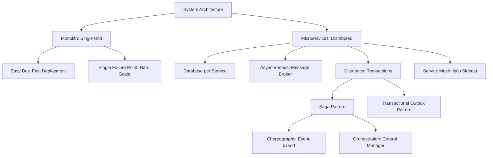

# Monolith vs Microservices Architecture

---

> **Mục tiêu đầu ra:** chọn kiến trúc dựa trên trade-off và thiết kế flow phân tán có consistency, retry và observability.

## 1. Khái niệm (Difficulty Breakdown)

### Beginner
Ở mức độ cơ bản:
- **Monolith Architecture (Kiến trúc nguyên khối)**: Là mô hình thiết kế phần mềm truyền thống, trong đó tất cả các thành phần chức năng (UI, Business Logic, Database Access) của ứng dụng được đóng gói và triển khai thành một khối duy nhất (Single Deployable Unit - ví dụ: tệp `.war` hoặc `.jar` chạy trên một máy chủ).
- **Microservices Architecture (Kiến trúc dịch vụ nhỏ)**: Là mô hình chia ứng dụng thành một tập hợp các dịch vụ nhỏ, độc lập. Mỗi dịch vụ chạy trong một tiến trình riêng, đảm nhận một nghiệp vụ cụ thể (Single Responsibility), giao tiếp với nhau qua các giao thức nhẹ như HTTP REST API hoặc Message Brokers, và có thể được triển khai độc lập.

### Intermediate
Đi sâu hơn vào chi tiết thiết kế:
- **Database-per-service**: Trong Microservices, mỗi service sở hữu một database riêng. Một service không được phép truy cập trực tiếp (Direct Query) vào database của service khác để đảm bảo tính cô lập và tránh xung đột schema dữ liệu.
- **IPC (Inter-Process Communication)**: Các dịch vụ giao tiếp qua hai hình thức:
  - *Đồng bộ (Synchronous)*: HTTP REST, gRPC (độ trễ thấp, kết nối điểm-điểm).
  - *Bất đồng bộ (Asynchronous)*: Message Broker như RabbitMQ, Apache Kafka (tăng tính chịu lỗi, giảm liên kết lỏng lẻo).
- **Service Discovery**: Cơ chế giúp các microservice tự động đăng ký và tìm thấy địa chỉ IP/Port của nhau khi chạy động trong môi trường container (ví dụ: Eureka, Consul).

### Advanced
Ở mức độ nâng cao, ta giải quyết bài toán giao dịch phân tán (Distributed Transactions) và tính nhất quán dữ liệu (Data Consistency):
- **Saga Pattern**: Giải quyết giao dịch phân tán kéo dài trên nhiều microservices mà không dùng cơ chế chặn 2-Phase Commit (2PC) vốn làm chậm hệ thống. Saga chia giao dịch lớn thành một chuỗi các giao dịch cục bộ (Local Transactions). Nếu một bước thất bại, Saga kích hoạt các **Giao dịch bù trừ (Compensating Transactions)** để hoàn tác (Rollback) các bước trước đó.
  - *Choreography (Biên đạo)*: Các dịch vụ tự phản ứng thông qua các Event/Message (không có người điều phối trung tâm).
  - *Orchestration (Dàn dựng)*: Có một Service Orchestrator điều phối trung tâm, ra lệnh cho các service chạy từng bước.
- **Transactional Outbox Pattern**: Đảm bảo việc cập nhật Database và phát Event (Publish Message) tới Message Broker diễn ra atomically. Nó ghi Event vào một bảng tạm `outbox` ngay trong transaction của DB chính, sau đó có một tiến trình riêng (`Debezium` hoặc polling worker) đọc bảng `outbox` để đẩy sang Kafka/RabbitMQ.

### Expert
Ở mức độ tối thượng (Architect):
- **Domain-Driven Design (DDD)**: Sử dụng khái niệm **Bounded Context** để xác định biên giới phân chia các Microservices hợp lý nhất, tránh tình trạng thiết kế ra các "Distributed Monolith" (hệ thống phân tán nhưng các service bị phụ thuộc chặt chẽ vào nhau).
- **CQRS (Command Query Responsibility Segregation)**: Tách biệt hoàn toàn luồng ghi (Command) và luồng đọc (Query) dữ liệu. Thường kết hợp với **Event Sourcing** (lưu trữ lịch sử thay đổi dưới dạng chuỗi các sự kiện liên tục thay vì chỉ lưu trạng thái hiện tại).
- **Service Mesh (Istio, Linkerd)**: Quản lý giao tiếp Service-to-Service ở cấp độ hạ tầng (infrastructure layer) bằng cách sử dụng các Sidecar Proxy (Envoy) chạy cạnh container ứng dụng, cung cấp các tính năng: mTLS (bảo mật), Tracing, Circuit Breaking, và Traffic Splitting mà không cần sửa mã nguồn.

---

## 2. Mục đích

- **Quy mô phát triển doanh nghiệp**: Khi đội ngũ kỹ sư tăng lên hàng trăm người, Monolith gây nghẽn do xung đột code trên cùng một codebase. Microservices cho phép chia nhỏ thành các tổ đội (Squads) độc lập, tự chọn công nghệ phù hợp và tự deploy dịch vụ của mình mà không ảnh hưởng đến toàn hệ thống.
- **Khả năng co giãn độc lập (Scale)**: Trong một ứng dụng E-commerce, tính năng xem sản phẩm (Catalog) có lượt truy cập gấp 100 lần tính năng thanh toán (Payment). Với Microservices, ta có thể scale-out 50 instance cho Catalog Service nhưng chỉ giữ 2 instance cho Payment Service để tiết kiệm chi phí phần cứng.
- **Fault Isolation (Cô lập lỗi)**: Nếu dịch vụ đề xuất sản phẩm (Recommendation Service) gặp lỗi và sập, người dùng vẫn có thể đặt mua hàng bình thường. Hệ thống Monolith có thể bị treo toàn bộ do rò rỉ bộ nhớ từ một chức năng nhỏ.

---

## 3. Kiến trúc hoạt động

### Saga Pattern: Choreography vs Orchestration

#### 1. Choreography (Biên đạo - Không có điều phối trung tâm)
```text
Order Service           Payment Service          Inventory Service
   │                           │                         │
   │ 1. Order Created          │                         │
   ├──────────────────────────>│                         │
   │                           │ 2. Payment Charged      │
   │                           ├────────────────────────>│
   │                           │                         │ 3. Stock Reserved
   │                           │                         │ (Success)
```

#### 2. Orchestration (Dàn dựng - Có Orchestrator điều phối)
```text
Client -> Order Service -> [Order Saga Orchestrator]
                             │
                             ├─ 1. Charge Payment ──> Payment Service
                             ├─ <── Payment OK ──────
                             │
                             ├─ 2. Reserve Stock ───> Inventory Service
                             ├─ <── Stock OK ────────
                             ▼
                        Order Completed
```

---

## 4. Ví dụ thực tế

### Tình huống:
Một ứng dụng đặt xe công nghệ (Ride-sharing App như Grab/Uber) ban đầu được thiết kế theo kiến trúc Monolith. Khi lượng người dùng tăng vọt lên hàng triệu lượt đặt xe mỗi ngày, hệ thống gặp các sự cố:
1. Khi cập nhật code của mô-đun bản đồ địa lý (Geofencing), toàn bộ hệ thống (gồm cả đặt xe, thanh toán, ví điện tử) phải ngừng hoạt động để deploy lại.
2. Một lỗi tràn bộ nhớ (Memory Leak) trong mô-đun chat giữa tài xế và khách hàng làm sập toàn bộ máy chủ Web, khiến khách hàng không thể đặt xe.

### Giải pháp của Architect:
Tách hệ thống thành các Microservices:
- **Passenger & Driver Service**: Quản lý thông tin tài khoản.
- **Trip (Booking) Service**: Điều phối đặt xe.
- **Matching Service**: Chạy thuật toán gán tài xế (ngốn nhiều CPU, scale độc lập).
- **Payment Service**: Xử lý giao dịch tài chính (yêu cầu bảo mật cao PCI-DSS).
- **Notification Service**: Gửi thông báo đẩy (Asynchronous).

---

## 5. Code Demo

Dưới đây là một triển khai cơ bản của **Transactional Outbox Pattern** sử dụng Spring Boot để lưu trữ sự kiện Order Created vào DB và một Scheduler quét bảng outbox để xuất bản sang Message Broker, đảm bảo tính nhất quán dữ liệu.

### 1. Thực thể Outbox Event:
```java
package com.knowledgebase.systemdesign.outbox;

import jakarta.persistence.*;
import java.time.LocalDateTime;

@Entity
@Table(name = "outbox_events")
public class OutboxEvent {

    @Id
    @GeneratedValue(strategy = GenerationType.IDENTITY)
    private Long id;

    private String aggregateType; // Ví dụ: "Order"

    private String aggregateId;   // ID của Order

    private String eventType;     // Ví dụ: "ORDER_CREATED"

    @Column(columnDefinition = "TEXT")
    private String payload;       // JSON dữ liệu sự kiện

    private boolean processed;

    private LocalDateTime createdAt;

    // Constructors, Getters, Setters
    public OutboxEvent() {}

    public OutboxEvent(String aggregateType, String aggregateId, String eventType, String payload) {
        this.aggregateType = aggregateType;
        this.aggregateId = aggregateId;
        this.eventType = eventType;
        this.payload = payload;
        this.processed = false;
        this.createdAt = LocalDateTime.now();
    }

    public Long getId() { return id; }
    public String getPayload() { return payload; }
    public boolean isProcessed() { return processed; }
    public void setProcessed(boolean processed) { this.processed = processed; }
}
```

### 2. Business Service viết đồng thời dữ liệu nghiệp vụ và Event Outbox trong cùng một Transaction:
```java
package com.knowledgebase.systemdesign.outbox;

import org.springframework.beans.factory.annotation.Autowired;
import org.springframework.stereotype.Service;
import org.springframework.transaction.annotation.Transactional;

@Service
public class OrderService {

    @Autowired
    private OrderRepository orderRepository; // Bảng lưu thông tin đơn hàng

    @Autowired
    private OutboxRepository outboxRepository; // Bảng lưu Event Outbox

    @Transactional
    public void createOrder(Order order) {
        // 1. Lưu đơn hàng vào DB
        Order savedOrder = orderRepository.save(order);

        // 2. Tạo JSON Payload
        String payload = String.format("{\"orderId\":\"%s\",\"amount\":%.2f}", 
                savedOrder.getId(), savedOrder.getAmount());

        // 3. Ghi sự kiện vào bảng Outbox (Cùng Transaction DB)
        OutboxEvent event = new OutboxEvent(
                "Order",
                savedOrder.getId().toString(),
                "ORDER_CREATED",
                payload
        );
        outboxRepository.save(event);
        
        // Nếu ở đây có lỗi xảy ra, cả Order và OutboxEvent đều được Rollback
    }
}
```

### 3. Outbox Publisher (Worker chạy ngầm gửi tin nhắn sang Kafka/RabbitMQ):
```java
package com.knowledgebase.systemdesign.outbox;

import org.springframework.beans.factory.annotation.Autowired;
import org.springframework.scheduling.annotation.Scheduled;
import org.springframework.stereotype.Component;
import org.springframework.transaction.annotation.Transactional;
import java.util.List;

@Component
public class OutboxPublisher {

    @Autowired
    private OutboxRepository outboxRepository;

    @Autowired
    private MessageBrokerSender messageBrokerSender; // Bean giả lập gửi tin nhắn

    @Scheduled(fixedDelay = 5000) // Chạy quét 5 giây một lần
    @Transactional
    public void publishPendingEvents() {
        // Tìm các event chưa gửi
        List<OutboxEvent> pendingEvents = outboxRepository.findByProcessedFalse();

        for (OutboxEvent event : pendingEvents) {
            try {
                // Gửi event sang Kafka/RabbitMQ
                messageBrokerSender.send(event.getPayload());

                // Đánh dấu đã xử lý thành công
                event.setProcessed(true);
                outboxRepository.save(event);
            } catch (Exception e) {
                // Ghi log lỗi và bỏ qua để thử lại ở lần quét sau
                System.err.println("Failed to publish event ID: " + event.getId() + " - " + e.getMessage());
            }
        }
    }
}
```

---

## 6. Best Practices

1. **Đừng bắt đầu dự án bằng Microservices**: Với các startup hoặc dự án mới chưa rõ nghiệp vụ, hãy bắt đầu bằng một **Modular Monolith** (Nguyên khối phân tách mô-đun rõ ràng trong code). Việc chuyển dịch sang Microservices quá sớm khi chưa rõ ranh giới nghiệp vụ sẽ tạo ra thảm họa về chi phí vận hành.
2. **Không dùng Shared Database**: Luôn thiết kế cơ sở dữ liệu riêng cho từng dịch vụ để tránh sự phụ thuộc chéo về Schema. Nếu cần dữ liệu của service khác, hãy sử dụng cơ chế nhân bản dữ liệu (Data Replication) hoặc gọi API / lắng nghe Event.
3. **Thiết kế tính chất Idempotency cho Consumers**: Trong hệ thống phân tán, tin nhắn có thể được gửi lặp lại (At-Least-Once Delivery). Các consumer xử lý tin nhắn (ví dụ: Service thanh toán) bắt buộc phải kiểm tra trùng lặp (Idempotent Key) để tránh việc trừ tiền khách hàng 2 lần.
4. **Sử dụng APM và Distributed Tracing**: Triển khai các công cụ như OpenTelemetry, Jaeger, hoặc Zipkin để theo dõi luồng request đi qua nhiều microservices khác nhau thông qua **Trace ID**.
5. **Đóng gói chuẩn Container**: Mọi microservice đều phải được Dockerize hóa và khai báo cấu hình qua biến môi trường (Environment Variables) theo tiêu chuẩn 12-Factor App.

---

## 7. Common Mistakes (Anti-patterns)

### 1. Distributed Monolith
- **Anti-pattern**: Chia nhỏ code thành các Microservices nhưng các dịch vụ giao tiếp hoàn toàn bằng các API đồng bộ (HTTP REST) nối tiếp nhau. 
- **Hệ quả**: Nếu Service A gọi Service B, Service B lại gọi Service C, hệ thống sẽ có độ trễ cực cao và nếu Service C sập, toàn bộ chuỗi A và B cũng sập theo.
- **Khắc phục**: Chuyển đổi sang giao tiếp bất đồng bộ thông qua Message Broker và áp dụng kỹ thuật Event-driven.

### 2. Thiết kế Saga bù trừ thiếu Idempotency
Nếu giao dịch bù trừ (Compensating Transaction) để hoàn tiền hoặc hủy đơn hàng bị lỗi mạng và gửi lại 2 lần, hệ thống có thể hoàn tiền gấp đôi cho khách hàng nếu API hủy không có tính Idempotent.

---

## 8. Interview Questions

#### Q1: So sánh ưu nhược điểm của Monolith và Microservices?
* **Đáp án**:
  - `Monolith`: Ưu điểm là dễ phát triển, dễ deploy, test nhanh, không mất overhead giao tiếp qua mạng. Nhược điểm là khó scale độc lập, codebase quá lớn làm chậm IDE và build time, nguy cơ sập cả hệ thống khi một module nhỏ lỗi.
  - `Microservices`: Ưu điểm là scale độc lập tối ưu phần cứng, phân tách đội ngũ phát triển dễ dàng, công nghệ linh hoạt, cô lập lỗi tốt. Nhược điểm là phức tạp trong vận hành, khó đảm bảo tính nhất quán dữ liệu tức thời, quản lý hệ thống phân tán phức tạp.

#### Q2: Tại sao nguyên tắc "Database per service" lại là bắt buộc trong Microservices?
* **Đáp án**: Để đảm bảo tính độc lập và lỏng lẻo (loose coupling) giữa các dịch vụ. Nếu hai dịch vụ cùng dùng chung một DB, khi Service A thay đổi cấu trúc bảng (schema change) sẽ làm sập Service B. Đồng thời, việc chia DB riêng giúp mỗi dịch vụ tự do chọn loại DB phù hợp nhất (ví dụ: Catalog dùng MongoDB, Order dùng PostgreSQL, Session dùng Redis).

#### Q3: Giải thích cơ chế hoạt động của Saga Pattern? Phân biệt Choreography và Orchestration?
* **Đáp án**: Saga là chuỗi các giao dịch cục bộ để đảm bảo tính nhất quán dữ liệu phân tán.
  - `Choreography`: Không có trung tâm điều phối. Các service tự lắng nghe event từ hàng đợi và tự chạy bước của mình, sau đó phát event tiếp theo. Dễ thiết kế cho hệ thống nhỏ nhưng khó kiểm soát luồng khi hệ thống lớn.
  - `Orchestration`: Có một Orchestrator trung tâm quản lý luồng. Nó gọi trực tiếp các dịch vụ chạy và theo dõi trạng thái. Thích hợp cho các luồng nghiệp vụ phức tạp, dễ theo dõi trạng thái nhưng Orchestrator có thể trở thành Single Point of Failure.

#### Q4: Transactional Outbox Pattern giải quyết vấn đề gì?
* **Đáp án**: Giải quyết vấn đề **Dual-Write** trong hệ thống phân tán: Khi ta cập nhật Database thành công nhưng do lỗi mạng, việc gửi Event sang Message Broker bị thất bại, dẫn đến dữ liệu bị bất nhất (DB đã lưu nhưng các service khác không biết). Outbox Pattern lưu Event vào một bảng tạm trong cùng transaction ghi dữ liệu chính, sau đó dùng một Worker riêng gửi Event đó đi, đảm bảo tính gửi tin cậy (At-Least-Once Delivery).

#### Q5: Sự khác biệt giữa gRPC và REST API trong giao tiếp Microservices?
* **Đáp án**: 
  - `REST API`: Sử dụng HTTP/1.1, định dạng dữ liệu JSON dạng văn bản (text), dễ debug, phổ biến nhưng tải trọng dữ liệu lớn và tốc độ chậm hơn.
  - `gRPC`: Sử dụng HTTP/2, định dạng dữ liệu nhị phân (Protocol Buffers), hỗ trợ bidirectional streaming, tốc độ cực nhanh, tiết kiệm băng thông nhưng khó debug trực tiếp và yêu cầu code generator.

#### Q6: Tính nhất quán cuối cùng (Eventual Consistency) là gì?
* **Đáp án**: Là trạng thái dữ liệu trong hệ thống phân tán không đảm bảo nhất quán ngay lập tức (Strong Consistency) sau một thay đổi, nhưng cam kết tất cả các node trong hệ thống sẽ đồng bộ và nhất quán sau một khoảng thời gian nhất định thông qua cơ chế đồng bộ bất đồng bộ (ví dụ: qua Kafka).

#### Q7: Định lý CAP là gì? Tại sao trong Microservices ta thường chọn AP thay vì CP?
* **Đáp án**: Định lý CAP phát biểu rằng một hệ thống phân tán chỉ có thể đáp ứng tối đa 2 trong 3 yếu tố: Consistency (Nhất quán), Availability (Sẵn sàng), và Partition Tolerance (Chịu phân mảnh mạng). Vì lỗi phân mảnh mạng (P) là không thể tránh khỏi ở hạ tầng thực tế, hệ thống bắt buộc phải chọn giữa C hoặc A. Trong các ứng dụng Web/Microservices thông thường, ta ưu tiên Availability (AP) để giữ hệ thống luôn phục vụ khách hàng và chấp nhận tính nhất quán cuối cùng (Eventual Consistency).

#### Q8: Ý nghĩa của Trace ID và Span ID trong Distributed Tracing?
* **Đáp án**: 
  - `Trace ID`: Là ID duy nhất được tạo ra khi request bắt đầu đi vào hệ thống (ví dụ từ API Gateway) và được truyền qua HTTP Header (`X-B3-TraceId`) tới tất cả các microservices liên quan trong suốt chuỗi gọi đó, giúp gom nhóm toàn bộ log của request.
  - `Span ID`: Đại diện cho một đơn vị công việc nhỏ (như một cuộc gọi DB hoặc một lời gọi API sang service khác) nằm trong Trace lớn đó.

#### Q9: CQRS (Command Query Responsibility Segregation) là gì? Khi nào nên áp dụng?
* **Đáp án**: CQRS là mô hình tách biệt hoàn toàn luồng ghi (Command - Thay đổi dữ liệu) và luồng đọc (Query - Lấy dữ liệu). Thích hợp áp dụng cho các hệ thống có lượng đọc cực kỳ lớn so với ghi, hoặc các màn hình dashboard hiển thị dữ liệu tổng hợp phức tạp từ nhiều nguồn khác nhau, giúp tối ưu hóa sơ đồ DB riêng cho đọc và ghi.

#### Q10: Service Mesh giải quyết bài toán gì và nó hoạt động thế nào?
* **Đáp án**: Service Mesh giải quyết bài toán quản lý giao tiếp mạng, bảo mật và giám sát giữa hàng nghìn microservices mà không muốn làm bẩn mã nguồn ứng dụng. Nó hoạt động bằng cách triển khai các **Sidecar Proxy** (như Envoy) chạy kèm theo mỗi Container ứng dụng. Mọi lưu lượng mạng vào/ra ứng dụng đều đi qua Proxy này, cho phép hạ tầng quản lý cấu hình mTLS, Circuit Breaker, Tracing và điều phối lưu lượng tập trung.

---

## 9. Senior Notes

> [!IMPORTANT]
> **Kinh nghiệm thực tế khi triển khai Microservices:**
> 1. **Cảnh giác với "Choreography Saga Hell"**: Khi bạn có hàng chục microservices tự bắn event cho nhau để thực hiện một luồng đặt hàng, việc vẽ lại luồng nghiệp vụ trên sơ đồ là bất khả thi. Khi xảy ra lỗi, việc debug tìm xem bước nào bị hỏng giống như mò kim đáy bể. Đối với các luồng nghiệp vụ cốt lõi dài hơn 3 bước, hãy sử dụng **Orchestration Saga** để kiểm soát trạng thái tập trung.
> 2. **Kiểm soát Database Connections**: Nhiều Microservice chạy độc lập đồng nghĩa với việc số lượng kết nối tới DB Cluster tăng lên gấp bội. Cần cấu hình giới hạn connection pool ở mỗi microservice hợp lý, tránh tình trạng scale-out service làm nghẽn và sập Database trung tâm do quá tải kết nối.

---

## 10. Tài liệu tham khảo

1. [Microservices.io - Architectural Patterns by Chris Richardson](https://microservices.io/)
2. [Microsoft Azure Architecture Center: Microservices architecture design](https://learn.microsoft.com/en-us/azure/architecture/guide/architecture-styles/microservices)
3. Sách: *Microservices Patterns* - Chris Richardson.
4. Sách: *Building Microservices* - Sam Newman.

---
# PHẦN BỔ TRỢ CHƯƠNG

### ✅ Checklist cần nhớ
- [ ] Phân biệt rõ ranh giới khi nào nên dùng Monolith và khi nào chuyển sang Microservices.
- [ ] Nắm vững nguyên tắc cô lập dữ liệu (Database-per-service).
- [ ] Hiểu rõ cơ chế hoạt động của Saga Pattern (Choreography và Orchestration).
- [ ] Biết cách áp dụng Transactional Outbox Pattern để tránh lỗi Dual-Write.
- [ ] Hiểu định lý CAP và cách ứng dụng chọn AP/CP.

### ✅ Mindmap (Mermaid)



### ✅ Cheat Sheet

* **Cấu hình Trace ID tự động với Spring Cloud Sleuth/Micrometer (application.properties)**:
  ```properties
  management.tracing.sampling.probability=1.0 # Trace 100% request
  ```
* **Kịch bản rollback của Compensating Transaction**:
  1. Action: `createOrder` -> DB lưu đơn hàng trạng thái `PENDING`.
  2. Action: `chargePayment` -> Thất bại (hết số dư).
  3. Compensating Action: `cancelOrder` -> DB cập nhật đơn hàng trạng thái `CANCELLED`.

### ✅ Interview Tips

* Khi được hỏi **"Khi nào bạn sẽ khuyên doanh nghiệp chuyển từ Monolith sang Microservices?"**, câu trả lời khôn ngoan của một Architect là: *"Chỉ chuyển khi Monolith đã chạm giới hạn về quy mô phát triển của tổ chức (các team tranh chấp code, thời gian build & deploy quá lâu) hoặc khi có nhu cầu scale-out độc lập các phần tải trọng cực lớn của hệ thống. Nếu một dự án startup chưa rõ nghiệp vụ, tôi sẽ khuyên dùng Modular Monolith trước."*
* Hãy chủ động vẽ sơ đồ **Transactional Outbox Pattern** lên bảng trắng khi được hỏi về cách đồng bộ dữ liệu giữa Database và Message Broker (như Kafka) để ghi điểm tuyệt đối.

### ✅ Mini Project: Simple Saga Orchestrator simulator

**Mô tả**: Thiết kế một lớp Orchestrator mô phỏng luồng đặt hàng đơn giản gồm 3 bước: Thanh toán (`Payment`), Trừ kho (`Inventory`), và Hủy đơn hàng (Compensating action) nếu bước kho bị lỗi.

**Triển khai**:

```java
package com.knowledgebase.systemdesign.project;

public class SimpleSagaOrchestrator {

    public interface ServiceAction {
        boolean execute();
        void compensate();
    }

    public static class PaymentService implements ServiceAction {
        public boolean execute() {
            System.out.println("Saga Step 1: Payment Charged Successfully.");
            return true;
        }
        public void compensate() {
            System.out.println("Saga Compensation 1: Refund Payment.");
        }
    }

    public static class InventoryService implements ServiceAction {
        private final boolean simulateFailure;
        public InventoryService(boolean simulateFailure) {
            this.simulateFailure = simulateFailure;
        }
        public boolean execute() {
            if (simulateFailure) {
                System.out.println("Saga Step 2: Out of Stock! Inventory Reservation Failed.");
                return false;
            }
            System.out.println("Saga Step 2: Stock Reserved Successfully.");
            return true;
        }
        public void compensate() {
            System.out.println("Saga Compensation 2: Release Stock.");
        }
    }

    public void runOrderSaga(boolean simulateStockFailure) {
        ServiceAction step1 = new PaymentService();
        ServiceAction step2 = new InventoryService(simulateStockFailure);

        System.out.println("--- Starting Order Saga ---");
        
        // Bước 1: Chạy Payment
        if (step1.execute()) {
            // Bước 2: Chạy Inventory
            if (!step2.execute()) {
                // Thất bại bước 2 -> Chạy rollback bù trừ bước 1
                System.out.println("Saga Failed. Initiating compensation chain...");
                step1.compensate();
                System.out.println("Saga compensation finished. System is consistent.");
            } else {
                System.out.println("Saga Completed Successfully!");
            }
        }
    }

    public static void main(String[] args) {
        SimpleSagaOrchestrator orchestrator = new SimpleSagaOrchestrator();
        // Chạy thành công
        orchestrator.runOrderSaga(false);
        System.out.println();
        // Chạy thất bại để xem bù trừ
        orchestrator.runOrderSaga(true);
    }
}
```

---

### ✅ Bài tập thực hành

#### Bài tập 1: Thiết kế sơ đồ Saga cho Đặt Phòng Khách Sạn
Hãy vẽ sơ đồ luồng (bằng Mermaid) cho hệ thống đặt phòng khách sạn (Booking) gồm: `Booking Service`, `Payment Service`, `Hotel Partner Service`. Thiết lập kịch bản khi thanh toán thành công nhưng đối tác khách sạn báo hết phòng đột xuất.
* **Gợi ý Giải pháp**: Vẽ sơ đồ Orchestrator gọi Book -> Pay -> Reserve Hotel. Nếu Reserve Hotel trả về lỗi, kích hoạt Compensating Action hoàn tiền (Refund Payment) và cập nhật Booking trạng thái Hủy.

#### Bài tập 2: Phân tích cơ chế Khử trùng lặp (Idempotent Consumer)
Hãy viết một đoạn mã giả (pseudo-code) của một Consumer nhận tin nhắn tạo tài khoản từ hàng đợi, sử dụng bảng `processed_messages` trong Database để ngăn chặn xử lý lại tin nhắn bị trùng lặp.
* **Gợi ý Giải pháp**:
  - `INSERT INTO processed_messages (message_id) VALUES (?)`
  - Nếu câu lệnh trên ném ra lỗi trùng khóa chính (Duplicate Key Exception), Consumer sẽ bỏ qua không xử lý tin nhắn đó nữa và xác nhận (ACK) với broker.

---

### ✅ References
- [Ref1] Microservice Patterns - Chris Richardson (Book).
- [Ref2] Martin Fowler blog: [Microservices Guide](https://martinfowler.com/articles/microservices.html)
