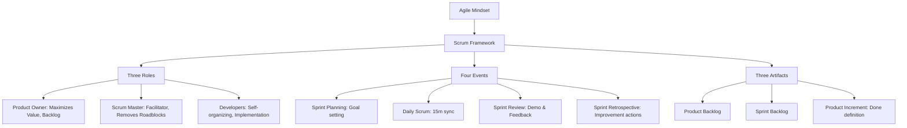

# Agile & Scrum Framework in Action

---

## 1. Khái niệm (Difficulty Breakdown)

### # Beginner
Ở mức độ cơ bản:
- **Agile**: Là một tư duy (mindset) quản trị dự án dựa trên 4 tôn chỉ và 12 nguyên lý của **Tuyên ngôn Agile (Agile Manifesto)**, ưu tiên tính linh hoạt, thích ứng nhanh với thay đổi, và bàn giao giá trị sớm cho khách hàng thay vì lập kế hoạch cứng nhắc từ đầu.
- **Scrum**: Là một framework cụ thể triển khai tư duy Agile phổ biến nhất. Scrum chia quy trình phát triển thành các chu kỳ ngắn, cố định từ 1 đến 4 tuần gọi là **Sprint**.
- **Scrum Roles (3 vai trò chính)**:
  - **Product Owner (PO)**: Người chịu trách nhiệm định nghĩa sản phẩm, quản lý và sắp xếp thứ tự ưu tiên của hàng đợi yêu cầu (**Product Backlog**) nhằm tối đa hóa giá trị sản phẩm.
  - **Scrum Master (SM)**: Người hỗ trợ (Facilitator) giúp toàn đội hiểu và thực hành đúng Scrum, loại bỏ các rào cản (impediments) cho đội ngũ phát triển.
  - **Developers (Đội ngũ phát triển)**: Tập hợp các kỹ sư trực tiếp xây dựng sản phẩm, tự tổ chức và liên chức năng (Cross-functional - có đủ kỹ năng để hoàn thành công việc).

### # Intermediate
Đi sâu vào quy trình vận hành và ước lượng:
- **Scrum Events (Các sự kiện chính)**:
  - **Sprint Planning (Lập kế hoạch)**: Họp đầu Sprint để chọn ra các yêu cầu từ Product Backlog đưa vào **Sprint Backlog** cam kết hoàn thành.
  - **Daily Scrum (Họp hàng ngày)**: Họp nhanh 15 phút hàng ngày để cập nhật tiến độ, lên kế hoạch cho ngày hôm nay và nêu các khó khăn.
  - **Sprint Review (Sơ kết)**: Trình diễn sản phẩm chạy được cho khách hàng/PO xem để nhận phản hồi cuối Sprint.
  - **Sprint Retrospective (Cải tiến)**: Họp nội bộ đội ngũ để phân tích những gì làm tốt, chưa tốt và đề xuất hành động cải tiến cho Sprint sau.
- **User Story**: Cách mô tả yêu cầu tính năng từ góc nhìn của người dùng cuối: *“Là một [vai trò], tôi muốn [chức năng], để [giá trị nhận được]”*, đi kèm các tiêu chí nghiệm thu rõ ràng (**Acceptance Criteria**).
- **Story Point & Planning Poker**: Phương pháp ước lượng kích thước/độ phức tạp của User Story dựa trên dãy số Fibonacci (1, 2, 3, 5, 8, 13...). Các thành viên sử dụng bộ bài Planning Poker để đồng thuận đưa ra điểm ước lượng một cách khách quan.

### # Advanced
Ở mức độ nâng cao về quản lý số liệu và nợ kỹ thuật:
- **Scrum Metrics (Các chỉ số đo lường)**:
  - **Velocity (Vận tốc)**: Tổng số Story Points một team hoàn thành trung bình trong một Sprint. Dùng để dự báo kế hoạch bàn giao dài hạn.
  - **Burndown Chart (Biểu đồ năng suất)**: Theo dõi lượng công việc còn lại theo thời gian thực hàng ngày của Sprint, giúp phát hiện sớm nguy cơ vỡ kế hoạch.
  - **Burnup Chart (Biểu đồ tích lũy)**: Theo dõi tiến độ tích lũy so với tổng phạm vi công việc dự án.
- **Technical Debt (Nợ kỹ thuật) in Scrum**: Việc bỏ qua chất lượng code, viết unit test hoặc refactoring để kịp tiến độ. Trong Scrum nâng cao, nợ kỹ thuật phải được định lượng và đưa vào Product Backlog dưới dạng các **Refactoring Stories** chiếm khoảng 10-20% dung lượng (Capacity) của mỗi Sprint để xử lý định kỳ.

### # Expert
Ở mức độ tối thượng (Architect / Agile Coach):
- **Scaling Agile (Mở rộng Agile)**: Khi dự án có từ 3 đến hàng chục Scrum teams cùng làm một sản phẩm. Ta áp dụng các mô hình:
  - **Scrum of Scrums**: Cuộc họp điều phối giữa đại diện các team.
  - **LeSS (Large-Scale Scrum)**: Giữ cấu trúc tối giản của Scrum truyền thống nhưng áp dụng cho nhiều team làm chung 1 PO và 1 Product Backlog.
  - **SAFe (Scaled Agile Framework)**: Mô hình quy mô lớn cấp tập đoàn, phân lớp rõ ràng từ Team, Program, Portfolio, tổ chức các đợt lập kế hoạch PI (Program Increment) kéo dài.
- **Scrum in High-Compliance Environments**: Triển khai Scrum trong các dự án y tế, hàng không, hoặc tài chính (đòi hỏi tài liệu kỹ thuật cực kỳ nghiêm ngặt và quy trình kiểm duyệt khắt khe). Architect thiết kế định nghĩa hoàn thành (**Definition of Done - DoD**) tích hợp sẵn các bài test bảo mật, quét code tự động và tài liệu hóa tự động vào quy trình CI/CD.

---

## 2. Mục đích

Trong các doanh nghiệp công nghệ:
- **Linh hoạt thích ứng với thị trường**: Khách hàng thay đổi yêu cầu liên tục. Thay vì phải làm lại kế hoạch 1 năm (như mô hình Thác nước Waterfall), Scrum cho phép điều chỉnh hướng đi của sản phẩm sau mỗi Sprint (2 tuần) mà không gây lãng phí tài nguyên lớn.
- **Bàn giao giá trị sớm (Early Value Delivery)**: Tạo ra phiên bản sản phẩm chạy được tối giản (**MVP - Minimum Viable Product**) để đưa ra thị trường chạy thử, thu thập ý kiến người dùng và tạo ra dòng tiền sớm cho doanh nghiệp.
- **Nâng cao tinh thần tự chủ của Kỹ sư**: Scrum loại bỏ mô hình quản lý áp đặt (Command and Control). Developers tự ước lượng điểm công việc và tự nhận việc trong Sprint, thúc đẩy tinh thần trách nhiệm và sáng tạo.

---

## 3. Kiến trúc hoạt động

### Luồng Hoạt động của Quy trình Scrum (Scrum Framework Flow)

```text
  Product          Sprint Planning                     Daily Scrum (15m)
  Backlog              Meeting                                │
┌─────────┐         ┌───────────┐                             ▼
│ Story 1 │ ──────> │  Sprint   │ ───> [ 2-Week Sprint ] ──────────────┐
│ Story 2 │         │  Backlog  │                                      │
│ Story 3 │         └───────────┘                                      │
│ Story 4 │               ▲                                            │
└─────────┘               │                                            ▼
                          └─────── [ Retrospective ] <─── [ Review ] <─┘
                                     (Improvement)       (Demo Product)
```

---

## 4. Ví dụ thực tế

### Tình huống:
Một dự án xây dựng ứng dụng Ví điện tử doanh nghiệp áp dụng Scrum nhưng gặp các vấn đề:
1. Đội ngũ DEV liên tục bị quá tải, cuối Sprint luôn còn 30-40% công việc chưa hoàn thành (Sprint Spillage).
2. Product Owner liên tục thay đổi yêu cầu giữa chừng khi Sprint đang chạy, yêu cầu DEV làm gấp tính năng mới phát sinh.
3. Kỹ sư trưởng (Tech Lead) phàn nàn hệ thống ngày càng chậm, nhiều lỗi ẩn do không có thời gian refactor code cũ vì PO chỉ ưu tiên làm tính năng mới hiển thị được UI.

### Giải pháp xử lý từ Architect & Scrum Master:
1. **Chuẩn hóa Ước lượng**: Sử dụng **Planning Poker** để DEV tự ước lượng độ phức tạp, tính toán chỉ số **Velocity** thực tế qua 3 Sprint gần nhất (ví dụ trung bình team chỉ làm được 40 Story Points/Sprint). Từ Sprint sau, cấm PO nhồi nhét quá 40 points vào Sprint Planning.
2. **Quy tắc Bất biến của Sprint**: Thiết lập luật: Một khi Sprint đã bắt đầu, nội dung Sprint Backlog là khóa (Frozen). PO không được phép can thiệp. Nếu có tính năng khẩn cấp, PO phải đợi Sprint sau hoặc yêu cầu hủy bỏ (Abort) toàn bộ Sprint hiện tại.
3. **Định nghĩa Hoàn thành (Definition of Done - DoD) chặt chẽ**: Đưa tiêu chí bắt buộc: *“Code phải được review bởi Tech Lead, độ bao phủ Unit Test >= 70%, quét bảo mật qua CI/CD đạt pass”* thì mới được coi là Done.
4. **Phân bổ Technical Debt**: Thỏa thuận dành **15% capacity** của mỗi Sprint cho các công việc kỹ thuật (Refactoring, Nâng cấp thư viện, Tối ưu SQL) do DEV tự định nghĩa và quản lý.

---

## 5. Code Demo

Dưới đây là một ví dụ thực tế mô tả cách tổ chức một **Jira Backlog Workflow Configuration** (Định nghĩa quy trình trạng thái công việc của Task) chuẩn Enterprise bằng mã mô tả trạng thái (State Pattern) trong code Backend để đồng bộ hóa trạng thái Task giữa ứng dụng quản lý nội bộ và hệ thống Jira Cloud API.

### Mã nguồn Service đồng bộ trạng thái Task:
```java
package com.knowledgebase.agile.project;

import java.util.EnumSet;

/**
 * Enterprise Task State Machine representing Scrum Task Lifecycle on a Jira Board.
 */
public class ScrumTaskTracker {

    // Định nghĩa các trạng thái chuẩn của một Task trên Jira Board
    public enum TaskStatus {
        BACKLOG,
        TO_DO,
        IN_PROGRESS,
        CODE_REVIEW,
        IN_TESTING,
        DONE
    }

    public static class Task {
        private final String id;
        private final String title;
        private final int storyPoints;
        private TaskStatus status;

        public Task(String id, String title, int storyPoints) {
            this.id = id;
            this.title = title;
            this.storyPoints = storyPoints;
            this.status = TaskStatus.BACKLOG;
        }

        public String getId() { return id; }
        public TaskStatus getStatus() { return status; }
        public void setStatus(TaskStatus status) { this.status = status; }
        public int getStoryPoints() { return storyPoints; }
    }

    /**
     * Chuyển đổi trạng thái Task tuân thủ nghiêm ngặt quy trình làm việc (Scrum Workflow).
     * Ngăn chặn hành vi nhảy cóc trạng thái (ví dụ từ TO_DO nhảy thẳng sang DONE không qua TEST).
     */
    public void transitionTask(Task task, TaskStatus newStatus) {
        TaskStatus currentStatus = task.getStatus();
        
        boolean isValidTransition = false;

        switch (currentStatus) {
            case BACKLOG:
                isValidTransition = newStatus == TaskStatus.TO_DO;
                break;
            case TO_DO:
                isValidTransition = newStatus == TaskStatus.IN_PROGRESS;
                break;
            case IN_PROGRESS:
                isValidTransition = newStatus == TaskStatus.CODE_REVIEW;
                break;
            case CODE_REVIEW:
                isValidTransition = EnumSet.of(TaskStatus.IN_TESTING, TaskStatus.IN_PROGRESS).contains(newStatus);
                break;
            case IN_TESTING:
                isValidTransition = EnumSet.of(TaskStatus.DONE, TaskStatus.IN_PROGRESS).contains(newStatus);
                break;
            case DONE:
                isValidTransition = false; // Một khi đã Done thì không được tự ý quay lại trừ khi PO Re-open
                break;
        }

        if (!isValidTransition) {
            throw new IllegalStateException(String.format(
                    "Invalid Scrum Workflow transition: Cannot move task from %s to %s", 
                    currentStatus, newStatus));
        }

        task.setStatus(newStatus);
        System.out.println("Jira Task ID " + task.getId() + " updated status to: " + newStatus);
    }
}
```

---

## 6. Best Practices

1. **Daily Scrum không phải là báo cáo tiến độ cho sếp**: Cuộc họp 15 phút là để các Developers tự trao đổi và lập kế hoạch phối hợp với nhau. Mọi người nên tập trung trả lời 3 câu hỏi hướng tới mục tiêu Sprint: *Hôm qua tôi làm được gì để giúp đội đạt Sprint Goal? Hôm nay tôi sẽ làm gì? Tôi có gặp khó khăn gì không?*
2. **Luôn xác định Sprint Goal (Mục tiêu Sprint)**: Một Sprint không được chỉ là tập hợp các task rời rạc. Phải có một mục tiêu cốt lõi đồng nhất (ví dụ: *“Hoàn thành hệ thống thanh toán qua cổng thẻ Visa”*). Sprint Goal giúp định hướng cho team khi có các vấn đề phát sinh phải cắt bớt scope.
3. **Độc lập ước lượng trong Planning Poker**: Các thành viên phải đưa ra điểm số ước lượng cùng một lúc (lật bài đồng thời). Việc người có kinh nghiệm nhất (Tech Lead) phát biểu điểm trước sẽ tạo ra tâm lý đám đông (Anchoring bias), khiến các DEV trẻ không dám đưa ra ý kiến thực tế của mình.
4. **Duy trì nhịp độ ổn định**: Giữ độ dài Sprint cố định (khuyên dùng 2 tuần). Việc thay đổi liên tục độ dài Sprint (tuần này 1 tuần, tuần sau 3 tuần) làm hỏng khả năng tính toán vận tốc (Velocity) của team.
5. **Definition of Done (DoD) phải được đồng thuận**: DoD phải được dán công khai và tất cả thành viên cam kết tuân thủ. Không có khái niệm "Xong 90%". Một Story hoặc là Done hoàn toàn (đủ tiêu chuẩn DoD), hoặc là Not Done (0 điểm).

---

## 7. Common Mistakes (Anti-patterns)

### 1. Scrum Master kiêm nhiệm Tech Lead hoặc Project Manager
- **Anti-pattern**: Tech Lead hoặc Project Manager làm Scrum Master của team.
- **Hệ quả**: SM sẽ sử dụng quyền lực quản lý để ép DEV nhận thêm việc, biến cuộc họp Daily thành họp báo cáo tiến độ căng thẳng, làm mất đi tính chất tự tổ chức (Self-organizing) của Scrum. SM phải là người phục vụ hỗ trợ độc lập.

### 2. PO thay đổi yêu cầu của User Story đang trong Sprint
PO tự ý thêm bớt Acceptance Criteria hoặc đổi thiết kế của một User Story khi DEV đang code dở trong Sprint, gây vỡ kế hoạch và ức chế cho đội ngũ phát triển.

---

## 8. Interview Questions

#### Q1: Bản chất của Scrum là gì? Phân biệt Agile và Scrum?
* **Đáp án**: Agile là một triết lý, tư duy quản lý dự án (được định nghĩa qua 4 tôn chỉ và 12 nguyên lý của Agile Manifesto). Scrum là một framework cụ thể chứa các vai trò, sự kiện và quy tắc rõ ràng để thực hành triết lý Agile đó. Có thể hiểu Agile là con đường, còn Scrum là phương tiện di chuyển trên con đường đó.

#### Q2: Trình bày vai trò của Product Owner, Scrum Master và Developers trong một Scrum Team?
* **Đáp án**:
  - `Product Owner (PO)`: Quản lý Product Backlog, định hình tầm nhìn sản phẩm, chịu trách nhiệm về ROI (lợi nhuận/giá trị mang lại), quyết định yêu cầu nào làm trước làm sau.
  - `Scrum Master (SM)`: Đảm bảo quy trình Scrum được vận hành đúng, hỗ trợ loại bỏ các khó khăn (impediments) cản trở team, bảo vệ team khỏi các can thiệp ngoài.
  - `Developers`: Tự tổ chức lên kế hoạch công việc, ước lượng điểm phức tạp, trực tiếp code và đảm bảo chất lượng sản phẩm đạt tiêu chuẩn Definition of Done.

#### Q3: Story Point là gì? Tại sao không dùng Giờ/Ngày (Man-days) để ước lượng trong Scrum?
* **Đáp án**: Story Point là đơn vị đo độ phức tạp, kích thước, rủi ro và nỗ lực của một công việc một cách tương đối. Ta không dùng Giờ/Ngày vì:
  1. Tốc độ làm việc của mỗi kỹ sư là khác nhau (1 task Senior làm mất 2 giờ nhưng Junior làm mất 2 ngày). Nếu ước lượng bằng giờ sẽ gây bất đồng. Ước lượng bằng Story Point là tương đối và đồng nhất (Độ phức tạp của task không đổi bất kể ai làm).
  2. Con người ước lượng độ tương đối tốt hơn nhiều so với ước lượng thời gian tuyệt đối.

#### Q4: Definition of Done (DoD) và Acceptance Criteria (AC) khác nhau thế nào?
* **Đáp án**:
  - `Acceptance Criteria (Tiêu chí nghiệm thu)`: Áp dụng riêng cho từng User Story cụ thể (ví dụ: *User Story đăng nhập thì AC là phải bắt lỗi sai mật khẩu, hỗ trợ login bằng Google*). Do PO định nghĩa.
  - `Definition of Done (Định nghĩa hoàn thành)`: Áp dụng chung cho tất cả mọi User Story trong dự án (ví dụ: *Code phải qua review, unit test >= 70%, deploy lên staging thành công*). Do toàn bộ Scrum Team thống nhất.

#### Q5: Bạn sẽ xử lý thế nào nếu một User Story không hoàn thành khi kết thúc Sprint (Sprint Spillage)?
* **Đáp án**: 
  1. Không được tính điểm (0 Story Points) cho User Story đó trong Sprint hiện tại (dù đã code xong 90%).
  2. Di chuyển User Story đó quay lại Product Backlog.
  3. PO tiến hành đánh giá lại mức độ ưu tiên của nó. Nếu vẫn ưu tiên cao, nó sẽ được đưa vào lập kế hoạch cho Sprint tiếp theo (chỉ ước lượng lại phần công việc còn lại).
  4. Trong cuộc họp Retrospective, cả team phân tích lý do tại sao không hoàn thành để rút kinh nghiệm.

#### Q6: Velocity (Vận tốc) là gì? Sử dụng chỉ số này như thế nào để lập kế hoạch?
* **Đáp án**: Velocity là tổng số Story Points mà team hoàn thành thực tế (đạt DoD) trong một Sprint. Ta lấy trung bình Velocity của 3-4 Sprint gần nhất làm con số dự báo. Ví dụ, nếu Velocity trung bình của team là 35 points, và tổng Product Backlog còn lại là 350 points, ta có thể dự báo dự án cần khoảng 10 Sprints nữa để hoàn thành.

#### Q7: Sprint Goal (Mục tiêu Sprint) là gì và tại sao nó lại vô cùng quan trọng?
* **Đáp án**: Sprint Goal là một tuyên bố ngắn gọn xác định giá trị cốt lõi mà team muốn đạt được sau Sprint (Ví dụ: *Tích hợp thành công cổng thanh toán Paypal*). Nó vô cùng quan trọng vì nó cung cấp mục tiêu tập trung thống nhất cho team, giúp định hướng giải quyết khi gặp khó khăn phần kỹ thuật và giữ cho Sprint không bị loãng bởi các task lẻ tẻ.

#### Q8: Điều gì xảy ra nếu Product Owner liên tục đưa yêu cầu mới vào khi Sprint đang chạy?
* **Đáp án**: Scrum Master cần can thiệp để bảo vệ Developers. Quy tắc của Scrum là Sprint Backlog không được thay đổi trong suốt Sprint. 
  - Nếu yêu cầu mới cực kỳ khẩn cấp, PO phải đưa nó vào Product Backlog để lập kế hoạch cho Sprint sau.
  - Nếu tính năng khẩn cấp đến mức bắt buộc phải làm ngay lập tức và làm vô hiệu hóa mục tiêu Sprint hiện tại, PO phải yêu cầu **Hủy bỏ Sprint (Abort Sprint)** để lập kế hoạch lại từ đầu. Việc hủy Sprint gây lãng phí tài nguyên lớn nên rất hạn chế.

#### Q9: Kể tên 4 sự kiện chính trong Scrum và mục đích của từng cuộc họp?
* **Đáp án**:
  - `Sprint Planning`: Lập kế hoạch công việc cam kết làm trong Sprint và xác định Sprint Goal.
  - `Daily Scrum`: Đồng bộ hóa tiến độ hàng ngày, phát hiện sớm các rào cản.
  - `Sprint Review`: Demo sản phẩm chạy được cho Stakeholders và PO để nhận phản hồi đánh giá.
  - `Sprint Retrospective`: Nhìn nhận lại quy trình làm việc, con người, công cụ để đưa ra các hành động cải tiến chất lượng và hiệu suất của team.

#### Q10: Quản lý Nợ kỹ thuật (Technical Debt) trong Scrum như thế nào?
* **Đáp án**: Kỹ sư trưởng cần trao đổi với PO để PO hiểu rằng nếu không xử lý nợ kỹ thuật, tốc độ phát triển tính năng mới ở các Sprint sau sẽ bị chậm dần đều do code quá rối.
  - Ta định nghĩa nợ kỹ thuật thành các **Technical Stories** trong Product Backlog.
  - Thống nhất phân bổ cố định một tỷ lệ phần trăm dung lượng (ví dụ 15% Story Points của Sprint) chuyên để xử lý nợ kỹ thuật này ở mỗi Sprint.

---

## 9. Senior Notes

> [!IMPORTANT]
> **Kinh nghiệm thực chiến vận hành Scrum ở doanh nghiệp lớn:**
> 1. **Cảnh giác với "Zombie Scrum"**:
>    Hiện tượng một team thực hiện đầy đủ tất cả các cuộc họp (Daily đúng giờ, Review đúng lịch, Retrospective đầy đủ) nhưng sản phẩm làm ra không có giá trị, không thu thập phản hồi của khách hàng thực tế và tinh thần team cực kỳ rệu rã. Đó là do mọi người chỉ làm theo thủ tục hình thức mà thiếu đi các giá trị cốt lõi của Agile là **Tập trung, Cởi mở, và Thích ứng**.
> 2. **Tránh biến Velocity thành công cụ so sánh hiệu suất**:
>    Lãnh đạo doanh nghiệp thường mắc sai lầm khi so sánh Velocity giữa các team (ví dụ hỏi: *Tại sao Team A đạt 50 points/sprint mà Team B chỉ đạt 30 points?*). Việc này khiến Team B tự động thổi phồng điểm số ước lượng của họ lên (Task 3 điểm nâng lên thành 8 điểm) để đối phó, làm mất hoàn toàn tính chính xác của Story Point. Hãy nhớ Story Point chỉ có giá trị nội bộ trong một team cụ thể.

---

## 10. Tài liệu tham khảo

1. [The Scrum Guide (Official Guide by Ken Schwaber and Jeff Sutherland)](https://scrumguides.org/scrum-guide.html)
2. [Agile Manifesto - 4 Values & 12 Principles](https://agilemanifesto.org/)
3. [Jira Agile Guide - Estimations and Metrics](https://www.atlassian.com/agile)
4. Sách: *User Stories Applied* - Mike Cohn.
5. Sách: *Scrum: The Art of Doing Twice the Work in Half the Time* - Jeff Sutherland.

---
# PHẦN BỔ TRỢ CHƯƠNG

### ✅ Checklist cần nhớ
- [ ] Nắm rõ 4 tôn chỉ và 12 nguyên lý của Tuyên ngôn Agile.
- [ ] Phân biệt được nhiệm vụ của 3 vai trò chính (PO, SM, Developers).
- [ ] Tổ chức đầy đủ và đúng mục đích 4 sự kiện chính trong Scrum.
- [ ] Luôn ước lượng công việc bằng Story Point (Fibonacci) thay vì thời gian.
- [ ] Xây dựng bộ tiêu chuẩn Definition of Done (DoD) rõ ràng cho dự án.
- [ ] Dành tối thiểu 10-15% thời gian mỗi Sprint để giải quyết Nợ kỹ thuật.

### ✅ Mindmap (Mermaid)



### ✅ Cheat Sheet

* **4 Tôn chỉ cốt lõi của Tuyên ngôn Agile**:
  1. **Cá nhân và sự tương tác** quan trọng hơn quy trình và công cụ.
  2. **Phần mềm chạy tốt** quan trọng hơn tài liệu đầy đủ.
  3. **Hợp tác với khách hàng** quan trọng hơn đàm phán hợp đồng.
  4. **Phản hồi với sự thay đổi** quan trọng hơn đi theo kế hoạch.
* **Tiêu chuẩn kiểm tra độ tốt của một User Story (Tiêu chí INVEST)**:
  - **I**ndependent (Độc lập)
  - **N**egotiable (Có thể thương lượng)
  - **V**aluable (Mang lại giá trị)
  - **E**stimable (Có thể ước lượng)
  - **S**mall (Nhỏ gọn vừa phải)
  - **T**estable (Có thể kiểm thử)

### ✅ Interview Tips

* Khi được hỏi **"Làm thế nào để bạn giải quyết xung đột giữa Product Owner và đội ngũ kỹ thuật về việc ưu tiên tính năng?"**, hãy trả lời bằng tư duy cộng tác: *"Tôi sẽ đứng trên vai trò cầu nối của Scrum Master/Tech Lead để giải thích cho PO hiểu về nợ kỹ thuật (Technical Debt) bằng các con số thực tế. Nếu không dành 15% thời gian để refactor, vận tốc (Velocity) của team sẽ giảm 30% ở các tháng sau, ảnh hưởng trực tiếp tới roadmap sản phẩm của PO. Ta cần đưa các technical task vào Product Backlog và cùng ước lượng để sắp xếp ưu tiên khoa học."*
* Luôn nhấn mạnh tính **tự tổ chức (Self-organizing)** của Developers: *"Trong Scrum, không ai được phép chỉ định task cho lập trình viên kể cả Tech Lead hay Project Manager. Developers dựa trên Sprint Goal tự thảo luận và nhận việc phù hợp với năng lực của mình."*

### ✅ Mini Project: Planning Poker Simulator command-line tool

**Mô tả**: Viết một chương trình Java nhỏ giả lập quy trình đồng thuận ước lượng điểm (Planning Poker) cho một User Story. Chương trình cho phép 3 lập trình viên nhập điểm ẩn (sử dụng dãy số Fibonacci), sau đó lật bài đồng thời, kiểm tra xem có sự đồng thuận hay không, nếu lệch quá lớn thì gợi ý thảo luận lại.

**Triển khai**:

```java
package com.knowledgebase.agile.project;

import java.util.*;

public class PlanningPokerSimulator {

    private static final List<Integer> FIBONACCI_SUITE = Arrays.asList(1, 2, 3, 5, 8, 13, 21);

    public static void runEstimation(String storyTitle) {
        Scanner scanner = new Scanner(System.in);
        Map<String, Integer> votes = new HashMap<>();

        System.out.println("--- Starting Planning Poker ---");
        System.out.println("Story: " + storyTitle);

        // Giả lập 3 Lập trình viên nhập điểm
        String[] developers = {"Developer_1", "Developer_2", "Developer_3"};
        for (String dev : developers) {
            int vote = -1;
            while (!FIBONACCI_SUITE.contains(vote)) {
                System.out.print(dev + ", enter your estimate (Fibonacci: 1, 2, 3, 5, 8, 13, 21): ");
                try {
                    vote = Integer.parseInt(scanner.nextLine());
                } catch (NumberFormatException e) {
                    System.out.println("Invalid input! Please enter a number.");
                }
            }
            votes.put(dev, vote);
        }

        System.out.println("\n--- Revealing Votes ---");
        votes.forEach((dev, score) -> System.out.println(dev + " voted: " + score + " points"));

        // Kiểm tra sự đồng thuận
        Set<Integer> uniqueVotes = new HashSet<>(votes.values());
        if (uniqueVotes.size() == 1) {
            System.out.println("\nConsensus Reached! Final Estimate: " + uniqueVotes.iterator().next() + " points.");
        } else {
            int min = Collections.min(votes.values());
            int max = Collections.max(votes.values());
            System.out.println("\nNo Consensus!");
            System.out.println("Suggestion: The developers who voted lowest (" + min + ") and highest (" + max + 
                    ") should explain their reasoning. Then run estimation again.");
        }
    }

    public static void main(String[] args) {
        // Giả lập chạy kiểm thử (Chạy console)
        // runEstimation("Build OAuth2 Google Login Feature");
    }
}
```

---

### ✅ Bài tập thực hành

#### Bài tập 1: Vẽ biểu đồ Burndown khi vỡ kế hoạch
Hãy vẽ sơ đồ (bằng text/ASCII) mô tả một biểu đồ Burndown của một Sprint 10 ngày với tổng 40 Story Points, trong đó từ ngày 1 đến ngày 5 team không hoàn thành được task nào do gặp lỗi môi trường chặn (Blocker), sau đó từ ngày 6 đến ngày 10 team tăng tốc.
* **Gợi ý Giải pháp**: Vẽ 2 đường chéo. Đường cơ sở (Ideal Line) giảm đều từ 40 về 0 sau 10 ngày. Đường thực tế (Actual Line) đi ngang ở mốc 40 từ ngày 1 tới ngày 5, sau đó dốc xuống mạnh từ ngày 6 và chạm 0 ở ngày 10.

#### Bài tập 2: Thiết lập Definition of Done
Hãy viết một bản Definition of Done (DoD) hoàn chỉnh cho một dự án Web Fullstack gồm React ở Frontend và Spring Boot ở Backend, đảm bảo bao gồm cả các tiêu chuẩn về kiểm thử bảo mật và tài liệu API.
* **Gợi ý Giải pháp**: DoD bao gồm:
  - Code compile không lỗi.
  - Đã qua Code Review (ít nhất 1 Approve).
  - Độ bao phủ Unit Test của Backend >= 70%.
  - UI test trên Chrome và Safari hoạt động tốt.
  - Tài liệu Swagger API được cập nhật đầy đủ.
  - Quét lỗ hổng bảo mật Docker Image không có lỗi nghiêm trọng (Critical/High).

---

### ✅ References
- [Ref1] Large-Scale Scrum (LeSS) framework official site: [LeSS Org](https://less.works/)
- [Ref2] Agile Alliance resources: [Agile Alliance glossary](https://www.agilealliance.org/agile101/)
