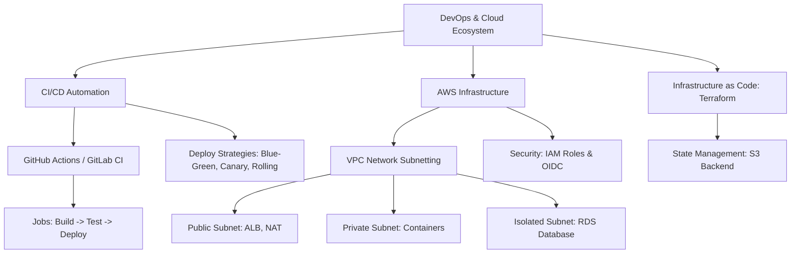

# CI/CD Pipelines & Cloud Infrastructure (AWS)

---

> **Mục tiêu đầu ra:** tạo pipeline test-build-deploy có health check, rollback và xác thực AWS bằng OIDC.

## 1. Khái niệm (Difficulty Breakdown)

### Beginner
Ở mức độ cơ bản:
- **CI (Continuous Integration - Tích hợp liên tục)**: Quy trình tự động hóa việc build, kiểm thử (unit tests), và merge code của các lập trình viên vào nhánh chính (main branch) nhiều lần trong ngày, đảm bảo code mới không làm hỏng ứng dụng hiện tại.
- **CD (Continuous Delivery - Chuyển giao liên tục)**: Tự động hóa việc đóng gói ứng dụng (ví dụ sinh Docker Image) và đẩy lên các môi trường Staging/Pre-production. Quá trình deploy lên Production thực tế yêu cầu phê duyệt bằng tay (Manual Approval).
- **CD (Continuous Deployment - Triển khai liên tục)**: Tự động hóa hoàn toàn quy trình từ khi push code cho tới khi ứng dụng mới được chạy trực tiếp trên Production mà không cần bất kỳ sự can thiệp thủ công nào.
- **AWS (Amazon Web Services)**: Nền tảng điện toán đám mây cung cấp các dịch vụ như máy chủ ảo (EC2), lưu trữ (S3), và cơ sở dữ liệu (RDS).

### Intermediate
Đi sâu vào các công cụ và cấu hình thực tế:
- **CI/CD Pipelines (GitHub Actions / GitLab CI)**: Được định nghĩa bằng tệp cấu hình YAML (ví dụ `.github/workflows/deploy.yml`). Pipeline được kích hoạt tự động theo các sự kiện (Webhook) như `push` hoặc `pull_request`, chạy qua các bước (Jobs) trên các máy ảo chạy ngầm (Runners).
- **AWS Core Services**:
  - **EC2 (Elastic Compute Cloud)**: Cung cấp máy chủ ảo để chạy các ứng dụng.
  - **S3 (Simple Storage Service)**: Hệ thống lưu trữ đối tượng (Object Storage) dùng để chứa ảnh, video, tệp tin tĩnh (HTML/CSS/JS của Frontend).
  - **RDS (Relational Database Service)**: Dịch vụ cơ sở dữ liệu quan hệ được quản lý hoàn toàn (tự động backup, vá lỗi bảo mật).
  - **IAM (Identity and Access Management)**: Quản lý quyền truy cập của người dùng và các dịch vụ AWS bằng cách cấp các **IAM Role** và **Access Keys**.

### Advanced
Ở mức độ tự động hóa và tối ưu hóa hạ tầng nâng cao:
- **Deployment Strategies (Chiến lược triển khai)**:
  - **Rolling Update**: Thay thế dần các instance cũ bằng instance mới. Đơn giản nhất nhưng trong quá trình deploy sẽ tồn tại song song cả 2 phiên bản cũ và mới.
  - **Blue-Green Deployment**: Dựng một môi trường mới hoàn toàn (Green) song song với môi trường đang chạy (Blue). Sau khi test Green thành công, bộ định tuyến (Route 53 hoặc Load Balancer) chuyển hướng 100% traffic sang Green. Nếu lỗi, rollback tức thời bằng cách trỏ traffic lại Blue. Yêu cầu chi phí tài nguyên gấp đôi.
  - **Canary Deployment**: Triển khai phiên bản mới cho một nhóm nhỏ người dùng thử nghiệm trước (ví dụ 5% traffic). Nếu không có lỗi, tăng dần tỷ lệ lên 100%.
- **Terraform (Infrastructure as Code - IaC)**: Công cụ khai báo bằng mã nguồn (HCL - HashiCorp Configuration Language) giúp tự động tạo, thay đổi và quản lý toàn bộ tài nguyên cloud (VPC, Subnets, EC2, RDS) một cách đồng nhất, có thể lưu trữ lịch sử qua Git.

### Expert
Ở mức độ tối thượng (Architect):
- **AWS ECS (Elastic Container Service) & EKS (Elastic Kubernetes Service)**: Nền tảng điều phối container quản lý hàng nghìn microservices. ECS chạy theo mô hình Fargate (Serverless container) loại bỏ việc quản lý máy chủ EC2 phía dưới.
- **Enterprise VPC Subnetting (Thiết kế mạng an toàn)**: Thiết kế mạng ảo VPC riêng cho doanh nghiệp chia làm 3 lớp Subnet:
  - **Public Subnet**: Chứa Application Load Balancer (ALB) hoặc NAT Gateway để tiếp nhận traffic trực tiếp từ Internet.
  - **Private Subnet (App Layer)**: Chứa các container microservices chạy ứng dụng, chỉ giao tiếp ra ngoài Internet một chiều thông qua NAT Gateway và không thể bị truy cập trực tiếp từ ngoài.
  - **Isolated Subnet (Data Layer)**: Chứa các Database RDS, Redis Cache, hoàn toàn không có kết nối Internet để đảm bảo an toàn dữ liệu tối đa.

---

## 2. Mục đích

Trong các doanh nghiệp:
- **Tăng tốc độ bàn giao phần mềm**: Loại bỏ việc deploy thủ công bằng tay (như SSH vào server rồi gõ lệnh `git pull` và build), giảm thiểu lỗi con người gây ra.
- **Đảm bảo tính nhất quán của hạ tầng**: Sử dụng Terraform giúp nhân bản môi trường Staging giống hệt Production chỉ trong vài giây, loại bỏ hiện tượng "môi trường Staging cấu hình khác Production dẫn đến lỗi khi deploy".
- **Bảo mật và tuân thủ (Compliance)**: Phân tách quyền chặt chẽ thông qua IAM, bảo vệ dữ liệu nhạy cảm của khách hàng nằm trong các Subnets cô lập an toàn khỏi sự tấn công của tin tặc.

---

## 3. Kiến trúc hoạt động

### Kiến trúc Mạng An toàn (VPC Subnetting) trên AWS cho Microservices

```text
+───────────────────────────────────────────────────────────────────────────────+
|                                AWS VPC (10.0.0.0/16)                          |
|                                                                               |
|   +───────────────────────────────────────────────────────────────────────+   |
|   |                      PUBLIC SUBNET (10.0.1.0/24)                      |   |
|   |  - Application Load Balancer (ALB)                                    |   |
|   |  - Internet Gateway (Route traffic in/out)                            |   |
|   +───────────────────────────────────────────────────────────────────────+   |
|                                │ (Forward Route)                              |
|                                ▼                                              |
|   +───────────────────────────────────────────────────────────────────────+   |
|   |                      PRIVATE SUBNET (10.0.2.0/24)                     |   |
|   |  - ECS Fargate / EKS Containers (Microservices)                       |   |
|   |  - NAT Gateway (Allow outbound-only traffic to fetch updates)         |   |
|   +───────────────────────────────────────────────────────────────────────+   |
|                                │ (Query Database)                             |
|                                ▼                                              |
|   +───────────────────────────────────────────────────────────────────────+   |
|   |                     ISOLATED SUBNET (10.0.3.0/24)                     |   |
|   |  - RDS MySQL/PostgreSQL DB Cluster                                    |   |
|   |  - Redis Cache Cluster (No internet access, highly secure)            |   |
|   +───────────────────────────────────────────────────────────────────────+   |
+───────────────────────────────────────────────────────────────────────────────+
```

---

## 4. Ví dụ thực tế

### Tình huống:
Một công ty tài chính công nghệ (Fintech) có chu kỳ release code 2 tuần/lần. Lập trình viên sau khi viết xong code phải đóng gói file jar gửi cho đội ngũ vận hành (Ops) deploy thủ công lên server EC2 bằng cách SSH vào máy chủ, tắt app cũ và chạy app mới. 
Quy trình này gây ra các lỗi:
1. Hệ thống bị gián đoạn (Downtime) khoảng 5 phút mỗi lần deploy do app cũ bị tắt trước khi app mới khởi động xong.
2. Thông tin mật khẩu DB cấu hình trong file properties bị lộ cho toàn bộ đội ngũ DEV và OPS.
3. Không có cơ chế kiểm thử tự động, dẫn đến lỗi cú pháp hoặc logic nghiệp vụ trôi nổi lên Production.

### Giải pháp của Architect:
1. Xây dựng Pipeline tự động bằng **GitHub Actions**: Mỗi khi merge code vào branch `main`, pipeline tự động chạy Unit Test, build Docker Image, đẩy lên **AWS ECR (Elastic Container Registry)**.
2. Viết mã **Terraform** để tạo tài nguyên AWS gồm **VPC**, **ECS Fargate**, **RDS**, và **Application Load Balancer (ALB)**.
3. Cấu hình ECS Fargate thực hiện **Rolling Update** kết hợp **Health Check**: Chỉ khi container mới đạt trạng thái Healthy, ALB mới chuyển hướng traffic sang container mới và tắt container cũ đi, đảm bảo **Zero-Downtime Deployment**.
4. Truyền mật khẩu DB bảo mật thông qua **AWS Systems Manager (SSM) Parameter Store** tiêm trực tiếp vào container lúc chạy (Runtime) dưới dạng biến môi trường.

---

## 5. Code Demo

Dưới đây là một cấu trúc hoàn chỉnh cho **GitHub Actions Workflow** (.github/workflows/deploy.yml) tự động hóa quy trình build dự án Java Spring Boot, đóng gói Docker Image, đẩy lên AWS ECR và ra lệnh cập nhật dịch vụ trên AWS ECS Fargate.

### GitHub Actions Workflow YAML:
```yaml
name: Java Enterprise CI/CD Pipeline

on:
  push:
    branches:
      - main # Kích hoạt khi push code vào main

permissions:
  contents: read
  id-token: write

jobs:
  # -------------------------------------------------------------------------
  # Job 1: Build & Test (Chạy kiểm thử và biên dịch)
  # -------------------------------------------------------------------------
  build-and-test:
    runs-on: ubuntu-latest
    steps:
      - name: Checkout Code
        uses: actions/checkout@v3

      - name: Set up JDK 17
        uses: actions/setup-java@v3
        with:
          java-version: '17'
          distribution: 'temurin'
          cache: maven

      - name: Build with Maven & Run Unit Tests
        run: mvn clean package -B

  # -------------------------------------------------------------------------
  # Job 2: Build Image, Push to ECR & Deploy to AWS ECS
  # -------------------------------------------------------------------------
  deploy-to-aws:
    needs: build-and-test # Chỉ chạy khi Job 1 thành công
    runs-on: ubuntu-latest
    steps:
      - name: Checkout Code
        uses: actions/checkout@v3

      # Xác thực quyền truy cập AWS bằng IAM Role (OIDC - an toàn hơn dùng Access Key tĩnh)
      - name: Configure AWS Credentials
        uses: aws-actions/configure-aws-credentials@v2
        with:
          role-to-assume: ${{ secrets.AWS_DEPLOY_ROLE_ARN }}
          aws-region: ap-southeast-1

      - name: Login to Amazon ECR
        id: login-ecr
        uses: aws-actions/amazon-ecr-login@v1

      # Đóng gói và đẩy Docker Image lên AWS ECR
      - name: Build, Tag, and Push Image to Amazon ECR
        env:
          ECR_REGISTRY: ${{ steps.login-ecr.outputs.registry }}
          ECR_REPOSITORY: payment-service-repo
          IMAGE_TAG: ${{ github.sha }} # Dùng SHA của Git commit làm tag cho Image
        run: |
          docker build -t $ECR_REGISTRY/$ECR_REPOSITORY:$IMAGE_TAG -t $ECR_REGISTRY/$ECR_REPOSITORY:latest .
          docker push --all-tags $ECR_REGISTRY/$ECR_REPOSITORY
          echo "IMAGE=$ECR_REGISTRY/$ECR_REPOSITORY:$IMAGE_TAG" >> $GITHUB_ENV

      # Cập nhật ECS Task Definition với Image mới vừa build
      - name: Download Active ECS Task Definition
        run: |
          aws ecs describe-task-definition --task-definition payment-service-task --query taskDefinition > task-definition.json

      - name: Render New ECS Task Definition
        id: render-web
        uses: aws-actions/amazon-ecs-render-task-definition@v1
        with:
          task-definition: task-definition.json
          container-name: payment-container
          image: ${{ env.IMAGE }}

      # Thực hiện Deploy lên ECS Fargate (Tự động chạy Rolling Update)
      - name: Deploy to Amazon ECS Service
        uses: aws-actions/amazon-ecs-deploy-task-definition@v1
        with:
          task-definition: ${{ steps.render-web.outputs.task-definition }}
          service: payment-service
          cluster: production-ecs-cluster
          wait-for-service-stability: true # Đợi cho tới khi Container mới khởi động thành công
```

---

## 6. Best Practices

1. **Sử dụng AWS OIDC cho GitHub Actions**: Thay vì ghi cứng các khóa truy cập AWS Access Key tĩnh lên GitHub Secrets (nguy cơ bị lộ rất lớn), hãy thiết lập **OIDC (OpenID Connect)** để AWS cấp token truy cập tạm thời có thời hạn ngắn (Short-lived token) cho GitHub Runner.
2. **Thiết lập Health Check Endpoint**: Luôn viết một endpoint kiểm tra sức khỏe hệ thống (như `/actuator/health` trong Spring Boot) và khai báo cho Load Balancer/ECS. AWS sẽ không bao giờ định tuyến traffic hoặc tắt container cũ nếu container mới chưa vượt qua bài test health check này.
3. **Cấu hình VPC Endpoint**: Khi các microservices nằm trong Private Subnet cần gọi các dịch vụ AWS khác như S3 hoặc Parameter Store, hãy dùng VPC Endpoint (PrivateLink) để lưu lượng mạng đi trực tiếp trong đường nội bộ của AWS thay vì đi vòng ra ngoài Internet, tăng tốc độ và bảo mật.
4. **Không lưu trữ Secret trong mã nguồn Terraform**: Khi sử dụng Terraform để dựng RDS Database, hãy để Terraform tự sinh mật khẩu ngẫu nhiên lưu vào **AWS Secrets Manager**, ứng dụng sẽ đọc mật khẩu từ Secrets Manager này lúc chạy.
5. **Kiểm tra chất lượng code tự động (Static Code Analysis)**: Tích hợp các công cụ như SonarQube hoặc Checkstyle trực tiếp vào Job đầu tiên của CI Pipeline để tự động chặn các đoạn code vi phạm quy tắc viết code sạch.

---

## 7. Common Mistakes (Anti-patterns)

### 1. Thực hiện Deploy trực tiếp từ máy của Lập trình viên
- **Anti-pattern**: Lập trình viên tự build file jar hoặc docker image trên máy local rồi đẩy trực tiếp lên server production.
- **Hệ quả**: Không có sự đồng nhất về phiên bản môi trường build (ví dụ JDK trên máy dev khác JDK server), không thể lưu trữ lịch sử deploy và dễ dàng làm mất kiểm soát bảo mật.
- **Khắc phục**: Mọi thay đổi code bắt buộc phải merge qua Git PR và đi qua CI/CD server để deploy đồng nhất.

### 2. NAT Gateway đặt sai Subnet
Đặt NAT Gateway ở Private Subnet. NAT Gateway chịu trách nhiệm cho các container ở Private Subnet giao tiếp một chiều ra Internet để tải thư viện, cập nhật hệ thống. Bản thân NAT Gateway cần có IP Public và Internet Gateway để hoạt động, vì thế **NAT Gateway bắt buộc phải đặt ở Public Subnet**.

---

## 8. Interview Questions

#### Q1: Phân biệt sự khác nhau giữa Continuous Delivery và Continuous Deployment?
* **Đáp án**: Cả hai đều tự động hóa toàn bộ quy trình build và test. Điểm khác biệt duy nhất nằm ở bước cuối cùng triển khai lên Production:
  - `Continuous Delivery`: Pipeline tự động build và chuẩn bị sẵn gói deploy lên môi trường chờ (Staging). Việc kích hoạt deploy lên Production thực tế yêu cầu một người quản trị nhấn nút duyệt thủ công (Manual Approval).
  - `Continuous Deployment`: Tự động hoàn toàn 100%. Mọi thay đổi code sau khi vượt qua các bài test của pipeline sẽ tự động chạy thẳng lên Production mà không cần phê duyệt bằng tay.

#### Q2: So sánh chiến lược Blue-Green Deployment và Canary Deployment?
* **Đáp án**:
  - `Blue-Green`: Dựng môi trường Green mới song song 100% với môi trường cũ Blue. Chuyển đổi traffic tức thời 100% qua bộ định tuyến. Ưu điểm là rollback cực nhanh (chỉ cần đổi hướng route ngược lại). Nhược điểm là tốn gấp đôi chi phí phần cứng vì phải chạy 2 môi trường song song trong quá trình deploy.
  - `Canary`: Triển khai app mới lên một cụm nhỏ (ví dụ 1 instance) để phục vụ khoảng 5% người dùng thử nghiệm trước. Nếu các chỉ số lỗi ổn định, tăng dần tỷ lệ phân bổ traffic cho tới khi đạt 100%. Ưu điểm là giảm thiểu rủi ro ảnh hưởng diện rộng, tiết kiệm chi phí phần cứng hơn.

#### Q3: Ý nghĩa và cơ chế hoạt động của Health Check trong Rolling Update deployment?
* **Đáp án**: Health Check là cơ chế Load Balancer hoặc ECS kiểm tra xem ứng dụng trong container mới đã khởi động hoàn toàn và sẵn sàng tiếp nhận request chưa (ví dụ gọi tới API `/health` nhận về HTTP 200). 
  - Trong Rolling Update: Hệ thống khởi động container mới, chờ cho đến khi container này vượt qua số lần Health Check quy định mới đánh dấu là Healthy. Lúc này Load Balancer mới bắt đầu chuyển traffic sang container mới và tắt container cũ đi. Nếu container mới bị lỗi khởi động (crash loop), hệ thống sẽ dừng deploy và giữ nguyên container cũ, đảm bảo hệ thống không bị downtime.

#### Q4: Terraform hoạt động theo mô hình State-based thế nào? Tệp `terraform.tfstate` dùng để làm gì?
* **Đáp án**: Terraform hoạt động bằng cách quản lý trạng thái của tài nguyên thực tế qua tệp `terraform.tfstate`. Tệp này lưu trữ cấu trúc chi tiết của tất cả các tài nguyên cloud đã được tạo ra. Khi ta chạy lệnh `terraform apply`, Terraform sẽ so sánh mã nguồn khai báo hiện tại (`.tf` files) với tệp state này để tính toán xem cần tạo mới, cập nhật hay xóa những tài nguyên nào, đảm bảo tính đồng bộ tuyệt đối. Trong môi trường dự án, tệp state này bắt buộc phải lưu trữ tập trung (như trên AWS S3) để tránh xung đột khi nhiều người cùng chạy Terraform.

#### Q5: Tại sao ta nên đặt Database RDS trong Isolated/Private Subnet thay vì Public Subnet?
* **Đáp án**: Để đảm bảo an toàn bảo mật tối đa cho dữ liệu nhạy cảm của doanh nghiệp. Nếu đặt RDS ở Public Subnet, database sẽ có địa chỉ IP Public và có thể bị quét và tấn công trực tiếp từ Internet nếu hacker bẻ khóa được mật khẩu hoặc phát hiện lỗi bảo mật của DBMS. Đặt ở Private Subnet đảm bảo chỉ các máy chủ ứng dụng nằm trong cùng mạng VPC mới có quyền truy cập, chặn đứng mọi nguy cơ tấn công từ môi trường Internet ngoài.

#### Q6: Application Load Balancer (ALB) và Network Load Balancer (NLB) khác nhau thế nào? Khi nào chọn loại nào?
* **Đáp án**:
  - `ALB`: Hoạt động ở tầng **Application (Layer 7)** của mô hình OSI. Hiểu được giao thức HTTP/HTTPS, cookie, URL path. Thích hợp cho các ứng dụng Web, Microservices cần định tuyến dựa trên đường dẫn (ví dụ: `/api/v1/orders` trỏ về Order Service, `/api/v1/users` trỏ về User Service).
  - `NLB`: Hoạt động ở tầng **Transport (Layer 4)**. Xử lý lưu lượng TCP/UDP thô với hiệu năng cực cao, hàng triệu request/giây với độ trễ siêu thấp. Thích hợp cho các ứng dụng Socket, IoT, Chat thời gian thực.

#### Q7: IAM Role và IAM User trong AWS khác nhau thế nào? Nên dùng cái nào cho ứng dụng chạy trên EC2?
* **Đáp án**:
  - `IAM User`: Đại diện cho một định danh cụ thể (thường là con người), có username, password và Access Key tĩnh lâu dài.
  - `IAM Role`: Không có thông tin đăng nhập tĩnh lâu dài. Nó được gán cho một dịch vụ hoặc tài nguyên AWS để cấp quyền tạm thời (Sử dụng STS tokens).
  - Đối với ứng dụng chạy trên EC2, **bắt buộc dùng IAM Role** (gán Role cho EC2 instance). Ứng dụng sẽ tự động lấy token xác thực tạm thời từ AWS Metadata Service, loại bỏ việc ghi cứng Access Key tĩnh trong code, tăng tính bảo mật tối đa.

#### Q8: NAT Gateway dùng để làm gì? Nó khác gì với Internet Gateway?
* **Đáp án**:
  - `Internet Gateway (IGW)`: Cho phép giao tiếp hai chiều (inbound và outbound) giữa các tài nguyên trong VPC (nằm ở Public Subnet) với Internet.
  - `NAT Gateway`: Cho phép các tài nguyên nằm trong Private Subnet kết nối một chiều ra Internet (outbound-only) để tải bản cập nhật hoặc gọi API ngoài, nhưng ngăn chặn hoàn toàn chiều ngược lại (inbound) từ Internet kết nối vào tài nguyên đó.

#### Q9: AWS Fargate là gì? Khác gì với ECS chạy trên EC2 thường?
* **Đáp án**:
  - `ECS on EC2`: Bạn phải tự tạo, cấu hình và quản lý các máy chủ ảo EC2 để làm môi trường chạy các container. Bạn phải chịu trách nhiệm cập nhật hệ điều hành máy host và tự scale số lượng máy chủ.
  - `AWS Fargate`: Là giải pháp **Serverless Container**. Bạn không cần quản lý bất kỳ máy chủ EC2 nào. AWS tự động cấp phát tài nguyên chạy container trực tiếp và bạn chỉ phải trả tiền cho lượng RAM/CPU mà Container thực sự tiêu thụ theo giây.

#### Q10: Làm thế nào để cấu hình Auto Scaling cho dịch vụ Container trên AWS?
* **Đáp án**: Ta sử dụng dịch vụ **Application Auto Scaling** kết hợp với CloudWatch Metrics:
  1. Định nghĩa các chỉ số đo lường (Metrics) như: Tỉ lệ sử dụng CPU trung bình vượt quá 70%, hoặc tỉ lệ sử dụng RAM vượt quá 80%.
  2. Cấu hình Scaling Policy: Khi CloudWatch báo động các chỉ số vượt ngưỡng trong 3 phút liên tục, ECS sẽ tự động khởi động thêm Container mới (Scale-out). Ngược lại, khi tải giảm xuống dưới 30%, hệ thống tự động tắt bớt container (Scale-in).

---

## 9. Senior Notes

> [!IMPORTANT]
> **Kinh nghiệm thực chiến thiết kế Hạ tầng Cloud:**
> 1. **Cảnh giác với chi phí NAT Gateway và NAT Data Processing**:
>    Trong AWS, chi phí truyền tải dữ liệu qua NAT Gateway có giá rất đắt (~$0.045/GB). Nếu ứng dụng của bạn trong Private Subnet liên tục ghi log đẩy lên Elasticsearch ngoài hoặc thực hiện sao lưu hàng Terabyte dữ liệu lên S3 qua Internet, bạn sẽ nhận được hóa đơn cloud khổng lồ. Hãy sử dụng **VPC Gateway Endpoints** cho S3 và DynamoDB để luồng dữ liệu đi miễn phí hoàn toàn qua mạng nội bộ AWS.
> 2. **Bảo vệ file `terraform.tfstate` cực kỳ nghiêm ngặt**:
>    Tệp trạng thái của Terraform chứa mọi thông tin về kiến trúc hạ tầng của bạn ở dạng text thuần, bao gồm cả mật khẩu DB, mã API Key dưới dạng biến cấu hình. Luôn cấu hình lưu tệp state này trên S3 bật mã hóa (Encryption at rest) và bật tính năng Versioning để có thể khôi phục lại khi tệp state bị hỏng.

---

## 10. Tài liệu tham khảo

1. [AWS Architecture Center - Web Application hosting Guide](https://aws.amazon.com/architecture/)
2. [Terraform Best Practices Guide](https://www.terraform.best/)
3. [GitHub Actions Workflow Documentation](https://docs.github.com/en/actions/using-workflows/about-workflows)
4. Sách: *Terraform: Up and Running (3rd Edition)* - Yevgeniy Brikman.

---
# PHẦN BỔ TRỢ CHƯƠNG

### ✅ Checklist cần nhớ
- [ ] Phân biệt được sự khác biệt giữa CI, Continuous Delivery và Continuous Deployment.
- [ ] Hiểu rõ cách thức hoạt động và viết file cấu hình cho GitHub Actions.
- [ ] Thiết kế được mô hình mạng an toàn VPC gồm Public, Private và Isolated Subnets.
- [ ] Luôn sử dụng IAM Roles thay vì Access Keys tĩnh cho các ứng dụng chạy trên cloud.
- [ ] Hiểu rõ cơ chế hoạt động của Health Check trong quá trình deploy Zero-downtime.
- [ ] Nắm vững cách quản lý trạng thái hạ tầng bằng Terraform State.

### ✅ Mindmap (Mermaid)



### ✅ Cheat Sheet

* **Lệnh cơ bản của Terraform**:
  ```bash
  terraform init          # Khởi tạo project và tải providers
  terraform plan          # Xem trước kế hoạch thay đổi hạ tầng
  terraform apply         # Thực hiện tạo/thay đổi hạ tầng thực tế
  terraform destroy       # Xóa sạch toàn bộ hạ tầng đã tạo
  ```
* **Khai báo IAM Role cấp quyền đọc S3 cho EC2 (Terraform)**:
  ```hcl
  resource "aws_iam_role" "ec2_s3_read" {
    name = "ec2_s3_read_role"
    assume_role_policy = jsonencode({
      Version = "2012-10-17"
      Statement = [{
        Action = "sts:AssumeRole"
        Effect = "Allow"
        Principal = { Service = "ec2.amazonaws.com" }
      }]
    })
  }
  ```

### ✅ Interview Tips

* Khi bị hỏi **"Làm thế nào để ứng dụng của bạn không bị Downtime khi deploy?"**, hãy trả lời bằng quy trình: *"Tôi sử dụng chiến lược Rolling Update kết hợp cấu hình Liveness/Readiness Probes hoặc Application Load Balancer Health Check. Khi chạy container mới, Load Balancer chỉ chuyển traffic sang container mới khi nó trả về HTTP 200 tại API `/health`. Sau khi container mới gánh tải thành công, container cũ mới được tắt đi một cách êm ái (Graceful Shutdown) bằng cách đợi hoàn thành nốt các request dở dang."*
* Hãy thể hiện tư duy Architect bằng cách nhấn mạnh tính **bất biến của hạ tầng (Immutable Infrastructure)**: *"Thay vì vào server sửa đổi file cấu hình, mỗi khi có thay đổi tôi luôn phá hủy tài nguyên cũ và dựng tài nguyên mới bằng Terraform kết hợp Docker Image mới, giúp loại bỏ hoàn toàn lỗi lệch lạc cấu hình."*

### ✅ Mini Project: Enterprise-grade Terraform VPC Setup

**Mô tả**: Viết mã nguồn Terraform khai báo cấu hình mạng an toàn chuẩn doanh nghiệp gồm: 1 VPC, 2 Public Subnets (ở 2 Availability Zones khác nhau để đảm bảo High Availability), 2 Private Subnets chạy ứng dụng, 1 Internet Gateway, và các bảng định tuyến (Route Tables) tương ứng.

**Triển khai**:

```hcl
# Định nghĩa Provider AWS
provider "aws" {
  region = "ap-southeast-1" # Singapore
}

# 1. Khai báo VPC chính
resource "aws_vpc" "production_vpc" {
  cidr_block           = "10.0.0.0/16"
  enable_dns_hostnames = true
  enable_dns_support   = true

  tags = {
    Name = "production-vpc"
  }
}

# 2. Khai báo Internet Gateway cho Public traffic
resource "aws_internet_gateway" "igw" {
  vpc_id = aws_vpc.production_vpc.id

  tags = {
    Name = "production-igw"
  }
}

# 3. Khai báo 2 Public Subnets
resource "aws_subnet" "public_subnet_1" {
  vpc_id            = aws_vpc.production_vpc.id
  cidr_block        = "10.0.1.0/24"
  availability_zone = "ap-southeast-1a"
  map_public_ip_on_launch = true

  tags = { Name = "public-subnet-1a" }
}

resource "aws_subnet" "public_subnet_2" {
  vpc_id            = aws_vpc.production_vpc.id
  cidr_block        = "10.0.2.0/24"
  availability_zone = "ap-southeast-1b"
  map_public_ip_on_launch = true

  tags = { Name = "public-subnet-1b" }
}

# 4. Khai báo Route Table cho Public Subnets
resource "aws_route_table" "public_rt" {
  vpc_id = aws_vpc.production_vpc.id

  route {
    cidr_block = "0.0.0.0/0"
    gateway_id = aws_internet_gateway.igw.id
  }

  tags = { Name = "public-route-table" }
}

# Liên kết Route Table với các Public Subnets
resource "aws_route_table_association" "public_1" {
  subnet_id      = aws_subnet.public_subnet_1.id
  route_table_id = aws_route_table.public_rt.id
}

resource "aws_route_table_association" "public_2" {
  subnet_id      = aws_subnet.public_subnet_2.id
  route_table_id = aws_route_table.public_rt.id
}

# 5. Khai báo 2 Private Subnets cho App Layer
resource "aws_subnet" "private_subnet_1" {
  vpc_id            = aws_vpc.production_vpc.id
  cidr_block        = "10.0.3.0/24"
  availability_zone = "ap-southeast-1a"

  tags = { Name = "private-subnet-1a" }
}

resource "aws_subnet" "private_subnet_2" {
  vpc_id            = aws_vpc.production_vpc.id
  cidr_block        = "10.0.4.0/24"
  availability_zone = "ap-southeast-1b"

  tags = { Name = "private-subnet-1b" }
}
```

---

### ✅ Bài tập thực hành

#### Bài tập 1: Xây dựng cơ chế Rollback tự động cho GitHub Actions
Hãy nâng cấp file GitHub Actions Workflow phía trên, bổ sung thêm một bước tự động kiểm tra xem sau khi deploy thành công lên ECS, nếu gọi API `/health` mà nhận về mã lỗi HTTP 500 hoặc Timeout trong vòng 2 phút, pipeline sẽ tự động thực hiện câu lệnh CLI để rollback về phiên bản Image trước đó (`IMAGE_TAG` cũ).
* **Gợi ý Giải pháp**: Sử dụng một script bash thực hiện vòng lặp kiểm tra sức khỏe bằng `curl` trong một khoảng thời gian. Nếu thất bại, gọi lệnh `aws ecs update-service --force-new-deployment` trỏ lại task definition cũ.

#### Bài tập 2: Giải thích cơ chế OIDC (OpenID Connect)
Giải thích tại sao việc sử dụng OIDC để phân quyền cho GitHub Actions kết nối tới AWS lại an toàn và bảo mật hơn rất nhiều so với việc tạo một IAM User với Access Key/Secret Key tĩnh lưu ở mục GitHub Secrets.
* **Gợi ý Giải pháp**: OIDC loại bỏ hoàn toàn các key bảo mật tĩnh. GitHub Actions sẽ tự trao đổi thông tin xác thực đáng tin cậy với AWS thông qua các token tạm thời có thời hạn ngắn (chỉ có giá trị trong vòng vài phút cho đúng phiên chạy build đó). Nếu hacker có hack được repository GitHub cũng không thể lấy cắp được thông tin khóa truy cập vĩnh viễn.

---

### ✅ References
- [Ref1] Terraform AWS Provider official docs: [HashiCorp Registry](https://registry.terraform.io/providers/hashicorp/aws/latest/docs)
- [Ref2] AWS Well-Architected Framework: [Security Pillar](https://aws.amazon.com/architecture/well-architected/)
