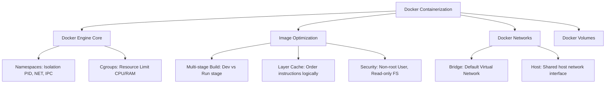

# Docker Containerization & Image Optimization

---

## 1. Khái niệm (Difficulty Breakdown)

### # Beginner
Ở mức độ cơ bản:
- **Containerization (Đóng gói ứng dụng)**: Kỹ thuật đóng gói mã nguồn ứng dụng cùng toàn bộ thư viện, cấu hình, và môi trường chạy phụ thuộc của nó vào một gói duy nhất (Container Image) giúp ứng dụng chạy đồng nhất ở mọi nơi (Local, Staging, Production).
- **Virtual Machines (VM) vs Containers**: 
  - **VM**: Ảo hóa ở cấp độ phần cứng. Mỗi VM chứa một hệ điều hành khách (Guest OS) riêng, tốn nhiều RAM/CPU và khởi động lâu (vài phút).
  - **Containers**: Ảo hóa ở cấp độ hệ điều hành. Các container dùng chung nhân hệ điều hành (Shared OS Kernel) của máy host thông qua Docker, cực kỳ nhẹ (vài chục MB) và khởi động trong vài mili-giây.
- **Docker Image vs Container**: Image là bản chụp tĩnh đóng gói ứng dụng (được coi như Class trong OOP). Container là một thể hiện đang chạy của Image đó (được coi như Instance trong OOP).

### # Intermediate
Đi sâu vào hoạt động của Docker:
- **Docker Engine Architecture**: Hoạt động theo mô hình Client-Server. Client giao tiếp với daemon **dockerd** qua REST API để kéo, dựng và chạy containers.
- **Dockerfile Core Instructions**:
  - `RUN`: Thực thi các câu lệnh shell để cài đặt thêm thư viện trong quá trình build Image (tạo ra layer mới).
  - `CMD`: Cung cấp lệnh mặc định để chạy container. Có thể bị ghi đè khi chạy lệnh `docker run`.
  - `ENTRYPOINT`: Thiết lập lệnh bắt buộc chạy khi container khởi động. Không thể ghi đè dễ dàng.
  - `COPY` vs `ADD`: `COPY` chỉ sao chép file cục bộ. `ADD` mạnh hơn, hỗ trợ tải file từ URL hoặc tự động giải nén tệp `.tar`.
- **Docker Volume**: Cơ chế lưu trữ dữ liệu bền vững (Persistent Data) nằm ngoài vòng đời của container (tránh mất dữ liệu khi container bị xóa).
- **Docker Network**: Quản lý giao tiếp mạng giữa các container (`bridge`, `host`, `none`, `overlay`).

### # Advanced
Ở mức độ nâng cao:
- **Multi-stage Builds**: Kỹ thuật chia quá trình build Image làm nhiều giai đoạn. Sử dụng các container build trung gian (đầy đủ SDK nặng như JDK/Maven) để biên dịch mã nguồn, sau đó chỉ sao chép tệp thực thi nhị phân cuối cùng (như `.jar` hoặc compiled binary) sang một Image chạy cực kỳ nhẹ (như JRE hoặc Alpine Linux) giúp giảm kích thước Image xuống 10 lần.
- **Docker Compose**: Công cụ khai báo bằng tệp YAML (`docker-compose.yml`) giúp điều phối và khởi chạy đồng thời nhiều container liên quan (ví dụ: Spring Boot App + MySQL + Redis) bằng một lệnh duy nhất `docker-compose up`.
- **Security Best Practices**: Tránh chạy container bằng quyền root mặc định. Khai báo chỉ thị `USER node` hoặc tạo user không có quyền quản trị để bảo vệ máy host nếu container bị tấn công.

### # Expert
Ở mức độ tối thượng (Architect):
- **Linux Kernel Namespaces & Control Groups (cgroups)**: Hiểu rõ cơ chế mà Docker sử dụng để cô lập. **Namespaces** cung cấp tính năng cô lập không gian tên (Process ID, Network, Mount points, User). **cgroups** chịu trách nhiệm giới hạn tài nguyên vật lý (CPU, RAM, I/O) mà một container được phép sử dụng.
- **Docker Storage Drivers & Copy-on-Write (CoW)**: Cách Docker lưu trữ các lớp ảnh (Layers) dựa trên các driver như `overlay2`. Khi container sửa đổi một file có sẵn trong Image, driver sao chép file đó lên phân vùng ghi của container trước khi chỉnh sửa để bảo toàn tính bất biến của các layer phía dưới.
- **Container Resource Allocation**: Cấu hình giới hạn cứng tài nguyên để tránh hiện tượng một container rò rỉ bộ nhớ chiếm dụng hết RAM của máy host làm sập hệ thống (sử dụng các flag `--memory` và `--cpus`).

---

## 2. Mục đích

Trong các doanh nghiệp:
- **Giải quyết bài toán "Code chạy tốt trên máy tôi nhưng lỗi trên server"**: Bằng cách đóng gói toàn bộ môi trường chạy vào Image, Docker đảm bảo ứng dụng chạy chính xác 100% giống nhau từ máy của lập trình viên cho tới hệ thống Production của công ty.
- **Tối ưu hóa tài nguyên phần cứng**: Thay vì thuê 10 máy chủ ảo (VMs) cho 10 dịch vụ nhỏ, ta có thể chạy hàng trăm containers trên 1 máy chủ vật lý duy nhất, tiết kiệm hàng nghìn USD chi phí cloud hàng tháng.
- **Hỗ trợ CI/CD và Auto-scaling**: Tốc độ khởi động siêu nhanh của container giúp quy trình tự động hóa kiểm thử diễn ra nhanh chóng và hỗ trợ scale-out (tăng số lượng instance) tức thời khi lưu lượng truy cập của người dùng tăng đột biến.

---

## 3. Kiến trúc hoạt động

### Kiến trúc Docker Engine và Hoạt động của Namespaces / Cgroups

```text
+─────────────────────────────────────────────────────────────+
|                        DOCKER HOST                          |
|                                                              |
|   +──────────────────+        +──────────────────────────+   |
|   |  Docker Client   | ────>  |      Docker Daemon       |   |
|   |  (CLI / API)     | <────  |       (dockerd)          |   |
|   +──────────────────+        +──────────────────────────+   |
|                                            │                 |
|                                            ▼                 |
|   +──────────────────────────────────────────────────────+   |
|   |                   CONTAINER RUNTIME                  |   |
|   |                      (containerd)                    |   |
|   +──────────────────────────────────────────────────────+   |
|                                │                             |
|       ┌────────────────────────┴────────────────────────┐    |
|       ▼                                                 ▼    |
|  +─────────────────────────+                       +───────+ |
|  |       Container 1       |                       | Cont2 | |
|  |                         |                       +───────+ |
|  |  [Namespaces]           |                                 |
|  |  - PID (Process isolation)                                |
|  |  - NET (Network isolation)                                |
|  |  [cgroups]                                                |
|  |  - CPU: Max 1 Core      |                                 |
|  |  - RAM: Max 512MB       |                                 |
|  +─────────────────────────+                                 |
+─────────────────────────────────────────────────────────────+
```

---

## 4. Ví dụ thực tế

### Tình huống:
Một microservice viết bằng Spring Boot đóng gói thông thường có kích thước Docker Image lên tới **750MB**. Việc này khiến quy trình build và deploy CI/CD mất tới 15 phút do phải truyền tải file Image quá nặng qua mạng lên Docker Registry của công ty và kéo về máy chủ AWS. 

### Giải pháp tối ưu của Architect:
1. Áp dụng kỹ thuật **Multi-stage Builds** trong Dockerfile.
2. Giai đoạn 1 (Build): Sử dụng Image `maven:3.8-openjdk-17` để compile code ra file `.jar`.
3. Giai đoạn 2 (Run): Sử dụng Image tối giản `eclipse-temurin:17-jre-alpine` ( Alpine Linux siêu nhẹ) để chạy file `.jar` đó.
4. Tối ưu hóa việc caching của Docker bằng cách sao chép file `pom.xml` và download dependencies trước khi sao chép toàn bộ source code.
5. Kích thước Image cuối cùng giảm từ 750MB xuống còn **180MB**, thời gian deploy giảm từ 15 phút xuống còn **2 phút**.

---

## 5. Code Demo

Dưới đây là một Dockerfile mẫu chuẩn Enterprise cho ứng dụng Spring Boot sử dụng kỹ thuật **Multi-stage Build**, tối ưu hóa cache layer, chạy với quyền hạn User thường (Non-root) và hỗ trợ Graceful Shutdown.

### Dockerfile:
```dockerfile
# =========================================================================
# Giai đoạn 1: Build & Compile (Sử dụng JDK và Maven)
# =========================================================================
FROM maven:3.8.8-eclipse-temurin-17-alpine AS builder

WORKDIR /build

# Sao chép pom.xml trước để tận dụng Docker cache cho các dependencies
COPY pom.xml .
RUN mvc dependency:go-offline -B

# Sao chép mã nguồn và tiến hành compile
COPY src ./src
RUN mvn clean package -DskipTests

# =========================================================================
# Giai đoạn 2: Runtime (Chỉ sử dụng JRE siêu nhẹ và Alpine Linux)
# =========================================================================
FROM eclipse-temurin:17-jre-alpine

WORKDIR /app

# Tạo một Group và User không có quyền root (Non-root user) để bảo mật
RUN addgroup -S appgroup && adduser -S appuser -G appgroup

# Cấu hình biến môi trường tối ưu hóa JVM trong Container
ENV JAVA_OPTS="-XX:+UseG1GC -XX:+ExitOnOutOfMemoryError"

# Sao chép file jar từ builder sang, gán quyền sở hữu cho appuser
COPY --from=builder /build/target/*.jar app.jar
RUN chown -R appuser:appgroup /app

# Chuyển sang chạy bằng User vừa tạo thay vì Root
USER appuser

# Expose cổng ứng dụng
EXPOSE 8080

# Sử dụng JSON Array format cho ENTRYPOINT để đảm bảo tín hiệu SIGTERM 
# từ Docker/Kubernetes truyền trực tiếp được tới JVM cho Graceful Shutdown
ENTRYPOINT ["sh", "-c", "java $JAVA_OPTS -jar app.jar"]
```

---

## 6. Best Practices

1. **Sử dụng JSON Array format cho `CMD` và `ENTRYPOINT`**: Luôn viết dạng `["java", "-jar", "app.jar"]` thay vì viết dạng chuỗi `java -jar app.jar`. Viết dạng chuỗi sẽ khởi chạy qua shell (`/bin/sh -c`), điều này làm mất tín hiệu **SIGTERM** khi Docker muốn tắt container, khiến ứng dụng bị tắt cưỡng bức đột ngột (Hard Kill) thay vì tắt an toàn (Graceful Shutdown).
2. **Tận dụng tối đa Docker Layer Caching**: Đặt các câu lệnh ít thay đổi ở phía trên (ví dụ cài đặt thư viện hệ thống, tải dependencies) và đặt các câu lệnh thường xuyên thay đổi ở phía dưới (ví dụ copy source code).
3. **Sử dụng file `.dockerignore`**: Loại bỏ thư mục `/target`, `/node_modules`, `.git` khỏi quá trình gửi dữ liệu lên Docker Daemon để tăng tốc độ build.
4. **Luôn sử dụng phiên bản cụ thể cho Base Image**: Tránh dùng tag `:latest` (ví dụ dùng `node:18.16-alpine` thay vì `node:latest`) để đảm bảo quá trình build luôn sinh ra kết quả đồng nhất ở mọi thời điểm.
5. **Cấu hình giới hạn tài nguyên**: Luôn giới hạn RAM và CPU của container khi deploy để tránh lỗi cạn kiệt tài nguyên (OOM) làm treo toàn bộ máy chủ.

---

## 7. Common Mistakes (Anti-patterns)

### 1. Lưu trữ dữ liệu trạng thái (State) bên trong Container
- **Anti-pattern**: Lưu file ảnh upload của khách hàng hoặc file log trực tiếp vào thư mục trong Container.
- **Hệ quả**: Khi container bị khởi động lại hoặc deploy phiên bản mới, toàn bộ dữ liệu này sẽ bị xóa sạch vĩnh viễn do tính chất bất biến (Ephemeral) của container.
- **Khắc phục**: Luôn lưu dữ liệu vào **Docker Volumes** hoặc đẩy lên các dịch vụ lưu trữ ngoài như AWS S3, Cloudinary.

### 2. Đóng gói mật khẩu, Private Key trực tiếp vào Dockerfile
Ghi cứng (Hardcode) mật khẩu DB, khóa API vào câu lệnh `ENV` trong Dockerfile. Bất kỳ ai có quyền kéo Image đều có thể dùng lệnh `docker inspect` để đọc được các thông tin nhạy cảm này. Cần truyền qua các biến môi trường khi khởi chạy hoặc dùng Kubernetes Secrets.

---

## 8. Interview Questions

#### Q1: Sự khác biệt bản chất giữa Containerization (Docker) và Virtualization (VMware)?
* **Đáp án**: Virtualization ảo hóa ở cấp phần cứng, mỗi VM có một hệ điều hành khách (Guest OS) đầy đủ chạy trên lớp Hypervisor, khởi động chậm và tốn tài nguyên. Containerization ảo hóa ở cấp hệ điều hành, các container chạy như các tiến trình độc lập dùng chung nhân hệ điều hành (Shared OS Kernel) của máy host thông qua Docker Engine, cực kỳ nhẹ và khởi động ngay lập tức.

#### Q2: Tại sao kích thước Image xây dựng qua Multi-stage Build lại nhỏ hơn nhiều so với thông thường?
* **Đáp án**: Vì trong Dockerfile thông thường ta cần cài đặt cả công cụ lập trình (Compiler, Build Tools như Maven, JDK, Node npm) để build code. Khi dùng Multi-stage, ta chia làm 2 giai đoạn: Giai đoạn build chứa đầy đủ công cụ nặng, giai đoạn runtime chỉ dùng môi trường tối giản (như JRE, Alpine OS) và chỉ sao chép tệp nhị phân đã biên dịch sang. Mọi công cụ build cồng kềnh đều bị bỏ lại ở stage trước, giúp Image cuối cùng siêu nhẹ.

#### Q3: Phân biệt sự khác nhau giữa lệnh `CMD` và `ENTRYPOINT` trong Dockerfile?
* **Đáp án**:
  - `CMD`: Định nghĩa lệnh và tham số mặc định cho container. Có thể dễ dàng bị ghi đè hoàn toàn nếu ta truyền lệnh mới phía sau lệnh `docker run <image> <new_command>`.
  - `ENTRYPOINT`: Định nghĩa lệnh cố định chạy khi container khởi động. Các tham số truyền sau `docker run` sẽ được coi là tham số bổ sung cho lệnh ENTRYPOINT này chứ không ghi đè nó. Khuyên dùng kết hợp cả hai.

#### Q4: Làm thế nào để truyền các thông số cấu hình nhạy cảm (như DB Password) vào Container an toàn?
* **Đáp án**: Không bao giờ ghi cứng mật khẩu vào Dockerfile. Ta nên cấu hình ứng dụng đọc tham số từ biến môi trường (Environment Variables). Khi khởi chạy container, truyền tham số qua flag `-e` hoặc file `.env`:
  ```bash
  docker run -e DB_PASSWORD=my_secure_pass payment-service
  ```
  Trong môi trường production chuyên nghiệp, ta sử dụng các công cụ quản lý bí mật như HashiCorp Vault, AWS Secrets Manager hoặc Kubernetes Secrets.

#### Q5: Cơ chế lưu trữ dữ liệu bền vững (Persistence Data) trong Docker hoạt động thế nào?
* **Đáp án**: Docker cung cấp 2 cơ chế chính để lưu dữ liệu ngoài container:
  1. `Volumes`: Được Docker tạo và quản lý hoàn toàn trong phân vùng riêng trên ổ đĩa máy host. Khuyên dùng cho hầu hết trường hợp.
  2. `Bind Mounts`: Ánh xạ trực tiếp một đường dẫn cụ thể từ máy host (ví dụ `/data/db`) vào bên trong container. Phù hợp khi cần cấu hình hoặc chia sẻ mã nguồn thời gian thực.

#### Q6: Docker Layer Caching hoạt động ra sao và làm sao để viết Dockerfile tận dụng tốt nhất tính năng này?
* **Đáp án**: Mỗi câu lệnh trong Dockerfile tạo ra một Read-only Layer mới. Khi build lại Image, Docker sẽ so sánh các file liên quan đến câu lệnh đó xem có thay đổi không, nếu không thay đổi nó sẽ tái sử dụng cache của layer đó mà không chạy lại lệnh. Để tận dụng tốt nhất, ta phải đặt các lệnh ít thay đổi lên trên (như cài đặt thư viện hệ thống), tải package dependency trước rồi mới copy mã nguồn dự án sau cùng.

#### Q7: Tại sao ta nên hạn chế chạy Container bằng quyền Root? Cách khắc phục?
* **Đáp án**: Mặc định Docker chạy các tiến trình trong container bằng quyền root. Nếu hacker tìm được lỗ hổng bảo mật trong ứng dụng và thoát ra ngoài container (Container Breakout), họ sẽ có quyền root kiểm soát hoàn toàn hệ điều hành máy host. 
  - Khắc phục: Khai báo lệnh tạo user và group không có quyền quản trị trong Dockerfile và chuyển đổi quyền chạy bằng chỉ thị `USER <username>`.

#### Q8: Docker Bridge Network và Host Network khác nhau thế nào?
* **Đáp án**:
  - `Bridge Network`: Là chế độ mặc định. Docker tạo ra một cổng mạng ảo (Virtual Bridge) riêng biệt cho các container. Các container có dải IP nội bộ riêng và giao tiếp qua cổng này. Muốn ra ngoài máy host phải cấu hình Port Forwarding (`-p`).
  - `Host Network`: Container dùng chung không gian mạng của máy host. Không có IP riêng cho container và cổng của container ánh xạ trực tiếp ra ngoài host mà không cần map port. Cho hiệu năng mạng cao nhất nhưng dễ xung đột cổng.

#### Q9: Giải thích ý nghĩa của Namespaces và Cgroups trong công nghệ Container?
* **Đáp án**:
  - `Namespaces`: Cơ chế của nhân Linux giúp cô lập tài nguyên hệ thống đối với tiến trình chạy trong container (đảm bảo container này không nhìn thấy tiến trình, card mạng, tệp tin của container khác).
  - `Cgroups` (Control Groups): Cơ chế giới hạn và đo lường tài nguyên vật lý phần cứng (RAM, CPU, I/O) cấp phát cho tiến trình container, ngăn ngừa một container bị lỗi chiếm dụng hết tài nguyên của toàn máy chủ.

#### Q10: Làm thế nào để dọn dẹp các tài nguyên Docker thừa (dangling images, stopped containers) để giải phóng ổ đĩa máy host?
* **Đáp án**: Ta sử dụng câu lệnh dọn dẹp hệ thống tích hợp sẵn của Docker:
  ```bash
  docker system prune -a --volumes
  ```
  Câu lệnh này sẽ xóa sạch: toàn bộ container đã dừng, các network không dùng, các dangling images (image không gắn với container nào) và các volumes không liên kết.

---

## 9. Senior Notes

> [!IMPORTANT]
> **Kinh nghiệm thực chiến vận hành Docker trên Production:**
> 1. **Cảnh giác với OOMKilled (Exit Code 137)**: 
>    Lỗi này xảy ra khi Container của bạn sử dụng bộ nhớ vượt quá giới hạn thiết lập trong cgroups, khiến hệ điều hành kích hoạt Out-Of-Memory Killer để giết ngay tiến trình container. Đối với ứng dụng Java/JVM, hãy đảm bảo đặt kích thước Heap tối đa (`-Xmx`) nhỏ hơn giới hạn RAM của container khoảng 25-30% để nhường không gian cho bộ nhớ Native Memory của JVM (như Metaspace, GC buffers).
> 2. **Chế độ Read-Only Root Filesystem**: 
>    Để tăng cường bảo mật tối đa cho microservices nhạy cảm (như Payment), hãy khởi chạy container với flag `--read-only`. Việc này chặn đứng mọi hành vi ghi đè file hệ thống của hacker nếu ứng dụng bị xâm nhập.

---

## 10. Tài liệu tham khảo

1. [Docker Official Documentation: Best practices for writing Dockerfiles](https://docs.docker.com/develop/develop-images/dockerfile_best-practices/)
2. [Docker Security Official Guide](https://docs.docker.com/engine/security/)
3. Sách: *Docker Deep Dive* - Nigel Poulton.

---
# PHẦN BỔ TRỢ CHƯƠNG

### ✅ Checklist cần nhớ
- [ ] Phân biệt được sự khác biệt giữa VM và Container.
- [ ] Biết cách viết Dockerfile áp dụng kỹ thuật Multi-stage Builds.
- [ ] Luôn sử dụng JSON Array format cho `CMD` và `ENTRYPOINT`.
- [ ] Đảm bảo chạy container bằng user thường (Non-root user).
- [ ] Không lưu trữ dữ liệu trạng thái (State) bên trong container, sử dụng Volumes.
- [ ] Hiểu rõ cơ chế hoạt động của Namespaces và Cgroups.

### ✅ Mindmap (Mermaid)



### ✅ Cheat Sheet

* **Lệnh khởi chạy container giới hạn tài nguyên cứng**:
  ```bash
  docker run -d --name payment-api -m 512m --cpus="1.5" -p 8080:8080 payment-service:1.0.0
  ```
* **Lệnh kiểm tra log thời gian thực của container**:
  ```bash
  docker logs -f --tail 100 payment-api
  ```
* **Lệnh phân tích dung lượng của từng Layer trong Image**:
  ```bash
  docker history payment-service:1.0.0
  ```

### ✅ Interview Tips

* Khi được yêu cầu **tối ưu hóa tốc độ build Docker Image**, hãy trả lời bằng 3 kỹ thuật cốt lõi:
  1. Sắp xếp lại thứ tự các dòng lệnh trong Dockerfile (lệnh cài đặt dependencies lên trước, copy source code sau cùng).
  2. Sử dụng file `.dockerignore` để tránh truyền tải các file rác lên Docker daemon.
  3. Sử dụng các Alpine Base Images siêu nhẹ thay vì các Ubuntu/Debian Full Images.

### ✅ Mini Project: Multi-container Microservice local development environment

**Mô tả**: Viết một tệp `docker-compose.yml` hoàn chỉnh thiết lập môi trường phát triển cục bộ cho một ứng dụng Web gồm 3 thành phần: Spring Boot Backend Application, MySQL Database, và Redis Cache. Đảm bảo cấu hình thứ tự khởi động chính xác và mạng kết nối nội bộ cô lập.

**Triển khai**:

```yaml
version: '3.8'

services:
  # 1. Cơ sở dữ liệu MySQL
  mysql-db:
    image: mysql:8.0
    container_name: local-mysql
    ports:
      - "3306:3306"
    environment:
      MYSQL_DATABASE: enterprise_db
      MYSQL_ROOT_PASSWORD: root_password_123
    volumes:
      - mysql-data:/var/lib/mysql
    networks:
      - app-network
    healthcheck:
      test: ["CMD", "mysqladmin", "ping", "-h", "localhost", "-u", "root", "-p", "root_password_123"]
      interval: 10s
      timeout: 5s
      retries: 5

  # 2. Redis Cache
  redis-cache:
    image: redis:7.0-alpine
    container_name: local-redis
    ports:
      - "6379:6379"
    networks:
      - app-network

  # 3. Spring Boot Backend Application
  backend-app:
    image: payment-service:latest
    container_name: local-backend
    ports:
      - "8080:8080"
    environment:
      - SPRING_DATASOURCE_URL=jdbc:mysql://mysql-db:3306/enterprise_db
      - SPRING_DATASOURCE_USERNAME=root
      - SPRING_DATASOURCE_PASSWORD=root_password_123
      - SPRING_REDIS_HOST=redis-cache
      - SPRING_REDIS_PORT=6379
    depends_on:
      mysql-db:
        condition: service_healthy # Đợi MySQL khởi động và vượt qua healthcheck mới chạy app
    networks:
      - app-network

volumes:
  mysql-data:

networks:
  app-network:
    driver: bridge
```

---

### ✅ Bài tập thực hành

#### Bài tập 1: Xây dựng Dockerfile cho ứng dụng Node.js
Hãy viết một Dockerfile tối ưu hóa (áp dụng multi-stage, non-root user, caching node_modules) cho một ứng dụng Node.js Express API.
* **Gợi ý Giải pháp**:
  - Stage 1: Dùng `node:18-alpine` cài đặt dependencies (`package.json`, `package-lock.json`) và build.
  - Stage 2: Chỉ sao chép thư mục `node_modules` và file source code đã compile sang Image chạy mới, chuyển USER sang `node`.

#### Bài tập 2: Giải thích lỗi Exit Code 137
Khi chạy container, sau một thời gian container tự tắt đột ngột và lệnh `docker ps -a` hiển thị trạng thái `Exited (137)`. Hãy giải thích lý do tại sao lỗi xảy ra và đề xuất phương án xử lý cấu hình JVM Java tương ứng.
* **Gợi ý Giải pháp**: Exit Code 137 nghĩa là tiến trình bị giết bởi tín hiệu SIGKILL (thường do OS OOM Killer). Khắc phục bằng cách tăng giới hạn RAM của container hoặc giảm cấu hình `-Xmx` của Java app.

---

### ✅ References
- [Ref1] Docker Mastery - Bret Fisher.
- [Ref2] OCI Container Image Specification official: [Open Container Initiative](https://opencontainers.org/)
